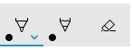

# Add an InkToolbar to a Windows app


There are two different controls that facilitate inking in Windows apps: [**InkCanvas**](/uwp/api/windows.ui.xaml.controls.inkcanvas) and [**InkToolbar**](/uwp/api/windows.ui.xaml.controls.inktoolbar).

The [**InkCanvas**](/uwp/api/windows.ui.xaml.controls.inkcanvas) control provides basic Windows Ink functionality. Use it to render pen input as either an ink stroke (using default settings for color and thickness) or an erase stroke.

> For InkCanvas implementation details, see [Pen and stylus interactions in Windows apps](pen-and-stylus-interactions.md).

As a completely transparent overlay, the InkCanvas does not provide any built-in UI for setting ink stroke properties. If you want to change the default inking experience, let users set ink stroke properties, and support other custom inking features, you have two options:

- In code-behind, use the underlying [**InkPresenter**](/uwp/api/windows.ui.input.inking.inkpresenter) object bound to the InkCanvas.

  The InkPresenter APIs support extensive customization of the inking experience. For more detail, see [Pen and stylus interactions in Windows apps](pen-and-stylus-interactions.md).

- Bind an [**InkToolbar**](/uwp/api/windows.ui.xaml.controls.inktoolbar) to the InkCanvas. By default, the InkToolbar provides a customizable and extensible collection of buttons for activating ink-related features such as stroke size, ink color, and pen tip.

  We discuss the InkToolbar in this topic.

> **Important APIs**: [**InkCanvas class**](/uwp/api/windows.ui.xaml.controls.inkcanvas), [**InkToolbar class**](/uwp/api/windows.ui.xaml.controls.inktoolbar), [**InkPresenter class**](/uwp/api/windows.ui.input.inking.inkpresenter), [**Windows.UI.Input.Inking**](/uwp/api/Windows.UI.Input.Inking)

## Default InkToolbar

By default, the [**InkToolbar**](/uwp/api/windows.ui.xaml.controls.inktoolbar) includes buttons for drawing, erasing, highlighting, and displaying a stencil (ruler or protractor). Depending on the feature, other settings and commands, such as ink color, stroke thickness, erase all ink, are provided in a flyout.

  
*Default Windows Ink toolbar*

To add a default [**InkToolbar**](/uwp/api/windows.ui.xaml.controls.inktoolbar) to an inking app, just place it on the same page as your [**InkCanvas**](/uwp/api/windows.ui.xaml.controls.inkcanvas) and associate the two controls.

1. In MainPage.xaml, declare a container object (for this example, we use a Grid control) for the inking surface.
2. Declare an InkCanvas object as a child of the container. (The InkCanvas size is inherited from the container.)
3. Declare an InkToolbar and use the TargetInkCanvas attribute to bind it to the InkCanvas.

> [!NOTE]
> Ensure the InkToolbar is declared after the InkCanvas. If not, the InkCanvas overlay renders the InkToolbar inaccessible.

```xaml
<Grid Background="{ThemeResource ApplicationPageBackgroundThemeBrush}">
    <Grid.RowDefinitions>
        <RowDefinition Height="Auto"/>
        <RowDefinition Height="*"/>
    </Grid.RowDefinitions>
    <StackPanel x:Name="HeaderPanel" Orientation="Horizontal" Grid.Row="0">
        <TextBlock x:Name="Header"
                   Text="Basic ink sample"
                   Style="{ThemeResource HeaderTextBlockStyle}"
                   Margin="10,0,0,0" />
    </StackPanel>
    <Grid Grid.Row="1">
        <Image Source="Assets\StoreLogo.png" />
        <InkCanvas x:Name="inkCanvas" />
        <InkToolbar x:Name="inkToolbar"
          VerticalAlignment="Top"
          TargetInkCanvas="{x:Bind inkCanvas}" />
    </Grid>
</Grid>
```

## Basic customization

In this section, we cover some basic Windows Ink toolbar customization scenarios.

### Specify location and orientation

When you add an ink toolbar to your app, you can accept the default location and orientation of the toolbar or set them as required by your app or user.

**XAML**

Explicitly specify the location and orientation of the toolbar through its [VerticalAlignment](/uwp/api/windows.ui.xaml.frameworkelement.VerticalAlignment), [HorizontalAlignment](/uwp/api/windows.ui.xaml.frameworkelement.HorizontalAlignment), and [Orientation](/uwp/api/windows.ui.xaml.controls.inktoolbar?branch=rs3.Orientation) properties.

| Default | Explicit |
| --- | --- |
|  |  |
| *Windows Ink toolbar default location and orientation* | *Windows Ink toolbar explicit location and orientation* |

Here's the code for explicitly setting the location and orientation of the ink toolbar in XAML.
```xaml
<InkToolbar x:Name="inkToolbar" 
    VerticalAlignment="Center" 
    HorizontalAlignment="Right" 
    Orientation="Vertical" 
    TargetInkCanvas="{x:Bind inkCanvas}" />
```

**Initialize based on user preferences or device state**

In some cases, you might want to set the location and orientation of the ink toolbar based on user preference or device state. The following example demonstrates how to set the location and orientation of the ink toolbar based on the left or right-hand writing preferences specified through **Settings > Devices > Pen & Windows Ink > Pen > Choose which hand you write with**.

  
*Dominant hand setting*

You can query this setting through the HandPreference property of Windows.UI.ViewManagement and set the [HorizontalAlignment](/uwp/api/windows.ui.xaml.frameworkelement.HorizontalAlignment) based on the value returned. In this example, we locate the toolbar on the left side of the app for a left-handed person and on the right side for a right-handed person.

**Download this sample from [Ink toolbar location and orientation sample (basic)](https://github.com/MicrosoftDocs/windows-topic-specific-samples/archive/uwp-ink-toolbar-handedness.zip)**

```csharp
public MainPage()
{
    this.InitializeComponent();

    Windows.UI.ViewManagement.UISettings settings = 
        new Windows.UI.ViewManagement.UISettings();
    HorizontalAlignment alignment = 
        (settings.HandPreference == 
            Windows.UI.ViewManagement.HandPreference.LeftHanded) ? 
            HorizontalAlignment.Left : HorizontalAlignment.Right;
    inkToolbar.HorizontalAlignment = alignment;
}
```

**Dynamically adjust to user or device state**

You can also use binding to look after UI updates based on changes to user preferences, device settings, or device states. In the following example, we expand on the previous example and show how to dynamically position the ink toolbar based on device orientation using binding, a ViewMOdel object, and the [INotifyPropertyChanged](/uwp/api/windows.ui.xaml.data.inotifypropertychanged) interface. 

**Download this sample from [Ink toolbar location and orientation sample (dynamic)](https://github.com/MicrosoftDocs/windows-topic-specific-samples/archive/uwp-ink-toolbar-handedness-dynamic.zip)**

1. First, let's add our ViewModel.
    1. Add a new folder to your project and call it **ViewModels**.
    1. Add a new class to the ViewModels folder (for this example, we called it **InkToolbarSnippetHostViewModel.cs**).
        > [!NOTE] 
        > We used the [Singleton pattern](/previous-versions/msp-n-p/ff650849(v=pandp.10)) as we only need one object of this type for the life of the application

    1. Add `using System.ComponentModel` namespace to the file.
    1. Add a static member variable called **instance**, and a static read only property named **Instance**. Make the constructor private to ensure this class can only be accessed via the Instance property.   
        > [!NOTE] 
        > This class inherits from [INotifyPropertyChanged](/uwp/api/windows.ui.xaml.data.inotifypropertychanged) interface, which is used to notify clients, typically binding clients, that a property value has changed. We'll be using this to handle changes to the device orientation (we'll expand this code and explain further in a later step).  

        ```csharp
        using System.ComponentModel;

        namespace locationandorientation.ViewModels
        {
            public class InkToolbarSnippetHostViewModel : INotifyPropertyChanged
            {
                private static InkToolbarSnippetHostViewModel instance;
                
                public static InkToolbarSnippetHostViewModel Instance
                {
                    get
                    {
                        if (null == instance)
                        {
                            instance = new InkToolbarSnippetHostViewModel();
                        }
                        return instance;
                    }
                }
            }

            private InkToolbarSnippetHostViewModel() { }
        }
        ```

    1. Add two bool properties to the InkToolbarSnippetHostViewModel class: **LeftHandedLayout** (same functionality as the previous XAML-only example) and **PortraitLayout** (orientation of the device).
        >[!NOTE] 
        > The PortraitLayout property is settable and includes the definition for the [PropertyChanged](/uwp/api/windows.ui.xaml.data.inotifypropertychanged.PropertyChanged) event.

        ```csharp
        public bool LeftHandedLayout
        {
            get
            {
                bool leftHandedLayout = false;
                Windows.UI.ViewManagement.UISettings settings =
                    new Windows.UI.ViewManagement.UISettings();
                leftHandedLayout = (settings.HandPreference ==
                    Windows.UI.ViewManagement.HandPreference.LeftHanded);
                return leftHandedLayout;
            }
        }

        public bool portraitLayout = false;
        public bool PortraitLayout
        {
            get
            {
                Windows.UI.ViewManagement.ApplicationViewOrientation winOrientation = 
                    Windows.UI.ViewManagement.ApplicationView.GetForCurrentView().Orientation;
                portraitLayout = 
                    (winOrientation == 
                        Windows.UI.ViewManagement.ApplicationViewOrientation.Portrait);
                return portraitLayout;
            }
            set
            {
                if (value.Equals(portraitLayout)) return;
                portraitLayout = value;
                PropertyChanged?.Invoke(this, new PropertyChangedEventArgs("PortraitLayout"));
            }
        }
        ```

1. Now, let's add a couple of converter classes to our project. Each class contains a Convert object that returns an alignment value (either [HorizontalAlignment](/uwp/api/windows.ui.xaml.horizontalalignment) or [VerticalAlignment](/uwp/api/windows.ui.xaml.verticalalignment)).
    1. Add a new folder to your project and call it **Converters**.
    1. Add two new classes to the Converters folder (for this example, we call them **HorizontalAlignmentFromHandednessConverter.cs** and **VerticalAlignmentFromAppViewConverter.cs**).
    1. Add `using Windows.UI.Xaml` and `using Windows.UI.Xaml.Data` namespaces to each file.
    1. Change each class to `public` and specify that it implements the [IValueConverter](/uwp/api/windows.ui.xaml.data.ivalueconverter) interface.
    1. Add the [Convert](/uwp/api/windows.ui.xaml.data.ivalueconverter.convert) and [ConvertBack](/uwp/api/windows.ui.xaml.data.ivalueconverter.convertback) methods to each file, as shown here (we leave the ConvertBack method unimplemented).
        - HorizontalAlignmentFromHandednessConverter positions the ink toolbar to the right side of the app for right-handed users and to the left side of the app for left-handed users.
        ```csharp
        using System;

        using Windows.UI.Xaml;
        using Windows.UI.Xaml.Data;

        namespace locationandorientation.Converters
        {
            public class HorizontalAlignmentFromHandednessConverter : IValueConverter
            {
                public object Convert(object value, Type targetType,
                    object parameter, string language)
                {
                    bool leftHanded = (bool)value;
                    HorizontalAlignment alignment = HorizontalAlignment.Right;
                    if (leftHanded)
                    {
                        alignment = HorizontalAlignment.Left;
                    }
                    return alignment;
                }

                public object ConvertBack(object value, Type targetType,
                    object parameter, string language)
                {
                    throw new NotImplementedException();
                }
            }
        }
        ```

        - VerticalAlignmentFromAppViewConverter positions the ink toolbar to the center of the app for portrait orientation and to the top of the app for landscape orientation (while intended to improve usability, this is just an arbitrary choice for demonstration purposes).
        ```csharp
        using System;

        using Windows.UI.Xaml;
        using Windows.UI.Xaml.Data;

        namespace locationandorientation.Converters
        {
            public class VerticalAlignmentFromAppViewConverter : IValueConverter
            {
                public object Convert(object value, Type targetType,
                    object parameter, string language)
                {
                    bool portraitOrientation = (bool)value;
                    VerticalAlignment alignment = VerticalAlignment.Top;
                    if (portraitOrientation)
                    {
                        alignment = VerticalAlignment.Center;
                    }
                    return alignment;
                }

                public object ConvertBack(object value, Type targetType,
                    object parameter, string language)
                {
                    throw new NotImplementedException();
                }
            }
        }
        ```

1. Now, open the MainPage.xaml.cs file.
    1. Add `using using locationandorientation.ViewModels` to the list of namespaces to associate our ViewModel.
    1. Add `using Windows.UI.ViewManagement` to the list of namespaces to enable listening for changes to the device orientation.
    1. Add the [WindowSizeChangedEventHandler](/uwp/api/windows.ui.xaml.windowsizechangedeventhandler) code.
    1. Set the [DataContext](/uwp/api/Windows.UI.Xaml.FrameworkElement.DataContext) for the view to the singleton instance of the InkToolbarSnippetHostViewModel class. 
    ```csharp
    using Windows.UI.Xaml;
    using Windows.UI.Xaml.Controls;

    using locationandorientation.ViewModels;
    using Windows.UI.ViewManagement;

    namespace locationandorientation
    {
        public sealed partial class MainPage : Page
        {
            public MainPage()
            {
                this.InitializeComponent();

                Window.Current.SizeChanged += (sender, args) =>
                {
                    ApplicationView currentView = ApplicationView.GetForCurrentView();

                    if (currentView.Orientation == ApplicationViewOrientation.Landscape)
                    {
                        InkToolbarSnippetHostViewModel.Instance.PortraitLayout = false;
                    }
                    else if (currentView.Orientation == ApplicationViewOrientation.Portrait)
                    {
                        InkToolbarSnippetHostViewModel.Instance.PortraitLayout = true;
                    }
                };

                DataContext = InkToolbarSnippetHostViewModel.Instance;
            }
        }
    }
    ```

1. Next, open the MainPage.xaml file.
    1. Add `xmlns:converters="using:locationandorientation.Converters"` to the `Page` element for binding to our converters.
        ```xaml
        <Page
        x:Class="locationandorientation.MainPage"
        xmlns="http://schemas.microsoft.com/winfx/2006/xaml/presentation"
        xmlns:x="http://schemas.microsoft.com/winfx/2006/xaml"
        xmlns:local="using:locationandorientation"
        xmlns:converters="using:locationandorientation.Converters"
        xmlns:d="http://schemas.microsoft.com/expression/blend/2008"
        xmlns:mc="http://schemas.openxmlformats.org/markup-compatibility/2006"
        mc:Ignorable="d">
        ```

    1. Add a `PageResources` element and specify references to our converters.
        ```xaml
        <Page.Resources>
            <converters:HorizontalAlignmentFromHandednessConverter x:Key="HorizontalAlignmentConverter"/>
            <converters:VerticalAlignmentFromAppViewConverter x:Key="VerticalAlignmentConverter"/>
        </Page.Resources>
        ```

    1. Add the InkCanvas and InkToolbar elements and bind the VerticalAlignment and HorizontalAlignment properties of the InkToolbar.
        ```xaml
        <InkCanvas x:Name="inkCanvas" />
        <InkToolbar x:Name="inkToolbar" 
                    VerticalAlignment="{Binding PortraitLayout, Converter={StaticResource VerticalAlignmentConverter} }" 
                    HorizontalAlignment="{Binding LeftHandedLayout, Converter={StaticResource HorizontalAlignmentConverter} }" 
                    Orientation="Vertical" 
                    TargetInkCanvas="{x:Bind inkCanvas}" />
        ```

1. Return to the InkToolbarSnippetHostViewModel.cs file to add our `PortraitLayout` and `LeftHandedLayout` bool properties to the `InkToolbarSnippetHostViewModel` class, along with support for rebinding `PortraitLayout` when that property value changes. 
    ```csharp
    public bool LeftHandedLayout
    {
        get
        {
            bool leftHandedLayout = false;
            Windows.UI.ViewManagement.UISettings settings =
                new Windows.UI.ViewManagement.UISettings();
            leftHandedLayout = (settings.HandPreference ==
                Windows.UI.ViewManagement.HandPreference.LeftHanded);
            return leftHandedLayout;
        }
    }

    public bool portraitLayout = false;
    public bool PortraitLayout
    {
        get
        {
            Windows.UI.ViewManagement.ApplicationViewOrientation winOrientation = 
                Windows.UI.ViewManagement.ApplicationView.GetForCurrentView().Orientation;
            portraitLayout = 
                (winOrientation == 
                    Windows.UI.ViewManagement.ApplicationViewOrientation.Portrait);
            return portraitLayout;
        }
        set
        {
            if (value.Equals(portraitLayout)) return;
            portraitLayout = value;
            PropertyChanged?.Invoke(this, new PropertyChangedEventArgs("PortraitLayout"));
        }
    }

    #region INotifyPropertyChanged Members

    public event PropertyChangedEventHandler PropertyChanged;

    protected void OnPropertyChanged(string property)
    {
        PropertyChanged?.Invoke(this, new PropertyChangedEventArgs(property));
    }

    #endregion
    ```

You should now have an inking app that adapts to both the dominant hand preference of the user and dynamically responds to the orientation of the user's device.

### Specify the selected button  
  
*Windows Ink toolbar with pencil button selected at initialization*

By default, the first (or leftmost) button is selected when your app is launched and the toolbar is initialized. In the default Windows Ink toolbar, this is the ballpoint pen button.

Because the framework defines the order of the built-in buttons, the first button might not be the pen or tool you want to activate by default.

You can override this default behavior and specify the selected button on the toolbar.

For this example, we initialize the default toolbar with the pencil button selected and the pencil activated (instead of the ballpoint pen).

1. Use the XAML declaration for the InkCanvas and InkToolbar from the previous example.
2. In code-behind, set up a handler for the [Loaded](/uwp/api/windows.ui.xaml.frameworkelement.loaded) event of the [InkToolbar](/uwp/api/windows.ui.xaml.controls.inktoolbar) object.

  ```csharp
  /// <summary>
  /// An empty page that can be used on its own or navigated to within a Frame.
  /// Here, we set up InkToolbar event listeners.
  /// </summary>
  public MainPage_CodeBehind()
  {
      this.InitializeComponent();
      // Add handlers for InkToolbar events.
      inkToolbar.Loaded += inkToolbar_Loaded;
  }
  ```

3. In the handler for the [Loaded](/uwp/api/windows.ui.xaml.frameworkelement.loaded) event:
    1. Get a reference to the built-in [InkToolbarPencilButton](/uwp/api/windows.ui.xaml.controls.inktoolbarpencilbutton).

    Passing an [InkToolbarTool.Pencil](/uwp/api/windows.ui.xaml.controls.inktoolbartool) object in the [GetToolButton](/uwp/api/windows.ui.xaml.controls.inktoolbar.gettoolbutton) method returns an [InkToolbarToolButton](/uwp/api/windows.ui.xaml.controls.inktoolbartoolbutton) object for the [InkToolbarPencilButton](/uwp/api/windows.ui.xaml.controls.inktoolbarpencilbutton).

    2. Set [ActiveTool](/uwp/api/windows.ui.xaml.controls.inktoolbar.activetool) to the object returned in the previous step.

```CSharp
/// <summary>
/// Handle the Loaded event of the InkToolbar.
/// By default, the active tool is set to the first tool on the toolbar.
/// Here, we set the active tool to the pencil button.
/// </summary>
/// <param name="sender"></param>
/// <param name="e"></param>
private void inkToolbar_Loaded(object sender, RoutedEventArgs e)
{
    InkToolbarToolButton pencilButton = inkToolbar.GetToolButton(InkToolbarTool.Pencil);
    inkToolbar.ActiveTool = pencilButton;
}
```

### Specify the built-in buttons

  
*Specific buttons included at initialization*

As mentioned, the Windows Ink toolbar includes a collection of default, built-in buttons. These buttons are displayed in the following order (from left to right):

- [InkToolbarBallpointPenButton](/uwp/api/windows.ui.xaml.controls.inktoolbarballpointpenbutton)
- [InkToolbarPencilButton](/uwp/api/windows.ui.xaml.controls.inktoolbarpencilbutton)
- [InkToolbarHighlighterButton](/uwp/api/windows.ui.xaml.controls.inktoolbarhighlighterbutton)
- [InkToolbarEraserButton](/uwp/api/windows.ui.xaml.controls.inktoolbareraserbutton)
- [InkToolbarRulerButton](/uwp/api/windows.ui.xaml.controls.inktoolbarrulerbutton)

For this example, we initialize the toolbar with only the built-in ballpoint pen, pencil, and eraser buttons.

You can do this using either XAML or code-behind.

**XAML**

Modify the XAML declaration for the InkCanvas and InkToolbar from the first example.
- Add an [InitialControls](/uwp/api/windows.ui.xaml.controls.inktoolbar.initialcontrols) attribute and set its value to "[None](/uwp/api/windows.ui.xaml.controls.inktoolbarinitialcontrols)". This clears the default collection of built-in buttons.
- Add the specific InkToolbar buttons required by your app. Here, we add [InkToolbarBallpointPenButton](/uwp/api/windows.ui.xaml.controls.inktoolbarballpointpenbutton), [InkToolbarPencilButton](/uwp/api/windows.ui.xaml.controls.inktoolbarpencilbutton), and [InkToolbarEraserButton](/uwp/api/windows.ui.xaml.controls.inktoolbareraserbutton) only.
> [!NOTE]
> Buttons are added to the toolbar in the order defined by the framework, not the order specified here.

```xaml
<Grid Background="{ThemeResource ApplicationPageBackgroundThemeBrush}">
    <Grid.RowDefinitions>
        <RowDefinition Height="Auto"/>
        <RowDefinition Height="*"/>
    </Grid.RowDefinitions>
    <StackPanel x:Name="HeaderPanel" Orientation="Horizontal" Grid.Row="0">
        <TextBlock x:Name="Header"
                   Text="Basic ink sample"
                   Style="{ThemeResource HeaderTextBlockStyle}"
                   Margin="10,0,0,0" />
    </StackPanel>
    <Grid Grid.Row="1">
        <Image Source="Assets\StoreLogo.png" />
        <!-- Clear the default InkToolbar buttons by setting InitialControls to None. -->
        <!-- Set the active tool to the pencil button. -->
        <InkCanvas x:Name="inkCanvas" />
        <InkToolbar x:Name="inkToolbar"
                    VerticalAlignment="Top"
                    TargetInkCanvas="{x:Bind inkCanvas}"
                    InitialControls="None">
            <!--
             Add only the ballpoint pen, pencil, and eraser.
             Note that the buttons are added to the toolbar in the order
             defined by the framework, not the order we specify here.
            -->
            <InkToolbarEraserButton />
            <InkToolbarBallpointPenButton />
            <InkToolbarPencilButton/>
        </InkToolbar>
    </Grid>
</Grid>
```

**Code-behind**
1. Use the XAML declaration for the InkCanvas and InkToolbar from the first example.

  ```xaml
  <Grid Background="{ThemeResource ApplicationPageBackgroundThemeBrush}">
      <Grid.RowDefinitions>
          <RowDefinition Height="Auto"/>
          <RowDefinition Height="*"/>
      </Grid.RowDefinitions>
      <StackPanel x:Name="HeaderPanel" Orientation="Horizontal" Grid.Row="0">
          <TextBlock x:Name="Header"
                     Text="Basic ink sample"
                     Style="{ThemeResource HeaderTextBlockStyle}"
                     Margin="10,0,0,0" />
      </StackPanel>
      <Grid Grid.Row="1">
          <Image Source="Assets\StoreLogo.png" />
          <InkCanvas x:Name="inkCanvas" />
          <InkToolbar x:Name="inkToolbar"
          VerticalAlignment="Top"
          TargetInkCanvas="{x:Bind inkCanvas}" />
      </Grid>
  </Grid>
  ```

2. In code-behind, set up a handler for the [Loading](/uwp/api/windows.ui.xaml.frameworkelement.loading) event of the [InkToolbar](/uwp/api/windows.ui.xaml.controls.inktoolbar) object.

  ```csharp
  /// <summary>
  /// An empty page that can be used on its own or navigated to within a Frame.
  /// Here, we set up InkToolbar event listeners.
  /// </summary>
  public MainPage_CodeBehind()
  {
      this.InitializeComponent();
      // Add handlers for InkToolbar events.
      inkToolbar.Loading += inkToolbar_Loading;
  }
  ```

3. Set [InitialControls](/uwp/api/windows.ui.xaml.controls.inktoolbar.initialcontrols) to "[None](/uwp/api/windows.ui.xaml.controls.inktoolbarinitialcontrols)".
4. Create object references for the buttons required by your app. Here, we add [InkToolbarBallpointPenButton](/uwp/api/windows.ui.xaml.controls.inktoolbarballpointpenbutton), [InkToolbarPencilButton](/uwp/api/windows.ui.xaml.controls.inktoolbarpencilbutton), and [InkToolbarEraserButton](/uwp/api/windows.ui.xaml.controls.inktoolbareraserbutton) only.
  > [!NOTE]
  > Buttons are added to the toolbar in the order defined by the framework, not the order specified here.

5. Add the buttons to the InkToolbar.

  ```csharp
  /// <summary>
  /// Handles the Loading event of the InkToolbar.
  /// Here, we identify the buttons to include on the InkToolbar.
  /// </summary>
  /// <param name="sender">The InkToolbar</param>
  /// <param name="args">The InkToolbar event data.
  /// If there is no event data, this parameter is null</param>
  private void inkToolbar_Loading(FrameworkElement sender, object args)
  {
      // Clear all built-in buttons from the InkToolbar.
      inkToolbar.InitialControls = InkToolbarInitialControls.None;

      // Add only the ballpoint pen, pencil, and eraser.
      // Note that the buttons are added to the toolbar in the order
      // defined by the framework, not the order we specify here.
      InkToolbarBallpointPenButton ballpoint = new InkToolbarBallpointPenButton();
      InkToolbarPencilButton pencil = new InkToolbarPencilButton();
      InkToolbarEraserButton eraser = new InkToolbarEraserButton();
      inkToolbar.Children.Add(eraser);
      inkToolbar.Children.Add(ballpoint);
      inkToolbar.Children.Add(pencil);
  }
  ```

<!--
### Support touch input
By default, the InkToolbar supports both pen and mouse input, you have to enable support for touch input.
-->

## Custom buttons and inking features

You can customize and extend the collection of buttons (and associated inking features) that are provided through the InkToolbar.

The InkToolbar consists of two distinct groups of button types:

1. A group of "tool" buttons containing the built-in drawing, erasing, and highlighting buttons. Custom pens and tools are added here.
> **Note**&nbsp;&nbsp;Feature selection is mutually exclusive.

2. A group of "toggle" buttons containing the built-in ruler button. Custom toggles are added here.
> **Note**&nbsp;&nbsp;Features are not mutually exclusive and can be used concurrently with other active tools.

Depending on your application and the inking functionality required, you can add any of the following buttons (bound to your custom ink features) to the InkToolbar:

- Custom pen – a pen for which the ink color palette and pen tip properties, such as shape, rotation, and size, are defined by the host app.
- Custom tool – a non-pen tool, defined by the host app.
- Custom toggle – Sets the state of an app-defined feature to on or off. When turned on, the feature works in conjunction with the active tool.

> **Note**&nbsp;&nbsp;You cannot change the display order of the built-in buttons. The default display order is: Ballpoint pen, pencil, highlighter, eraser, and ruler. Custom pens are appended to the last default pen, custom tool buttons are added between the last pen button and the eraser button and custom toggle buttons are added after the ruler button. (Custom buttons are added in the order they are specified.)

### Custom pen

You can create a custom pen (activated through a custom pen button) where you define the ink color palette and pen tip properties, such as shape, rotation, and size.

  
*Custom calligraphic pen button*

For this example, we define a custom pen with a broad tip that enables basic calligraphic ink strokes. We also customize the collection of brushes in the palette displayed on the button flyout.

**Code-behind**

First, we define our custom pen and specify the drawing attributes in code-behind. We reference this custom pen from XAML later.

1. Right click the project in Solution Explorer and select Add -> New item.
2. Under Visual C# -> Code, add a new Class file and call it CalligraphicPen.cs.
3. In Calligraphic.cs, replace the default using block with the following:
```csharp
using System.Numerics;
using Windows.UI;
using Windows.UI.Input.Inking;
using Windows.UI.Xaml.Controls;
using Windows.UI.Xaml.Media;
```

4. Specify that the CalligraphicPen class is derived from [InkToolbarCustomPen](/uwp/api/windows.ui.xaml.controls.inktoolbarcustompen).
```csharp
class CalligraphicPen : InkToolbarCustomPen
{
}
```

5. Override  [CreateInkDrawingAttributesCore](/uwp/api/windows.ui.xaml.controls.inktoolbarcustompen.createinkdrawingattributescore)  to specify your own brush and stroke size.
```csharp
class CalligraphicPen : InkToolbarCustomPen
{
    protected override InkDrawingAttributes
      CreateInkDrawingAttributesCore(Brush brush, double strokeWidth)
    {
    }
}
```

6. Create an [InkDrawingAttributes](/uwp/api/windows.ui.input.inking.inkdrawingattributes) object and set the [pen tip shape](/uwp/api/windows.ui.input.inking.inkdrawingattributes.pentip), [tip rotation](/uwp/api/windows.ui.input.inking.inkdrawingattributes.pentiptransform), [stroke size](/uwp/api/windows.ui.input.inking.inkdrawingattributes.size), and [ink color](/uwp/api/windows.ui.input.inking.inkdrawingattributes.color).
```csharp
class CalligraphicPen : InkToolbarCustomPen
{
    protected override InkDrawingAttributes
      CreateInkDrawingAttributesCore(Brush brush, double strokeWidth)
    {
        InkDrawingAttributes inkDrawingAttributes =
          new InkDrawingAttributes();
        inkDrawingAttributes.PenTip = PenTipShape.Circle;
        inkDrawingAttributes.Size =
          new Windows.Foundation.Size(strokeWidth, strokeWidth * 20);
        SolidColorBrush solidColorBrush = brush as SolidColorBrush;
        if (solidColorBrush != null)
        {
            inkDrawingAttributes.Color = solidColorBrush.Color;
        }
        else
        {
            inkDrawingAttributes.Color = Colors.Black;
        }

        Matrix3x2 matrix = Matrix3x2.CreateRotation(45);
        inkDrawingAttributes.PenTipTransform = matrix;

        return inkDrawingAttributes;
    }
}
```

**XAML**

Next, we add the necessary references to the custom pen in MainPage.xaml.

1. We declare a local page resource dictionary that creates a reference to the custom pen (`CalligraphicPen`) defined in CalligraphicPen.cs, and a [brush collection](/uwp/api/Windows.UI.Xaml.Media.BrushCollection) supported by the custom pen (`CalligraphicPenPalette`).
```xaml
<Page.Resources>
    <!-- Add the custom CalligraphicPen to the page resources. -->
    <local:CalligraphicPen x:Key="CalligraphicPen" />
    <!-- Specify the colors for the palette of the custom pen. -->
    <BrushCollection x:Key="CalligraphicPenPalette">
        <SolidColorBrush Color="Blue" />
        <SolidColorBrush Color="Red" />
    </BrushCollection>
</Page.Resources>
```

2. We then add an InkToolbar with a child [InkToolbarCustomPenButton](/uwp/api/windows.ui.xaml.controls.inktoolbarcustompenbutton) element.

  The custom pen button includes the two static resource references declared in the page resources: `CalligraphicPen` and `CalligraphicPenPalette`.

  We also specify the range for the stroke size slider ([MinStrokeWidth](/uwp/api/windows.ui.xaml.controls.inktoolbarpenbutton.minstrokewidth), [MaxStrokeWidth](/uwp/api/windows.ui.xaml.controls.inktoolbarpenbutton.maxstrokewidth), and [SelectedStrokeWidth](/uwp/api/windows.ui.xaml.controls.inktoolbarpenbutton.selectedstrokewidthproperty)), the selected brush ([SelectedBrushIndex](/uwp/api/windows.ui.xaml.controls.inktoolbarpenbutton.selectedbrushindex)), and the icon for the custom pen button ([SymbolIcon](/uwp/api/windows.ui.xaml.controls.symbolicon)).
```xaml
<Grid Grid.Row="1">
    <InkCanvas x:Name="inkCanvas" />
    <InkToolbar x:Name="inkToolbar"
                VerticalAlignment="Top"
                TargetInkCanvas="{x:Bind inkCanvas}">
        <InkToolbarCustomPenButton
            CustomPen="{StaticResource CalligraphicPen}"
            Palette="{StaticResource CalligraphicPenPalette}"
            MinStrokeWidth="1" MaxStrokeWidth="3" SelectedStrokeWidth="2"
            SelectedBrushIndex ="1">
            <SymbolIcon Symbol="Favorite" />
            <InkToolbarCustomPenButton.ConfigurationContent>
                <InkToolbarPenConfigurationControl />
            </InkToolbarCustomPenButton.ConfigurationContent>
        </InkToolbarCustomPenButton>
    </InkToolbar>
</Grid>
```

### Custom toggle

You can create a custom toggle (activated through a custom toggle button) to set the state of an app-defined feature to on or off. When turned on, the feature works in conjunction with the active tool.

In this example, we define a custom toggle button that enables inking with touch input (by default, touch inking is not enabled).

> [!NOTE]  
> If you need to support inking with touch, we recommended that you enable it using a CustomToggleButton, with the icon and [tooltip](../controls/tooltips.md) specified in this example.

Typically, touch input is used for direct manipulation of an object or the app UI. To demonstrate the differences in behavior when touch inking is enabled, we place the InkCanvas within a ScrollViewer container and set the dimensions of the ScrollViewer to be smaller than the InkCanvas. 

When the app starts, only pen inking is supported and touch is used to pan or zoom the inking surface. When touch inking is enabled, the inking surface cannot be panned or zoomed through touch input.

> [!NOTE]
> See [Inking controls](../controls/inking-controls.md) for both [**InkCanvas**](/uwp/api/Windows.UI.Xaml.Controls.InkCanvas) and [**InkToolbar**](/uwp/api/Windows.UI.Xaml.Controls.InkToolbar) UX guidelines. The following recommendations are relevant to this example:
> - The [**InkToolbar**](/uwp/api/Windows.UI.Xaml.Controls.InkToolbar), and inking in general, is best experienced through an active pen. However, inking with mouse and touch can be supported if required by your app. 
> - If supporting inking with touch input, we recommend using the "ED5F" icon from the "Segoe MLD2 Assets" font for the toggle button, with a "Touch writing" tooltip. 

**XAML**

1. First, we declare an [**InkToolbarCustomToggleButton**](/uwp/api/Windows.UI.Xaml.Controls.InkToolbarCustomToggleButton) element (toggleButton) with a Click event listener that specifies the event handler (Toggle_Custom).

```xaml 
<Grid Background="{ThemeResource ApplicationPageBackgroundThemeBrush}">
    <Grid.RowDefinitions>
        <RowDefinition Height="Auto"/>
        <RowDefinition Height="*"/>
    </Grid.RowDefinitions>

    <StackPanel Grid.Row="0" 
                x:Name="HeaderPanel" 
                Orientation="Horizontal">
        <TextBlock x:Name="Header" 
                   Text="Basic ink sample" 
                   Style="{ThemeResource HeaderTextBlockStyle}" 
                   Margin="10" />
    </StackPanel>

    <ScrollViewer Grid.Row="1" 
                  HorizontalScrollBarVisibility="Auto" 
                  VerticalScrollBarVisibility="Auto">
        
        <Grid HorizontalAlignment="Left" VerticalAlignment="Top">
            <Grid.RowDefinitions>
                <RowDefinition Height="Auto"/>
                <RowDefinition Height="*"/>
            </Grid.RowDefinitions>
            
            <InkToolbar Grid.Row="0" 
                        Margin="10"
                        x:Name="inkToolbar" 
                        VerticalAlignment="Top"
                        TargetInkCanvas="{x:Bind inkCanvas}">
                <InkToolbarCustomToggleButton 
                x:Name="toggleButton" 
                Click="CustomToggle_Click" 
                ToolTipService.ToolTip="Touch Writing">
                    <SymbolIcon Symbol="{x:Bind TouchWritingIcon}"/>
                </InkToolbarCustomToggleButton>
            </InkToolbar>
            
            <ScrollViewer Grid.Row="1" 
                          Height="500"
                          Width="500"
                          x:Name="scrollViewer" 
                          ZoomMode="Enabled" 
                          MinZoomFactor=".1" 
                          VerticalScrollMode="Enabled" 
                          VerticalScrollBarVisibility="Auto" 
                          HorizontalScrollMode="Enabled" 
                          HorizontalScrollBarVisibility="Auto">
                
                <Grid x:Name="outputGrid" 
                      Height="1000"
                      Width="1000"
                      Background="{ThemeResource SystemControlBackgroundChromeWhiteBrush}">
                    <InkCanvas x:Name="inkCanvas"/>
                </Grid>
                
            </ScrollViewer>
        </Grid>
    </ScrollViewer>
</Grid>
```

**Code-behind**

2. In the previous snippet, we declared a Click event listener and handler (Toggle_Custom) on the custom toggle button for touch inking (toggleButton). This handler simply toggles support for CoreInputDeviceTypes.Touch through the InputDeviceTypes property of the InkPresenter.

   We also specified an icon for the button using the SymbolIcon element and the {x:Bind} markup extension that binds it to a field defined in the code-behind file (TouchWritingIcon).

   The following snippet includes both the Click event handler and the definition of TouchWritingIcon.

```csharp 
namespace Ink_Basic_InkToolbar
{
    /// <summary>
    /// An empty page that can be used on its own or navigated to within a Frame.
    /// </summary>
    public sealed partial class MainPage_AddCustomToggle : Page
    {
        Symbol TouchWritingIcon = (Symbol)0xED5F;

        public MainPage_AddCustomToggle()
        {
            this.InitializeComponent();
        }

        // Handler for the custom toggle button that enables touch inking.
        private void CustomToggle_Click(object sender, RoutedEventArgs e)
        {
            if (toggleButton.IsChecked == true)
            {
                inkCanvas.InkPresenter.InputDeviceTypes |= CoreInputDeviceTypes.Touch;
            }
            else
            {
                inkCanvas.InkPresenter.InputDeviceTypes &= ~CoreInputDeviceTypes.Touch;
            }
        }
    }
}
```

### Custom tool

You can create a custom tool button to invoke a non-pen tool that is defined by your app.

By default, an [**InkPresenter**](/uwp/api/Windows.UI.Input.Inking.InkPresenter) processes all input as either an ink stroke or an erase stroke. This includes input modified by a secondary hardware affordance such as a pen barrel button, a right mouse button, or similar. However, [**InkPresenter**](/uwp/api/Windows.UI.Input.Inking.InkPresenter) can be configured to leave specific input unprocessed, which can then be passed through to your app for custom processing.

In this example, we define a custom tool button that, when selected, causes subsequent strokes to be processed and rendered as a selection lasso (dashed line) instead of ink. All ink strokes within the bounds of the selection area are set to [**Selected**](/uwp/api/windows.ui.input.inking.inkstroke.selected).

> [!NOTE]
> See Inking controls for both InkCanvas and InkToolbar UX guidelines. The following recommendation is relevant to this example:
> - If providing stroke selection, we recommend using the "EF20" icon from the "Segoe MLD2 Assets" font for the tool button, with a "Selection tool" tooltip. 
 
**XAML**

1. First, we declare an [**InkToolbarCustomToolButton**](/uwp/api/Windows.UI.Xaml.Controls.InkToolbarCustomToolButton) element (customToolButton) with a Click event listener that specifies the event handler (customToolButton_Click) where stroke selection is configured. (We've also added a set of buttons for copying, cutting, and pasting the stroke selection.)

2. We also add a Canvas element for drawing our selection stroke. Using a separate layer to draw the selection stroke ensures the [**InkCanvas**](/uwp/api/Windows.UI.Xaml.Controls.InkCanvas) and its content remain untouched. 

```xaml
<Grid Background="{ThemeResource ApplicationPageBackgroundThemeBrush}">
    <Grid.RowDefinitions>
        <RowDefinition Height="Auto"/>
        <RowDefinition Height="Auto"/>
        <RowDefinition Height="*"/>
    </Grid.RowDefinitions>
    <StackPanel x:Name="HeaderPanel" Orientation="Horizontal" Grid.Row="0">
        <TextBlock x:Name="Header" 
                   Text="Basic ink sample" 
                   Style="{ThemeResource HeaderTextBlockStyle}" 
                   Margin="10,0,0,0" />
    </StackPanel>
    <StackPanel x:Name="ToolPanel" Orientation="Horizontal" Grid.Row="1">
        <InkToolbar x:Name="inkToolbar" 
                    VerticalAlignment="Top" 
                    TargetInkCanvas="{x:Bind inkCanvas}">
            <InkToolbarCustomToolButton 
                x:Name="customToolButton" 
                Click="customToolButton_Click" 
                ToolTipService.ToolTip="Selection tool">
                <SymbolIcon Symbol="{x:Bind SelectIcon}"/>
            </InkToolbarCustomToolButton>
        </InkToolbar>
        <Button x:Name="cutButton" 
                Content="Cut" 
                Click="cutButton_Click"
                Width="100"
                Margin="5,0,0,0"/>
        <Button x:Name="copyButton" 
                Content="Copy"  
                Click="copyButton_Click"
                Width="100"
                Margin="5,0,0,0"/>
        <Button x:Name="pasteButton" 
                Content="Paste"  
                Click="pasteButton_Click"
                Width="100"
                Margin="5,0,0,0"/>
    </StackPanel>
    <Grid Grid.Row="2" x:Name="outputGrid" 
              Background="{ThemeResource SystemControlBackgroundChromeWhiteBrush}" 
              Height="Auto">
        <!-- Canvas for displaying selection UI. -->
        <Canvas x:Name="selectionCanvas"/>
        <!-- Canvas for displaying ink. -->
        <InkCanvas x:Name="inkCanvas" />
    </Grid>
</Grid>
```

**Code-behind**

2. We then handle the Click event for the [**InkToolbarCustomToolButton**](/uwp/api/Windows.UI.Xaml.Controls.InkToolbarCustomToolButton) in the MainPage.xaml.cs code-behind file.

   This handler configures the [**InkPresenter**](/uwp/api/Windows.UI.Input.Inking.InkPresenter) to pass unprocessed input through to the app. 

   For a more detailed step through of this code:  See the Pass-through input for advanced processing section of [Pen interactions and Windows Ink in Windows apps](pen-and-stylus-interactions.md).

   We also specified an icon for the button using the SymbolIcon element and the {x:Bind} markup extension that binds it to a field defined in the code-behind file (SelectIcon).

   The following snippet includes both the Click event handler and the definition of SelectIcon.

```csharp
namespace Ink_Basic_InkToolbar
{
    /// <summary>
    /// An empty page that can be used on its own or navigated to within a Frame.
    /// </summary>
    public sealed partial class MainPage_AddCustomTool : Page
    {
        // Icon for custom selection tool button.
        Symbol SelectIcon = (Symbol)0xEF20;

        // Stroke selection tool.
        private Polyline lasso;
        // Stroke selection area.
        private Rect boundingRect;

        public MainPage_AddCustomTool()
        {
            this.InitializeComponent();

            // Listen for new ink or erase strokes to clean up selection UI.
            inkCanvas.InkPresenter.StrokeInput.StrokeStarted +=
                StrokeInput_StrokeStarted;
            inkCanvas.InkPresenter.StrokesErased +=
                InkPresenter_StrokesErased;
        }

        private void customToolButton_Click(object sender, RoutedEventArgs e)
        {
            // By default, the InkPresenter processes input modified by 
            // a secondary affordance (pen barrel button, right mouse 
            // button, or similar) as ink.
            // To pass through modified input to the app for custom processing 
            // on the app UI thread instead of the background ink thread, set 
            // InputProcessingConfiguration.RightDragAction to LeaveUnprocessed.
            inkCanvas.InkPresenter.InputProcessingConfiguration.RightDragAction =
                InkInputRightDragAction.LeaveUnprocessed;

            // Listen for unprocessed pointer events from modified input.
            // The input is used to provide selection functionality.
            inkCanvas.InkPresenter.UnprocessedInput.PointerPressed +=
                UnprocessedInput_PointerPressed;
            inkCanvas.InkPresenter.UnprocessedInput.PointerMoved +=
                UnprocessedInput_PointerMoved;
            inkCanvas.InkPresenter.UnprocessedInput.PointerReleased +=
                UnprocessedInput_PointerReleased;
        }

        // Handle new ink or erase strokes to clean up selection UI.
        private void StrokeInput_StrokeStarted(
            InkStrokeInput sender, Windows.UI.Core.PointerEventArgs args)
        {
            ClearSelection();
        }

        private void InkPresenter_StrokesErased(
            InkPresenter sender, InkStrokesErasedEventArgs args)
        {
            ClearSelection();
        }

        private void cutButton_Click(object sender, RoutedEventArgs e)
        {
            inkCanvas.InkPresenter.StrokeContainer.CopySelectedToClipboard();
            inkCanvas.InkPresenter.StrokeContainer.DeleteSelected();
            ClearSelection();
        }

        private void copyButton_Click(object sender, RoutedEventArgs e)
        {
            inkCanvas.InkPresenter.StrokeContainer.CopySelectedToClipboard();
        }

        private void pasteButton_Click(object sender, RoutedEventArgs e)
        {
            if (inkCanvas.InkPresenter.StrokeContainer.CanPasteFromClipboard())
            {
                inkCanvas.InkPresenter.StrokeContainer.PasteFromClipboard(
                    new Point(0, 0));
            }
            else
            {
                // Cannot paste from clipboard.
            }
        }

        // Clean up selection UI.
        private void ClearSelection()
        {
            var strokes = inkCanvas.InkPresenter.StrokeContainer.GetStrokes();
            foreach (var stroke in strokes)
            {
                stroke.Selected = false;
            }
            ClearBoundingRect();
        }

        private void ClearBoundingRect()
        {
            if (selectionCanvas.Children.Any())
            {
                selectionCanvas.Children.Clear();
                boundingRect = Rect.Empty;
            }
        }

        // Handle unprocessed pointer events from modified input.
        // The input is used to provide selection functionality.
        // Selection UI is drawn on a canvas under the InkCanvas.
        private void UnprocessedInput_PointerPressed(
            InkUnprocessedInput sender, PointerEventArgs args)
        {
            // Initialize a selection lasso.
            lasso = new Polyline()
            {
                Stroke = new SolidColorBrush(Windows.UI.Colors.Blue),
                StrokeThickness = 1,
                StrokeDashArray = new DoubleCollection() { 5, 2 },
            };

            lasso.Points.Add(args.CurrentPoint.RawPosition);

            selectionCanvas.Children.Add(lasso);
        }

        private void UnprocessedInput_PointerMoved(
            InkUnprocessedInput sender, PointerEventArgs args)
        {
            // Add a point to the lasso Polyline object.
            lasso.Points.Add(args.CurrentPoint.RawPosition);
        }

        private void UnprocessedInput_PointerReleased(
            InkUnprocessedInput sender, PointerEventArgs args)
        {
            // Add the final point to the Polyline object and 
            // select strokes within the lasso area.
            // Draw a bounding box on the selection canvas 
            // around the selected ink strokes.
            lasso.Points.Add(args.CurrentPoint.RawPosition);

            boundingRect =
                inkCanvas.InkPresenter.StrokeContainer.SelectWithPolyLine(
                    lasso.Points);

            DrawBoundingRect();
        }

        // Draw a bounding rectangle, on the selection canvas, encompassing 
        // all ink strokes within the lasso area.
        private void DrawBoundingRect()
        {
            // Clear all existing content from the selection canvas.
            selectionCanvas.Children.Clear();

            // Draw a bounding rectangle only if there are ink strokes 
            // within the lasso area.
            if (!((boundingRect.Width == 0) ||
                (boundingRect.Height == 0) ||
                boundingRect.IsEmpty))
            {
                var rectangle = new Rectangle()
                {
                    Stroke = new SolidColorBrush(Windows.UI.Colors.Blue),
                    StrokeThickness = 1,
                    StrokeDashArray = new DoubleCollection() { 5, 2 },
                    Width = boundingRect.Width,
                    Height = boundingRect.Height
                };

                Canvas.SetLeft(rectangle, boundingRect.X);
                Canvas.SetTop(rectangle, boundingRect.Y);

                selectionCanvas.Children.Add(rectangle);
            }
        }
    }
}
```


### Custom ink rendering

By default, ink input is processed on a low-latency background thread and rendered "wet" as it is drawn. When the stroke is completed (pen or finger lifted, or mouse button released), the stroke is processed on the UI thread and rendered "dry" to the [**InkCanvas**](/uwp/api/Windows.UI.Xaml.Controls.InkCanvas) layer (above the application content and replacing the wet ink).

The ink platform enables you to override this behavior and completely customize the inking experience by custom drying the ink input.

For more info on custom drying, see [Pen interactions and Windows Ink in Windows apps](./pen-and-stylus-interactions.md#custom-ink-rendering).

> [!NOTE]
> Custom drying and the [**InkToolbar**](/uwp/api/windows.ui.xaml.controls.inktoolbar)  
> If your app overrides the default ink rendering behavior of the [**InkPresenter**](/uwp/api/Windows.UI.Input.Inking.InkPresenter) with a custom drying implementation, the rendered ink strokes are no longer available to the InkToolbar and the built-in erase commands of the InkToolbar do not work as expected. To provide erase functionality, you must handle all pointer events, perform hit-testing on each stroke, and override the built-in "Erase all ink" command.

## Related articles

- [Pen and stylus interactions](pen-and-stylus-interactions.md)

### Topic samples

- [Ink toolbar location and orientation sample (basic)](https://github.com/MicrosoftDocs/windows-topic-specific-samples/archive/uwp-ink-toolbar-handedness.zip)
- [Ink toolbar location and orientation sample (dynamic)](https://github.com/MicrosoftDocs/windows-topic-specific-samples/archive/uwp-ink-toolbar-handedness-dynamic.zip)

### Other samples

- [Simple ink sample (C#/C++)](https://github.com/Microsoft/Windows-universal-samples/tree/master/Samples/SimpleInk)
- [Complex ink sample (C++)](https://github.com/Microsoft/Windows-universal-samples/tree/master/Samples/ComplexInk)
- [Ink sample (JavaScript)](https://github.com/microsoftarchive/msdn-code-gallery-microsoft/tree/411c271e537727d737a53fa2cbe99eaecac00cc0/Official%20Windows%20Platform%20Sample/Windows%208%20app%20samples/%5BJavaScript%5D-Windows%208%20app%20samples/JavaScript/Windows%208%20app%20samples/Input%20Ink%20sample%20(Windows%208))
- [Get Started Tutorial: Support ink in your Windows app](https://github.com/Microsoft/Windows-tutorials-inputs-and-devices/tree/master/GettingStarted-Ink)
- [Coloring book sample](https://github.com/Microsoft/Windows-appsample-coloringbook)
- [Family notes sample](https://github.com/Microsoft/Windows-appsample-familynotes)
