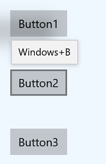
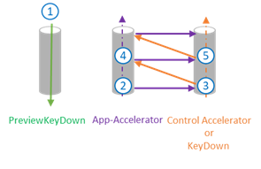
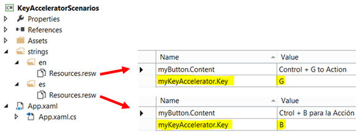

# Keyboard accelerators


Accelerator keys (or keyboard accelerators) are keyboard shortcuts that improve the usability and accessibility of your Windows applications by providing an intuitive way for users to invoke common actions or commands without navigating the app UI.

> [!NOTE]
> A keyboard is indispensable for users with certain disabilities (see [Keyboard accessibility](../accessibility/keyboard-accessibility.md)), and is also an important tool for users who prefer it as a more efficient way to interact with an app.

See the [Access keys](access-keys.md) topic for details on navigating the UI of a Windows application with keyboard shortcuts.

To create your own custom keyboard shortcuts, see the [Keyboard events](keyboard-events.md) topic.

## Overview

Accelerators are composed of two types of keys: modifiers and non-modifiers. Modifier keys include Shift, Menu, Control, and the Windows key, which are exposed through [VirtualKeyModifiers](/uwp/api/Windows.System.VirtualKeyModifiers). Non-modifiers include any [VirtualKey](/uwp/api/windows.system.virtualkey), such as Delete, F3, Spacebar, Arrow, Esc, and all alphanumeric and punctuation keys.

> [!NOTE]
> Accelerators typically include the function keys F1 through F12 or some combination of a standard key paired with one or more modifier keys (CTRL, Shift). For example, if a user presses Ctrl+Shift+M, the framework checks the modifiers (Ctrl and Shift) and fires the accelerator, if it exists.

Many XAML controls have built-in keyboard accelerators. For example, ListView supports Ctrl+A for selecting all the items in the list, and RichEditBox supports Ctrl+Tab for inserting a Tab in the text box. These built-in keyboard accelerators are referred to as **control accelerators** and are executed only if the focus is on the element or one of its children. Accelerators defined by you using the keyboard accelerator APIs discussed here are referred to as **app accelerators**.

Keyboard accelerators are not available for every action but are often associated with commands exposed in menus (and should be specified with the menu item content). Accelerators can also be associated with actions that do not have equivalent menu items. However, because users rely on an application's menus to discover and learn the available command set, you should try to make discovery of accelerators as easy as possible (using labels or established patterns can help with this).

An accelerator auto-repeats (for example, when the user presses Ctrl+Shift and then holds down M, the accelerator is invoked repeatedly until M is released). This behavior cannot be modified.

  
*Keyboard accelerators described in a menu item label*

## When to use keyboard accelerators

We recommend that you specify keyboard accelerators wherever appropriate in your UI, and support accelerators in all custom controls.

- Keyboard accelerators make your app more accessible for users with motor disabilities, including those users who can press only one key at a time or have difficulty using a mouse.

  A well-designed keyboard UI is an important aspect of software accessibility. It enables users with vision impairments or who have certain motor disabilities to navigate an app and interact with its features. Such users might not be able to operate a mouse and instead rely on various assistive technologies such as keyboard enhancement tools, on-screen keyboards, screen enlargers, screen readers, and voice input utilities. For these users, comprehensive command coverage is crucial.

- Keyboard accelerators make your app more usable for power users who prefer to interact through the keyboard.

  Experienced users often have a strong preference for using the keyboard because keyboard-based commands can be entered more quickly and don't require them to remove their hands from the keyboard. For these users, efficiency and consistency are crucial; comprehensiveness is important only for the most frequently used commands.

## Specify a keyboard accelerator

Use the [KeyboardAccelerator](/uwp/api/windows.ui.xaml.input.keyboardaccelerator.-ctor) APIs to create keyboard accelerators in Windows apps. With these APIs, you don't have to handle multiple KeyDown events to detect the key combination pressed, and you can localize accelerators in the app resources.

We recommend that you set keyboard accelerators for the most common actions in your app and document them using the menu item label or tooltip. In this example, we declare keyboard accelerators only for the Rename and Copy commands.

``` xaml
<CommandBar Margin="0,200" AccessKey="M">
  <AppBarButton 
    Icon="Share" 
    Label="Share" 
    Click="OnShare" 
    AccessKey="S" />
  <AppBarButton 
    Icon="Copy" 
    Label="Copy" 
    ToolTipService.ToolTip="Copy (Ctrl+C)" 
    Click="OnCopy" 
    AccessKey="C">
    <AppBarButton.KeyboardAccelerators>
      <KeyboardAccelerator 
        Modifiers="Control" 
        Key="C" />
    </AppBarButton.KeyboardAccelerators>
  </AppBarButton>

  <AppBarButton 
    Icon="Delete" 
    Label="Delete" 
    Click="OnDelete" 
    AccessKey="D" />
  <AppBarSeparator/>
  <AppBarButton 
    Icon="Rename" 
    Label="Rename" 
    ToolTipService.ToolTip="Rename (F2)" 
    Click="OnRename" 
    AccessKey="R">
    <AppBarButton.KeyboardAccelerators>
      <KeyboardAccelerator 
        Modifiers="None" Key="F2" />
    </AppBarButton.KeyboardAccelerators>
  </AppBarButton>

  <AppBarButton 
    Icon="SelectAll" 
    Label="Select" 
    Click="OnSelect" 
    AccessKey="A" />
  
  <CommandBar.SecondaryCommands>
    <AppBarButton 
      Icon="OpenWith" 
      Label="Sources" 
      AccessKey="S">
      <AppBarButton.Flyout>
        <MenuFlyout>
          <ToggleMenuFlyoutItem Text="OneDrive" />
          <ToggleMenuFlyoutItem Text="Contacts" />
          <ToggleMenuFlyoutItem Text="Photos"/>
          <ToggleMenuFlyoutItem Text="Videos"/>
        </MenuFlyout>
      </AppBarButton.Flyout>
    </AppBarButton>
    <AppBarToggleButton 
      Icon="Save" 
      Label="Auto Save" 
      IsChecked="True" 
      AccessKey="A"/>
  </CommandBar.SecondaryCommands>

</CommandBar>
```

  
***Keyboard accelerator described in a tooltip***

The [UIElement](/uwp/api/windows.ui.xaml.uielement) object has a [KeyboardAccelerator](/uwp/api/windows.ui.xaml.input.keyboardaccelerator) collection, [KeyboardAccelerators](/uwp/api/windows.ui.xaml.uielement.KeyboardAccelerators), where you specify your custom KeyboardAccelerator objects and define the keystrokes for the keyboard accelerator:

-   **[Key](/uwp/api/windows.ui.xaml.input.keyboardaccelerator.Key)** - the [VirtualKey](/uwp/api/windows.system.virtualkey) used for the keyboard accelerator.

-   **[Modifiers](/uwp/api/windows.ui.xaml.input.keyboardaccelerator.Modifiers)** – the [VirtualKeyModifiers](/uwp/api/windows.system.virtualkeymodifiers) used for the keyboard accelerator. If Modifiers is not set, the default value is None.

> [!NOTE]
> Single key (A, Delete, F2, Spacebar, Esc, Multimedia Key) accelerators and multi-key accelerators (Ctrl+Shift+M) are supported. However, Gamepad virtual keys are not supported.

## Scoped accelerators

Some accelerators work only in specific scopes while others work app-wide.

For example, Microsoft Outlook includes the following accelerators:
-   Ctrl+B, Ctrl+I and ESC work only on the scope of the send email form
-   Ctrl+1 and Ctrl+2 work app-wide

### Context menus

Context menu actions affect only specific areas or elements, such as the selected characters in a text editor or a song in a playlist. For this reason, we recommend setting the scope of keyboard accelerators for context menu items to the parent of the context menu.

Use the [ScopeOwner](/uwp/api/windows.ui.xaml.input.keyboardaccelerator.ScopeOwner) property to specify the scope of the keyboard accelerator. This code demonstrates how to implement a context menu on a ListView with scoped keyboard accelerators:

``` xaml
<ListView x:Name="MyList">
  <ListView.ContextFlyout>
    <MenuFlyout>
      <MenuFlyoutItem Text="Share" Icon="Share"/>
      <MenuFlyoutItem Text="Copy" Icon="Copy">
        <MenuFlyoutItem.KeyboardAccelerators>
          <KeyboardAccelerator 
            Modifiers="Control" 
            Key="C" 
            ScopeOwner="{x:Bind MyList }" />
        </MenuFlyoutItem.KeyboardAccelerators>
      </MenuFlyoutItem>
      
      <MenuFlyoutItem Text="Delete" Icon="Delete" />
      <MenuFlyoutSeparator />
      
      <MenuFlyoutItem Text="Rename">
        <MenuFlyoutItem.KeyboardAccelerators>
          <KeyboardAccelerator 
            Modifiers="None" 
            Key="F2" 
            ScopeOwner="{x:Bind MyList}" />
        </MenuFlyoutItem.KeyboardAccelerators>
      </MenuFlyoutItem>
      
      <MenuFlyoutItem Text="Select" />
    </MenuFlyout>
    
  </ListView.ContextFlyout>
    
  <ListViewItem>Track 1</ListViewItem>
  <ListViewItem>Alternative Track 1</ListViewItem>

</ListView>
```

The ScopeOwner attribute of the MenuFlyoutItem.KeyboardAccelerators element marks the accelerator as scoped instead of global (the default is null, or global). For more detail, see the **Resolving accelerators** section later in this topic.

## Invoke a keyboard accelerator 

The [KeyboardAccelerator](/uwp/api/windows.ui.xaml.input.keyboardaccelerator) object uses the [UI Automation (UIA) control pattern](/windows/desktop/WinAuto/uiauto-controlpatternsoverview) to take action when an accelerator is invoked.

The UIA [control patterns] expose common control functionality. For example, the Button control implements the [Invoke](/windows/desktop/WinAuto/uiauto-implementinginvoke) control pattern to support the Click event (typically a control is invoked by clicking, double-clicking, or pressing Enter, a predefined keyboard shortcut, or some other combination of keystrokes). When a keyboard accelerator is used to invoke a control, the XAML framework looks up whether the control implements the Invoke control pattern and, if so, activates it (it is not necessary to listen for the KeyboardAcceleratorInvoked event).

In the following example, Control+S triggers the Click event because the button implements the Invoke pattern.

``` xaml 
<Button Content="Save" Click="OnSave">
  <Button.KeyboardAccelerators>
    <KeyboardAccelerator Key="S" Modifiers="Control" />
  </Button.KeyboardAccelerators>
</Button>
```

If an element implements multiple control patterns, only one can be activated through an accelerator. The control patterns are prioritized as follows:
1.  Invoke (Button)
2.  Toggle (Checkbox)
3.  Selection (ListView)
4.  Expand/Collapse (ComboBox) 

If no match is identified, the accelerator is invalid and a debug message is provided ("No automation patterns for this component found. Implement all desired behavior in the Invoked event. Setting Handled to true in your event handler suppresses this message.")

## Custom keyboard accelerator behavior

The Invoked event of the [KeyboardAccelerator](/uwp/api/windows.ui.xaml.input.keyboardaccelerator) object is fired when the accelerator is executed. The [KeyboardAcceleratorInvokedEventArgs](/uwp/api/windows.ui.xaml.input.keyboardacceleratorinvokedeventargs) event object includes the following properties:

- [**Handled**](/uwp/api/windows.ui.xaml.input.keyboardacceleratorinvokedeventargs.handled) (Boolean): Setting this to true prevents the event triggering the control pattern and stops accelerator event bubbling. The default is false.
- [**Element**](/uwp/api/windows.ui.xaml.input.keyboardacceleratorinvokedeventargs.element) (DependencyObject): The object associated with the accelerator.
- [**KeyboardAccelerator**](/uwp/api/windows.ui.xaml.input.keyboardacceleratorinvokedeventargs.keyboardaccelerator): The keyboard accelerator used to raise the Invoked event.

Here we demonstrate how to define a collection of keyboard accelerators for items in a ListView, and how to handle the Invoked event for each accelerator.

``` xaml
<ListView x:Name="MyListView">
  <ListView.KeyboardAccelerators>
    <KeyboardAccelerator Key="A" Modifiers="Control,Shift" Invoked="SelectAllInvoked" />
    <KeyboardAccelerator Key="F5" Invoked="RefreshInvoked"  />
  </ListView.KeyboardAccelerators>
</ListView>
```

``` csharp
void SelectAllInvoked(KeyboardAccelerator sender, KeyboardAcceleratorInvokedEventArgs args)
{
  MyListView.SelectAll();
  args.Handled = true;
}

void RefreshInvoked(KeyboardAccelerator sender, KeyboardAcceleratorInvokedEventArgs args)
{
  MyListView.SelectionMode = ListViewSelectionMode.None;
  MyListView.SelectionMode = ListViewSelectionMode.Multiple;
  args.Handled = true;
}
```

## Override default keyboard behavior

Some controls, when they have focus, support built-in keyboard accelerators that override any app-defined accelerator. For example, when a [TextBox](/uwp/api/windows.ui.xaml.controls.textbox) has focus, the Control+C accelerator only copies the currently selected text (app-defined accelerators are ignored and no other functionality is executed).

While we don't recommend overriding default control behaviors due to user familiarity and expectations, you can override a control's built-in keyboard accelerator. The following example shows how to override the Control+C keyboard accelerator for a [TextBox](/uwp/api/windows.ui.xaml.controls.textbox) through the [PreviewKeyDown](/uwp/api/windows.ui.xaml.uielement.previewkeydown) event handler: 

``` csharp
 private void TextBlock_PreviewKeyDown(object sender, KeyRoutedEventArgs e)
 {
    var ctrlState = CoreWindow.GetForCurrentThread().GetKeyState(Windows.System.VirtualKey.Control);
    var isCtrlDown = ctrlState == CoreVirtualKeyStates.Down || ctrlState 
        ==  (CoreVirtualKeyStates.Down | CoreVirtualKeyStates.Locked);
    if (isCtrlDown && e.Key == Windows.System.VirtualKey.C)
    {
        // Your custom keyboard accelerator behavior.
        
        e.Handled = true;
    }
 }
```  

## Disable a keyboard accelerator

If a control is disabled, the associated accelerator is also disabled. In the following example, because the IsEnabled property of the ListView is set to false, the associated Control+A accelerator can't be invoked.

``` xaml
<ListView >
  <ListView.KeyboardAccelerators>
    <KeyboardAccelerator Key="A"
      Modifiers="Control"
      Invoked="CustomListViewSelecAllInvoked" />
  </ListView.KeyboardAccelerators>
  
  <TextBox>
    <TextBox.KeyboardAccelerators>
      <KeyboardAccelerator 
        Key="A" 
        Modifiers="Control" 
        Invoked="CustomTextSelecAllInvoked" 
        IsEnabled="False" />
    </TextBox.KeyboardAccelerators>
  </TextBox>

<ListView>
```

Parent and child controls can share the same accelerator. In this case, the parent control can be invoked even if the child has focus and its accelerator is disabled.

## Screen readers and keyboard accelerators 

Screen readers such as Narrator can announce the keyboard accelerator key combination to users. By default, this is each modifier (in the VirtualModifiers enum order) followed by the key (and separated by "+" signs). You can customize this through the [AcceleratorKey](/uwp/api/windows.ui.xaml.automation.automationproperties.AcceleratorKeyProperty) AutomationProperties attached property. If more than one accelerator is specified, only the first is announced.

In this example, the AutomationProperty.AcceleratorKey returns the string "Control+Shift+A":

``` xaml
<ListView x:Name="MyListView">
  <ListView.KeyboardAccelerators>

    <KeyboardAccelerator 
      Key="A" 
      Modifiers="Control,Shift" 
      Invoked="CustomSelectAllInvoked" />
      
    <KeyboardAccelerator 
      Key="F5" 
      Modifiers="None" 
      Invoked="RefreshInvoked" />

  </ListView.KeyboardAccelerators>

</ListView>   
```

> [!NOTE] 
> Setting AutomationProperties.AcceleratorKey doesn't enable keyboard functionality, it only indicates to the UIA framework which keys are used.

## Common Keyboard Accelerators

We recommend that you make keyboard accelerators consistent across Windows applications.

Users have to memorize keyboard accelerators and expect the same (or similar) results, but this might not always be possible due to differences in functionality across apps.

| **Editing** | **Common Keyboard Accelerator** |
| ------------- | ----------------------------------- |
| Begin editing mode | Ctrl + E |
| Select all items in a focused control or window | Ctrl + A |
| Search and replace | Ctrl + H |
| Undo | Ctrl + Z |
| Redo | Ctrl + Y |
| Delete selection and copy it to the clipboard | Ctrl + X |
| Copy selection to the clipboard | Ctrl + C, Ctrl + Insert |
| Paste the contents of the clipboard | Ctrl + V, Shift + Insert |
| Paste the contents of the clipboard (with options) | Ctrl + Alt + V |
| Rename an item | F2 |
| Add a new item | Ctrl + N |
| Add a new secondary item | Ctrl + Shift + N |
| Delete selected item (with undo) | Del, Ctrl+D |
| Delete selected item (without undo) | Shift + Del |
| Bold | Ctrl + B |
| Underline | Ctrl + U |
| Italic | Ctrl + I |
| **Navigation** | |
| Find content in a focused control or Window | Ctrl + F |
| Go to the next search result | F3 |
| **Other Actions** | |
| Add favorites | Ctrl + D |
| Refresh | F5 or Ctrl + R |
| Zoom In | Ctrl + + |
| Zoom out | Ctrl + - |
| Zoom to default view | Ctrl + 0 |
| Save | Ctrl + S |
| Close | Ctrl + W |
| Print | Ctrl + P |

Notice that some of the combinations are not valid for localized versions of Windows. For example, in the Spanish version of Windows, Ctrl+N is used for bold instead of Ctrl+B. We recommend providing localized keyboard accelerators if the app is localized.

## Usability affordances for keyboard accelerators

### Tooltips

As keyboard accelerators are not typically described directly in the UI of your Windows application, you can improve discoverability through [tooltips](../controls/tooltips.md), which display automatically when the user moves focus to, presses and holds, or hovers the mouse pointer over a control. The tooltip can identify whether a control has an associated keyboard accelerator and, if so, what the accelerator key combination is.

**Windows 10, Version 1803 (April 2018 Update) and newer**

By default, when keyboard accelerators are declared, all controls (except [MenuFlyoutItem](/uwp/api/Windows.UI.Xaml.Controls.MenuFlyoutItem) and [ToggleMenuFlyoutItem](/uwp/api/windows.ui.xaml.controls.togglemenuflyoutitem)) present the corresponding key combinations in a tooltip.

> [!NOTE] 
> If a control has more than one accelerator defined, only the first is presented.

</br>
*Accelerator key combo in tooltip*

For [Button](/uwp/api/windows.ui.xaml.controls.button), [AppBarButton](/uwp/api/windows.ui.xaml.controls.appbarbutton), and [AppBarToggleButton](/uwp/api/windows.ui.xaml.controls.appbartogglebutton) objects, the keyboard accelerator is appended to the control's default tooltip. For [MenuFlyoutItem](/uwp/api/windows.ui.xaml.controls.appbarbutton) and [ToggleMenuFlyoutItem](/uwp/api/windows.ui.xaml.controls.togglemenuflyoutitem) objects, the keyboard accelerator is displayed with the flyout text.

> [!NOTE]
> Specifying a tooltip (see Button1 in the following example) overrides this behavior.

```xaml
<StackPanel x:Name="Container" Grid.Row="0" Background="AliceBlue">
    <Button Content="Button1" Margin="20"
            Click="OnSave" 
            KeyboardAcceleratorPlacementMode="Auto" 
            ToolTipService.ToolTip="Tooltip">
        <Button.KeyboardAccelerators>
            <KeyboardAccelerator  Key="A" Modifiers="Windows"/>
        </Button.KeyboardAccelerators>
    </Button>
    <Button Content="Button2"  Margin="20"
            Click="OnSave" 
            KeyboardAcceleratorPlacementMode="Auto">
        <Button.KeyboardAccelerators>
            <KeyboardAccelerator  Key="B" Modifiers="Windows"/>
        </Button.KeyboardAccelerators>
    </Button>
    <Button Content="Button3"  Margin="20"
            Click="OnSave" 
            KeyboardAcceleratorPlacementMode="Auto">
        <Button.KeyboardAccelerators>
            <KeyboardAccelerator  Key="C" Modifiers="Windows"/>
        </Button.KeyboardAccelerators>
    </Button>
</StackPanel>
```



*Accelerator key combo appended to Button's default tooltip*

```xaml
<AppBarButton Icon="Save" Label="Save">
    <AppBarButton.KeyboardAccelerators>
        <KeyboardAccelerator Key="S" Modifiers="Control"/>
    </AppBarButton.KeyboardAccelerators>
</AppBarButton>
```


*Accelerator key combo appended to AppBarButton's default tooltip*

```xaml
<AppBarButton AccessKey="R" Icon="Refresh" Label="Refresh" IsAccessKeyScope="True">
    <AppBarButton.Flyout>
        <MenuFlyout>
            <MenuFlyoutItem AccessKey="A" Icon="Refresh" Text="Refresh A">
                <MenuFlyoutItem.KeyboardAccelerators>
                    <KeyboardAccelerator Key="R" Modifiers="Control"/>
                </MenuFlyoutItem.KeyboardAccelerators>
            </MenuFlyoutItem>
            <MenuFlyoutItem AccessKey="B" Icon="Globe" Text="Refresh B" />
            <MenuFlyoutItem AccessKey="C" Icon="Globe" Text="Refresh C" />
            <MenuFlyoutItem AccessKey="D" Icon="Globe" Text="Refresh D" />
            <ToggleMenuFlyoutItem AccessKey="E" Icon="Globe" Text="ToggleMe">
                <MenuFlyoutItem.KeyboardAccelerators>
                    <KeyboardAccelerator Key="Q" Modifiers="Control"/>
                </MenuFlyoutItem.KeyboardAccelerators>
            </ToggleMenuFlyoutItem>
        </MenuFlyout>
    </AppBarButton.Flyout>
</AppBarButton>
```

</br>
*Accelerator key combo appended to MenuFlyoutItem's text*

Control the presentation behavior by using the [KeyboardAcceleratorPlacementMode](/uwp/api/windows.ui.xaml.uielement.KeyboardAcceleratorPlacementMode) property, which accepts two values: [Auto](/uwp/api/windows.ui.xaml.input.keyboardacceleratorplacementmode) or [Hidden](/uwp/api/windows.ui.xaml.input.keyboardacceleratorplacementmode).

```xaml
<Button Content="Save" Click="OnSave" KeyboardAcceleratorPlacementMode="Auto">
    <Button.KeyboardAccelerators>
        <KeyboardAccelerator Key="S" Modifiers="Control" />
    </Button.KeyboardAccelerators>
</Button>
```

In some cases, you might need to present a tooltip relative to another element (typically a container object).

Here, we show how to use the KeyboardAcceleratorPlacementTarget property to display the keyboard accelerator key combination for a Save button with the Grid container instead of the button.

```xaml
<Grid x:Name="Container" Padding="30">
  <Button Content="Save"
    Click="OnSave"
    KeyboardAcceleratorPlacementMode="Auto"
    KeyboardAcceleratorPlacementTarget="{x:Bind Container}">
    <Button.KeyboardAccelerators>
      <KeyboardAccelerator  Key="S" Modifiers="Control" />
    </Button.KeyboardAccelerators>
  </Button>
</Grid>
```

### Labels

In some cases, we recommend using a control's label to identify whether the control has an associated keyboard accelerator and, if so, what the accelerator key combination is. 

Some platform controls do this by default, specifically the [MenuFlyoutItem](/uwp/api/Windows.UI.Xaml.Controls.MenuFlyoutItem) and [ToggleMenuFlyoutItem](/uwp/api/windows.ui.xaml.controls.togglemenuflyoutitem) objects, while the [AppBarButton](/uwp/api/windows.ui.xaml.controls.appbarbutton) and the [AppBarToggleButton](/uwp/api/windows.ui.xaml.controls.appbartogglebutton) do it when they appear in the overflow menu of the [CommandBar](/uwp/api/windows.ui.xaml.controls.commandbar).

  
*Keyboard accelerators described in a menu item label*

You can override the default accelerator text for the label through the [KeyboardAcceleratorTextOverride](/uwp/api/windows.ui.xaml.controls.appbarbutton.KeyboardAcceleratorTextOverride) property of the [MenuFlyoutItem](/uwp/api/Windows.UI.Xaml.Controls.MenuFlyoutItem), [ToggleMenuFlyoutItem](/uwp/api/windows.ui.xaml.controls.togglemenuflyoutitem), [AppBarButton](/uwp/api/windows.ui.xaml.controls.appbarbutton), and [AppBarToggleButton](/uwp/api/windows.ui.xaml.controls.appbartogglebutton) controls (use a single space for no text). 

> [!NOTE]
> The override text is not be presented if the system cannot detect an attached keyboard (you can check this yourself through the [KeyboardPresent](/uwp/api/windows.devices.input.keyboardcapabilities.KeyboardPresent) property).

## Advanced Concepts

Here, we review some low-level aspects of keyboard accelerators.

### Input event priority

Input events occur in a specific sequence that you can intercept and handle based on the requirements of your app. 

#### The KeyDown/KeyUp bubbling event

In XAML, a keystroke is processed as if there is just one input bubbling pipeline. This input pipeline is used by the KeyDown/KeyUp events and character input. For example, if an element has focus and the user presses a key down, a KeyDown event is raised on the element, followed by the parent of the element, and so on up the tree, until the args.Handled property is true.

The KeyDown event is also used by some controls to implement the built-in control accelerators. When a control has a keyboard accelerator, it handles the KeyDown event, which means that there won't be KeyDown event bubbling. For example, the RichEditBox supports copy with Ctrl+C. When Ctrl is pressed, the KeyDown event is fired and bubbles, but when the user presses C at the same time, the KeyDown event is marked Handled and is not raised (unless the handledEventsToo parameter of [UIElement.AddHandler](/uwp/api/windows.ui.xaml.uielement.addhandler) is set to true).

#### The CharacterReceived event

As the [CharacterReceived](/uwp/api/windows.ui.core.corewindow.CharacterReceived) event is fired after the [KeyDown](/uwp/api/windows.ui.core.corewindow.KeyDown) event for text controls such as TextBox, you can cancel character input in the KeyDown event handler.

#### The PreviewKeyDown and PreviewKeyUp events

The preview input events are fired before any other events. If you don't handle these events, the accelerator for the element that has the focus is fired, followed by the KeyDown event. Both events bubble until handled.



***Key event sequence***

Order of events:

Preview KeyDown events<br>
…<br>
App accelerator<br>
OnKeyDown method<br>
KeyDown event<br>
App accelerators on the parent<br>
OnKeyDown method on the parent<br>
KeyDown event on the parent<br>
(Bubbles to the root)<br>
…<br>
CharacterReceived event<br>
PreviewKeyUp events<br>
KeyUpEvents<br>

When the accelerator event is handled, the KeyDown event is also marked as handled. The KeyUp event remains unhandled.

### Resolving accelerators

A keyboard accelerator event bubbles from the element that has focus up to the root. If the event isn't handled, the XAML framework looks for other unscoped app accelerators outside of the bubbling path.

When two keyboard accelerators are defined with the same key combination, the first keyboard accelerator found on the visual tree is invoked.

Scoped keyboard accelerators are invoked only when focus is inside a specific scope. For example, in a Grid that contains dozens of controls, a keyboard accelerator can be invoked for a control only when focus is within the Grid (the scope owner).

### Scoping accelerators programmatically

The [UIElement.TryInvokeKeyboardAccelerator](/uwp/api/windows.ui.xaml.uielement.tryinvokekeyboardaccelerator) method invokes any matching accelerators in the subtree of the element.

The [UIElement.OnProcessKeyboardAccelerators](/uwp/api/windows.ui.xaml.uielement.onprocesskeyboardaccelerators) method is executed before the keyboard accelerator. This method passes a [ProcessKeyboardAcceleratorArgs](/uwp/api/windows.ui.xaml.input.processkeyboardacceleratoreventargs) object that contains the key, the modifier, and a Boolean indicating whether the keyboard accelerator is handled. If marked as handled, the keyboard accelerator bubbles (so the outside keyboard accelerator is never invoked).

> [!NOTE]
> OnProcessKeyboardAccelerators always fires, whether handled or not (similar to the OnKeyDown event). You must check whether the event was marked as handled.

In this example, we use OnProcessKeyboardAccelerators and TryInvokeKeyboardAccelerator to scope keyboard accelerators to the Page object:

``` csharp
protected override void OnProcessKeyboardAccelerators(
  ProcessKeyboardAcceleratorArgs args)
{
  if(args.Handled != true)
  {
    this.TryInvokeKeyboardAccelerator(args);
    args.Handled = true;
  }
}
```

### Localize the accelerators

We recommend localizing all keyboard accelerators. You can do this with the standard resources (.resw) file and the x:Uid attribute in your XAML declarations. In this example, the Windows Runtime automatically loads the resources.


***Keyboard accelerator localization with the resources file***

``` xaml
<Button x:Uid="myButton" Click="OnSave">
  <Button.KeyboardAccelerators>
    <KeyboardAccelerator x:Uid="myKeyAccelerator" Modifiers="Control"/>
  </Button.KeyboardAccelerators>
</Button>
```

> [!NOTE]
> Keyboard accelerators are implemented as virtual-keys. Localized accelerators must be chosen from the predefined collection of [Virtual-Key codes](/windows/win32/inputdev/virtual-key-codes) (otherwise, a XAML parser error will occur).

### Setup an accelerator programmatically

Here is an example of programmatically defining an accelerator:

``` csharp
void AddAccelerator(
  VirtualKeyModifiers keyModifiers, 
  VirtualKey key, 
  TypedEventHandler<KeyboardAccelerator, KeyboardAcceleratorInvokedEventArgs> handler )
  {
    var accelerator = 
      new KeyboardAccelerator() 
      { 
        Modifiers = keyModifiers, Key = key
      };
    accelerator.Invoked += handler;
    this.KeyboardAccelerators.Add(accelerator);
  }
```

> [!NOTE]
> KeyboardAccelerator is not shareable, the same KeyboardAccelerator can't be added to multiple elements.

### Override keyboard accelerator behavior

You can handle the [KeyboardAccelerator.Invoked](/uwp/api/windows.ui.xaml.input.keyboardaccelerator.Invoked) event to override the default KeyboardAccelerator behavior.

This example shows how to override the "Select all" command (Ctrl+A keyboard accelerator) in a custom ListView control. We also set the Handled property to true to stop the event bubbling further.

```csharp
public class MyListView : ListView
{
  …
  protected override void OnKeyboardAcceleratorInvoked(KeyboardAcceleratorInvokedEventArgs args) 
  {
    if(args.Accelerator.Key == VirtualKey.A 
      && args.Accelerator.Modifiers == KeyboardModifiers.Control)
    {
      CustomSelectAll(TypeOfSelection.OnlyNumbers); 
      args.Handled = true;
    }
  }
  …
}
```

## Related articles

- [Keyboard interactions](keyboard-interactions.md)
- [Access keys](access-keys.md)
- [VirtualKey Enum](/uwp/api/windows.system.virtualkey)

### Samples

- [WinUI Gallery](https://github.com/Microsoft/WinUI-Gallery)
