# Keyboard interactions

Learn how to design and optimize your Windows apps so they provide the best experiences for both keyboard power users and those with disabilities and other accessibility requirements.

Across devices, keyboard input is an important part of the overall Windows app interaction experience. A well-designed keyboard experience lets users efficiently navigate the UI of your app and access its full functionality without ever lifting their hands from the keyboard.

***Common interaction patterns are shared between keyboard and gamepad***

In this topic, we focus specifically on Windows app design for keyboard input on PCs. However, a well-designed keyboard experience is important for supporting accessibility tools such as Windows Narrator, using [software keyboards](#software-keyboard) such as the touch keyboard and the On-Screen Keyboard (OSK), and for handling other input device types, such as a game pad or remote control.

Many of the guidelines and recommendations discussed here, including [focus visuals](#focus-visuals), [access keys](#access-keys), and [UI navigation](#navigation), are also applicable to these other scenarios.

**NOTE**  While both hardware and software keyboards are used for text input, the focus of this topic is navigation and interaction.

## Built-in support

Along with the mouse, the keyboard is the most widely used peripheral on PCs and, as such, is a fundamental part of the PC experience. PC users expect a comprehensive and consistent experience from both the system and individual apps in response to keyboard input.

All UWP controls include built-in support for rich keyboard experiences and user interactions, while the platform itself provides an extensive foundation for creating keyboard experiences that you feel are best suited to both your custom controls and apps.

***UWP supports keyboard with any device***

## Basic experiences
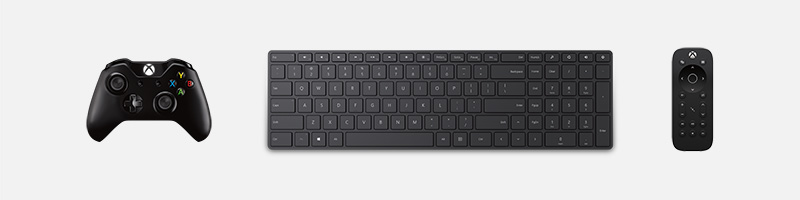

As mentioned previously, input devices such as a game pad and remote control, and accessibility tools such as Narrator, share much of the keyboard input experience for navigation and commanding. This common experience across input types and tools minimizes additional work from you and contributes to the "build once, run anywhere" goal of the Universal Windows Platform.

Where necessary, we'll identify key differences you should be aware of and describe any mitigations you should consider.

Here are the devices and tools discussed in this topic:

| Device/tool                       | Description     |
|-----------------------------------|-----------------|
|Keyboard (hardware and software)   |In addition to the standard hardware keyboard, Windows applications support two software keyboards: the [touch (or software) keyboard](#software-keyboard) and the [On-Screen Keyboard](#on-screen-keyboard).|
|Game pad and remote control         |A game pad and remote control are fundamental input devices in the [10-foot experience](../devices/designing-for-tv.md). For specific details on Windows support for game pad and remote control, see [Game pad and remote control interactions](gamepad-and-remote-interactions.md).|
|Screen readers (Narrator)          |Narrator is a built-in screen reader for Windows that provides unique interaction experiences and functionality, but still relies on basic keyboard navigation and input. For Narrator details, see [Getting started with Narrator](https://support.microsoft.com/help/22798/windows-10-complete-guide-to-narrator).|

## Custom experiences and efficient keyboarding
As mentioned, keyboard support is integral to ensuring your applications work great for users with different skills, abilities, and expectations. We recommend that you prioritize the following.
- Support keyboard navigation and interaction
    - Ensure actionable items are identified as tab stops (and non-actionable items are not), and navigation order is logical and predictable (see [Tab stops](#tab-stops))
    - Set initial focus on the most logical element (see [Initial focus](#initial-focus))
    - Provide arrow key navigation for "inner navigations" (see [Navigation](#navigation))
- Support keyboard shortcuts
    - Provide accelerator keys for quick actions (see [Accelerators](#accelerators))
    - Provide access keys to navigate your application's UI (see [Access keys](access-keys.md))

### Focus visuals

The UWP supports a single focus visual design that works well for all input types and experiences.

A focus visual:

- Is shown when a UI element receives focus from a keyboard and/or gamepad/remote control
- Is rendered as a highlighted border around the UI element to indicate an action can be taken
- Helps a user navigate an app UI without getting lost
- Can be customized for your app (See [High visibility focus  visuals](guidelines-for-visualfeedback.md#high-visibility-focus-visuals))

**NOTE** The UWP focus visual is not the same as the Narrator focus rectangle.

### Tab stops

To use a control (including navigation elements) with the keyboard, the control must have focus. One way for a control to receive keyboard focus is to make it accessible through tab navigation by identifying it as a tab stop in your application's tab order.

For a control to be included in the tab order, the [IsEnabled](/uwp/api/windows.ui.xaml.controls.control#Windows_UI_Xaml_Controls_Control_IsEnabled) property must be set to **true** and the [IsTabStop](/uwp/api/Windows.UI.Xaml.Controls.Control#Windows_UI_Xaml_Controls_Control_IsTabStop) property must be set to **true**.

To specifically exclude a control from the tab order, set the [IsTabStop](/uwp/api/Windows.UI.Xaml.Controls.Control#Windows_UI_Xaml_Controls_Control_IsTabStop) property to **false**.

By default, tab order reflects the order in which UI elements are created. For example, if a `StackPanel` contains a `Button`, a `Checkbox`, and a `TextBox`, tab order is `Button`, `Checkbox`, and `TextBox`.

You can override the default tab order by setting the [TabIndex](/uwp/api/Windows.UI.Xaml.Controls.Control#Windows_UI_Xaml_Controls_Control_TabIndex) property.

#### Tab order should be logical and predictable

A well-designed keyboard navigation model, using a logical and predictable tab order, makes your app more intuitive and helps users explore, discover, and access functionality more efficiently and effectively.

All interactive controls should have tab stops (unless they are in a [group](#control-group)), while non-interactive controls, such as labels, should not.

Avoid a custom tab order that makes the focus jump around in your application. For example, a list of controls in a form should have a tab order that flows from top to bottom and left to right (depending on locale).

See [Keyboard accessibility](../accessibility/keyboard-accessibility.md) for more details about customizing tab stops.

#### Try to coordinate tab order and visual order

Coordinating tab order and visual order (also referred to as reading order or display order) helps reduce confusion for users as they navigate through your application's UI.

Try to rank and present the most important commands, controls, and content first in both the tab order and the visual order. However, the actual display position can depend on the parent layout container and certain properties of the child elements that influence the layout. Specifically, layouts that use a grid metaphor or a table metaphor can have a visual order quite different from the tab order.

**NOTE** Visual order is also dependent on locale and language.

### Initial focus

Initial focus specifies the UI element that receives focus when an application or a page is first launched or activated. When using a keyboard, it is from this element that a user starts interacting with your application's UI.

For UWP apps, initial focus is set to the element with the highest [TabIndex](/uwp/api/Windows.UI.Xaml.Controls.Control#Windows_UI_Xaml_Controls_Control_TabIndex) that can receive focus. Child elements of container controls are ignored. In a tie, the first element in the visual tree receives focus.

#### Set initial focus on the most logical element

Set initial focus on the UI element for the first, or primary, action that users are most likely to take when launching your app or navigating to a page. Some examples include:
-   A photo app where focus is set to the first item in a gallery
-   A music app where focus is set to the play button

#### Don't set initial focus on an element that exposes a potentially negative, or even disastrous, outcome

This level of functionality should be a user's choice. Setting initial focus to an element with a significant outcome might result in unintended data loss or system access. For example, don't set focus to the delete button when navigating to an e-mail.

See [Focus navigation](focus-navigation.md) for more details about overriding tab order.

### Navigation

Keyboard navigation is typically supported through the Tab keys and the Arrow keys.

By default, UWP controls follow these basic keyboard behaviors:
-   **Tab keys** navigate between actionable/active controls in tab order.
-   **Shift + Tab** navigate controls in reverse tab order. If user has navigated inside the control using arrow key, focus is set to the last known value inside the control.
-   **Arrow keys** expose control-specific "inner navigation" When user enters "inner navigation,"" arrow keys do not navigate out of a control. Some examples include:
    -   Up/Down arrow key moves focus inside `ListView` and `MenuFlyout`
    -   Modify currently selected values for `Slider` and `RatingsControl`
    -   Move caret inside `TextBox`
    -   Expand/collapse items inside `TreeView`

Use these default behaviors to optimize your application's keyboard navigation.

#### Use "inner navigation" with sets of related controls

Providing arrow key navigation into a set of related controls reinforces their relationship within the overall organization of your application's UI.

For example, the `ContentDialog` control shown here provides inner navigation by default for a horizontal row of buttons (for custom controls, see the [Control Group](#control-group) section).

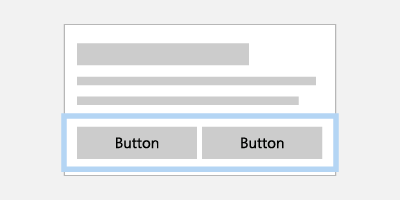

***Interaction with a collection of related buttons is made easier with arrow key navigation***

If items are displayed in a single column, Up/Down arrow key navigates items. If items are displayed in a single row, Right/Left arrow key navigates items. If items are multiple columns, all 4 arrow keys navigate.

#### Define a single tab stop for a collection of related controls

By defining a single tab stop for a collection of related, or complementary, controls, you can minimize the number of overall tab stops in your app.

For example, the following images show two stacked `ListView` controls. The image on the left shows arrow key navigation used with a tab stop to navigate between `ListView` controls, while the image on the right shows how navigation between child elements could be made easier and more efficient by eliminating the need for to traverse parent controls with a tab key.

<table>
  <td></td>
  <td></td>
</table>

***Interaction with two stacked ListView controls can be made easier and more efficient by eliminating the tab stop and navigating with just arrow keys.***

Visit [Control Group](#control-group) section to learn how to apply the optimization examples to your application UI.

### Interaction and commanding

Once a control has focus, a user can interact with it and invoke any associated functionality using specific keyboard input.

#### Text entry

For those controls specifically designed for text input such as `TextBox` and `RichEditBox`, all keyboard input is used for entering or navigating text, which takes priority over other keyboard commands. For example, the drop down menu for an `AutoSuggestBox` control does not recognize the **Space** key as a selection command.

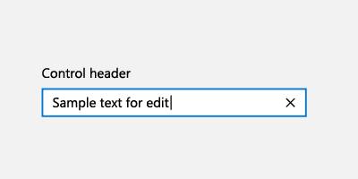

#### Space key

When not in text entry mode, the **Space** key invokes the action or command associated with the focused control (just like a tap with touch or a click with a mouse).

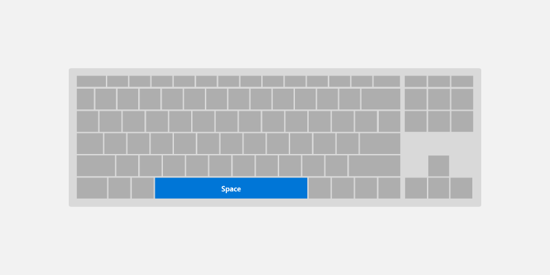

#### Enter key

The **Enter** key can perform a variety of common user interactions, depending on the control with focus:
-   Activates command controls such as a `Button` or `Hyperlink`. To avoid end user confusion, the **Enter** key also activates controls that look like command controls such as `ToggleButton` or `AppBarToggleButton`.
-   Displays the picker UI for controls such as `ComboBox` and `DatePicker`. The **Enter** key also commits and closes the picker UI.
-   Activates list controls such as `ListView`, `GridView`, and `ComboBox`.
    -   The **Enter** key performs the selection action as the **Space** key for list and grid items, unless there is an additional action associated with these items (opening a new window).
    -   If an additional action is associated with the control, the **Enter** key performs the additional action and the **Space** key performs the selection action.

**NOTE** The **Enter** key and **Space** key do not always perform the same action, but often do.

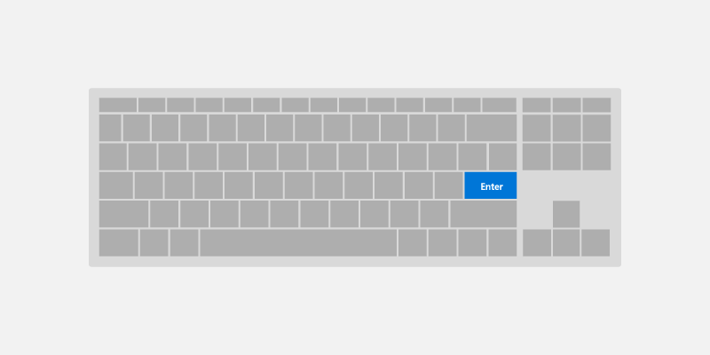

#### Esc key

The Esc key lets a user cancel transient UI (along with any ongoing actions in that UI).

Examples of this experience include:
-   User opens a `ComboBox` with a selected value and uses the arrow keys to move the focus selection to a new value. Pressing the Esc key closes the `ComboBox` and resets the selected value back to the original value.
-   User invokes a permanent delete action for an email and is prompted with a `ContentDialog` to confirm the action. The user decides this is not the intended action and presses the **Esc** key to close the dialog. As the **Esc** key is associated with the **Cancel** button, the dialog is closed and the action is canceled. The **Esc** key only affects transient UI, it does not close, or back navigate through, app UI.

#### Home and End keys

The **Home** and **End** keys let a user scroll to the beginning or end of a UI region.

Examples of this experience include:
-   For `ListView` and `GridView` controls, the **Home** key moves focus to the first element and scrolls it into view, whereas the **End** key moves focus to the last element and scrolls it into view.
-   For a `ScrollView` control, the **Home** key scrolls to the top of the region, whereas the **End** key scrolls to the bottom of the region (focus is not changed).

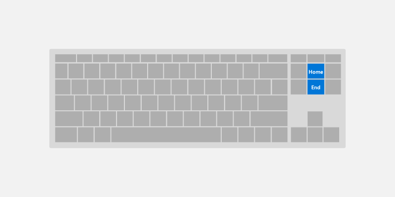

#### Page up and Page down keys

The **Page** keys let a user scroll a UI region in discrete increments.

For example, for `ListView` and `GridView` controls, the **Page up** key scrolls the region up by a "page" (typically the viewport height) and moves focus to the top of the region. Alternately, the **Page down** key scrolls the region down by a page and moves focus to the bottom of the region.

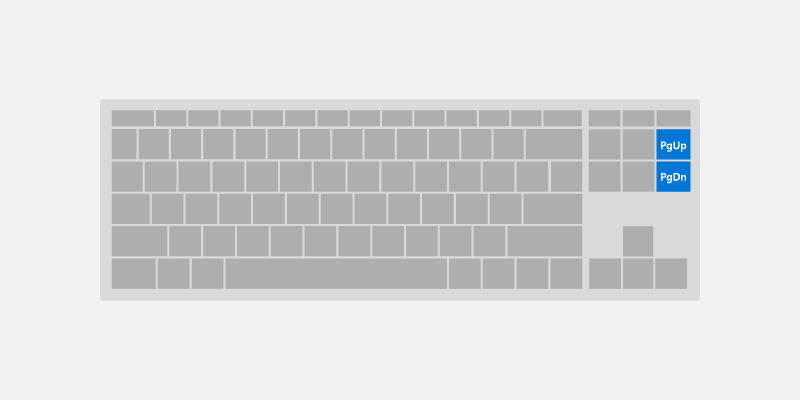

#### F6 key

The **F6** key lets a user cycle between panes or important sections of your app or UI. **Shift-F6** typically cycles backwards (see [Keyboard accessibility](../accessibility/keyboard-accessibility.md)).

These are often related to [landmarks and headings](../accessibility/landmarks-and-headings.md), but do not need to correspond directly.

For example:

- In Edge, pressing F6 will cycle between the tab bar, the address bar/app bar, and the page content.
- In File Explorer, pressing F6 will cycle between the sections of the app.
- On the desktop, pressing F6 will cycle between parts of the taskbar and the desktop.

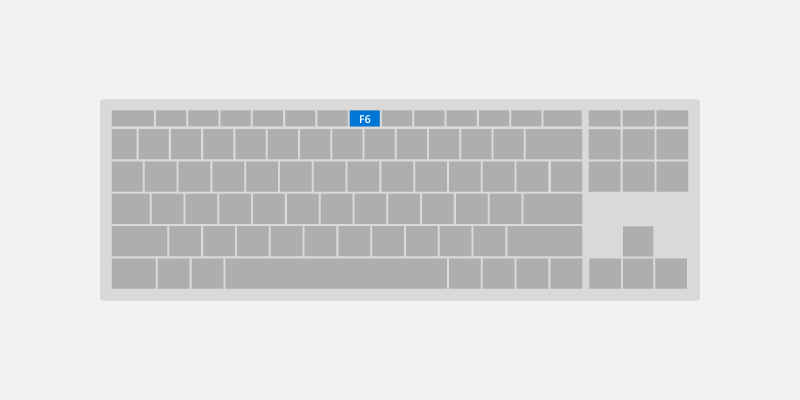

### Keyboard shortcuts

In addition to implementing keyboard navigation and activation, it is also good practice to implement keyboard shortcuts such as [keyboard accelerators](../input/keyboard-accelerators.md) and [access keys](../input/access-keys.md) for important or frequently used functionality.

Keyboard shortcuts can make your app easier to use by providing both enhanced support for accessibility and improved efficiency for keyboard users.

A shortcut is a keyboard combination that enhances productivity by providing an efficient way for the user to access app functionality. There are two kinds of shortcut:

- [Accelerators](#accelerators) are shortcuts that invoke an app command. Your app may or may not provide specific UI that corresponds to the command. Accelerators typically consist of the Ctrl key plus a letter key.
- [Access keys](#access-keys) are shortcuts that set focus to specific UI in your application. Access keys typically consist of the Alt key plus a letter key.

Providing consistent keyboard shortcuts that support similar tasks across applications makes them much more useful and powerful and helps users remember them.

#### Accelerators

Accelerators help users perform common actions in an application much more quickly and efficiently. 

Examples of Accelerators:
-   Pressing Ctrl + N key anywhere in the **Mail** app launches a new mail item.
-   Pressing Ctrl + E key anywhere in Microsoft Edge (and many Microsoft Store applications) launches search.

Accelerators have the following characteristics:
-   They primarily use Ctrl and Function key sequences (Windows system shortcut keys also use Alt + non-alphanumeric keys and the Windows logo key).
-   They are assigned only to the most commonly used commands.
-   They are intended to be memorized, and are documented only in menus, tooltips, and Help.
-   They have effect throughout the entire application, when supported.
-   They should be assigned consistently as they are memorized and not directly documented.

#### Access keys

See [Access keys](access-keys.md) page for more in-depth information for supporting access keys with UWP.

Access keys help users with motor function disabilities an ability to press one key at a time to action on a specific item in the UI. Moreover, access keys can be used to communicate additional shortcut keys to help advanced users perform actions quickly.

Access keys have the following characteristics:
-   They use the Alt key plus an alphanumeric key.
-   They are primarily for accessibility.
-   They are documented directly in the UI, adjacent to the control, through [Key Tips](access-keys.md).
-   They have effect only in the current window, and navigate to the corresponding menu item or control.
-   Access keys should be assigned consistently to commonly used commands (especially commit buttons), whenever possible.
-   They are localized.

#### Common keyboard shortcuts

The following table is a small sample of frequently used keyboard shortcuts. 

| Action                               | Key command                                      |
|--------------------------------------|--------------------------------------------------|
| Select all                           | Ctrl+A                                           |
| Continuously select                  | Shift+Arrow key                                  |
| Save                                 | Ctrl+S                                           |
| Find                                 | Ctrl+F                                           |
| Print                                | Ctrl+P                                           |
| Copy                                 | Ctrl+C                                           |
| Cut                                  | Ctrl+X                                           |
| Paste                                | Ctrl+V                                           |
| Undo                                 | Ctrl+Z                                           |
| Next tab                             | Ctrl+Tab                                         |
| Close tab                            | Ctrl+F4 or Ctrl+W                                |
| Semantic zoom                        | Ctrl++ or Ctrl+-                                 |

For a comprehensive list of Windows system shortcuts, see [keyboard shortcuts for Windows](https://support.microsoft.com/help/12445/windows-keyboard-shortcuts). For common application shortcuts, see [keyboard shortcuts for Microsoft applications](https://support.microsoft.com/help/13805/windows-keyboard-shortcuts-in-apps).

## Advanced experiences

In this section, we discuss some of the more complex keyboard interaction experiences supported by UWP apps, along with some of the behaviors you should be aware of when your app is used on different devices and with different tools.

### Control group

You can group a set of related, or complementary, controls in a "control
group" (or directional area), which enables "inner navigation" using the
arrow keys. The control group can be a single tab stop, or you can
specify multiple tab stops within the control group.

#### Arrow key navigation

Users expect support for arrow key navigation when there is a group of similar, related controls in a UI region:
-   `AppBarButtons` in a `CommandBar`
-   `ListItems` or `GridItems` inside `ListView` or `GridView`
-   `Buttons` inside `ContentDialog`

UWP controls support arrow key navigation by default. For custom layouts and control groups, use `XYFocusKeyboardNavigation="Enabled"` to provide similar behavior.

Consider adding support for arrow key navigation when using the following controls:

<table>
  <tr>
    <td>
      

      
Dialog buttons

      

      
RadioButtons
     
    </td>
    <td>
      

      
AppBarButtons

      
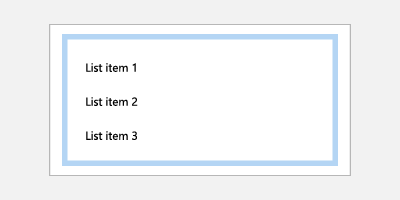

      
ListItems and GridItems

    </td>    
  </tr>
</table>

#### Tab stops

Depending on your application's functionality and layout, the best navigation option for a control group might be a single tab stop with arrow navigation to child elements, multiple tab stops, or some combination.

##### Use multiple tab stops and arrow keys for buttons

Accessibility users rely on well-established keyboard navigation rules, which do not typically use arrow keys to navigate a collection of buttons. However, users without visual impairments might feel that the behavior is natural.

An example of default UWP behavior in this case is the `ContentDialog`. While arrow keys can be used to navigate between buttons, each button is also a tab stop.

##### Assign single tab stop to familiar UI patterns

In cases where your layout follows a well-known UI pattern for control groups, assigning a single tab stop to the group can improve navigation efficiency for users.

Examples include:
-   `RadioButtons`
-   Multiple `ListViews` that look like and behave like a single `ListView`
-   Any UI made to look and behave like grid of tiles (such as the Start menu tiles)

#### Specifying control group behavior

Use the following APIs to support custom control group behavior (all are discussed in more detail later in this topic):

-   [XYFocusKeyboardNavigation](focus-navigation.md#2d-directional-navigation-for-keyboard) enables arrow key navigation between controls
-   [TabFocusNavigation](focus-navigation.md#tab-navigation) indicates whether there are multiple tab stops or single tab stop
-   [FindFirstFocusableElement and FindLastFocusableElement](focus-navigation-programmatic.md#find-the-first-and-last-focusable-element) sets focus on the first item with **Home** key and the last item with **End** key

The following image shows an intuitive keyboard navigation behavior for a control group of associated radio buttons. In this case, we recommend a single tab stop for the control group, inner navigation between the radio buttons using the arrow keys, **Home** key bound to the first radio button, and **End** key bound to the last radio button.

### Keyboard and Narrator

Narrator is a UI accessibility tool geared towards keyboard users (other input types are also supported). However, Narrator functionality goes beyond the keyboard interactions supported by UWP apps and extra care is required when designing your UWP app for Narrator. (The [Narrator basics page](https://support.microsoft.com/help/22808/windows-10-narrator-basics) guides you through the Narrator user experience.)

Some of the differences between UWP keyboard behaviors and those supported by Narrator include:
-   Extra key combinations for navigation to UI elements that are not exposed through standard keyboard navigation, such as Caps lock + arrow keys to read control labels.
-   Navigation to disabled items. By default, disabled items are not exposed through standard keyboard navigation.
-   Control "views" for quicker navigation based on UI granularity. Users can navigate to items, characters, word, lines, paragraphs, links, headings, tables, landmarks, and suggestions. Standard keyboard navigation exposes these objects as a flat list, which might make navigation cumbersome unless you provide shortcut keys.

#### Case Study – AutoSuggestBox control

The search button for the `AutoSuggestBox` is not accessible to standard keyboard navigation using tab and arrow keys because the user can press the **Enter** key to submit the search query. However, it is accessible through Narrator when the user presses Caps Lock + an arrow key.

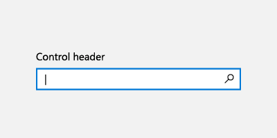

*With keyboard, users press the* ***Enter*** *key to submit search query*

<table>
  <tr>
    <td>
      

      
<em>With Narrator, users press the <strong>Enter</strong> key to submit search query</em>

    </td>
    <td>
      

      
<em>With Narrator, users are also able to access the search button using the <strong>Caps Lock + Right arrow key</strong>, then pressing <strong>Space</strong> key</em>

    </td>
  </tr>
</table>

### Keyboard, game pad, and remote control

Game pads and remote controls support many UWP keyboard behaviors and experiences. However, due to the lack of various key options available on a keyboard, game pad and remote control lack many keyboard optimizations (remote control is even more limited than game pad).

See [Game pad and remote control interactions](gamepad-and-remote-interactions.md) for more detail on UWP support for game pad and remote control input.

The following shows some key mappings between keyboard, game pad, and remote control.

| **Keyboard**  | **Game pad**                         | **Remote control**  |
|---------------|-------------------------------------|---------------------|
| Space         | A button                            | Select button       |
| Enter         | A button                            | Select button       |
| Escape        | B button                            | Back button         |
| Home/End      | N/A                                 | N/A                 |
| Page Up/Down  | Trigger button for vertical scroll, Bumper button for horizontal scroll   | N/A                 |

Some key differences you should be aware of when designing your UWP app for use with game pad and remote control usage include:
-   Text entry requires the user to press A to activate a text control.
-   Focus navigation is not limited to control groups, users can navigate freely to any focusable UI element in the app.

    **NOTE** Focus can move to any focusable UI element in the key press direction unless it is in an overlay UI or [focus engagement](gamepad-and-remote-interactions.md#focus-engagement) is specified, which prevents focus from entering/exiting a region until engaged/disengaged with the A button. For more info, see the [directional navigation](#directional-navigation) section.
-   D-pad and left stick buttons are used to move focus between controls and for inner navigation.

    **NOTE** Gamepad and remote control only navigate to items that are in the same visual order as the directional key pressed. Navigation is disabled in that direction when there is no subsequent element that can receive focus. Depending on the situation, keyboard users do not always have that constraint. See the [Built in keyboard optimization](#built-in-keyboard-optimization) section for more info.

#### Directional navigation

Directional navigation is managed by a UWP [Focus Manager](/uwp/api/Windows.UI.Xaml.Input.FocusManager) helper class, which takes the directional key pressed (arrow key, D-pad) and attempts to move focus in the corresponding visual direction.

Unlike the keyboard, when an app opts out of [Mouse Mode](gamepad-and-remote-interactions.md#mouse-mode), directional navigation is applied across the entire application for gamepad and remote control. See [Gamepad and remote control interactions](gamepad-and-remote-interactions.md) for more detail on directional navigation optimization.

**NOTE** Navigation using the keyboard Tab key is not considered directional navigation. For more info, see the [Tab stops](#tab-stops) section.

<table>
  <tr>
    <td>
      

      
<em><strong>Directional navigation supported</strong> Using directional keys (keyboard arrows, gamepad and remote control D-pad), user can navigate between different controls.</em>

    </td>
    <td>
      

      
<em><strong>Directional navigation not supported</strong>  User cannot navigate between different controls using directional keys. Other methods of navigating between controls (tab key) are not impacted.</em>

    </td>
  </tr>
</table>

### Built in keyboard optimization

Depending on the layout and controls used, UWP apps can be optimized specifically for keyboard input.

The following example shows a group of list items, grid items, and menu items that have been assigned to a single tab stop (see the [Tab stops](#tab-stops) section). When the group has focus, inner navigation is performed with the directional arrow keys in the corresponding visual order (see [Navigation](#navigation) section).

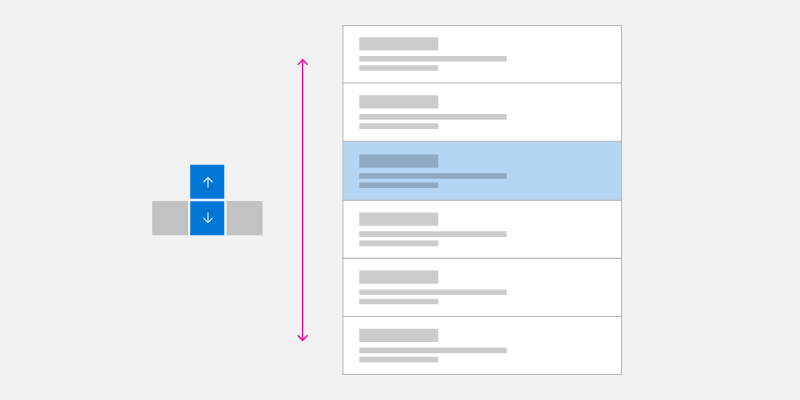

***Single Column Arrow Key Navigation***

***Single Row Arrow Key Navigation***

***Multiple Column/Row Arrow Key Navigation***

#### Wrapping homogeneous List and Grid View Items

Directional navigation is not always the most efficient way to navigate multiple rows and columns of List and GridView items.

**NOTE** Menu items are typically single column lists, but special focus rules might apply in some cases (see [Popup UI](#popup-ui)).

List and Grid objects can be created with multiple rows and columns. These are typically in row-major (where items fill entire row first before filling in the next row) or column-major (where items fill entire column first before filling in the next column) order. Row or column major order depends on scroll direction and you should ensure that item
order does not conflict with this direction.

In row-major order (where items fill in left to right, top to bottom), when the focus is on the last item in a row and the Right arrow key is pressed, focus is moved to the first item in the next row. This same behavior occurs in reverse: When focus is set to the first item in a row and the Left arrow key is pressed, focus is moved to the last item in
the previous row.

In column-major order (where items fill in top to bottom, left to right), when the focus is on the last item in a column and user presses the Down arrow key, focus is moved to the first item in the next column. This same behavior occurs in reverse: When focus is set to the first item in a column and the Up arrow key is pressed, focus is moved to the
last item in the previous column.

<table>
  <tr>
    <td>
      

      
<em>Row major keyboard navigation</em>

    </td>
    <td>
      

      
<em>Column major keyboard navigation</em>

    </td>
  </tr>
</table>

#### Popup UI

As mentioned, you should try to ensure directional navigation corresponds to the visual order of the controls in your application's UI.

Some controls (such as the context menu, CommandBar overflow menu, and AutoSuggest menu) display a menu popup in a location and direction (downwards by default) relative to the primary control and available screen space. Note that the opening direction can be affected by a variety of factors at run time.

<table>
  <td></td>
  <td></td>
</table>

For these controls, when the menu is first opened (and no item has been selected by the user), the Down arrow key always sets focus to the first item while the Up arrow key always sets focus to the last item on the menu. 

If the last item has focus and the Down arrow key is pressed, focus moves to the first item on the menu. Similarly, if the first item has focus and the Up arrow key is pressed, focus moves to the last item on the menu. This behavior is referred to as *cycling* and is useful for navigating popup menus that can open in unpredictable directions.

> [!NOTE]
> Cycling should be avoided in non-popup UIs where users might come to feel trapped in an endless loop. 

We recommend that you emulate these same behaviors in your custom controls. Code sample on how to implement this behavior can be found in [Programmatic focus navigation](focus-navigation-programmatic.md#find-the-first-and-last-focusable-element) documentation.

## Test your app

Test your app with all supported input devices to ensure UI elements can be navigated to in a coherent and intuitive way and that no unexpected elements interfere with the desired tab order.

## Related articles

* [Keyboard events](keyboard-events.md)
* [Identify input devices](identify-input-devices.md)
* [Respond to the presence of the touch keyboard](respond-to-the-presence-of-the-touch-keyboard.md)
* [Focus visuals sample](https://github.com/Microsoft/Windows-universal-samples/tree/master/Samples/XamlFocusVisuals)
* [NavigationView control keyboarding specifics](../controls/navigationview.md#hierarchical-navigation)
* [Keyboard accessibility](../accessibility/keyboard-accessibility.md)

## Appendix

### Software keyboard

A software keyboard is displayed on screen and used instead of the physical keyboard to type and enter data using touch, mouse, pen/stylus or other pointing device. On gaming devices, individual keys need to be selected by moving focus visual or using shortcut keys on a game pad or remote control.

#### Touch keyboard

***Windows 11 Touch Keyboard***

Depending on the device, the touch keyboard appears when a text field or other editable text control gets focus, or when the user manually enables it through the **Notification Center**:

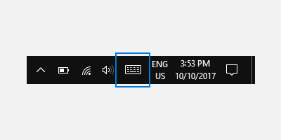

If your app sets focus programmatically to a text input control, the touch keyboard is not invoked. This eliminates unexpected behaviors not instigated directly by the user. However, the keyboard does automatically hide when focus is moved programmatically to a non-text input control.

The touch keyboard typically remains visible while the user navigates between controls in a form. This behavior can vary based on the other control types within the form.

The following is a list of non-edit controls that can receive focus during a text entry session using the touch keyboard without dismissing the keyboard. Rather than needlessly churn the UI and potentially disorient the user, the touch keyboard remains in view because the user is likely to go back and forth between these controls and text entry with the touch keyboard.

-   Check box
-   Combo box
-   Radio button
-   Scroll bar
-   Tree
-   Tree item
-   Menu
-   Menu bar
-   Menu item
-   Toolbar
-   List
-   List item

Here are examples of different modes for the touch keyboard. The first image is the default layout, the second is the expanded layout (which might not be available in all languages).

***The touch keyboard in default layout mode***

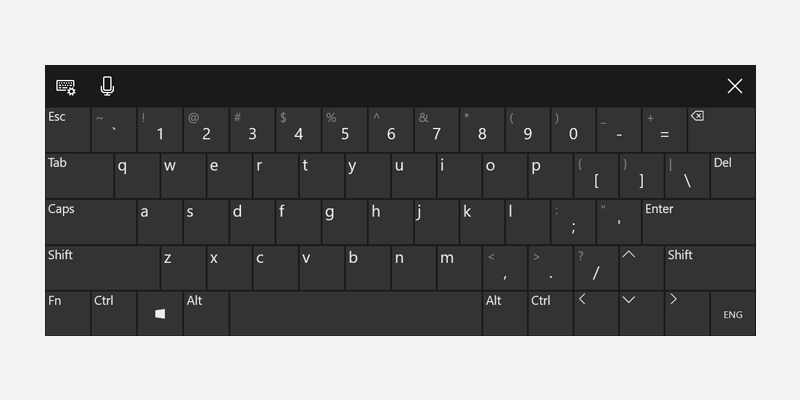

***The touch keyboard in expanded layout mode***

Successful keyboard interactions enable users to accomplish basic app scenarios using only the keyboard; that is, users can reach all interactive elements and activate default functionality. A number of factors can affect the degree of success, including keyboard navigation, access keys for accessibility, and accelerator (or shortcut) keys for advanced users.

#### On-Screen Keyboard

Like the touch keyboard, the On-Screen Keyboard (OSK) is a visual, software keyboard used instead of the physical keyboard to type and enter data using touch, mouse, pen/stylus or other pointing device (a touch screen is not required). The OSK is provided for systems that don't have a physical keyboard, or for users whose mobility impairments prevent them from using traditional physical input devices. The OSK emulates most, if not all, the functionality of a hardware keyboard.

The OSK can be turned on from the Keyboard page in Settings > Ease of access.

**NOTE** The OSK has priority over the touch keyboard, which won't be shown if the OSK is present.

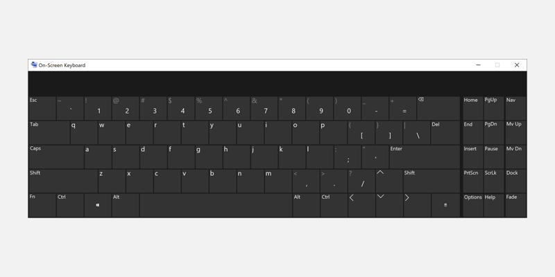

***On-Screen Keyboard***

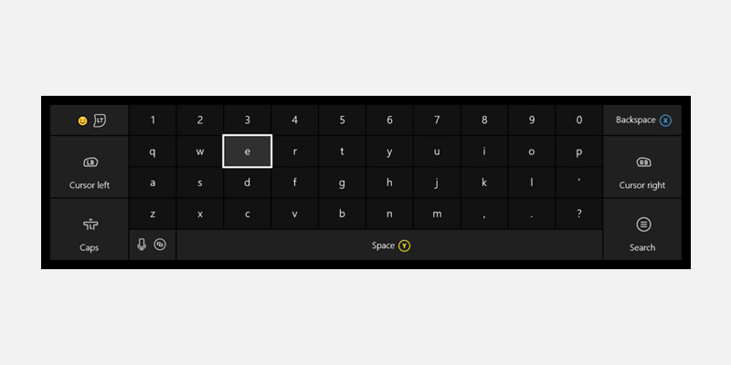

***Xbox One On-Screen Keyboard***

For more details, see [Use the On-Screen Keyboard to type](https://support.microsoft.com/help/10762/windows-use-on-screen-keyboard).
