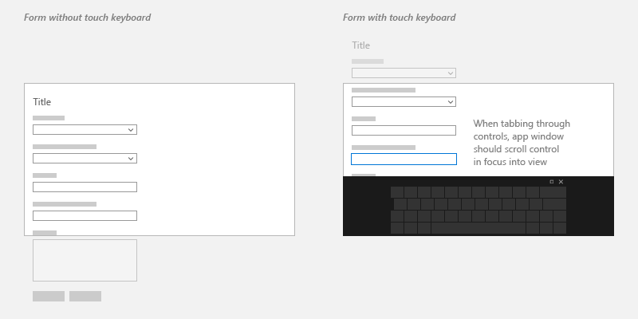
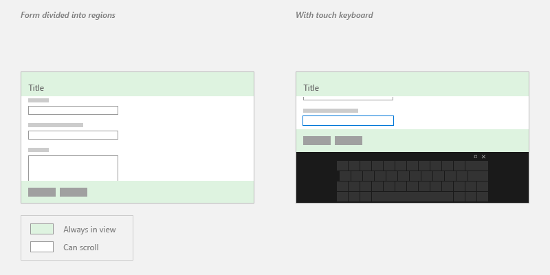

# Respond to the presence of the touch keyboard

Learn how to tailor the UI of your app when showing or hiding the touch keyboard.

### Important APIs

- [AutomationPeer](/uwp/api/Windows.UI.Xaml.Automation.Peers.AutomationPeer)
- [InputPane](/uwp/api/Windows.UI.ViewManagement.InputPane)

:::image type="content" source="images/keyboard/default.png" alt-text="The touch keyboard in default layout mode.":::

<sup>The touch keyboard in default layout mode</sup>

The touch keyboard enables text entry for devices that support touch. Windows app text input controls invoke the touch keyboard by default when a user taps on an editable input field. The touch keyboard typically remains visible while the user navigates between controls in a form, but this behavior can vary based on the other control types within the form.

To support corresponding touch keyboard behavior in a custom text input control that does not derive from a standard text input control, you must use the <a href="/uwp/api/Windows.UI.Xaml.Automation.Peers.AutomationPeer">AutomationPeer</a> class to expose your controls to Microsoft UI Automation and implement the correct UI Automation control patterns. See [Keyboard accessibility](../accessibility/keyboard-accessibility.md) and [Custom automation peers](../accessibility/custom-automation-peers.md).

Once this support has been added to your custom control, you can respond appropriately to the presence of the touch keyboard.

**Prerequisites:**

This topic builds on [Keyboard interactions](keyboard-interactions.md).

You should have a basic understanding of standard keyboard interactions, handling keyboard input and events, and UI Automation.

If you're new to developing Windows apps, have a look through these topics to get familiar with the technologies discussed here.

- [Create your first app](/windows/uwp/get-started/your-first-app)
- Learn about events with [Events and routed events overview](/windows/uwp/xaml-platform/events-and-routed-events-overview)

**User experience guidelines:**

For helpful tips about designing a useful and engaging app optimized for keyboard input, see [Keyboard interactions](./keyboard-interactions.md) .

## Touch keyboard and a custom UI

Here are a few basic recommendations for custom text input controls.

- Display the touch keyboard throughout the entire interaction with your form.

- Ensure that your custom controls have the appropriate UI Automation [AutomationControlType](/uwp/api/Windows.UI.Xaml.Automation.Peers.AutomationControlType) for the keyboard to persist when focus moves from a text input field while in the context of text entry. For example, if you have a menu that's opened in the middle of a text-entry scenario, and you want the keyboard to persist, the menu must have the **AutomationControlType** of Menu.

- Don't manipulate UI Automation properties to control the touch keyboard. Other accessibility tools rely on the accuracy of UI Automation properties.

- Ensure that users can always see the input field that they're interacting with.

    Because the touch keyboard occludes a large portion of the screen, Windows ensures that the input field with focus scrolls into view as a user navigates through the controls on the form, including controls that are not currently in view.

    When customizing your UI, provide similar behavior on the appearance of the touch keyboard by handling the [Showing](/uwp/api/windows.ui.viewmanagement.inputpane.showing) and [Hiding](/uwp/api/windows.ui.viewmanagement.inputpane.hiding) events exposed by the [**InputPane**](/uwp/api/Windows.UI.ViewManagement.InputPane) object.

    

    In some cases, there are UI elements that should stay on the screen the entire time. Design the UI so that the form controls are contained in a panning region and the important UI elements are static. For example:

    

## Handling the Showing and Hiding events

Here's an example of attaching event handlers for the [Showing](/uwp/api/windows.ui.viewmanagement.inputpane.showing) and [Hiding](/uwp/api/windows.ui.viewmanagement.inputpane.hiding) events of the touch keyboard.

```csharp
using Windows.UI.ViewManagement;
using Windows.UI.Xaml.Controls;
using Windows.UI.Xaml.Media;
using Windows.Foundation;
using Windows.UI.Xaml.Navigation;

namespace SDKTemplate
{
    /// <summary>
    /// Sample page to subscribe show/hide event of Touch Keyboard.
    /// </summary>
    public sealed partial class Scenario2_ShowHideEvents : Page
    {
        public Scenario2_ShowHideEvents()
        {
            this.InitializeComponent();
        }

        protected override void OnNavigatedTo(NavigationEventArgs e)
        {
            InputPane currentInputPane = InputPane.GetForCurrentView();
            // Subscribe to Showing/Hiding events
            currentInputPane.Showing += OnShowing;
            currentInputPane.Hiding += OnHiding;
        }

        protected override void OnNavigatedFrom(NavigationEventArgs e)
        {
            InputPane currentInputPane = InputPane.GetForCurrentView();
            // Unsubscribe from Showing/Hiding events
            currentInputPane.Showing -= OnShowing;
            currentInputPane.Hiding -= OnHiding;
        }

        void OnShowing(InputPane sender, InputPaneVisibilityEventArgs e)
        {
            LastInputPaneEventRun.Text = "Showing";
        }
        
        void OnHiding(InputPane sender, InputPaneVisibilityEventArgs e)
        {
            LastInputPaneEventRun.Text = "Hiding";
        }
    }
}
```

```cppwinrt
...
#include <winrt/Windows.UI.ViewManagement.h>
...
private:
    winrt::event_token m_showingEventToken;
    winrt::event_token m_hidingEventToken;
...
Scenario2_ShowHideEvents::Scenario2_ShowHideEvents()
{
    InitializeComponent();
}

void Scenario2_ShowHideEvents::OnNavigatedTo(Windows::UI::Xaml::Navigation::NavigationEventArgs const& e)
{
    auto inputPane{ Windows::UI::ViewManagement::InputPane::GetForCurrentView() };
    // Subscribe to Showing/Hiding events
    m_showingEventToken = inputPane.Showing({ this, &Scenario2_ShowHideEvents::OnShowing });
    m_hidingEventToken = inputPane.Hiding({ this, &Scenario2_ShowHideEvents::OnHiding });
}

void Scenario2_ShowHideEvents::OnNavigatedFrom(Windows::UI::Xaml::Navigation::NavigationEventArgs const& e)
{
    auto inputPane{ Windows::UI::ViewManagement::InputPane::GetForCurrentView() };
    // Unsubscribe from Showing/Hiding events
    inputPane.Showing(m_showingEventToken);
    inputPane.Hiding(m_hidingEventToken);
}

void Scenario2_ShowHideEvents::OnShowing(Windows::UI::ViewManagement::InputPane const& /*sender*/, Windows::UI::ViewManagement::InputPaneVisibilityEventArgs const& /*args*/)
{
    LastInputPaneEventRun().Text(L"Showing");
}

void Scenario2_ShowHideEvents::OnHiding(Windows::UI::ViewManagement::InputPane const& /*sender*/, Windows::UI::ViewManagement::InputPaneVisibilityEventArgs const& /*args*/)
{
    LastInputPaneEventRun().Text(L"Hiding");
}
```

```cpp
#include "pch.h"
#include "Scenario2_ShowHideEvents.xaml.h"

using namespace SDKTemplate;
using namespace Platform;
using namespace Windows::Foundation;
using namespace Windows::UI::ViewManagement;
using namespace Windows::UI::Xaml;
using namespace Windows::UI::Xaml::Controls;
using namespace Windows::UI::Xaml::Navigation;

Scenario2_ShowHideEvents::Scenario2_ShowHideEvents()
{
    InitializeComponent();
}

void Scenario2_ShowHideEvents::OnNavigatedTo(NavigationEventArgs^ e)
{
    auto inputPane = InputPane::GetForCurrentView();
    // Subscribe to Showing/Hiding events
    showingEventToken = inputPane->Showing +=
        ref new TypedEventHandler<InputPane^, InputPaneVisibilityEventArgs^>(this, &Scenario2_ShowHideEvents::OnShowing);
    hidingEventToken = inputPane->Hiding +=
        ref new TypedEventHandler<InputPane^, InputPaneVisibilityEventArgs^>(this, &Scenario2_ShowHideEvents::OnHiding);
}

void Scenario2_ShowHideEvents::OnNavigatedFrom(NavigationEventArgs^ e)
{
    auto inputPane = Windows::UI::ViewManagement::InputPane::GetForCurrentView();
    // Unsubscribe from Showing/Hiding events
    inputPane->Showing -= showingEventToken;
    inputPane->Hiding -= hidingEventToken;
}

void Scenario2_ShowHideEvents::OnShowing(InputPane^ /*sender*/, InputPaneVisibilityEventArgs^ /*args*/)
{
    LastInputPaneEventRun->Text = L"Showing";
}

void Scenario2_ShowHideEvents::OnHiding(InputPane^ /*sender*/, InputPaneVisibilityEventArgs ^ /*args*/)
{
    LastInputPaneEventRun->Text = L"Hiding";
}
```

## Related articles

- [Keyboard interactions](keyboard-interactions.md)
- [Keyboard accessibility](../accessibility/keyboard-accessibility.md)
- [Custom automation peers](../accessibility/custom-automation-peers.md)

### Samples

- [Touch keyboard sample](https://github.com/Microsoft/Windows-universal-samples/tree/master/Samples/TouchKeyboard)

### Archive samples

- [Input: Touch keyboard sample](https://github.com/Microsoft/Windows-universal-samples/tree/master/Samples/TouchKeyboard)
- [Responding to the appearance of the on-screen keyboard sample](https://github.com/microsoftarchive/msdn-code-gallery-microsoft/tree/411c271e537727d737a53fa2cbe99eaecac00cc0/Official%20Windows%20Platform%20Sample/Responding%20to%20the%20appearance%20of%20the%20on-screen%20keyboard%20sample)
- [XAML text editing sample](https://github.com/microsoftarchive/msdn-code-gallery-microsoft/tree/411c271e537727d737a53fa2cbe99eaecac00cc0/Official%20Windows%20Platform%20Sample/Windows%208%20app%20samples/%5BVB%5D-Windows%208%20app%20samples/VB/Windows%208%20app%20samples/XAML%20text%20editing%20sample%20(Windows%208))
- [XAML accessibility sample](https://github.com/microsoftarchive/msdn-code-gallery-microsoft/tree/411c271e537727d737a53fa2cbe99eaecac00cc0/Official%20Windows%20Platform%20Sample/XAML%20accessibility%20sample)
