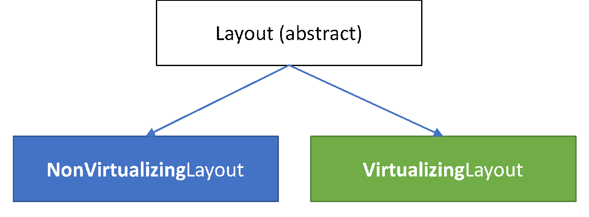

# Attached Layouts

A container (for example, Panel) that delegates its layout logic to another object relies on the attached layout object to provide the layout behavior for its child elements.  An attached layout model provides flexibility for an application to alter the layout of items at runtime, or more easily share aspects of layout between different parts of the UI (for example, items in the rows of a table that appear to be aligned within a column).

In this topic, we cover what's involved in creating an attached layout (virtualizing and non-virtualizing), the concepts and classes you'll need to understand, and the trade-offs you'll need to consider when deciding between them.

| **Get WinUI** |
| - |
| This control is included as part of WinUI, a NuGet package that contains new controls and UI features for Windows apps. For more info, including installation instructions, see the [WinUI overview](/uwp/toolkits/winui/). |

> **Important APIs**:

> * [ScrollViewer](/uwp/api/windows.ui.xaml.controls.scrollviewer)
> * [ItemsRepeater](../controls/items-repeater.md)
> * [Layout](/uwp/api/microsoft.ui.xaml.controls.layout)
>     * [NonVirtualizingLayout](/uwp/api/microsoft.ui.xaml.controls.nonvirtualizinglayout)
>     * [VirtualizingLayout](/uwp/api/microsoft.ui.xaml.controls.virtualizinglayout)
> * [LayoutContext](/uwp/api/microsoft.ui.xaml.controls.layoutcontext)
>     * [NonVirtualizingLayoutContext](/uwp/api/microsoft.ui.xaml.controls.nonvirtualizinglayoutcontext)
>     * [VirtualizingLayoutContext](/uwp/api/microsoft.ui.xaml.controls.virtualizinglayoutcontext)
> * [LayoutPanel](/uwp/api/microsoft.ui.xaml.controls.layoutpanel) (Preview)

## Key Concepts

Performing layout requires that two questions be answered for every element:

1. What ***size*** will this element be?

2. What will the ***position*** of this element be?

XAML's layout system, which answers these questions, is briefly covered as part of the discussion of [Custom panels](./custom-panels-overview.md).

### Containers and Context

Conceptually, XAML's [Panel](/uwp/api/windows.ui.xaml.controls.panel) fills two important roles in the framework:

1. It can contain child elements and introduces branching in the tree of elements.
2. It applies a specific layout strategy to those children.

For this reason, a Panel in XAML has often been synonymous with layout, but technically-speaking, does more than just layout.

The [ItemsRepeater](../controls/items-repeater.md) also behaves like Panel, but, unlike Panel, it does not expose a Children property that would allow programmatically adding or removing UIElement children.  Instead, the lifetime of its children are automatically managed by the framework to correspond to a collection of data items.  Although it is not derived from Panel, it behaves and is treated by the framework like a Panel.

> [!NOTE]
> The [LayoutPanel](/uwp/api/microsoft.ui.xaml.controls.layoutpanel) is a container, derived from Panel, that delegates its logic to the attached [Layout](/uwp/api/microsoft.ui.xaml.controls.layoutpanel.layout) object.  LayoutPanel is in *Preview* and is currently available only in the *Prerelease* drops of the WinUI package.

#### Containers

Conceptually, [Panel](/uwp/api/windows.ui.xaml.controls.panel) is a container of elements that also has the ability to render pixels for a [Background](/uwp/api/windows.ui.xaml.controls.panel.background).  Panels provide a way to encapsulate common layout logic in an easy to use package.

The concept of **attached layout** makes the distinction between the two roles of container and layout more clear.  If the container delegates its layout logic to another object we would call that object the attached layout as seen in the snippet below. Containers that inherit from [FrameworkElement](/uwp/api/windows.ui.xaml.frameworkelement), such as the LayoutPanel, automatically expose the common properties that provide input to XAML's layout process (for example, Height and Width).

```xaml
<LayoutPanel>
    <LayoutPanel.Layout>
        <UniformGridLayout/>
    </LayoutPanel.Layout>
    <Button Content="1"/>
    <Button Content="2"/>
    <Button Content="3"/>
</LayoutPanel>
```

During the layout process the container relies on the attached *UniformGridLayout* to measure and arrange its children.

#### Per-Container State

With an attached layout, a single instance of the layout object may be associated with *many* containers like in the snippet below; therefore, it must not depend on or directly reference the host container.  For example:

```xaml
<!-- ... --->
<Page.Resources>
    <ExampleLayout x:Name="exampleLayout"/>
<Page.Resources>

<LayoutPanel x:Name="example1" Layout="{StaticResource exampleLayout}"/>
<LayoutPanel x:Name="example2" Layout="{StaticResource exampleLayout}"/>
<!-- ... --->
```

For this situation *ExampleLayout* must carefully consider the state that it uses in its layout calculation and where that state is stored to avoid impacting the layout for elements in one panel with the other.  It would be analogous to a custom Panel whose MeasureOverride and ArrangeOverride logic depends on the values of its *static* properties.

#### LayoutContext

The purpose of the [LayoutContext](/uwp/api/microsoft.ui.xaml.controls.layoutcontext) is to deal with those challenges.  It provides the attached layout the ability to interact with the host container, such as retrieving child elements, without introducing a direct dependency between the two. The context also enables the layout to store any state it requires that might be related to the container's child elements.

Simple, non-virtualizing layouts often do not need to maintain any state, making it a non-issue. A more complex layout, such as Grid, however, may choose to maintain state between the measure and arrange call to avoid re-computing a value.

Virtualizing layouts *often* need to maintain some state between both the measure and arrange as well as between iterative layout passes.

#### Initializing and Uninitializing Per-Container State

When a layout is attached to a container, its [InitializeForContextCore](/uwp/api/microsoft.ui.xaml.controls.virtualizinglayout.initializeforcontextcore) method is called and provides an opportunity to initialize an object to store state.

Similarly, when the layout is being removed from a container, the [UninitializeForContextCore](/uwp/api/microsoft.ui.xaml.controls.virtualizinglayout.uninitializeforcontextcore) method will be called.  This gives the layout an opportunity to clean up any state it had associated with that container.

The layout's state object can be stored with and retrieved from the container with the [LayoutState](/uwp/api/microsoft.ui.xaml.controls.layoutcontext.layoutstate) property on the context.

### UI Virtualization

UI virtualization means delaying the creation of a UI object until _when it's needed_.  It's a performance optimization.  For non-scrolling scenarios determining _when needed_ may be based on any number of things that are app-specific.  In those cases, apps should consider using the [x:Load](/windows/uwp/xaml-platform/x-load-attribute). It does not require any special handling in your layout.

In scrolling-based scenarios such as a list, determining _when needed_ is often based on "will it be visible to a user" which depends heavily on where it was placed during the layout process and requires special considerations.  This scenario is a focus for this document.

> [!NOTE]
> Although not covered in this document, the same capabilities that enable UI virtualization in scrolling scenarios could be applied in non-scrolling scenarios.  For example, a data-driven ToolBar control that manages the lifetime of the commands it presents and responds to changes in available space by recycling / moving elements between a visible area and an overflow menu.

## Getting Started

First, decide whether the layout you need to create should support UI virtualization.

**A few things to keep in mind…**

1. Non-virtualizing layouts are easier to author. If the number of items will always be small then authoring a non-virtualizing layout is recommended.
2. The platform provides a set of attached layouts that work with the [ItemsRepeater](../controls/items-repeater.md#change-the-layout-of-items) and [LayoutPanel](/uwp/api/microsoft.ui.xaml.controls.layoutpanel) to cover common needs.  Familiarize yourself with those before deciding you need to define a custom layout.
3. Virtualizing layouts always have some additional CPU and memory cost/complexity/overhead compared to a non-virtualizing layout.  As a general rule of thumb if the children the layout will need to manage will likely fit in an area that is 3x the size of the viewport, then there may not be much gain from a virtualizing layout. The 3x size is discussed in greater detail later in this doc, but is due to the asynchronous nature of scrolling on Windows and its impact on virtualization.

> [!TIP]
> As a point of reference, the default settings for the [ListView](/uwp/api/windows.ui.xaml.controls.listview) (and [ItemsRepeater](/uwp/api/microsoft.ui.xaml.controls.itemsrepeater)) are that recycling doesn't begin until the number of items are enough to fill up 3x the size of the current viewport.

**Choose your base type**



The base [Layout](/uwp/api/microsoft.ui.xaml.controls.layout) type has two derived types that serve as the start point for authoring an attached layout:

1. [NonVirtualizingLayout](/uwp/api/microsoft.ui.xaml.controls.nonvirtualizinglayout)
2. [VirtualizingLayout](/uwp/api/microsoft.ui.xaml.controls.virtualizinglayout)

## Non-Virtualizing Layout

The approach for creating a non-virtualizing layout should feel familiar to anyone that has created a [Custom Panel](./custom-panels-overview.md).  The same concepts apply.  The primary difference is that a [NonVirtualizingLayoutContext](/uwp/api/microsoft.ui.xaml.controls.nonvirtualizinglayoutcontext) is used to access the [Children](/uwp/api/microsoft.ui.xaml.controls.nonvirtualizinglayoutcontext.children) collection, and layout may choose to store state.

1. Derive from the base type [NonVirtualizingLayout](/uwp/api/microsoft.ui.xaml.controls.nonvirtualizinglayout) (instead of Panel).
2. *(Optional)* Define dependency properties that when changed will invalidate the layout.
3. _(**New**/Optional)_ Initialize any state object required by the layout as part of the [InitializeForContextCore](/uwp/api/microsoft.ui.xaml.controls.virtualizinglayout.initializeforcontextcore). Stash it with the host container by using the [LayoutState](/uwp/api/microsoft.ui.xaml.controls.layoutcontext.layoutstate) provided with the context.
4. Override the [MeasureOverride](/uwp/api/microsoft.ui.xaml.controls.nonvirtualizinglayout.measureoverride) and call the [Measure](/uwp/api/windows.ui.xaml.uielement.measure) method on all the children.
5. Override the [ArrangeOverride](/uwp/api/microsoft.ui.xaml.controls.nonvirtualizinglayout.arrangeoverride) and call the [Arrange](/uwp/api/windows.ui.xaml.uielement.arrange) method on all the children.
6. *(**New**/Optional)* Clean up any saved state as part of the [UninitializeForContextCore](/uwp/api/microsoft.ui.xaml.controls.virtualizinglayout.uninitializeforcontextcore).

### Example: A Simple Stack Layout (Varying-Sized Items)


Here is a very basic non-virtualizing stack layout of varying sized items. It lacks any properties to adjust the layout's behavior. The implementation below illustrates how the layout relies on the context object provided by the container to:

1. Get the count of children, and
2. Access each child element by index.

```csharp
public class MyStackLayout : NonVirtualizingLayout
{
    protected override Size MeasureOverride(NonVirtualizingLayoutContext context, Size availableSize)
    {
        double extentHeight = 0.0;
        foreach (var element in context.Children)
        {
            element.Measure(availableSize);
            extentHeight += element.DesiredSize.Height;
        }

        return new Size(availableSize.Width, extentHeight);
    }

    protected override Size ArrangeOverride(NonVirtualizingLayoutContext context, Size finalSize)
    {
        double offset = 0.0;
        foreach (var element in context.Children)
        {
            element.Arrange(
                new Rect(0, offset, finalSize.Width, element.DesiredSize.Height));
            offset += element.DesiredSize.Height;
        }

        return finalSize;
    }
}
```

```xaml
 <LayoutPanel MaxWidth="196">
    <LayoutPanel.Layout>
        <local:MyStackLayout/>
    </LayoutPanel.Layout>

    <Button HorizontalAlignment="Stretch">1</Button>
    <Button HorizontalAlignment="Right">2</Button>
    <Button HorizontalAlignment="Center">3</Button>
    <Button>4</Button>

</LayoutPanel>
```

## Virtualizing Layouts

Similar to a non-virtualizing layout, the high-level steps for a virtualizing layout are the same.  The complexity is largely in determining what elements will fall within the viewport and should be realized.

1. Derive from the base type [VirtualizingLayout](/uwp/api/microsoft.ui.xaml.controls.virtualizinglayout).
2. (Optional) Define your dependency properties that when changed will invalidate the layout.
3. Initialize any state object that will be required by the layout as part of the [InitializeForContextCore](/uwp/api/microsoft.ui.xaml.controls.virtualizinglayout.initializeforcontextcore). Stash it with the host container by using the [LayoutState](/uwp/api/microsoft.ui.xaml.controls.layoutcontext.layoutstate) provided with the context.
4. Override the [MeasureOverride](/uwp/api/microsoft.ui.xaml.controls.virtualizinglayout.measureoverride) and call the [Measure](/uwp/api/windows.ui.xaml.uielement.measure) method for each child that should be realized.
   1. The [GetOrCreateElementAt](/uwp/api/microsoft.ui.xaml.controls.virtualizinglayoutcontext.getorcreateelementat) method is used to retrieve a UIElement that has been prepared by the framework (for example, data bindings applied).
5. Override the [ArrangeOverride](/uwp/api/microsoft.ui.xaml.controls.virtualizinglayout.arrangeoverride) and call the [Arrange](/uwp/api/windows.ui.xaml.uielement.arrange) method for each realized child.
6. (Optional) Clean up any saved state as part of the [UninitializeForContextCore](/uwp/api/microsoft.ui.xaml.controls.virtualizinglayout.uninitializeforcontextcore).

> [!TIP]
> The value returned by the [MeasureOverride](/uwp/api/microsoft.ui.xaml.controls.virtualizinglayout) is used as the size of the virtualized content.

There are two general approaches to consider when authoring a virtualizing layout.  Whether to choose one or the other largely depends on "how will you determine the size of an element".  If its enough to know the index of an item in the data set or the data itself dictates its eventual size, then we'd consider it **data-dependent**.  These are more straightforward to create.  If, however, the only way to determine the size for an item is to create and measure the UI then we'd say it is **content-dependent**.  These are more complex.

### The Layout Process

Whether you're creating a data or content-dependent layout, it's important to understand the layout process and the impact of Windows' asynchronous scrolling.

An (over)simplified view of the steps performed by the framework from start-up to displaying UI on screen is that:

1. It parses the markup.

2. Generates a tree of elements.

3. Performs a layout pass.

4. Performs a render pass.

With UI virtualization, creating the elements that would normally be done in step 2 is delayed or ended early once its been determined that sufficient content has been created to fill the viewport. A virtualizing container (for example, ItemsRepeater) defers to its attached layout to drive this process. It provides the attached layout with a [VirtualizingLayoutContext](/uwp/api/microsoft.ui.xaml.controls.virtualizinglayoutcontext) that surfaces the additional information that a virtualizing layout needs.

**The RealizationRect (i.e. Viewport)**

Scrolling on Windows happens asynchronous to the UI thread. It is not controlled by the framework's layout.  Rather, the interaction and movement occurs in the system's compositor. The advantage of this approach is that panning content can always be done at 60fps.  The challenge, however, is that the "viewport", as seen by the layout, might be slightly out-of-date relative to what is actually visible on screen. If a user scrolls quickly, they may outpace the speed of the UI thread to generate new content and "pan to black". For this reason, it's often necessary for a virtualizing layout to generate an additional buffer of prepared elements sufficient to fill an area larger than the viewport. When under heavier load during scrolling the user is still presented with content.


Since element creation is costly, virtualizing containers (for example, [ItemsRepeater](../controls/items-repeater.md)) will initially provide the attached layout with a [RealizationRect](/uwp/api/microsoft.ui.xaml.controls.virtualizinglayoutcontext.realizationrect) that matches the viewport. On idle time the container may grow the buffer of prepared content by making repeated calls to the layout using an increasingly larger realization rect. This behavior is a performance optimization that attempts to strike a balance between fast startup time and a good panning experience. The maximum buffer size that the ItemsRepeater will generate is controlled by its [VerticalCacheLength](/uwp/api/microsoft.ui.xaml.controls.itemsrepeater.verticalcachelength) and [HorizontalCacheLength](/uwp/api/microsoft.ui.xaml.controls.itemsrepeater.verticalcachelength) properties.

**Re-using Elements (Recycling)**

The layout is expected to size and position the elements to fill the [RealizationRect](/uwp/api/microsoft.ui.xaml.controls.virtualizinglayoutcontext.realizationrect) each time it is run. By default the [VirtualizingLayout](/uwp/api/microsoft.ui.xaml.controls.virtualizinglayout) will recycle any unused elements at the end of each layout pass.

The [VirtualizingLayoutContext](/uwp/api/microsoft.ui.xaml.controls.virtualizinglayoutcontext) that is passed to the layout as part of the [MeasureOverride](/uwp/api/microsoft.ui.xaml.controls.virtualizinglayout.measureoverride) and [ArrangeOverride](/uwp/api/microsoft.ui.xaml.controls.virtualizinglayout.arrangeoverride) provides the additional information a virtualizing layout needs. Some of the most commonly used things it provides are the ability to:

1. Query the number of items in the data ([ItemCount](/uwp/api/microsoft.ui.xaml.controls.virtualizinglayoutcontext.itemcount)).
2. Retrieve a specific item using the [GetItemAt](/uwp/api/microsoft.ui.xaml.controls.virtualizinglayoutcontext.getitemat) method.
3. Retrieve a [RealizationRect](/uwp/api/microsoft.ui.xaml.controls.virtualizinglayoutcontext.realizationrect) that represents the viewport and buffer that the layout should fill with realized elements.
4. Request the UIElement for a specific item with the [GetOrCreateElement](/uwp/api/microsoft.ui.xaml.controls.virtualizinglayoutcontext.getorcreateelementat) method.

Requesting an element for a given index will cause that element to be marked as "in use" for that pass of the layout. If the element does not already exist, then it will be realized and automatically prepared for use (for example, inflating the UI tree defined in a DataTemplate, processing any data binding, etc.).  Otherwise, it will be retrieved from a pool of existing instances.

At the end of each measure pass, any existing, realized element that was not marked "in use" is automatically considered available for re-use unless the option to [SuppressAutoRecycle](/uwp/api/microsoft.ui.xaml.controls.elementrealizationoptions) was used when the element was retrieved via the [GetOrCreateElementAt](/uwp/api/microsoft.ui.xaml.controls.virtualizinglayoutcontext.getorcreateelementat) method. The framework automatically moves it to a recycle pool and makes it available. It may subsequently be pulled for use by a different container. The framework tries to avoid this when possible as there is some cost associated with re-parenting an element.

If a virtualizing layout knows at the beginning of each measure which elements will no longer fall within the realization rect then it can optimize its re-use. Rather than relying on the framework's default behavior. The layout can preemptively move elements to the recycle pool by using the [RecycleElement](/uwp/api/microsoft.ui.xaml.controls.virtualizinglayoutcontext.recycleelement) method.  Calling this method before requesting new elements causes those existing elements to be available when the layout later issues a [GetOrCreateElementAt](/uwp/api/microsoft.ui.xaml.controls.virtualizinglayoutcontext.getorcreateelementat) request for an index that isn't already associated with an element.

The VirtualizingLayoutContext provides two additional properties designed for layout authors creating a content-dependent layout. They are discussed in more detail later.

1. A [RecommendedAnchorIndex](/uwp/api/microsoft.ui.xaml.controls.virtualizinglayoutcontext.recommendedanchorindex) that provides an optional _input_ to layout.
2. A [LayoutOrigin](/uwp/api/microsoft.ui.xaml.controls.virtualizinglayoutcontext.layoutorigin) that is an optional _output_ of the layout.

## Data-dependent Virtualizing Layouts

A virtualizing layout is easier if you know what the size of every item should be without needing to measure the content to show.  In this doc we'll simply refer to this category of virtualizing layouts as **data layouts** since they usually involve inspecting the data.  Based on the data an app may pick a visual representation with a known size - perhaps because its part of the data or was previously determined by design.

The general approach is for the layout to:

1. Calculate a size and position of every item.
2. As part of the [MeasureOverride](/uwp/api/microsoft.ui.xaml.controls.virtualizinglayout.measureoverride):
   1. Use the [RealizationRect](/uwp/api/microsoft.ui.xaml.controls.virtualizinglayoutcontext.realizationrect) to determine which items should appear within the viewport.
   2. Retrieve the UIElement that should represent the item with the [GetOrCreateElementAt](/uwp/api/microsoft.ui.xaml.controls.virtualizinglayoutcontext.getorcreateelementat) method.
   3. [Measure](/uwp/api/windows.ui.xaml.uielement.measure) the UIElement with the pre-calculated size.
3. As part of the [ArrangeOverride](/uwp/api/microsoft.ui.xaml.controls.virtualizinglayout.arrangeoverride), [Arrange](/uwp/api/windows.ui.xaml.uielement.arrange) each realized UIElement with the precalculated position.

> [!NOTE]
> A data layout approach is often incompatible with _data virtualization_.  Specifically, where the only data loaded into memory is that data required to fill what's visible to the user.  Data virtualization isn't referring to lazy or incremental loading of data as a user scrolls down where that data remains resident.  Rather, it's referring to when items are released from memory as they're scrolled out of view.  Having a data layout that inspects every data item as part of a data layout would prevent data virtualization from working as expected.  An exception is a layout like the UniformGridLayout which assumes that everything has the same size.

> [!TIP]
> If you're creating a custom control for a control library that will be used by others in a wide variety of situations then a data layout may not be an option for you.

### Example: Xbox Activity Feed layout

The UI for the Xbox Activity Feed uses a repeating pattern where each line has a wide tile, followed by two narrow tiles that is inverted on the subsequent line. In this layout, the size for every item is a function of the item's position in the data set and the known size for the tiles (wide vs narrow).


The code below walks through what a custom virtualizing UI for the activity feed might be to illustrate the general approach you might take for a **data layout**.

> [!TIP]
> If you have the **WinUI 3 Gallery** app installed, click here to [open the app and see the ItemsRepeater in action](winui3gallery:/item/ItemsRepeater). Get the app from the [Microsoft Store](https://www.microsoft.com/store/productId/9P3JFPWWDZRC) or get the source code on [GitHub](https://github.com/microsoft/WinUI-Gallery).

#### Implementation

```csharp
/// <summary>
///  This is a custom layout that displays elements in two different sizes
///  wide (w) and narrow (n). There are two types of rows 
///  odd rows - narrow narrow wide
///  even rows - wide narrow narrow
///  This pattern repeats.
/// </summary>

public class ActivityFeedLayout : VirtualizingLayout // STEP #1 Inherit from base attached layout
{
    // STEP #2 - Parameterize the layout
    #region Layout parameters

    // We'll cache copies of the dependency properties to avoid calling GetValue during layout since that
    // can be quite expensive due to the number of times we'd end up calling these.
    private double _rowSpacing;
    private double _colSpacing;
    private Size _minItemSize = Size.Empty;

    /// <summary>
    /// Gets or sets the size of the whitespace gutter to include between rows
    /// </summary>
    public double RowSpacing
    {
        get { return _rowSpacing; }
        set { SetValue(RowSpacingProperty, value); }
    }

    /// <summary>
    /// Gets or sets the size of the whitespace gutter to include between items on the same row
    /// </summary>
    public double ColumnSpacing
    {
        get { return _colSpacing; }
        set { SetValue(ColumnSpacingProperty, value); }
    }

    public Size MinItemSize
    {
        get { return _minItemSize; }
        set { SetValue(MinItemSizeProperty, value); }
    }

    public static readonly DependencyProperty RowSpacingProperty =
        DependencyProperty.Register(
            nameof(RowSpacing),
            typeof(double),
            typeof(ActivityFeedLayout),
            new PropertyMetadata(0, OnPropertyChanged));

    public static readonly DependencyProperty ColumnSpacingProperty =
        DependencyProperty.Register(
            nameof(ColumnSpacing),
            typeof(double),
            typeof(ActivityFeedLayout),
            new PropertyMetadata(0, OnPropertyChanged));

    public static readonly DependencyProperty MinItemSizeProperty =
        DependencyProperty.Register(
            nameof(MinItemSize),
            typeof(Size),
            typeof(ActivityFeedLayout),
            new PropertyMetadata(Size.Empty, OnPropertyChanged));

    private static void OnPropertyChanged(DependencyObject obj, DependencyPropertyChangedEventArgs args)
    {
        var layout = obj as ActivityFeedLayout;
        if (args.Property == RowSpacingProperty)
        {
            layout._rowSpacing = (double)args.NewValue;
        }
        else if (args.Property == ColumnSpacingProperty)
        {
            layout._colSpacing = (double)args.NewValue;
        }
        else if (args.Property == MinItemSizeProperty)
        {
            layout._minItemSize = (Size)args.NewValue;
        }
        else
        {
            throw new InvalidOperationException("Don't know what you are talking about!");
        }

        layout.InvalidateMeasure();
    }

    #endregion

    #region Setup / teardown // STEP #3: Initialize state

    protected override void InitializeForContextCore(VirtualizingLayoutContext context)
    {
        base.InitializeForContextCore(context);

        var state = context.LayoutState as ActivityFeedLayoutState;
        if (state == null)
        {
            // Store any state we might need since (in theory) the layout could be in use by multiple
            // elements simultaneously
            // In reality for the Xbox Activity Feed there's probably only a single instance.
            context.LayoutState = new ActivityFeedLayoutState();
        }
    }

    protected override void UninitializeForContextCore(VirtualizingLayoutContext context)
    {
        base.UninitializeForContextCore(context);

        // clear any state
        context.LayoutState = null;
    }

    #endregion

    #region Layout // STEP #4,5 - Measure and Arrange

    protected override Size MeasureOverride(VirtualizingLayoutContext context, Size availableSize)
    {
        if (this.MinItemSize == Size.Empty)
        {
            var firstElement = context.GetOrCreateElementAt(0);
            firstElement.Measure(new Size(double.PositiveInfinity, double.PositiveInfinity));

            // setting the member value directly to skip invalidating layout
            this._minItemSize = firstElement.DesiredSize;
        }

        // Determine which rows need to be realized.  We know every row will have the same height and
        // only contain 3 items.  Use that to determine the index for the first and last item that
        // will be within that realization rect.
        var firstRowIndex = Math.Max(
            (int)(context.RealizationRect.Y / (this.MinItemSize.Height + this.RowSpacing)) - 1,
            0);
        var lastRowIndex = Math.Min(
            (int)(context.RealizationRect.Bottom / (this.MinItemSize.Height + this.RowSpacing)) + 1,
            (int)(context.ItemCount / 3));

        // Determine which items will appear on those rows and what the rect will be for each item
        var state = context.LayoutState as ActivityFeedLayoutState;
        state.LayoutRects.Clear();

        // Save the index of the first realized item.  We'll use it as a starting point during arrange.
        state.FirstRealizedIndex = firstRowIndex * 3;

        // ideal item width that will expand/shrink to fill available space
        double desiredItemWidth = Math.Max(this.MinItemSize.Width, (availableSize.Width - this.ColumnSpacing * 3) / 4);

        // Foreach item between the first and last index,
        //     Call GetElementOrCreateElementAt which causes an element to either be realized or retrieved
        //       from a recycle pool
        //     Measure the element using an appropriate size
        //
        // Any element that was previously realized which we don't retrieve in this pass (via a call to
        // GetElementOrCreateAt) will be automatically cleared and set aside for later re-use.
        // Note: While this work fine, it does mean that more elements than are required may be
        // created because it isn't until after our MeasureOverride completes that the unused elements
        // will be recycled and available to use.  We could avoid this by choosing to track the first/last
        // index from the previous layout pass.  The diff between the previous range and current range
        // would represent the elements that we can pre-emptively make available for re-use by calling
        // context.RecycleElement(element).
        for (int rowIndex = firstRowIndex; rowIndex < lastRowIndex; rowIndex++)
        {
            int firstItemIndex = rowIndex * 3;
            var boundsForCurrentRow = CalculateLayoutBoundsForRow(rowIndex, desiredItemWidth);

            for (int columnIndex = 0; columnIndex < 3; columnIndex++)
            {
                var index = firstItemIndex + columnIndex;
                var rect = boundsForCurrentRow[index % 3];
                var container = context.GetOrCreateElementAt(index);

                container.Measure(
                    new Size(boundsForCurrentRow[columnIndex].Width, boundsForCurrentRow[columnIndex].Height));

                state.LayoutRects.Add(boundsForCurrentRow[columnIndex]);
            }
        }

        // Calculate and return the size of all the content (realized or not) by figuring out
        // what the bottom/right position of the last item would be.
        var extentHeight = ((int)(context.ItemCount / 3) - 1) * (this.MinItemSize.Height + this.RowSpacing) + this.MinItemSize.Height;

        // Report this as the desired size for the layout
        return new Size(desiredItemWidth * 4 + this.ColumnSpacing * 2, extentHeight);
    }

    protected override Size ArrangeOverride(VirtualizingLayoutContext context, Size finalSize)
    {
        // walk through the cache of containers and arrange
        var state = context.LayoutState as ActivityFeedLayoutState;
        var virtualContext = context as VirtualizingLayoutContext;
        int currentIndex = state.FirstRealizedIndex;

        foreach (var arrangeRect in state.LayoutRects)
        {
            var container = virtualContext.GetOrCreateElementAt(currentIndex);
            container.Arrange(arrangeRect);
            currentIndex++;
        }

        return finalSize;
    }

    #endregion
    #region Helper methods

    private Rect[] CalculateLayoutBoundsForRow(int rowIndex, double desiredItemWidth)
    {
        var boundsForRow = new Rect[3];

        var yoffset = rowIndex * (this.MinItemSize.Height + this.RowSpacing);
        boundsForRow[0].Y = boundsForRow[1].Y = boundsForRow[2].Y = yoffset;
        boundsForRow[0].Height = boundsForRow[1].Height = boundsForRow[2].Height = this.MinItemSize.Height;

        if (rowIndex % 2 == 0)
        {
            // Left tile (narrow)
            boundsForRow[0].X = 0;
            boundsForRow[0].Width = desiredItemWidth;
            // Middle tile (narrow)
            boundsForRow[1].X = boundsForRow[0].Right + this.ColumnSpacing;
            boundsForRow[1].Width = desiredItemWidth;
            // Right tile (wide)
            boundsForRow[2].X = boundsForRow[1].Right + this.ColumnSpacing;
            boundsForRow[2].Width = desiredItemWidth * 2 + this.ColumnSpacing;
        }
        else
        {
            // Left tile (wide)
            boundsForRow[0].X = 0;
            boundsForRow[0].Width = (desiredItemWidth * 2 + this.ColumnSpacing);
            // Middle tile (narrow)
            boundsForRow[1].X = boundsForRow[0].Right + this.ColumnSpacing;
            boundsForRow[1].Width = desiredItemWidth;
            // Right tile (narrow)
            boundsForRow[2].X = boundsForRow[1].Right + this.ColumnSpacing;
            boundsForRow[2].Width = desiredItemWidth;
        }

        return boundsForRow;
    }

    #endregion
}

internal class ActivityFeedLayoutState
{
    public int FirstRealizedIndex { get; set; }

    /// <summary>
    /// List of layout bounds for items starting with the
    /// FirstRealizedIndex.
    /// </summary>
    public List<Rect> LayoutRects
    {
        get
        {
            if (_layoutRects == null)
            {
                _layoutRects = new List<Rect>();
            }

            return _layoutRects;
        }
    }

    private List<Rect> _layoutRects;
}
```

### (Optional) Managing the Item to UIElement Mapping

By default, the [VirtualizingLayoutContext](/uwp/api/microsoft.ui.xaml.controls.virtualizinglayoutcontext) maintains a mapping between the realized elements and the index in the data source they represent.  A layout can choose to manage this mapping itself by always requesting the option to [SuppressAutoRecycle](/uwp/api/microsoft.ui.xaml.controls.elementrealizationoptions) when retrieving an element via the [GetOrCreateElementAt](/uwp/api/microsoft.ui.xaml.controls.virtualizinglayoutcontext.getorcreateelementat) method which prevents the default auto-recycling behavior.  A layout may choose to do this, for example, if it will only be used when scrolling is restricted to one direction and the items it considers will always be contiguous (i.e. knowing the index of the first and last element is enough to know all the elements that should be realized).

#### Example: Xbox Activity Feed measure

The snippet below shows the additional logic that could be added to the MeasureOverride in the previous sample to manage the mapping.

```csharp
    protected override Size MeasureOverride(VirtualizingLayoutContext context, Size availableSize)
    {
        //...

        // Determine which items will appear on those rows and what the rect will be for each item
        var state = context.LayoutState as ActivityFeedLayoutState;
        state.LayoutRects.Clear();

         // Recycle previously realized elements that we know we won't need so that they can be used to
        // fill in gaps without requiring us to realize additional elements.
        var newFirstRealizedIndex = firstRowIndex * 3;
        var newLastRealizedIndex = lastRowIndex * 3 + 3;
        for (int i = state.FirstRealizedIndex; i < newFirstRealizedIndex; i++)
        {
            context.RecycleElement(state.IndexToElementMap.Get(i));
            state.IndexToElementMap.Clear(i);
        }

        for (int i = state.LastRealizedIndex; i < newLastRealizedIndex; i++)
        {
            context.RecycleElement(context.IndexElementMap.Get(i));
            state.IndexToElementMap.Clear(i);
        }

        // ...

        // Foreach item between the first and last index,
        //     Call GetElementOrCreateElementAt which causes an element to either be realized or retrieved
        //       from a recycle pool
        //     Measure the element using an appropriate size
        //
        for (int rowIndex = firstRowIndex; rowIndex < lastRowIndex; rowIndex++)
        {
            int firstItemIndex = rowIndex * 3;
            var boundsForCurrentRow = CalculateLayoutBoundsForRow(rowIndex, desiredItemWidth);

            for (int columnIndex = 0; columnIndex < 3; columnIndex++)
            {
                var index = firstItemIndex + columnIndex;
                var rect = boundsForCurrentRow[index % 3];
                UIElement container = null;
                if (state.IndexToElementMap.Contains(index))
                {
                    container = state.IndexToElementMap.Get(index);
                }
                else
                {
                    container = context = context.GetOrCreateElementAt(index, ElementRealizationOptions.ForceCreate | ElementRealizationOptions.SuppressAutoRecycle);
                    state.IndexToElementMap.Add(index, container);
                }

                container.Measure(
                    new Size(boundsForCurrentRow[columnIndex].Width, boundsForCurrentRow[columnIndex].Height));

                state.LayoutRects.Add(boundsForCurrentRow[columnIndex]);
            }
        }

        // ...
   }

internal class ActivityFeedLayoutState
{
    // ...
    Dictionary<int, UIElement> IndexToElementMap { get; set; }
    // ...
}
```

## Content-dependent Virtualizing Layouts

If you must first measure the UI content for an item to figure out its exact size then it is a **content-dependent layout**.  You can also think of it as a layout where each item must size itself rather than the layout telling the item its size. Virtualizing layouts that fall into this category are more involved.

> [!NOTE]
> Content-dependent layouts don't (shouldn't) break data virtualization.

### Estimations

Content-dependent layouts rely on estimation to guess both the size of unrealized content and the position of the realized content. As those estimates change it will cause the realized content to regularly shift positions within the scrollable area. This can lead to a very frustrating and jarring user experience if not mitigated. The potential issues and mitigations are discussed here.

> [!NOTE]
> Data layouts that consider every item and know the exact size of all items, realized or not, and their positions can avoid these issues entirely.

**Scroll Anchoring**

XAML provides a mechanism to mitigate sudden viewport shifts by having scrolling controls support [scroll anchoring](/uwp/api/windows.ui.xaml.controls.iscrollanchorprovider) by implementing the [IScrollAnchorPovider](/uwp/api/windows.ui.xaml.controls.iscrollanchorprovider) interface. As the user manipulates the content, the scrolling control continually selects an element from the set of candidates that were opted-in to be tracked. If the position of the anchor element shifts during the layout then the scroll control automatically shifts its viewport to maintain the viewport.

The value of the [RecommendedAnchorIndex](/uwp/api/microsoft.ui.xaml.controls.virtualizinglayoutcontext.recommendedanchorindex) provided to the layout may reflect that currently selected anchor element chosen by the scrolling control. Alternatively, if a developer explicitly requests that an element be realized for an index with the [GetOrCreateElement](/uwp/api/microsoft.ui.xaml.controls.itemsrepeater.getorcreateelement) method on the [ItemsRepeater](/uwp/api/microsoft.ui.xaml.controls.itemsrepeater), then that index is given as the [RecommendedAnchorIndex](/uwp/api/microsoft.ui.xaml.controls.virtualizinglayoutcontext.recommendedanchorindex) on the next layout pass. This enables the layout to be prepared for the likely scenario that a developer realizes an element and subsequently requests that it be brought into view via the [StartBringIntoView](/uwp/api/windows.ui.xaml.uielement.startbringintoview) method.

The [RecommendedAnchorIndex](/uwp/api/microsoft.ui.xaml.controls.virtualizinglayoutcontext.recommendedanchorindex) is the index for the item in the data source that a content-dependent layout should position first when estimating the position of its items. It should serve as the starting point for positioning other realized items.

**Impact on ScrollBars**

Even with scroll anchoring, if the layout's estimates vary a lot, perhaps due to significant variations in the size of content, then the position of the thumb for the ScrollBar may appear to jump around.  This can be jarring for a user if the thumb doesn't appear to track the position of their mouse pointer when they're dragging it.

The more accurate the layout can be in its estimations then the less likely a user will see the ScrollBar's thumb jumping.

### Layout Corrections

A content-dependent layout should be prepared to rationalize its estimate with reality.  For example, as the user scrolls to the top of the content and the layout realizes the very first element, it may find that the element's anticipated position relative to the element from which it started would cause it to appear somewhere other than the origin of (x:0, y:0). When this occurs, the layout can use the [LayoutOrigin](/uwp/api/microsoft.ui.xaml.controls.virtualizinglayoutcontext.layoutorigin) property to set the position it calculated as the new layout origin.  The net result is similar to scroll anchoring in which the scrolling control's viewport is automatically adjusted to account for the content's position as reported by the layout.


### Disconnected Viewports

The size returned from the layout's [MeasureOverride](/uwp/api/microsoft.ui.xaml.controls.virtualizinglayout.measureoverride) method represents the best guess at the size of the content which may change with each successive layout.  As a user scrolls the layout will be continually re-evaluated with an updated [RealizationRect](/uwp/api/microsoft.ui.xaml.controls.virtualizinglayoutcontext.realizationrect).

If a user drags the thumb very quickly then  its possible for the viewport, from the perspective of the layout, to appear to make large jumps where the prior position doesn't overlap the now current position.  This is due to the asynchronous nature of scrolling. It's also possible for an app that is consuming the layout to request that an element be brought into view for an item that is not currently realized and is estimated to lay outside the current range tracked by the layout.

When the layout discovers its guess is incorrect and/or sees an unexpected viewport shift, it needs to reorient its starting position.  The virtualizing layouts that ship as part of the XAML controls are developed as content-dependent layouts as they place fewer restrictions on the nature of the content that will be shown.


### Example: Simple Virtualizing Stack Layout for Variable-Sized Items

The sample below demonstrates a simple stack layout for variable-sized items that:

* supports UI virtualization,
* uses estimations to guess the size of unrealized items,
* is aware of potential discontinuous viewport shifts, and
* applies layout corrections to account for those shifts.

**Usage: Markup**

```xaml
<ScrollViewer>

  <ItemsRepeater x:Name="repeater" >
    <ItemsRepeater.Layout>

      <local:VirtualizingStackLayout />

    </ItemsRepeater.Layout>
    <ItemsRepeater.ItemTemplate>
      <DataTemplate x:Key="item">
        <UserControl IsTabStop="True" UseSystemFocusVisuals="True" Margin="5">
          <StackPanel BorderThickness="1" Background="LightGray" Margin="5">
            <Image x:Name="recipeImage" Source="{Binding ImageUri}"  Width="100" Height="100"/>
              <TextBlock x:Name="recipeDescription"
                         Text="{Binding Description}"
                         TextWrapping="Wrap"
                         Margin="10" />
          </StackPanel>
        </UserControl>
      </DataTemplate>
    </ItemsRepeater.ItemTemplate>
  </ItemsRepeater>

</ScrollViewer>
```

**Codebehind: Main.cs**

```csharp
string _lorem = @"Lorem ipsum dolor sit amet, consectetur adipiscing elit. Etiam laoreet erat vel massa rutrum, eget mollis massa vulputate. Vivamus semper augue leo, eget faucibus nulla mattis nec. Donec scelerisque lacus at dui ultricies, eget auctor ipsum placerat. Integer aliquet libero sed nisi eleifend, nec rutrum arcu lacinia. Sed a sem et ante gravida congue sit amet ut augue. Donec quis pellentesque urna, non finibus metus. Proin sed ornare tellus. Lorem ipsum dolor sit amet, consectetur adipiscing elit. Etiam laoreet erat vel massa rutrum, eget mollis massa vulputate. Vivamus semper augue leo, eget faucibus nulla mattis nec. Donec scelerisque lacus at dui ultricies, eget auctor ipsum placerat. Integer aliquet libero sed nisi eleifend, nec rutrum arcu lacinia. Sed a sem et ante gravida congue sit amet ut augue. Donec quis pellentesque urna, non finibus metus. Proin sed ornare tellus.";

var rnd = new Random();
var data = new ObservableCollection<Recipe>(Enumerable.Range(0, 300).Select(k =>
               new Recipe
               {
                   ImageUri = new Uri(string.Format("ms-appx:///Images/recipe{0}.png", k % 8 + 1)),
                   Description = k + " - " + _lorem.Substring(0, rnd.Next(50, 350))
               }));

repeater.ItemsSource = data;
```

**Code: VirtualizingStackLayout.cs**

```csharp
// This is a sample layout that stacks elements one after
// the other where each item can be of variable height. This is
// also a virtualizing layout - we measure and arrange only elements
// that are in the viewport. Not measuring/arranging all elements means
// that we do not have the complete picture and need to estimate sometimes.
// For example the size of the layout (extent) is an estimation based on the
// average heights we have seen so far. Also, if you drag the mouse thumb
// and yank it quickly, then we estimate what goes in the new viewport.

// The layout caches the bounds of everything that are in the current viewport.
// During measure, we might get a suggested anchor (or start index), we use that
// index to start and layout the rest of the items in the viewport relative to that
// index. Note that since we are estimating, we can end up with negative origin when
// the viewport is somewhere in the middle of the extent. This is achieved by setting the
// LayoutOrigin property on the context. Once this is set, future viewport will account
// for the origin.
public class VirtualizingStackLayout : VirtualizingLayout
{
    // Estimation state
    List<double> m_estimationBuffer = Enumerable.Repeat(0d, 100).ToList();
    int m_numItemsUsedForEstimation = 0;
    double m_totalHeightForEstimation = 0;

    // State to keep track of realized bounds
    int m_firstRealizedDataIndex = 0;
    List<Rect> m_realizedElementBounds = new List<Rect>();

    Rect m_lastExtent = new Rect();

    protected override Size MeasureOverride(VirtualizingLayoutContext context, Size availableSize)
    {
        var viewport = context.RealizationRect;
        DebugTrace("MeasureOverride: Viewport " + viewport);

        // Remove bounds for elements that are now outside the viewport.
        // Proactive recycling elements means we can reuse it during this measure pass again.
        RemoveCachedBoundsOutsideViewport(viewport);

        // Find the index of the element to start laying out from - the anchor
        int startIndex = GetStartIndex(context, availableSize);

        // Measure and layout elements starting from the start index, forward and backward.
        Generate(context, availableSize, startIndex, forward:true);
        Generate(context, availableSize, startIndex, forward:false);

        // Estimate the extent size. Note that this can have a non 0 origin.
        m_lastExtent = EstimateExtent(context, availableSize);
        context.LayoutOrigin = new Point(m_lastExtent.X, m_lastExtent.Y);
        return new Size(m_lastExtent.Width, m_lastExtent.Height);
    }

    protected override Size ArrangeOverride(VirtualizingLayoutContext context, Size finalSize)
    {
        DebugTrace("ArrangeOverride: Viewport" + context.RealizationRect);
        for (int realizationIndex = 0; realizationIndex < m_realizedElementBounds.Count; realizationIndex++)
        {
            int currentDataIndex = m_firstRealizedDataIndex + realizationIndex;
            DebugTrace("Arranging " + currentDataIndex);

            // Arrange the child. If any alignment needs to be done, it
            // can be done here.
            var child = context.GetOrCreateElementAt(currentDataIndex);
            var arrangeBounds = m_realizedElementBounds[realizationIndex];
            arrangeBounds.X -= m_lastExtent.X;
            arrangeBounds.Y -= m_lastExtent.Y;
            child.Arrange(arrangeBounds);
        }

        return finalSize;
    }

    // The data collection has changed, since we are maintaining the bounds of elements
    // in the viewport, we will update the list to account for the collection change.
    protected override void OnItemsChangedCore(VirtualizingLayoutContext context, object source, NotifyCollectionChangedEventArgs args)
    {
        InvalidateMeasure();
        if (m_realizedElementBounds.Count > 0)
        {
            switch (args.Action)
            {
                case NotifyCollectionChangedAction.Add:
                    OnItemsAdded(args.NewStartingIndex, args.NewItems.Count);
                    break;
                case NotifyCollectionChangedAction.Replace:
                    OnItemsRemoved(args.OldStartingIndex, args.OldItems.Count);
                    OnItemsAdded(args.NewStartingIndex, args.NewItems.Count);
                    break;
                case NotifyCollectionChangedAction.Remove:
                    OnItemsRemoved(args.OldStartingIndex, args.OldItems.Count);
                    break;
                case NotifyCollectionChangedAction.Reset:
                    m_realizedElementBounds.Clear();
                    m_firstRealizedDataIndex = 0;
                    break;
                default:
                    throw new NotImplementedException();
            }
        }
    }

    // Figure out which index to use as the anchor and start laying out around it.
    private int GetStartIndex(VirtualizingLayoutContext context, Size availableSize)
    {
        int startDataIndex = -1;
        var recommendedAnchorIndex = context.RecommendedAnchorIndex;
        bool isSuggestedAnchorValid = recommendedAnchorIndex != -1;

        if (isSuggestedAnchorValid)
        {
            if (IsRealized(recommendedAnchorIndex))
            {
                startDataIndex = recommendedAnchorIndex;
            }
            else
            {
                ClearRealizedRange();
                startDataIndex = recommendedAnchorIndex;
            }
        }
        else
        {
            // Find the first realized element that is visible in the viewport.
            startDataIndex = GetFirstRealizedDataIndexInViewport(context.RealizationRect);
            if (startDataIndex < 0)
            {
                startDataIndex = EstimateIndexForViewport(context.RealizationRect, context.ItemCount);
                ClearRealizedRange();
            }
        }

        // We have an anchorIndex, realize and measure it and
        // figure out its bounds.
        if (startDataIndex != -1 & context.ItemCount > 0)
        {
            if (m_realizedElementBounds.Count == 0)
            {
                m_firstRealizedDataIndex = startDataIndex;
            }

            var newAnchor = EnsureRealized(startDataIndex);
            DebugTrace("Measuring start index " + startDataIndex);
            var desiredSize = MeasureElement(context, startDataIndex, availableSize);

            var bounds = new Rect(
                0,
                newAnchor ?
                    (m_totalHeightForEstimation / m_numItemsUsedForEstimation) * startDataIndex : GetCachedBoundsForDataIndex(startDataIndex).Y,
                availableSize.Width,
                desiredSize.Height);
            SetCachedBoundsForDataIndex(startDataIndex, bounds);
        }

        return startDataIndex;
    }


    private void Generate(VirtualizingLayoutContext context, Size availableSize, int anchorDataIndex, bool forward)
    {
        // Generate forward or backward from anchorIndex until we hit the end of the viewport
        int step = forward ? 1 : -1;
        int previousDataIndex = anchorDataIndex;
        int currentDataIndex = previousDataIndex + step;
        var viewport = context.RealizationRect;
        while (IsDataIndexValid(currentDataIndex, context.ItemCount) &&
            ShouldContinueFillingUpSpace(previousDataIndex, forward, viewport))
        {
            EnsureRealized(currentDataIndex);
            DebugTrace("Measuring " + currentDataIndex);
            var desiredSize = MeasureElement(context, currentDataIndex, availableSize);
            var previousBounds = GetCachedBoundsForDataIndex(previousDataIndex);
            Rect currentBounds = new Rect(0,
                                          forward ? previousBounds.Y + previousBounds.Height : previousBounds.Y - desiredSize.Height,
                                          availableSize.Width,
                                          desiredSize.Height);
            SetCachedBoundsForDataIndex(currentDataIndex, currentBounds);
            previousDataIndex = currentDataIndex;
            currentDataIndex += step;
        }
    }

    // Remove bounds that are outside the viewport, leaving one extra since our
    // generate stops after generating one extra to know that we are outside the
    // viewport.
    private void RemoveCachedBoundsOutsideViewport(Rect viewport)
    {
        int firstRealizedIndexInViewport = 0;
        while (firstRealizedIndexInViewport < m_realizedElementBounds.Count &&
               !Intersects(m_realizedElementBounds[firstRealizedIndexInViewport], viewport))
        {
            firstRealizedIndexInViewport++;
        }

        int lastRealizedIndexInViewport = m_realizedElementBounds.Count - 1;
        while (lastRealizedIndexInViewport >= 0 &&
            !Intersects(m_realizedElementBounds[lastRealizedIndexInViewport], viewport))
        {
            lastRealizedIndexInViewport--;
        }

        if (firstRealizedIndexInViewport > 0)
        {
            m_firstRealizedDataIndex += firstRealizedIndexInViewport;
            m_realizedElementBounds.RemoveRange(0, firstRealizedIndexInViewport);
        }

        if (lastRealizedIndexInViewport >= 0 && lastRealizedIndexInViewport < m_realizedElementBounds.Count - 2)
        {
            m_realizedElementBounds.RemoveRange(lastRealizedIndexInViewport + 2, m_realizedElementBounds.Count - lastRealizedIndexInViewport - 3);
        }
    }

    private bool Intersects(Rect bounds, Rect viewport)
    {
        return !(bounds.Bottom < viewport.Top ||
            bounds.Top > viewport.Bottom);
    }

    private bool ShouldContinueFillingUpSpace(int dataIndex, bool forward, Rect viewport)
    {
        var bounds = GetCachedBoundsForDataIndex(dataIndex);
        return forward ?
            bounds.Y < viewport.Bottom :
            bounds.Y > viewport.Top;
    }

    private bool IsDataIndexValid(int currentDataIndex, int itemCount)
    {
        return currentDataIndex >= 0 && currentDataIndex < itemCount;
    }

    private int EstimateIndexForViewport(Rect viewport, int dataCount)
    {
        double averageHeight = m_totalHeightForEstimation / m_numItemsUsedForEstimation;
        int estimatedIndex = (int)(viewport.Top / averageHeight);
        // clamp to an index within the collection
        estimatedIndex = Math.Max(0, Math.Min(estimatedIndex, dataCount));
        return estimatedIndex;
    }

    private int GetFirstRealizedDataIndexInViewport(Rect viewport)
    {
        int index = -1;
        if (m_realizedElementBounds.Count > 0)
        {
            for (int i = 0; i < m_realizedElementBounds.Count; i++)
            {
                if (m_realizedElementBounds[i].Y < viewport.Bottom &&
                   m_realizedElementBounds[i].Bottom > viewport.Top)
                {
                    index = m_firstRealizedDataIndex + i;
                    break;
                }
            }
        }

        return index;
    }

    private Size MeasureElement(VirtualizingLayoutContext context, int index, Size availableSize)
    {
        var child = context.GetOrCreateElementAt(index);
        child.Measure(availableSize);

        int estimationBufferIndex = index % m_estimationBuffer.Count;
        bool alreadyMeasured = m_estimationBuffer[estimationBufferIndex] != 0;
        if (!alreadyMeasured)
        {
            m_numItemsUsedForEstimation++;
        }

        m_totalHeightForEstimation -= m_estimationBuffer[estimationBufferIndex];
        m_totalHeightForEstimation += child.DesiredSize.Height;
        m_estimationBuffer[estimationBufferIndex] = child.DesiredSize.Height;

        return child.DesiredSize;
    }

    private bool EnsureRealized(int dataIndex)
    {
        if (!IsRealized(dataIndex))
        {
            int realizationIndex = RealizationIndex(dataIndex);
            Debug.Assert(dataIndex == m_firstRealizedDataIndex - 1 ||
                dataIndex == m_firstRealizedDataIndex + m_realizedElementBounds.Count ||
                m_realizedElementBounds.Count == 0);

            if (realizationIndex == -1)
            {
                m_realizedElementBounds.Insert(0, new Rect());
            }
            else
            {
                m_realizedElementBounds.Add(new Rect());
            }

            if (m_firstRealizedDataIndex > dataIndex)
            {
                m_firstRealizedDataIndex = dataIndex;
            }

            return true;
        }

        return false;
    }

    // Figure out the extent of the layout by getting the number of items remaining
    // above and below the realized elements and getting an estimation based on
    // average item heights seen so far.
    private Rect EstimateExtent(VirtualizingLayoutContext context, Size availableSize)
    {
        double averageHeight = m_totalHeightForEstimation / m_numItemsUsedForEstimation;

        Rect extent = new Rect(0, 0, availableSize.Width, context.ItemCount * averageHeight);

        if (context.ItemCount > 0 && m_realizedElementBounds.Count > 0)
        {
            extent.Y = m_firstRealizedDataIndex == 0 ?
                            m_realizedElementBounds[0].Y :
                            m_realizedElementBounds[0].Y - (m_firstRealizedDataIndex - 1) * averageHeight;

            int lastRealizedIndex = m_firstRealizedDataIndex + m_realizedElementBounds.Count;
            if (lastRealizedIndex == context.ItemCount - 1)
            {
                var lastBounds = m_realizedElementBounds[m_realizedElementBounds.Count - 1];
                extent.Y = lastBounds.Bottom;
            }
            else
            {
                var lastBounds = m_realizedElementBounds[m_realizedElementBounds.Count - 1];
                int lastRealizedDataIndex = m_firstRealizedDataIndex + m_realizedElementBounds.Count;
                int numItemsAfterLastRealizedIndex = context.ItemCount - lastRealizedDataIndex;
                extent.Height = lastBounds.Bottom + numItemsAfterLastRealizedIndex * averageHeight - extent.Y;
            }
        }

        DebugTrace("Extent " + extent + " with average height " + averageHeight);
        return extent;
    }

    private bool IsRealized(int dataIndex)
    {
        int realizationIndex = dataIndex - m_firstRealizedDataIndex;
        return realizationIndex >= 0 && realizationIndex < m_realizedElementBounds.Count;
    }

    // Index in the m_realizedElementBounds collection
    private int RealizationIndex(int dataIndex)
    {
        return dataIndex - m_firstRealizedDataIndex;
    }

    private void OnItemsAdded(int index, int count)
    {
        // Using the old indexes here (before it was updated by the collection change)
        // if the insert data index is between the first and last realized data index, we need
        // to insert items.
        int lastRealizedDataIndex = m_firstRealizedDataIndex + m_realizedElementBounds.Count - 1;
        int newStartingIndex = index;
        if (newStartingIndex > m_firstRealizedDataIndex &&
            newStartingIndex <= lastRealizedDataIndex)
        {
            // Inserted within the realized range
            int insertRangeStartIndex = newStartingIndex - m_firstRealizedDataIndex;
            for (int i = 0; i < count; i++)
            {
                // Insert null (sentinel) here instead of an element, that way we do not
                // end up creating a lot of elements only to be thrown out in the next layout.
                int insertRangeIndex = insertRangeStartIndex + i;
                int dataIndex = newStartingIndex + i;
                // This is to keep the contiguousness of the mapping
                m_realizedElementBounds.Insert(insertRangeIndex, new Rect());
            }
        }
        else if (index <= m_firstRealizedDataIndex)
        {
            // Items were inserted before the realized range.
            // We need to update m_firstRealizedDataIndex;
            m_firstRealizedDataIndex += count;
        }
    }

    private void OnItemsRemoved(int index, int count)
    {
        int lastRealizedDataIndex = m_firstRealizedDataIndex + m_realizedElementBounds.Count - 1;
        int startIndex = Math.Max(m_firstRealizedDataIndex, index);
        int endIndex = Math.Min(lastRealizedDataIndex, index + count - 1);
        bool removeAffectsFirstRealizedDataIndex = (index <= m_firstRealizedDataIndex);

        if (endIndex >= startIndex)
        {
            ClearRealizedRange(RealizationIndex(startIndex), endIndex - startIndex + 1);
        }

        if (removeAffectsFirstRealizedDataIndex &&
            m_firstRealizedDataIndex != -1)
        {
            m_firstRealizedDataIndex -= count;
        }
    }

    private void ClearRealizedRange(int startRealizedIndex, int count)
    {
        m_realizedElementBounds.RemoveRange(startRealizedIndex, count);
        if (startRealizedIndex == 0)
        {
            m_firstRealizedDataIndex = m_realizedElementBounds.Count == 0 ? 0 : m_firstRealizedDataIndex + count;
        }
    }

    private void ClearRealizedRange()
    {
        m_realizedElementBounds.Clear();
        m_firstRealizedDataIndex = 0;
    }

    private Rect GetCachedBoundsForDataIndex(int dataIndex)
    {
        return m_realizedElementBounds[RealizationIndex(dataIndex)];
    }

    private void SetCachedBoundsForDataIndex(int dataIndex, Rect bounds)
    {
        m_realizedElementBounds[RealizationIndex(dataIndex)] = bounds;
    }

    private Rect GetCachedBoundsForRealizationIndex(int relativeIndex)
    {
        return m_realizedElementBounds[relativeIndex];
    }

    void DebugTrace(string message, params object[] args)
    {
        Debug.WriteLine(message, args);
    }
}
```

## Related articles

- [ItemsRepeater](/uwp/api/microsoft.ui.xaml.controls.itemsrepeater)
- [ScrollViewer](/uwp/api/windows.ui.xaml.controls.scrollviewer)
