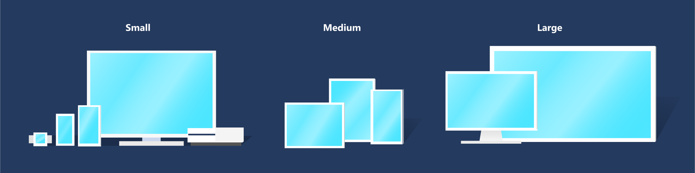

# Screen sizes and breakpoints

Windows apps can run on any device running Windows, which includes tablets, desktops, TVs, and more. With a huge number of device targets and screen sizes across the Windows ecosystem, rather than optimizing your UI for each device, we recommended designing for a few key width categories (also called "breakpoints"):

- Small (smaller than 640px)
- Medium (641px to 1007px)
- Large (1008px and larger)

> [!TIP]
> When designing for specific breakpoints, design for the amount of screen space available to your app (the app's window), not the screen size. When the app is running full-screen, the app window is the same size as the screen, but when the app is not full-screen, the window is smaller than the screen.

## Breakpoints

This table describes the different size classes and breakpoints.

| Size class | Breakpoints   | Typical screen size  | Devices     | Window Sizes |
|------------|---------------|----------------------|-------------|--------------|
| Small      | up to 640px   | 20" to 65" | TVs | 320x569, 360x640, 480x854 |
| Medium     | 641 - 1007px  | 7" to 12"            | Tablets     | 960x540 |
| Large      | 1008px and up | 13" and up           | PCs, Laptops, Surface Hub | 1024x640, 1366x768, 1920x1080 |

## Why are TVs considered "small"?

While most TVs are physically quite large (40 to 65 inches is common) and have high resolutions (HD or 4k), designing for a 1080P TV that you view from 10 feet away is different from designing for a 1080p monitor sitting a foot away on your desk. When you account for distance, the TV's 1080 pixels are more like a 540-pixel monitor that's much closer.

XAML's effective pixel system automatically takes viewing distance in account for you. When you specify a size for a control or a breakpoint range, you're actually using "effective" pixels. For example, if you create responsive code for 1080 pixels or more, a 1080 monitor will use that code, but a 1080p TV will not--because although a 1080p TV has 1080 physical pixels, it only has 540 effective pixels. Which makes designing for a TV similar to designing for a small screen.

## Effective pixels and scale factor

XAML helps by automatically adjusting UI elements so that they're legible and easy to interact with on all devices and screen sizes.

When your app runs on a device, the system uses an algorithm to normalize the way UI elements display on the screen. This scaling algorithm takes into account viewing distance and screen density (pixels per inch) to optimize for perceived size (rather than physical size). The scaling algorithm ensures that a 24 px font on Surface Hub 10 feet away is just as legible to the user as a 24 px font on 5" phone that's a few inches away.

:::image type="content" source="images/scaling-chart.png" alt-text="Content is scaled differently on different devices based on how far away the user is expected to be from the device's screen":::

Because of how the scaling system works, when you design your XAML app, you're designing in effective pixels, not actual physical pixels. Effective pixels (epx) are a virtual unit of measurement, and they're used to express layout dimensions and spacing, independent of screen density. (In our guidelines, epx, ep, and px are used interchangeably.)

You can ignore the pixel density and the actual screen resolution when designing. Instead, design for the effective resolution (the resolution in effective pixels) for a size class (for details, see the Screen sizes and breakpoints article).

> [!TIP]
> When creating screen mockups in image editing programs, set the DPI to 72 and set the image dimensions to the effective resolution for the size class you're targeting.

## Multiples of Four

:::image type="content" source="images/4epx.svg" alt-text="A 4 epx image being scaled to many dimensions without fractional pixels.":::

The sizes, margins, and positions of UI elements should always be in multiples of 4 epx in your UWP apps.

XAML scales across a range of devices with scaling plateaus of 100%, 125%, 150%, 175%, 200%, 225%, 250%, 300%, 350%, and 400%. The base unit is 4 because it can be scaled to these plateaus as a whole number (for example; 4 x 125% = 5, 4 x 150% = 6). Using multiples of four aligns all UI elements with whole pixels and ensures UI elements have crisp, sharp edges. (Note that text doesn't have this requirement; text can have any size and position.)
