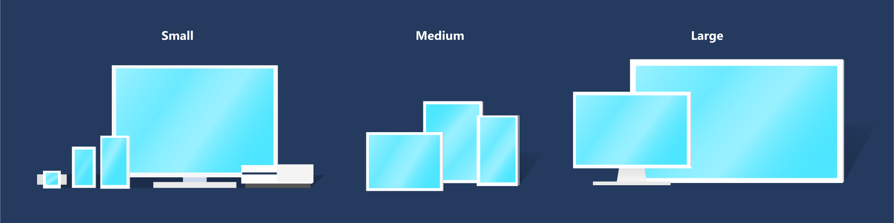

# Screen sizes and breakpoints

Windows apps run on a wide range of devices, from tablets and laptops to desktops, large monitors, and TVs. Rather than optimizing your UI for every screen size, design for a few key width categories called *breakpoints*:

- Small (smaller than 640px)
- Medium (641px to 1007px)
- Large (1008px and larger)

> [!TIP]
> When you design for specific breakpoints, design for the amount of screen space available to your app (the app's window), not the physical screen size. When your app runs full-screen, the app window matches the screen size. When it doesn't, the window is smaller than the screen.

## Breakpoints

This table describes the different size classes and breakpoints.

| Size class | Breakpoints   | Typical screen size  | Devices     | Window sizes |
|------------|---------------|----------------------|-------------|--------------|
| Small      | up to 640px   | 20" to 65" | TVs | 480x854, 540x960 |
| Medium     | 641 - 1007px  | 7" to 12"            | Tablets     | 960x540 |
| Large      | 1008px and up | 13" and up           | PCs, Laptops, Surface Hub | 1024x640, 1366x768, 1920x1080 |

## Why are TVs considered "small"?

Most TVs are physically large (40 to 65 inches is common) and have high resolutions (HD or 4K). However, designing for a 1080p TV that you view from 10 feet away is different from designing for a 1080p monitor on your desk. When you account for viewing distance, the TV's 1080 pixels are more like a 540-pixel monitor that's much closer.

XAML's effective pixel system accounts for viewing distance automatically. When you specify a size for a control or a breakpoint range, you use *effective* pixels. For example, if you create responsive code for 1080 pixels or more, a 1080p monitor uses that code, but a 1080p TV does not — because although the TV has 1080 physical pixels, it has only 540 effective pixels. This makes designing for a TV similar to designing for a small screen.

## Effective pixels and scale factor

XAML automatically adjusts UI elements so that they are legible and easy to interact with on all devices and screen sizes.

When your app runs on a device, the system uses an algorithm to normalize how UI elements display on the screen. This scaling algorithm takes into account viewing distance and screen density (pixels per inch) to optimize for perceived size rather than physical size. The algorithm ensures that a 24 px font on a large screen 10 feet away is just as legible as a 24 px font on a small screen a few inches away.

<!-- TODO: Replace images/scaling-chart.png — it still shows "Phone" as a device category. -->

:::image type="content" source="images/scaling-chart.png" alt-text="Diagram showing how content is scaled differently on devices at different viewing distances.":::

When you design your XAML app, you design in effective pixels, not actual physical pixels. Effective pixels (epx) are a virtual unit of measurement used to express layout dimensions and spacing, independent of screen density. (In our guidelines, epx, ep, and px are used interchangeably.)

You can ignore pixel density and the actual screen resolution when you design. Instead, design for the effective resolution (the resolution in effective pixels) for a size class.

> [!TIP]
> When you create screen mockups in image editing programs, set the DPI to 72 and set the image dimensions to the effective resolution for the size class you're targeting.

## Multiples of four

:::image type="content" source="images/4epx.svg" alt-text="A 4 epx image being scaled to many dimensions without fractional pixels.":::

The sizes, margins, and positions of UI elements should always be in multiples of 4 epx in your XAML apps.

XAML scales across a range of devices with scaling plateaus of 100%, 125%, 150%, 175%, 200%, 225%, 250%, 300%, 350%, and 400%. The base unit is 4 because it scales to these plateaus as a whole number (for example, 4 × 125% = 5, 4 × 150% = 6). Using multiples of four aligns all UI elements with whole pixels and ensures crisp, sharp edges. (Text does not have this requirement; text can have any size and position.)

## Related topics

- [Fluent Design - Layout](https://fluent2.microsoft.design/layout)
- [Responsive design](responsive-design.md)
- [Responsive layouts with XAML](../../develop/ui/layouts-with-xaml.md)
- [XAML controls](../../develop/ui/controls/index.md)
