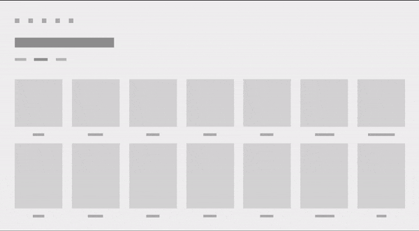

# Connected animation for Windows apps

Connected animations let you create a dynamic and compelling navigation experience by animating the transition of an element between two different views. This helps the user maintain their context and provides continuity between the views.

In a connected animation, an element appears to "continue" between two views during a change in UI content, flying across the screen from its location in the source view to its destination in the new view. This emphasizes the common content between the views and creates a beautiful and dynamic effect as part of a transition.

> **Important APIs**:  [ConnectedAnimation class](/uwp/api/windows.ui.xaml.media.animation.connectedanimation), [ConnectedAnimationService class](/uwp/api/windows.ui.xaml.media.animation.connectedanimationservice)


## Examples

<table>
<th align="left">WinUI 2 Gallery<th>
<tr>
<td></img></td>
<td>
    <p>If you have the <strong>WinUI 2 Gallery</strong> app installed, click here to <a href="winui2gallery:/item/ConnectedAnimation">open the app and see Connected Animation in action</a>.</p>
    <ul>
    <li><a href="https://www.microsoft.com/store/productId/9MSVH128X2ZT">Get the WinUI 2 Gallery app (Microsoft Store)</a></li>
    <li><a href="https://github.com/Microsoft/WinUI-Gallery">Get the source code (GitHub)</a></li>
    </ul>
</td>
</tr>
</table>

In this short video, an app uses a connected animation to animate an item image as it "continues" to become part of the header of the next page. The effect helps maintain user context across the transition.


## Connected animation and the Fluent Design System

 The Fluent Design System helps you create modern, bold UI that incorporates light, depth, motion, material, and scale. Connected animation is a Fluent Design System component that adds motion to your app. To learn more, see the [Fluent Design overview](../index.md).

## Why connected animation?

When navigating between pages, it’s important for the user to understand what new content is being presented after the navigation and how it relates to their intent when navigating. Connected animations provide a powerful visual metaphor that emphasizes the relationship between two views by drawing the user’s focus to the content shared between them. Additionally, connected animations add visual interest and polish to page navigation that can help differentiate the motion design of your app.

## When to use connected animation

Connected animations are generally used when changing pages, though they can be applied to any experience where you are changing content in a UI and want the user to maintain context. You should consider using a connected animation instead of a [drill in navigation transition](/uwp/api/Windows.UI.Xaml.Media.Animation.NavigationThemeTransition) whenever there is an image or other piece of UI shared between the source and destination views.

## Configure connected animation

> [!IMPORTANT]
> This feature requires that your app's Target version be Windows 10, version 1809 ([SDK 17763](https://developer.microsoft.com/windows/downloads/windows-10-sdk)) or later. The Configuration property is not available in earlier SDKs. You can target a Minimum version lower than SDK 17763 using adaptive code or conditional XAML. For more info, see [Version adaptive apps](/windows/uwp/debug-test-perf/version-adaptive-apps).

Starting in Windows 10, version 1809, connected animations further embody Fluent design by providing animation configurations tailored specifically for forward and backwards page navigation.

You specify an animation configuration by setting the Configuration property on the ConnectedAnimation. (We’ll show examples of this in the next section.)

This table describes the available configurations. For more information about the motion principles applied in these animations, see [Directionality and gravity](index.md).

| [GravityConnectedAnimationConfiguration](/uwp/api/windows.ui.xaml.media.animation.gravityconnectedanimationconfiguration) |
| - |
| This is the default configuration, and is recommended for forward navigation. |
As the user navigates forward in the app (A to B), the connected element appears to physically “pull off the page”. In doing so, the element appears to move forward in z-space and drops a bit as an effect of gravity taking hold. To overcome the effects of gravity, the element gains velocity and accelerates into its final position. The result is a “scale and dip” animation. |

| [DirectConnectedAnimationConfiguration](/uwp/api/windows.ui.xaml.media.animation.directconnectedanimationconfiguration) |
| - |
| As the user navigates backwards in the app (B to A), the animation is more direct. The connected element linearly translates from B to A using a decelerate cubic Bezier easing function. The backwards visual affordance returns the user to their previous state as fast as possible while still maintaining the context of the navigation flow. |

| [BasicConnectedAnimationConfiguration](/uwp/api/windows.ui.xaml.media.animation.basicconnectedanimationconfiguration) |
| - |
| This is the default (and only) animation used in versions prior to Windows 10, version 1809 ([SDK 17763](https://developer.microsoft.com/windows/downloads/windows-10-sdk)). |

### ConnectedAnimationService configuration

The [ConnectedAnimationService](/uwp/api/windows.ui.xaml.media.animation.connectedanimationservice) class has two properties that apply to the individual animations rather than the overall service.

- [DefaultDuration](/uwp/api/windows.ui.xaml.media.animation.connectedanimationservice.defaultduration)
- [DefaultEasingFunction](/uwp/api/windows.ui.xaml.media.animation.connectedanimationservice.defaulteasingfunction)

To achieve the various effects, some configurations ignore these properties on ConnectedAnimationService and use their own values instead, as described in this table.

| Configuration | Respects DefaultDuration? | Respects DefaultEasingFunction? |
| - | - | - |
| Gravity | Yes | Yes* <br/> **The basic translation from A to B uses this easing function, but the "gravity dip" has its own easing function.*  |
| Direct | No <br/> *Animates over 150ms.*| No <br/> *Uses the Decelerate easing function.* |
| Basic | Yes | Yes |

## How to implement connected animation

Setting up a connected animation involves two steps:

1. *Prepare* an animation object on the source page, which indicates to the system that the source element will participate in the connected animation.
1. *Start* the animation on the destination page, passing a reference to the destination element.

When navigating from the source page, call [ConnectedAnimationService.GetForCurrentView](/uwp/api/windows.ui.xaml.media.animation.connectedanimationservice.getforcurrentview) to get an instance of ConnectedAnimationService. To prepare an animation, call [PrepareToAnimate](/uwp/api/windows.ui.xaml.media.animation.connectedanimationservice.preparetoanimate) on this instance, and pass in a unique key and the UI element you want to use in the transition. The unique key lets you retrieve the animation later on the destination page.

```csharp
ConnectedAnimationService.GetForCurrentView()
    .PrepareToAnimate("forwardAnimation", SourceImage);
```

When the navigation occurs, start the animation in the destination page. To start the animation, call [ConnectedAnimation.TryStart](/uwp/api/windows.ui.xaml.media.animation.connectedanimation.trystart). You can retrieve the right animation instance by calling [ConnectedAnimationService.GetAnimation](/uwp/api/windows.ui.xaml.media.animation.connectedanimationservice.getanimation) with the unique key you provided when creating the animation.

```csharp
ConnectedAnimation animation =
    ConnectedAnimationService.GetForCurrentView().GetAnimation("forwardAnimation");
if (animation != null)
{
    animation.TryStart(DestinationImage);
}
```

### Forward navigation

This example shows how to use ConnectedAnimationService to create a transition for forward navigation between two pages (Page_A to Page_B).

The recommended animation configuration for forward navigation is [GravityConnectedAnimationConfiguration](/uwp/api/windows.ui.xaml.media.animation.gravityconnectedanimationconfiguration). This is the default, so you don't need to set the [Configuration](/uwp/api/windows.ui.xaml.media.animation.connectedanimation.configuration) property unless you want to specify a different configuration.

Set up the animation in the source page.

```xaml
<!-- Page_A.xaml -->

<Image x:Name="SourceImage"
       HorizontalAlignment="Left" VerticalAlignment="Top"
       Width="200" Height="200"
       Stretch="Fill"
       Source="Assets/StoreLogo.png"
       PointerPressed="SourceImage_PointerPressed"/>
```

```csharp
// Page_A.xaml.cs

private void SourceImage_PointerPressed(object sender, PointerRoutedEventArgs e)
{
    // Navigate to detail page.
    // Suppress the default animation to avoid conflict with the connected animation.
    Frame.Navigate(typeof(Page_B), null, new SuppressNavigationTransitionInfo());
}

protected override void OnNavigatingFrom(NavigatingCancelEventArgs e)
{
    ConnectedAnimationService.GetForCurrentView()
        .PrepareToAnimate("forwardAnimation", SourceImage);
    // You don't need to explicitly set the Configuration property because
    // the recommended Gravity configuration is default.
    // For custom animation, use:
    // animation.Configuration = new BasicConnectedAnimationConfiguration();
}
```

Start the animation in the destination page.

```xaml
<!-- Page_B.xaml -->

<Image x:Name="DestinationImage"
       Width="400" Height="400"
       Stretch="Fill"
       Source="Assets/StoreLogo.png" />
```

```csharp
// Page_B.xaml.cs

protected override void OnNavigatedTo(NavigationEventArgs e)
{
    base.OnNavigatedTo(e);

    ConnectedAnimation animation =
        ConnectedAnimationService.GetForCurrentView().GetAnimation("forwardAnimation");
    if (animation != null)
    {
        animation.TryStart(DestinationImage);
    }
}
```

### Back navigation

For back navigation (Page_B to Page_A), you follow the same steps, but the source and destination pages are reversed.

When the user navigates back, they expect the app to be returned to the previous state as soon as possible. Therefore, the recommended configuration is [DirectConnectedAnimationConfiguration](/uwp/api/windows.ui.xaml.media.animation.directconnectedanimationconfiguration). This animation is quicker, more direct, and uses the decelerate easing.

Set up the animation in the source page.

```csharp
// Page_B.xaml.cs

protected override void OnNavigatingFrom(NavigatingCancelEventArgs e)
{
    if (e.NavigationMode == NavigationMode.Back)
    {
        ConnectedAnimation animation = 
            ConnectedAnimationService.GetForCurrentView().PrepareToAnimate("backAnimation", DestinationImage);

        // Use the recommended configuration for back animation.
        animation.Configuration = new DirectConnectedAnimationConfiguration();
    }
}
```

Start the animation in the destination page.

```csharp
// Page_A.xaml.cs

protected override void OnNavigatedTo(NavigationEventArgs e)
{
    base.OnNavigatedTo(e);

    ConnectedAnimation animation =
        ConnectedAnimationService.GetForCurrentView().GetAnimation("backAnimation");
    if (animation != null)
    {
        animation.TryStart(SourceImage);
    }
}
```

Between the time that the animation is set up and when it's started, the source element appears frozen above other UI in the app. This lets you perform any other transition animations simultaneously. For this reason, you shouldn't wait more than ~250 milliseconds in between the two steps because the presence of the source element may become distracting. If you prepare an animation and do not start it within three seconds, the system will dispose of the animation and any subsequent calls to [TryStart](/uwp/api/windows.ui.xaml.media.animation.connectedanimation.trystart) will fail.

## Connected animation in list and grid experiences

Often, you will want to create a connected animation from or to a list or grid control. You can use the two methods on [ListView](/uwp/api/windows.ui.xaml.controls.listview) and [GridView](/uwp/api/windows.ui.xaml.controls.gridview), [PrepareConnectedAnimation](/uwp/api/windows.ui.xaml.controls.listviewbase.prepareconnectedanimation) and [TryStartConnectedAnimationAsync](/uwp/api/windows.ui.xaml.controls.listviewbase.trystartconnectedanimationasync), to simplify this process.

For example, say you have a **ListView** that contains an element with the name "PortraitEllipse" in its data template.

```xaml
<ListView x:Name="ContactsListView" Loaded="ContactsListView_Loaded">
    <ListView.ItemTemplate>
        <DataTemplate x:DataType="vm:ContactsItem">
            <Grid>
                …
                <Ellipse x:Name="PortraitEllipse" … />
            </Grid>
        </DataTemplate>
    </ListView.ItemTemplate>
</ListView>
```

To prepare a connected animation with the ellipse corresponding to a given list item, call the [PrepareConnectedAnimation](/uwp/api/windows.ui.xaml.controls.listviewbase.prepareconnectedanimation) method with a unique key, the item, and the name "PortraitEllipse".

```csharp
void PrepareAnimationWithItem(ContactsItem item)
{
     ContactsListView.PrepareConnectedAnimation("portrait", item, "PortraitEllipse");
}
```

To start an animation with this element as the destination, such as when navigating back from a detail view, use [TryStartConnectedAnimationAsync](/uwp/api/windows.ui.xaml.controls.listviewbase.trystartconnectedanimationasync). If you have just loaded the data source for the ListView, TryStartConnectedAnimationAsync will wait to start the animation until the corresponding item container has been created.

```csharp
private async void ContactsListView_Loaded(object sender, RoutedEventArgs e)
{
    ContactsItem item = GetPersistedItem(); // Get persisted item
    if (item != null)
    {
        ContactsListView.ScrollIntoView(item);
        ConnectedAnimation animation =
            ConnectedAnimationService.GetForCurrentView().GetAnimation("portrait");
        if (animation != null)
        {
            await ContactsListView.TryStartConnectedAnimationAsync(
                animation, item, "PortraitEllipse");
        }
    }
}
```

## Coordinated animation



A *coordinated animation* is a special type of entrance animation where an element appears along with the connected animation target, animating in tandem with the connected animation element as it moves across the screen. Coordinated animations can add more visual interest to a transition and further draw the user’s attention to the context that is shared between the source and destination views. In these images, the caption UI for the item is animating using a coordinated animation.

When a coordinated animation uses the gravity configuration, gravity is applied to both the connected animation element and the coordinated elements. The coordinated elements will "swoop" alongside the connected element so the elements stay truly coordinated.

Use the two-parameter overload of **TryStart** to add coordinated elements to a connected animation. This example demonstrates a coordinated animation of a Grid layout named "DescriptionRoot" that enters in tandem with a connected animation element named "CoverImage".

```xaml
<!-- DestinationPage.xaml -->
<Grid>
    <Image x:Name="CoverImage" />
    <Grid x:Name="DescriptionRoot" />
</Grid>
```

```csharp
// DestinationPage.xaml.cs
void OnNavigatedTo(NavigationEventArgs e)
{
    var animationService = ConnectedAnimationService.GetForCurrentView();
    var animation = animationService.GetAnimation("coverImage");

    if (animation != null)
    {
        // Don’t need to capture the return value as we are not scheduling any subsequent
        // animations
        animation.TryStart(CoverImage, new UIElement[] { DescriptionRoot });
     }
}
```

## Do’s and don’ts

- Use a connected animation in page transitions where an element is shared between the source and destination pages.
- Use [GravityConnectedAnimationConfiguration](/uwp/api/windows.ui.xaml.media.animation.gravityconnectedanimationconfiguration) for forward navigation.
- Use [DirectConnectedAnimationConfiguration](/uwp/api/windows.ui.xaml.media.animation.directconnectedanimationconfiguration) for back navigation.
- Don't wait on network requests or other long-running asynchronous operations in between preparing and starting a connected animation. You may need to pre-load the necessary information to run the transition ahead of time, or use a low-resolution placeholder image while a high-resolution image loads in the destination view.
- Use [SuppressNavigationTransitionInfo](/uwp/api/windows.ui.xaml.media.animation.suppressnavigationtransitioninfo) to prevent a transition animation in a **Frame** if you are using **ConnectedAnimationService**, since connected animations aren't meant to be used simultaneously with the default navigation transitions. See [NavigationThemeTransition](/uwp/api/Windows.UI.Xaml.Media.Animation.NavigationThemeTransition) for more info on how to use navigation transitions.

## Related articles

[ConnectedAnimation](/uwp/api/windows.ui.xaml.media.animation.connectedanimation)

[ConnectedAnimationService](/uwp/api/windows.ui.xaml.media.animation.connectedanimationservice)

[NavigationThemeTransition](/uwp/api/Windows.UI.Xaml.Media.Animation.NavigationThemeTransition)