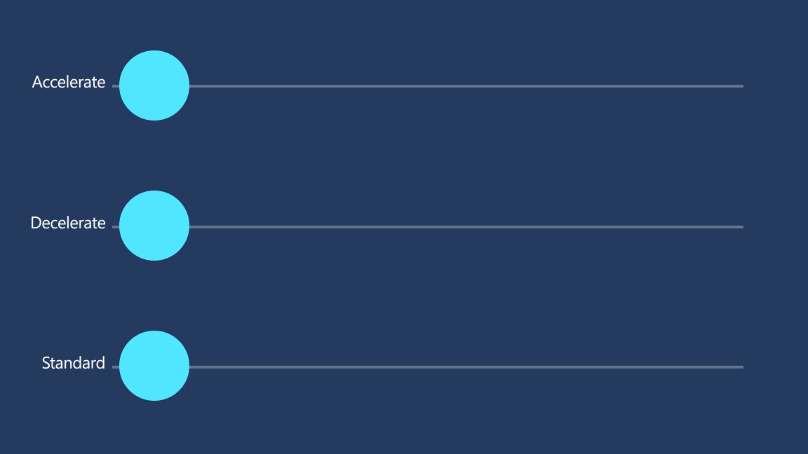
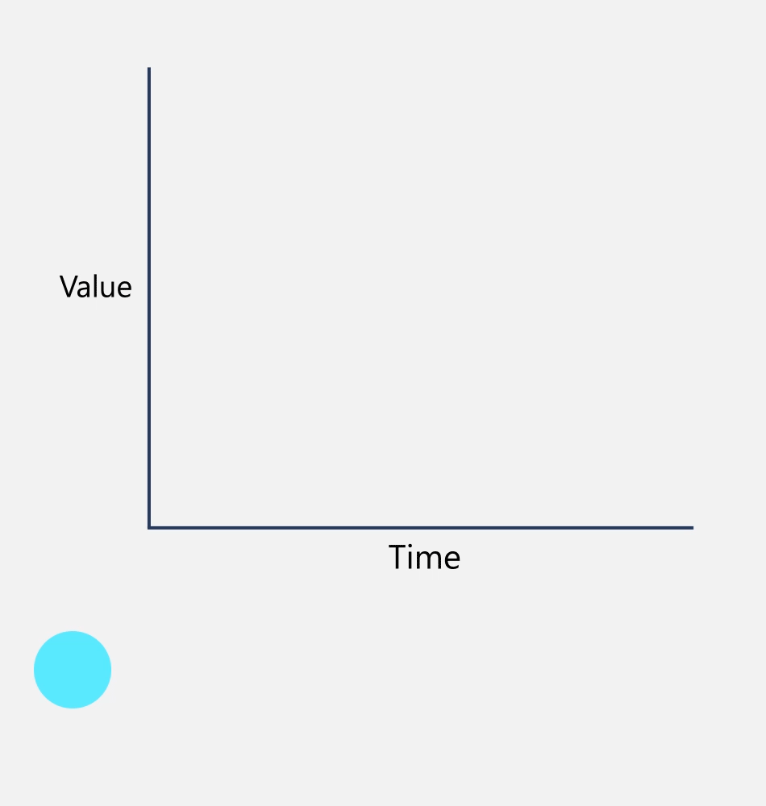

# Timing and easing

While motion is based in the real world, we are also a digital medium, which comes with an expectation of speed and performance.​

## Examples

<table>
<tr>
<td></img></td>
<td>
    <p>If you have the <strong style="font-weight: semi-bold">XAML Controls Gallery</strong> app installed, click here to <a href="xamlcontrolsgallery:/item/EasingFunction">open the app and see Easing Functions in action</a>.</p>
    <ul>
    <li><a href="https://www.microsoft.com/store/productId/9MSVH128X2ZT">Get the XAML Controls Gallery app (Microsoft Store)</a></li>
    <li><a href="https://github.com/Microsoft/Xaml-Controls-Gallery">Get the source code (GitHub)</a></li>
    </ul>
</td>
</tr>
</table>

## Standard animation duration values

WinUI provides a set of standard animation durations that are used throughout the platform controls. You can use these named resources when building custom Storyboard animations as well.

|ThemeResource Name  |Value  |
|---------|---------|
|ControlNormalAnimationDuration     |    250ms     |
|ControlFastAnimationDuration     |    167ms     |
|ControlFasterAnimationDuration     |    83ms     |

## Easing in Fluent motion

Easing is a way to manipulate the velocity of an object as it travels. It's the glue that ties together all the Fluent motion experiences.​ While extreme, the easing used in the system helps unify the physical feel of objects moving throughout the system. This is one way to mimic the real world, and make objects in motion feel like they belong in their environment.



## Apply easing to motion

These easings will help you achieve a more natural feel, and are the baseline we use for Fluent motion.

### Fast Out, Slow In

```csharp
cubic-bezier(0, 0, 0, 1)
```

:::row:::
    :::column:::
Use for objects or UI entering the scene, either navigating or spawning​.

Once on-scene, the object is met with extreme friction, which slows the object to rest.​
The resulting feel is that the object traveled from a long distance away and entered at an extreme velocity, or is quickly returning to a rest state.​

Even if it's preceded by a moment of unresponsiveness, the velocity of the incoming object has the effect of feeling fast and responsive.​
    :::column-end:::
    :::column:::
        
    :::column-end:::
:::row-end:::


### Slow Out, Fast In

```csharp
cubic-bezier(1 , 0 , 1 , 1)
```

:::row:::
    :::column:::
Use for UI or objects that are exiting the scene.

Objects become powered and gain momentum until they reach escape velocity.​
The resulting feel is that the object is trying its hardest to get out of the user's way and make room for new content to come in.​
    :::column-end:::
    :::column:::
        
    :::column-end:::
:::row-end:::

## Related articles

- [Motion overview](index.md)
- [Directionality and gravity](directionality-and-gravity.md)
