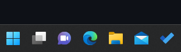
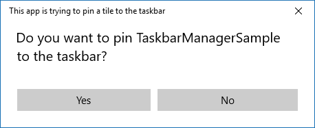

# Pin your app to the taskbar

Now you can programmatically request users to pin your Win32 or UWP app to the taskbar, similar to how you can [pin your app to the Start menu](tiles-and-notifications/primary-tile-apis.md). And you can check whether your app is currently pinned, and whether the taskbar allows pinning.



> [!IMPORTANT]
> **Requires Fall Creators Update**: You must target SDK 16299 and be running build 16299 or later to use the taskbar APIs.

> **Important APIs**: [TaskbarManager class](/uwp/api/windows.ui.shell.taskbarmanager)

## When should you ask the user to pin your app to the taskbar?

The [TaskbarManager](/uwp/api/windows.ui.shell.taskbarmanager) class lets you ask the user to pin your app to the taskbar; the user must approve the request. You put a lot of effort into building a stellar app, and now you have the opportunity to ask the user to pin it to taskbar. But before we dive into the code, here are some things to keep in mind as you are designing your experience:

* **Do** craft a non-disruptive and easily dismissible UX in your app with a clear call to action. Avoid using dialogs and flyouts for this purpose. Accessible pinning icons or similar UX is recommended but not required.
* **Do** ensure your app has value to the user before asking the user to pin it.
* **Don't** ask a user to pin your app if the tile is already pinned or the device doesn't support it. (This article explains how to determine whether pinning is supported.)
* **Don't** repeatedly ask the user to pin your app (they will probably get annoyed).
* **Don't** call the pin API without explicit user interaction or when your app is minimized/not open. Your app must be in the foreground for the process to work.
* **Don't** use installers to call the API.

## Limited Access Feature (LAF) approval

Taskbar pinning is a Limited Access Feature (LAF). To gain access to this API you will need to receive a token to unlock the LAF gating. To request a token, email [taskbarlafapprovals@outlook.com](mailto:taskbarlafapprovals@outlook.com) with the information listed below. If the request is approved you will receive a token to unlock the LAF.

* The UX experience – please provide images in the LAF request email.
* Microsoft Store name – please provide the name of your app as represented in the Microsoft Store. Our team will manually check if you have an entry. A discoverable Microsoft Store entry is required for use.

## 1. Check whether the required APIs exist

### UWP

If your app supports older versions of Windows 10, you need to check whether the `TaskbarManager` class is available. You can use the [ApiInformation.IsTypePresent method](/uwp/api/windows.foundation.metadata.apiinformation#Windows_Foundation_Metadata_ApiInformation_IsTypePresent_System_String_) to perform this check. If the `TaskbarManager` class isn't available, avoid executing any calls to the APIs.

```csharp
if (ApiInformation.IsTypePresent("Windows.UI.Shell.TaskbarManager"))
{
    // Taskbar APIs exist!
}

else
{
    // Older version of Windows, no taskbar APIs
}
```

### Win32

If you want to use `TaskbarManager` from your WIn32 desktop app, then you'll need to check whether desktop app support is present. You can look for the `ITaskbarManagerDesktopAppSupportStatics` marker interface on the `TaskbarManager` activation factory to perform this check. If this interface is not available, then you won't be able to use `TaskbarManager` from your desktop app.

```cpp
if (winrt::try_get_activation_factory<winrt::Windows::UI::Shell::TaskbarManager, winrt::Windows::UI::Shell::ITaskbarManagerDesktopAppSupportStatics>())
{
    // TaskbarManager desktop app support is available.
}
else
{
    // TaskbarManager desktop app support is not available.
}
```

## 2. Check whether taskbar is present and allows pinning

Windows apps can run on a wide variety of devices; not all of them support the taskbar. Right now, only Desktop devices support the taskbar. Additionally, apps may request pinning, but pinning may not be allowed at any given time. It is suggested that apps check whether pinning is allowed before UX is surfaced to prevent confusing users.

Even if the taskbar is available, a group policy on the user's machine might disable taskbar pinning. So, before you attempt to pin your app, you need to check whether pinning to the taskbar is supported. The [TaskbarManager.IsPinningAllowed](/uwp/api/windows.ui.shell.taskbarmanager.IsPinningAllowed) property returns `true` if the taskbar is present and allows pinning.

```csharp
// Check if taskbar allows pinning, apps may request pinning, but pinning may not be allowed at any given time. It is suggested that apps check whether pinning is allowed before a UX is surfaced in order to prevent confusing users.

bool isPinningAllowed = TaskbarManager.GetDefault().IsPinningAllowed;
```

> [!IMPORTANT]
> There are also requirements that must be met at the time the call is actually made for the pin request to be allowed:
>
> * App is in foreground
> * App has a Start menu entry
>
> These requirements won't result in an exception if not met, the pin request will just be denied. `IsPinningAllowed` can be called to determine if a pin request (prompt) will be allowed.

> [!NOTE]
> If you don't want to pin your app to the taskbar and just want to find out whether the taskbar is available, use the [TaskbarManager.IsSupported](/uwp/api/windows.ui.shell.taskbarmanager.IsSupported) property.

## 3. Check whether your app is currently pinned to the taskbar

Obviously, there's no point in asking the user to let you pin the app to the taskbar if it's already pinned there. You can use the [TaskbarManager.IsCurrentAppPinnedAsync](/uwp/api/windows.ui.shell.taskbarmanager.IsCurrentAppPinnedAsync) method to check whether the app is already pinned before asking the user.

```csharp
// Check whether your app is currently pinned
bool isPinned = await TaskbarManager.GetDefault().IsCurrentAppPinnedAsync();

if (isPinned)
{
    // The app is already pinned--no point in asking to pin it again!
}
else
{
    //The app is not pinned.
}
```

## 4. Pin your app

If the taskbar is present and pinning is allowed and your app currently isn't pinned, you might want to show a subtle tip to let users know that they can pin your app. For example, you might show a pin icon somewhere in your UI that the user can click.

If the user clicks your pin suggestion UI, you would then call the [TaskbarManager.RequestPinCurrentAppAsync](/uwp/api/windows.ui.shell.taskbarmanager.RequestPinCurrentAppAsync) method. This method displays a dialog that asks the user to confirm that they want your app pinned to the taskbar.

> [!IMPORTANT]
> This must be called from a foreground UI thread, otherwise an exception will be thrown.

```csharp
// Request to be pinned to the taskbar.
bool isPinned = await TaskbarManager.GetDefault().RequestPinCurrentAppAsync();
```



This method returns a boolean value that indicates whether your app is now pinned to the taskbar. If your app was already pinned, the method immediately returns `true` without showing the dialog to the user. If the user clicks "no" on the dialog, or pinning your app to the taskbar isn't allowed, the method returns `false`. Otherwise, the user clicked yes and the app was pinned, and the API will return `true`.

## Resources

* [Full UWP code sample on GitHub](https://github.com/WindowsNotifications/quickstart-pin-to-taskbar)
* [Full desktop code sample on GitHub](https://github.com/microsoft/Windows-classic-samples/tree/main/Samples/TaskbarManager)
* [TaskbarManager class](/uwp/api/windows.ui.shell.taskbarmanager)
* [Pin an app to the Start menu](tiles-and-notifications/primary-tile-apis.md)
