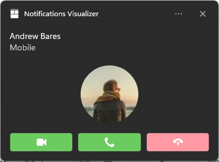

# Toast content

Adaptive and interactive toast notifications let you create flexible notifications with text, images, and buttons/inputs.

> **Important APIs**: [UWP Community Toolkit Notifications nuget package](https://www.nuget.org/packages/Microsoft.Toolkit.Uwp.Notifications/)

## Getting started

You can define a notification's content using XML or the `Microsoft.Toolkit.Uwp.Notifications` builder syntax. To use XML, follow the **XML** sample tabs below and reference the [toast notification XML schema](/uwp/schemas/tiles/toastschema/schema-root). To use the `Microsoft.Toolkit.Uwp.Notification` C# builder syntax, install the NuGet package [Microsoft.Toolkit.Uwp.Notifications](https://www.nuget.org/packages/Microsoft.Toolkit.Uwp.Notifications/), follow the **Builder syntax** sample tabs below and reference the [toast content schema](toast-schema.md). The C# samples provided in this article use version 7.0.0 of the NuGet package.


**Install Notifications Visualizer.** This free Windows app helps you design interactive toast notifications by providing an instant visual preview of your toast as you edit it, similar to Visual Studio's XAML editor/design view. See [Notifications Visualizer](notifications-visualizer.md) for more information, or [download Notifications Visualizer from the Store](https://www.microsoft.com/store/apps/notifications-visualizer/9nblggh5xsl1).


## Sending a toast notification

To learn how to send a notification, see [Send local toast](send-local-toast.md). This documentation only covers creating the toast content.


## Toast notification structure

Toast notifications are a combination of some data properties like Tag/Group (which let you identify the notification) and the *toast content*.

The core components of toast content are...
* **launch**: This defines what arguments will be passed back to your app when the user clicks your toast, allowing you to deep link into the correct content that the toast was displaying. To learn more, see [Send local toast](send-local-toast.md).
* **visual**: The visual portion of the toast, including the generic binding that contains text and images.
* **actions**: The interactive portion of the toast, including inputs and actions.
* **audio**: Controls the audio played when the toast is shown to the user.

The toast content is defined in raw XML, but you can use our [NuGet library](https://www.nuget.org/packages/Microsoft.Toolkit.Uwp.Notifications/) to get a C# (or C++) object model for constructing the toast content. This article documents everything that goes within the toast content.

#### [Builder syntax](#tab/builder-syntax)

```csharp
new ToastContentBuilder()
    .AddArgument("conversationId", 9813)

    .AddText("Some text")

    .AddButton(new ToastButton()
        .SetContent("Archive")
        .AddArgument("action", "archive")
        .SetBackgroundActivation())

    .AddAudio(new Uri("ms-appx:///Sound.mp3"));
```

#### [XML](#tab/xml)

```xml
<toast launch="app-defined-string">

    <visual>
        <binding template="ToastGeneric">
        ...
        </binding>
    </visual>

    <actions>
        ...
    </actions>

    <audio src="ms-winsoundevent:Notification.Reminder"/>

</toast>
```

---

Here is a visual representation of the toast's content:


## Attribution area

The attribution area is at the top of the toast notification. Starting with Windows 11, your app's name and icon are displayed in this area. The attribution area also includes a close button that allows the user to quickly dismiss the notification and an ellipses menu that allows the user to quickly disable notifications for your app or go to the Windows Settings page for your app's notifications. The attribution area is configured by the shell and can't be overridden in the toast XML payload, although your app can add items to the attribution area context menu. For more information see [Context menu actions](#context-menu-actions).

## Visual

Each toast must specify a visual, where you must provide a generic toast binding, which can contain text, images, and more. These elements will be rendered on various Windows devices, including desktop, phones, tablets, and Xbox.

For all attributes supported in the visual section and its child elements, [see the schema documentation](toast-schema.md#toastvisual).

## Text elements

Each toast must have at least one text element, and can contain two additional text elements, all of type [**AdaptiveText**](toast-schema.md#adaptivetext).


Since the Windows 10 Anniversary Update, you can control how many lines of text are displayed by using the **HintMaxLines** property on the text. The default (and maximum) is up to 2 lines of text for the title, and up to 4 lines (combined) for the two additional description elements (the second and third **AdaptiveText**).

#### [Builder syntax](#tab/builder-syntax)

```csharp
new ToastContentBuilder()
    .AddText("Adaptive Tiles Meeting", hintMaxLines: 1)
    .AddText("Conf Room 2001 / Building 135")
    .AddText("10:00 AM - 10:30 AM");
```

#### [XML](#tab/xml)

```xml
<toast launch="app-defined-string">
  <visual>
    <binding template="ToastGeneric">
      <text hint-maxLines="1">Adaptive Tiles Meeting</text>
      <text>Conf Room 2001 / Building 135</text>
      <text>10:00 AM - 10:30 AM</text>
    </binding>
  </visual>
</toast>
```

---

## Inline image

By default, images are displayed inline, after any text elements, filling the full width of the visual area.


#### [Builder syntax](#tab/builder-syntax)

```csharp
new ToastContentBuilder()
    ...
    
    .AddInlineImage(new Uri("https://picsum.photos/360/202?image=1043"));
```

#### [XML](#tab/xml)

```xml
<toast>  
  <visual>
    <binding template="ToastGeneric">
      <image src="https://picsum.photos/360/202?image=1043"/>
      <text>Featured image of the day.</text>
    </binding>
  </visual>
</toast>
```

---


## App logo override

Specifying a placement value of appLogoOverride will cause the image to be displayed in a square on the left side of the visual area. The name of this property reflects the behavior in previous versions of Windows, where the image would replace the default app logo image. In Windows 11, the app logo is displayed in the attribution area, so it is not overridden by the appLogoOverride image placement.

Image dimensions are 48x48 pixels at 100% scaling. We generally recommend providing a version each icon asset for each scale factor: 100%, 125%, 150%, 200%, and 400%. 


#### [Builder syntax](#tab/builder-syntax)

```csharp
new ToastContentBuilder()
    ...
    
    .AddAppLogoOverride(new Uri("https://picsum.photos/360/202?image=1043"), NotificationAppLogoCrop.Circle);
```

#### [XML](#tab/xml)

```xml
<toast>  
  <visual>
    <binding template="ToastGeneric">
      <image placement="appLogoOverride"  src="https://picsum.photos/360/202?image=1043"/>
      <text>Featured image of the day.</text>
    </binding>
  </visual>
</toast>
```

---

## Hint crop

Microsoft style guidelines recommend representing profile pictures with a circular image to provide a consistent representation of people across apps and the shell. Set the **HintCrop** property to **Circle** to render the image with a circular crop.  


#### [Builder syntax](#tab/builder-syntax)

```csharp
new ToastContentBuilder()
    ...
    
    .AddAppLogoOverride(new Uri("https://picsum.photos/48?image=883"), NotificationAppLogoCrop.Circle);
```

#### [XML](#tab/xml)

```xml
<toast>  
  <visual>
    <binding template="ToastGeneric">
      <image placement="appLogoOverride" hint-crop="circle" src="https://picsum.photos/48?image=883"/>
      <text>Matt sent you a friend request</text>
      <text>Hey, wanna dress up as wizards and ride around on hoverboards?</text>
    </binding>
  </visual>
</toast>
```

---

## Hero image

**New in Anniversary Update**: Toasts can display a hero image, which is a featured [**ToastGenericHeroImage**](toast-schema.md#toastgenericheroimage) displayed prominently within the toast banner and while inside Notification Center. Image dimensions are 364x180 pixels at 100% scaling.


#### [Builder syntax](#tab/builder-syntax)

```csharp
new ToastContentBuilder()
    ...
    
    .AddHeroImage(new Uri("https://picsum.photos/364/180?image=1043"));
```

#### [XML](#tab/xml)

```xml
<toast>  
  <visual>
    <binding template="ToastGeneric">
      <image placement="hero" src="https://picsum.photos/360/202?image=1043"/>
      <text>Mary Anne</text>
      <text>Check out where we camped last night!</text>
    </binding>
  </visual>
</toast>
```

---


## Image size restrictions

The images you use in your toast notification can be sourced from...

 - http://
 - ms-appx:///
 - ms-appdata:///

For http and https remote web images, there are limits on the file size of each individual image. In the Fall Creators Update (16299), we increased the limit to be 3 MB on normal connections and 1 MB on metered connections. Before that, images were always limited to 200 KB.

| Normal connection | Metered connection | Before Fall Creators Update |
| - | - | - |
| 3 MB | 1 MB | 200 KB |

If an image exceeds the file size, or fails to download, or times out, the image will be dropped and the rest of the notification will be displayed.


## Attribution text

**New in Anniversary Update**: If you need to reference the source of your content, you can use attribution text. This text is always displayed below any text elements, but above inline images. The text uses a slightly smaller size than standard text elements to help to distinguish from regular text elements.

On older versions of Windows that don't support attribution text, the text will simply be displayed as another text element (assuming you don't already have the maximum of three text elements).


#### [Builder syntax](#tab/builder-syntax)

```csharp
new ToastContentBuilder()
    ...
    
    .AddAttributionText("Via SMS");
```

#### [XML](#tab/xml)

```xml
<toast>  
  <visual>
    <binding template="ToastGeneric">
      <image src="https://picsum.photos/360/202?image=1043"/>
      <text>Mary Anne</text>
      <text>Check out where we camped last night!</text>
      <text placement="attribution">Via SMS</text>
    </binding>
  </visual>
</toast>
```

---


## Custom timestamp

**New in Creators Update**: You can now override the system-provided timestamp with your own timestamp that accurately represents when the message/information/content was generated. This timestamp is visible within Notification Center.


To learn more about using a custom timestamp, please see [custom timestamps on toasts](custom-timestamps-on-toasts.md).

#### [Builder syntax](#tab/builder-syntax)

```csharp
new ToastContentBuilder()
    ...
    
    .AddCustomTimeStamp(new DateTime(2017, 04, 15, 19, 45, 00, DateTimeKind.Utc));
```

#### [XML](#tab/xml)

```xml
<toast displayTimestamp="2022-07-01T19:45:00Z">  
  <visual>
    <binding template="ToastGeneric">
      <image placement="appLogoOverride" hint-crop="circle" src="https://picsum.photos/48?image=883"/>
      <text>Matt sent you a friend request</text>
      <text>Hey, wanna dress up as wizards and ride around on hoverboards?</text>
    </binding>
  </visual>
</toast>
```

---


## Progress bar

**New in Creators Update**: You can provide a progress bar on your toast notification to keep the user informed of the progress of operations such as downloads.


To learn more about using a progress bar, please see [Toast progress bar](toast-progress-bar.md).


## Headers

**New in Creators Update**: You can group notifications under headers within Notification Center. For example, you can group messages from a group chat under a header, or group notifications of a common theme under a header, or more.


To learn more about using headers, please see [Toast headers](toast-headers.md).


## Adaptive content

**New in Anniversary Update**: In addition to the content specified above, you can also display additional adaptive content that is visible when the toast is expanded.

This additional content is specified using Adaptive, which you can learn more about by reading the [Adaptive Tiles documentation](create-adaptive-tiles.md).

Note that any adaptive content must be contained within an [**AdaptiveGroup**](./toast-schema.md#adaptivegroup). Otherwise it will not be rendered using adaptive.


### Columns and text elements

Here's an example where columns and some advanced adaptive text elements are used. Since the text elements are within an **AdaptiveGroup**, they support all the rich adaptive styling properties.


#### [Builder syntax](#tab/builder-syntax)

```csharp
new ToastContentBuilder()
    ...
    
    .AddVisualChild(new AdaptiveGroup()
    {
        Children =
        {
            new AdaptiveSubgroup()
            {
                Children =
                {
                    new AdaptiveText()
                    {
                        Text = "52 attendees",
                        HintStyle = AdaptiveTextStyle.Base
                    },
                    new AdaptiveText()
                    {
                        Text = "23 minute drive",
                        HintStyle = AdaptiveTextStyle.CaptionSubtle
                    }
                }
            },
            new AdaptiveSubgroup()
            {
                Children =
                {
                    new AdaptiveText()
                    {
                        Text = "1 Microsoft Way",
                        HintStyle = AdaptiveTextStyle.CaptionSubtle,
                        HintAlign = AdaptiveTextAlign.Right
                    },
                    new AdaptiveText()
                    {
                        Text = "Bellevue, WA 98008",
                        HintStyle = AdaptiveTextStyle.CaptionSubtle,
                        HintAlign = AdaptiveTextAlign.Right
                    }
                }
            }
        }
    });
```

#### [XML](#tab/xml)

```xml
<toast launch="app-defined-string">
  <visual>
    <binding template="ToastGeneric">
      <text>Reminder: Windows Launch Party</text>
      <text>4:00 PM, 10/21/2021</text>
      <group>
        <subgroup>
          <text hint-style="base">52 attendees</text>
          <text hint-style="captionSubtle">23 minute drive</text>
        </subgroup>
        <subgroup>
          <text hint-style="captionSubtle" hint-align="right">1 Microsoft Way</text>
          <text hint-style="captionSubtle" hint-align="right">Bellevue, WA 98008</text>
        </subgroup>
      </group>
    </binding>
  </visual>
</toast>
```

---


## Buttons

Buttons make your toast interactive, letting the user take quick actions on your toast notification without interrupting their current workflow. For example, users can reply to a message directly from within a toast, or delete an email without even opening the email app. Buttons appear in the expanded portion of your notification.

To learn more about implementing buttons end-to-end, see [Send local toast](send-local-toast.md).

Buttons can perform the following different actions...

-   Activating the app in the foreground, with an argument that can be used to navigate to a specific page/context.
-   Activating the app's background task, for a quick-reply or similar scenario.
-   Activating another app via protocol launch.
-   Performing a system action, such as snoozing or dismissing the notification.

> [!NOTE]
> You can only have up to 5 buttons (including context menu items which we discuss later).


#### [Builder syntax](#tab/builder-syntax)

```csharp
new ToastContentBuilder()
    ...
    
    .AddButton(new ToastButton()
        .SetContent("See more details")
        .AddArgument("action", "viewDetails"))

    .AddButton(new ToastButton()
        .SetContent("Remind me later")
        .AddArgument("action", "remindLater")
        .SetBackgroundActivation());
```

#### [XML](#tab/xml)

```xml
<toast>  
  <visual>
    <binding template="ToastGeneric">
      <text>New product in stock!</text>
    </binding>
  </visual>
  <actions>
    <action
      content="See more details"
      arguments="action=viewDetails&amp;contentId=351"
      activationType="foreground"/>
    <action
      content="Remind me later"
      arguments="action=remindlater&amp;contentId=351"
      activationType="background"/>
   </actions>
</toast>
```

---


### Buttons with icons

You can add icons to your buttons. These icons are white transparent 16x16 pixel images at 100% scaling, and should have no padding included in the image itself. If you choose to provide icons on a toast notification, you must provide icons for ALL of your buttons in the notification, as it transforms the style of your buttons into icon buttons.

> [!NOTE]
> For accessibility, be sure to include a contrast-white version of the icon (a black icon for white backgrounds), so that when the user turns on High Contrast White mode, your icon is visible. Learn more on the [toast accessiblity page](tile-toast-language-scale-contrast.md).


#### [Builder syntax](#tab/builder-syntax)

```csharp
new ToastContentBuilder()
    ...
    
    .AddButton(new ToastButton()
        .SetContent("Dismiss")
        .AddArgument("action", "dismiss")
        .SetImageUri(new Uri("Assets/NotificationButtonIcons/Dismiss.png", UriKind.Relative))
        .SetBackgroundActivation());
```

#### [XML](#tab/xml)

```xml
<toast launch="app-defined-string">  
  <visual>
    <binding template="ToastGeneric">
      <text>Return books to the library</text>
    </binding>
  </visual>
  <actions>
        <action
            content="Accept"
            imageUri="Assets/Icons/accept.png"
            arguments="accept"
            activationType="background"/>
        <action
            content="Snooze"
            imageUri="Assets/Icons/snooze.png"
            arguments="snooze"
            activationType="background"/>
        <action
            content="Dismiss"
            imageUri="Assets/Icons/dismiss.png"
            arguments="dismiss"
            activationType="background"/>
    </actions>
</toast>
```

---

**New in Windows 11 Update**: You can add tooltips to your icons with the **HintToolTip** property in XML. This is ideal if your buttons have icons but no content, as this will make sure you can pass text that Windows Narrator can read. However, if content is present, then Narrator will read the content, no matter what is passed in the tooltip.

#### [Builder syntax](#tab/builder-syntax)

```csharp
// The builder syntax does not support icon tooltips yet. 
```

#### [XML](#tab/xml)

```xml
<toast launch="app-defined-string">
  <visual>
    <binding template="ToastGeneric">
      <text>New update available.</text> 
    </binding>
  </visual>
  <actions> 
   <action
     content=""
     hint-toolTip="Dismiss"
     imageUri="Assets/NotificationButtonIcons/dismiss.png"
     arguments="dismiss"
     activationType="background"/>
  </actions>
</toast>
```

---

### Buttons with colors

**New in Windows 11 Update**: You can add red or green colors to your buttons by adding the **useButtonStyle** attribute to the toast XML element and the **hint-buttonStyle** attribute to the action XML element as seen below.





#### [Builder syntax](#tab/builder-syntax)

```csharp
// The builder syntax does not support red and green button colors yet.
```

#### [XML](#tab/xml)

```xml
<toast scenario="incomingCall" launch="app-defined-string" useButtonStyle="true">  
  <visual>
    <binding template="ToastGeneric">
      <text hint-callScenarioCenterAlign = "true">Andrew Bares</text>
      <text hint-callScenarioCenterAlign = "true">Incoming Call - Mobile</text>
      <image hint-crop="circle" src="https://unsplash.it/100?image=883"/>
    </binding>  
  </visual>
  <actions> 
    <action
      content=""
      hint-toolTip="Answer Video Call"
      hint-buttonStyle="Success"
      imageUri="Assets/Icons/video.png"
      activationType="foreground"
      arguments="videoId" />
    <action
      content=""
      hint-toolTip="Answer Phone Call"
      hint-buttonStyle="Success"
      imageUri="Assets/Icons/call.png"
      activationType="foreground"
      arguments="answerId" />
    <action
      content=""
      hint-toolTip="Hang Up"
      hint-buttonStyle="Critical"
      imageUri="Assets/Icons/hangup.png" 
      activationType="background"
      arguments="hangupId" />
    </actions>
</toast>
```

---

### Buttons with pending update activation

**New in Fall Creators Update**: On background activation buttons, you can use an after activation behavior of **PendingUpdate** to create multi-step interactions in your toast notifications. When the user clicks your button, your background task is activated, and the toast gets placed in a "pending update" state, where it stays on screen till your background task replaces the toast with a new toast.

To learn how to implement this, see [Toast pending update](toast-pending-update.md).


## Context menu actions

**New in Anniversary Update**: You can add additional context menu actions to the existing context menu that appears when the user right clicks your toast notification or selects the context menu icon.

> [!NOTE]
> On older devices, these additional context menu actions will simply appear as normal buttons on your toast.

The additional context menu actions you add (such as "Mute group chat for 1 hour") appear above the two default system entries.


#### [Builder syntax](#tab/builder-syntax)

The builder syntax doesn't support context menu actions, so we recommend using initializer syntax.

```csharp
ToastContent content = new ToastContent()
{
    ...
 
    Actions = new ToastActionsCustom()
    {
        ContextMenuItems =
        {
            new ToastContextMenuItem("Mute group chat for 1 hour", "action=muteId")
        }
    }
};
```

#### [XML](#tab/xml)

```xml
<toast launch="app-defined-string">
  <header
    id="6289"
    title="Camping!!"
    arguments="action=openConversation&amp;id=6289"/>
    <visual>
      <binding template="ToastGeneric">
        <image placement="appLogoOverride" hint-crop="circle" src="https://picsum.photos/48?image=883"/>
        <text>Camping this weekend?</text>
      </binding>
    </visual>
    <actions>
      <action
        placement="contextMenu"
        content="Mute group chat for 1 hour"
        arguments="action=muteId"/>
    </actions>
</toast>
```

---

> [!NOTE]
> Additional context menu items contribute to the total limit of 5 buttons on a toast.

Activation of additional context menu items is handled identical to toast buttons.


## Inputs

Inputs are specified within the Actions region of the toast region of the toast, meaning they are only visible when the toast is expanded.


### Quick reply text box

To enable a quick reply text box (for example, in a messaging app) add a text input and a button, and reference the ID of the text input field so that the button is displayed next to to the input field. The optional icon for the button, if provided, should be a 32x32 pixel image with no padding, white pixels set to transparent, and 100% scale.


#### [Builder syntax](#tab/builder-syntax)

```csharp
new ToastContentBuilder()
    ...
    
    .AddInputTextBox("tbReply", "Type a reply")

    .AddButton(new ToastButton()
        .SetContent("Reply")
        .SetTextBoxId("tbReply") // To place button next to text box, reference text box's id
        .SetImageUri(new Uri("Assets/Reply.png", UriKind.Relative))
        .AddArgument("action", "reply")
        .SetBackgroundActivation());
```

#### [XML](#tab/xml)

```xml
<toast launch="app-defined-string">
  <visual>
    <binding template="ToastGeneric">
      <image placement="appLogoOverride" hint-crop="circle" src="https://picsum.photos/48?image=883"/>
      <text>Andrew Bares</text>
      <text>Shall we meet up at 8?</text>
    </binding>
  </visual>
  <actions>
    <input id="textBox" type="text" placeHolderContent="Type a reply"/>
    <action
      content="Send"
      arguments="action=reply&amp;convId=9318"
      activationType="background"
      hint-inputId="textBox"
      imageUri="Assets/Reply.png"/>
  </actions>
</toast>
```

---


### Inputs with buttons bar

You also can have one (or many) inputs with normal buttons displayed below the inputs.


#### [Builder syntax](#tab/builder-syntax)

```csharp
new ToastContentBuilder()
    ...
    
    .AddInputTextBox("tbReply", "Type a reply")

    .AddButton(new ToastButton()
        .SetContent("Reply")
        .AddArgument("action", "reply")
        .SetBackgroundActivation())

    .AddButton(new ToastButton()
        .SetContent("Video call")
        .AddArgument("action", "videoCall"));
```

#### [XML](#tab/xml)

```xml
<toast launch="app-defined-string">
  <visual>
    <binding template="ToastGeneric">
      <image placement="appLogoOverride" hint-crop="circle" src="https://picsum.photos/48?image=883"/>
      <text>Andrew Bares</text>
      <text>Shall we meet up at 8?</text>
    </binding>
  </visual>
  <actions>
    <input id="textBox" type="text" placeHolderContent="Type a reply"/>
    <action
      content="Reply"
      arguments="action=reply&amp;threadId=9218"
      activationType="background"/>
    <action
      content="Video call"
      arguments="action=videocall&amp;threadId=9218"
      activationType="foreground"/>
  </actions>
</toast>
```

---


### Selection input

In addition to text boxes, you can also use a selection menu.


#### [Builder syntax](#tab/builder-syntax)

```csharp
new ToastContentBuilder()
    ...
    
    .AddToastInput(new ToastSelectionBox("time")
    {
        DefaultSelectionBoxItemId = "lunch",
        Items =
        {
            new ToastSelectionBoxItem("breakfast", "Breakfast"),
            new ToastSelectionBoxItem("lunch", "Lunch"),
            new ToastSelectionBoxItem("dinner", "Dinner")
        }
    })

    .AddButton(...)
    .AddButton(...);
```

#### [XML](#tab/xml)

```xml
<toast launch="app-defined-string">  
  <visual>
    <binding template="ToastGeneric">
      <text>4th coffee?</text>
      <text>When do you plan to come in tomorrow?</text>
    </binding>
  </visual>
  <actions>
    <input id="time" type="selection" defaultInput="lunch">
      <selection id="breakfast" content="Breakfast" />
      <selection id="lunch" content="Lunch" />
      <selection id="dinner" content="Dinner" />
    </input>
    <action
      content="Reserve"
      arguments="action=reply&amp;threadId=9218"
      activationType="background"/>
    <action
      content="Call restaurant"
      arguments="action=videocall&amp;threadId=9218"
      activationType="foreground"/>
  </actions>
</toast>
```

---


### Snooze/dismiss

Using a selection menu and two buttons, we can create a reminder notification that utilizes the system snooze and dismiss actions. Make sure to set the scenario to Reminder for the notification to behave like a reminder.


We link the Snooze button to the selection menu input using the **SelectionBoxId** property on the toast button.

#### [Builder syntax](#tab/builder-syntax)

```csharp
new ToastContentBuilder()
    .SetToastScenario(ToastScenario.Reminder)
    
    ...
    
    .AddToastInput(new ToastSelectionBox("snoozeTime")
    {
        DefaultSelectionBoxItemId = "15",
        Items =
        {
            new ToastSelectionBoxItem("5", "5 minutes"),
            new ToastSelectionBoxItem("15", "15 minutes"),
            new ToastSelectionBoxItem("60", "1 hour"),
            new ToastSelectionBoxItem("240", "4 hours"),
            new ToastSelectionBoxItem("1440", "1 day")
        }
    })

    .AddButton(new ToastButtonSnooze() { SelectionBoxId = "snoozeTime" })
    .AddButton(new ToastButtonDismiss());
```

#### [XML](#tab/xml)

```xml
<toast>
  <visual>
    <binding template="ToastGeneric">
      <text hint-maxLines="1">Adaptive Tiles Meeting</text>
      <text>Conf Room 2001 / Building 135</text>
      <text>10:00 AM - 10:30 AM</text>
    </binding>
  </visual>
  <actions>
    <input id="snoozeTime" type="selection" defaultInput="15">
      <selection id="1" content="1 minute"/>
      <selection id="15" content="15 minutes"/>
      <selection id="60" content="1 hour"/>
      <selection id="240" content="4 hours"/>
      <selection id="1440" content="1 day"/>
    </input>
    <action activationType="system" arguments="snooze" hint-inputId="snoozeTime" content="" />
    <action activationType="system" arguments="dismiss" content=""/>
  </actions>
</toast>
```

---

To use the system snooze and dismiss actions:

-   Specify a **ToastButtonSnooze** or **ToastButtonDismiss**
-   Optionally specify a custom content string:
    -   If you don't provide a string, we'll automatically use localized strings for "Snooze" and "Dismiss".
-   Optionally specify the **SelectionBoxId**:
    -   If you don't want the user to select a snooze interval and instead just want your notification to snooze only once for a system-defined time interval (that is consistent across the OS), then don't construct any &lt;input&gt; at all.
    -   If you want to provide snooze interval selections:
        -   Specify **SelectionBoxId** in the snooze action
        -   Match the id of the input with the **SelectionBoxId** of the snooze action
        -   Specify **ToastSelectionBoxItem**'s value to be a nonNegativeInteger which represents snooze interval in minutes.


## Audio

Custom audio has always been supported by Mobile, and is supported in Desktop Version 1511 (build 10586) or later. Custom audio can be referenced via the following paths:

-   ms-appx:///
-   ms-appdata:///

Alternatively, you can pick from the [list of ms-winsoundevents](/uwp/schemas/tiles/toastschema/element-audio#attributes-and-elements), which have always been supported on both platforms.

#### [Builder syntax](#tab/builder-syntax)

```csharp
new ToastContentBuilder()
    ...
    
    .AddAudio(new Uri("ms-appx:///Assets/NewMessage.mp3"));
```

#### [XML](#tab/xml)

```xml
<toast launch="app-defined-string">

    ...

    <audio src="ms-appx:///Assets/NewMessage.mp3"/>

</toast>
```

---


See the [audio schema page](/uwp/schemas/tiles/toastschema/element-audio) for information on audio in toast notifications. To learn how to send a toast using custom audio, see [custom audio on toasts](custom-audio-on-toasts.md).


## Scenarios

To create important notifications, alarms, reminders, and incoming call notifications, you simply use a normal toast notification with a **Scenario** value assigned to it. The scenario adjusts a few behaviors to create a consistent and unified user experience. There are four possible **Scenario** values: 

* **Reminder**
* **Alarm**
* **IncomingCall** 
* **Urgent**

### Reminders
In the reminder scenario, the notification will stay on screen until the user dismisses it or takes action. On Windows Mobile, the toast will also show pre-expanded. A reminder sound will be played. You must provide at least one button on your toast notification. Otherwise, the toast will be treated as a normal toast.

#### [Builder syntax](#tab/builder-syntax)

```csharp
new ToastContentBuilder()
    .SetToastScenario(ToastScenario.Reminder)
    ...
```

#### [XML](#tab/xml)

```xml
<toast scenario="reminder" launch="app-defined-string">

    ...

</toast>
```

---


### Alarms
Alarms behave the same as reminders, except alarms will additionally loop audio with a default alarm sound. You must provide at least one button on your toast notification. Otherwise, the toast will be treated as a normal toast.

#### [Builder syntax](#tab/builder-syntax)

```csharp
new ToastContentBuilder()
    .SetToastScenario(ToastScenario.Alarm)
    ...
```

#### [XML](#tab/xml)

```xml
<toast scenario="alarm" launch="app-defined-string">

    ...

</toast>
```

---


### Incoming calls
Incoming call notifications are displayed pre-expanded in a special call format and stay on the user's screen till dismissed. Ringtone audio will loop by default. On Windows Mobile devices, they display full screen.


#### [Builder syntax](#tab/builder-syntax)

```csharp
new ToastContentBuilder()
    .SetToastScenario(ToastScenario.IncomingCall)
    ...
```

#### [XML](#tab/xml)

```xml
<toast scenario="incomingCall" launch="app-defined-string" useButtonStyle="true">  
  <visual>
    <binding template="ToastGeneric">
      <text hint-callScenarioCenterAlign = "true">Andrew Bares</text>
      <text hint-callScenarioCenterAlign = "true">Incoming Call - Mobile</text>
      <image hint-crop="circle" src="https://unsplash.it/100?image=883"/>
    </binding>  
  </visual>
  <actions>
    <action
      content=""
      hint-toolTip="Answer Video Call"
      hint-buttonStyle="Success"
      imageUri="Assets/Icons/video.png"
      activationType="foreground"
      arguments="videoId" />
    <action
      content=""
      hint-toolTip="Answer Phone Call"
      hint-buttonStyle="Success"
      imageUri="Assets/Icons/call.png"
      activationType="foreground"
      arguments="answerId" />
    <action
      content=""
      hint-toolTip="Hang Up"
      hint-buttonStyle="Critical"
      imageUri="Assets/Icons/hangup.png"
      activationType="background"
      arguments="hangupId" />
  </actions>
</toast>
```


---

### Important Notifications

> [!IMPORTANT]
> **Requires**: You must be running Windows Insider Preview Build 22546 or higher to use important notifications.

Important notifications allow users to have more control over what 1st party and 3rd party apps can send them high-priority toast notifications (urgent/important) that can break through Focus Assist (Do not Disturb). This can be modified in the notifications settings.


#### [Builder syntax](#tab/builder-syntax)

```csharp
// The builder syntax does not support important notifications yet.
```

#### [XML](#tab/xml)

```xml
<toast scenario="urgent" launch="app-defined-string">

    <visual>
        <binding template="ToastGeneric">
            <text hint-maxLines="1">Adaptive Tiles Meeting</text>
            <text>Conf Room 2001 / Building 135</text>
            <text>10:00 AM - 10:30 AM</text>
        </binding>
    </visual>

</toast>
```

---

## Localization and accessibility

Your tiles and toasts can load strings and images tailored for display language, display scale factor, high contrast, and other runtime contexts. For more info, see [Tile and toast notification support for language, scale, and high contrast](tile-toast-language-scale-contrast.md).


## Handling activation
To learn how to handle toast activations (the user clicking your toast or buttons on the toast), see [Send local toast](send-local-toast.md).
 
## Related topics

* [Send a local toast and handle activation](send-local-toast.md)
* [Notifications library on GitHub (part of the UWP Community Toolkit)](https://github.com/windows-toolkit/WindowsCommunityToolkit/tree/master/Microsoft.Toolkit.Uwp.Notifications)
* [Tile and toast notification support for language, scale, and high contrast](tile-toast-language-scale-contrast.md)
