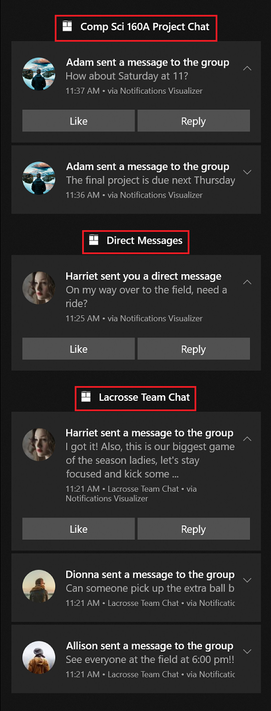

# Grouping toast notifications with collections
Use collections to organize your app's toasts in Action Center. Collections help users locate information within Action Center more easily and allow for developers to better manage their notifications.  The APIs below allow for removing, creating, and updating notification collections.

> [!IMPORTANT]
> **Requires Creators Update**: You must target SDK 15063 and be running build 15063 or later to use toast collections. Related APIs include [Windows.UI.Notifications.ToastCollection](/uwp/api/windows.ui.notifications.toastcollection), and [Windows.UI.Notifications.ToastCollectionManager](/uwp/api/windows.ui.notifications.toastcollectionmanager)

You can see the example below with a messaging app that separates the notifications based on the chat group; each title (Comp Sci 160A Project Chat, Direct Messages, Lacrosse Team Chat) is a separate collection.  Notice how the notifications are distinctly grouped as if they were from a separate app, even though they are all notifications from the same app.  If you are looking for a more subtle way to organize your notifications, see [toast headers](toast-headers.md).  


## Creating collections
When creating each collection, you are required to provide a display name and an icon, which are displayed inside Action Center as part of the collection's title, as shown in the image above. Collections also require a launch argument to help the app navigate to the right location within the app when the collection’s title is clicked on by the user.  

### Create a collection

``` csharp 
// Create a toast collection
public async void CreateToastCollection()
{
	string displayName = "Work Email"; 
	string launchArg = "NavigateToWorkEmailInbox"; 
	Uri icon = new Windows.Foundation.Uri("ms-appx:///Assets/workEmail.png");

	// Constructor
	ToastCollection workEmailToastCollection = new ToastCollection(
		"MyToastCollection", 
		displayName,
 		launchArg, 
		icon);

	// Calls the platform to create the collection
	await ToastNotificationManager.GetDefault().GetToastCollectionManager().SaveToastCollectionAsync(workEmailToastCollection);  								
}
```

## Sending notifications to a collection
We will cover sending notifications from three different toast pipelines: local, scheduled, and push.  For each of these examples we will be creating a sample toast to send with the code immediately below, then we will focus on how to add the toast to a collection via each pipeline.

Construct the toast content:

``` csharp
// Construct the content
var content = new ToastContentBuilder()
	.AddText("Adam sent a message to the group")
	.GetToastContent();
```

### Send a toast to a collection

```csharp
// Create the toast
ToastNotification toast = new ToastNotification(content.GetXml());

// Get the collection notifier
var notifier = await ToastNotificationManager.GetDefault().GetToastNotifierForToastCollectionIdAsync("MyToastCollection");

// And show the toast
notifier.Show(toast);
```

### Add a scheduled toast to a collection

``` csharp
// Create scheduled toast from XML above
ScheduledToastNotification scheduledToast = new ScheduledToastNotification(content.GetXml(), DateTimeOffset.Now.AddSeconds(10));

// Get notifier
var notifier = await ToastNotificationManager.GetDefault().GetToastNotifierForToastCollectionIdAsync("MyToastCollection");
    
// Add to schedule
notifier.AddToSchedule(scheduledToast);
```

### Send a push toast to a collection
For push toasts, you need to add the X-WNS-CollectionId header to the POST message.
```csharp
// Add header to HTTP request
request.Headers.Add("X-WNS-CollectionId", collectionId); 

```

## Managing collections
#### Create the toast collection manager
For the rest of the code snippets in this 'Managing Collections' section we will be using the collectionManager below.
```csharp
ToastCollectionManger collectionManager = ToastNotificationManager.GetDefault().GetToastCollectionManager();
```

#### Get all collections

``` csharp
IReadOnlyList<ToastCollection> collections = await collectionManager.FindAllToastCollectionsAsync();
``` 

#### Get the number of collections created

``` csharp
int toastCollectionCount = (await collectionManager.FindAllToastCollectionsAsync()).Count;
```

#### Remove a collection

``` csharp
await collectionManager.RemoveToastCollectionAsync("MyToastCollection");
```

#### Update a collection
You can update collections by creating a new collection with the same ID and saving the new instance of the collection.
``` csharp
string displayName = "Updated Display Name"; 
string launchArg = "UpdatedLaunchArgs"; 
Uri icon = new Windows.Foundation.Uri("ms-appx:///Assets/updatedPicture.png");

// Construct a new toast collection with the same collection id
ToastCollection updatedToastCollection = new ToastCollection(
	"MyToastCollection", 
	displayName,
	launchArg, 
	icon);

// Calls the platform to update the collection by saving the new instance
await collectionManager.SaveToastCollectionAsync(updatedToastCollection);  								
```
## Managing toasts within a collection
#### Group and tag properties
The group and tag properties together uniquely identify a notification within a collection.  Group (and Tag) serves as a composite primary key (more than one identifier) to identify your notification. For example, if you want to remove or replace a notification, you have to be able to specify *what notification* you want to remove/replace; you do that by specifying the Tag and Group. An example is a messaging app.  The developer could use the conversation ID as the Group, and the message ID as the Tag.

#### Remove a toast from a collection
You can remove individual toasts using the tag and group IDs, or clear all toasts in a collection.
``` csharp
// Get the history
var collectionHistory = await ToastNotificationManager.GetDefault().GetHistoryForToastCollectionAsync("MyToastCollection");

// Remove toast
collectionHistory.Remove(tag, group); 
```

#### Clear all toasts within a collection
``` csharp
// Get the history
var collectionHistory = await ToastNotificationManager.GetDefault().GetHistoryForToastCollectionAsync("MyToastCollection");

// Remove toast
collectionHistory.Clear();
```


## Collections in Notifications Visualizer
You can use the [Notifications Visualizer](notifications-visualizer.md) tool to help design your collections. Follow the steps below:

* Click on the gear icon in the bottom right corner. 
* Select 'Toast collections'.
* Above the preview of the toast, there is a 'Toast Collection' dropdown menu. Select manage collections.
* Click 'Add collection', fill out the details for the collection, and save.
* You can add more collections, or click off of the manage collections box to return to the main screen.
* Select the collection you want to add the toast to from the 'Toast Collection' dropdown menu.
* When you fire the toast, it will be added to the appropriate collection in Action Center.


## Other details
The toast collections that you create will also be reflected in the user's notification settings.  Users can toggle the settings for each individual collection to turn these subgroups on or off.  If notifications are turned off at the top level for the app, then all collections notifications will be turned off as well.  In addition, each collection will by default show 3 notifications in Action Center, and the user can expand it to show up to 20 notifications.

## Related topics

* [Toast content](adaptive-interactive-toasts.md)
* [Toast headers](toast-headers.md)
* [Notifications library on GitHub (part of the Windows Community Toolkit)](https://github.com/windows-toolkit/WindowsCommunityToolkit/tree/master/Microsoft.Toolkit.Uwp.Notifications)