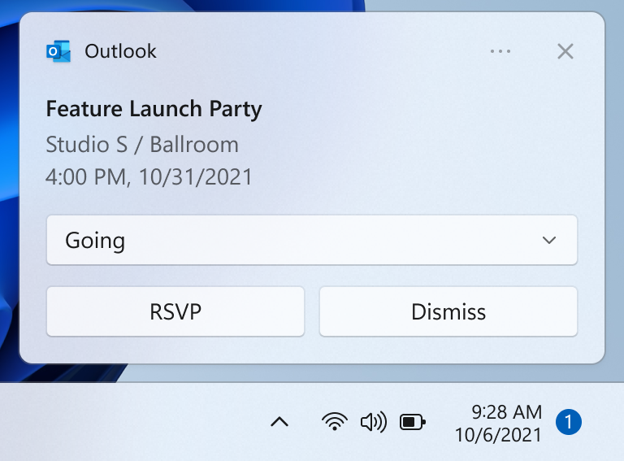
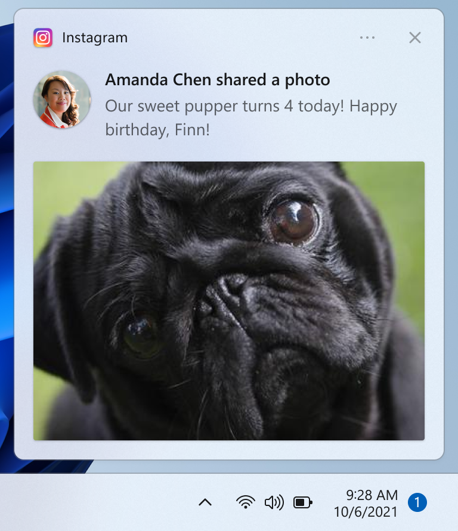
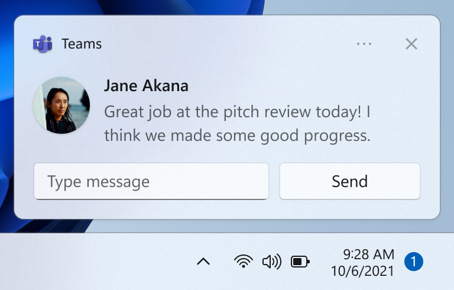
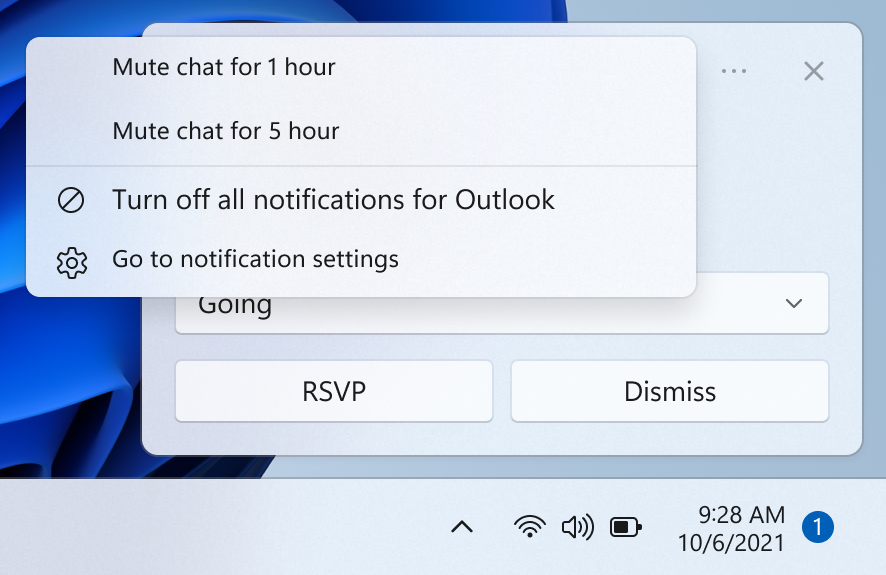
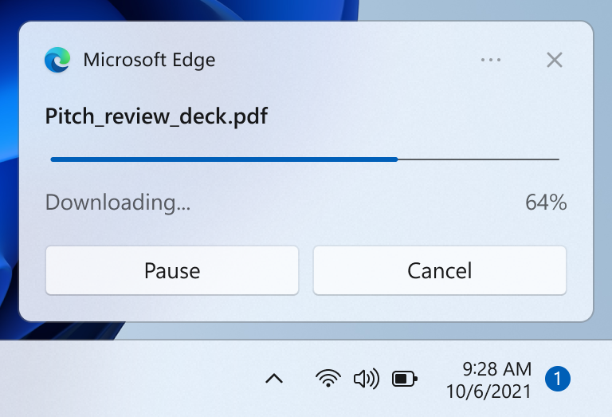
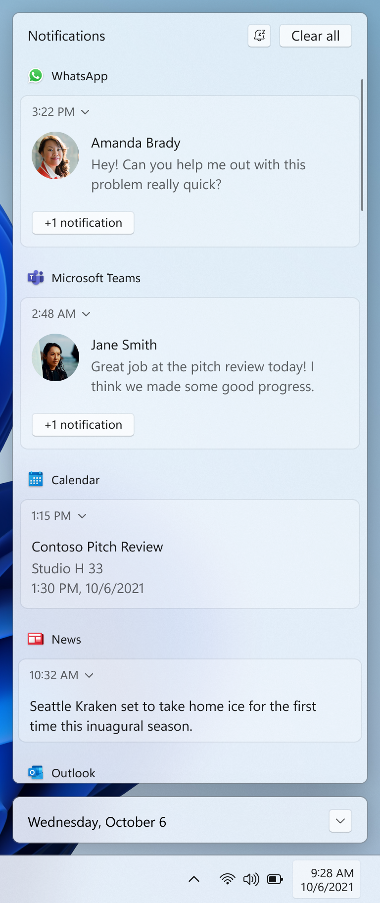

# Notifications design basics
Drive user engagement with your app by providing personalized, actionable, and useful toast notifications. Toast notifications are the Windows notifications that appear in the lower right of the user’s screen and the Notification Center (called Action Center in Windows 10). This article provides design guidance to consider as you plan and implement the toast notification experience for your app.

   
## Notifications should be informative and valuable  

Design your notifications to have clear intent so the user can quickly understand the purpose of the notification and stay in their flow. Consider the user scenarios your toast notifications are enabling and add elements to your notification that are appropriate for each scenario. Notifications should allow the user to save time, but shouldn't distract or create more work.  

### Choose the right notification UI elements 

Consider which UI elements offer the most value to your user scenario. Is the purpose of the notification to allow the user to accomplish a task, or is it simply to get new information? The following section shows some example elements that you can use in your toast notifications. 

:::row:::
    :::column:::

    :::column-end:::
    :::column span="2":::
**Buttons**

Buttons trigger an immediate action. By adding buttons, the user can complete a task within the notification.  
    :::column-end:::
:::row-end:::

:::row:::
    :::column:::

    :::column-end:::
    :::column span="2":::
**Images**

Images can either be [app logo override](adaptive-interactive-toasts.md?tabs=builder-syntax#app-logo-override), [inline](adaptive-interactive-toasts.md?tabs=builder-syntax#inline-image), or [hero](adaptive-interactive-toasts.md?tabs=builder-syntax#hero-image). By adding images, the user can parse your content more quickly. Examples include adding an app logo override image depicting the sender’s profile image to a chat or email notification.  
    :::column-end:::
:::row-end:::

:::row:::
    :::column:::

    :::column-end:::
    :::column span="2":::
**Quick replies**

Quick reply boxes enable users to respond to messages without opening the app. Examples include adding quick reply boxes to a chat notification.
    :::column-end:::
:::row-end:::

:::row:::
    :::column:::

    :::column-end:::
    :::column span="2":::
**Context menu buttons**

Context menu buttons give users more options on right-click on the notification or upon selection of the context menu icon. An example scenario is adding an option to mute a group chat for an hour. 
    :::column-end:::
:::row-end:::

:::row:::
    :::column:::

    :::column-end:::
    :::column span="2":::
**Progress bars**

Progress bars communicate status of long-running operations. By adding a progress bar, the user doesn’t have to check back in your app for updates. Examples include communicating a file download or game update with a progress bar notification. 
    :::column-end:::
:::row-end:::

To see all of the UI elements that can be used in a notification, see [Toast content](adaptive-interactive-toasts.md).

## Notifications should not be noisy  

Users can easily be overloaded with too much information and get frustrated if they are being interrupted while they are trying to focus. Too many interruptions leads to users turning off this critical communication channel for your app.   

- One method of not interrupting the user but still communicating valuable information is by suppressing the notification, meaning the notification is automatically placed directly into the Notification Center without an alert. 
- On Windows 11, Focus Sessions allow users to suppress extraneous notifications. You can use the [FocusSessionManager](/uwp/api/windows.ui.shell.focussessionmanager) API to detect if the user is in a Focus Session and adjust your app’s notification behavior accordingly.  

## Respond to the user’s intent 

Just like the design of your notification UI, the behavior when the user clicks on the notification or on UI elements within the notification should be deliberate and consistent, and should engage the user in a clear task or scenario.

- If the user clicks on your notification to launch it, your app should launch in the notification’s context.  
- If the user clicks on a button in your notification, your app should launch in the context that is appropriate for the button’s action 
    - However, if the action is intended to be a background task, such as quick reply, your app should not launch.   

## Provide a consistent Notification Center experience

:::row:::
    :::column:::

    :::column-end:::
    :::column span="2":::
        The Notification Center allows the user to view and respond to notifications after they have been displayed, or in the case of silent notifications, after they have been received but not displayed. It's important to keep Notification Center tidy by clearing out old notifications. You should also be sure to provide a consistent experience when removing notifications so the user feels confident they aren't missing information. Following standard conventions for notification removal makes the notification experience predictable and intuitive for users. 
        
        The following are some example scenarios that illustrate strategies for clearing out old notifications from Notification Center: 
        
        - The user receives 10 new emails, and thus 10 new notifications. The user goes to the email app and views 10 emails, without interacting with the 10 notifications. After the user views the 10 emails, the email app removes the 10 notifications from the Notification Center. This also applies if the user has viewed the 10 emails elsewhere, such as their phone or website. 
        - The user receives 10 new chat messages from one user, and thus 10 new notifications. The user selects one of these chat notifications, which launches the chat. After the user views the chat, the app removes the 9 remaining notifications from the Notification Center.   
    :::column-end:::
:::row-end:::

## Related articles

[Developer guidance for notifications](send-local-toast.md)