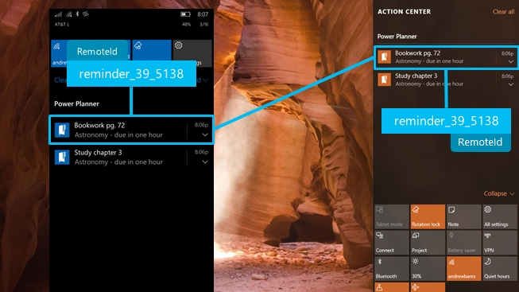

# Universal Dismiss

Universal Dismiss, powered by Action Center in the Cloud, means that when you dismiss a notification from one device, the same notification on your other devices is also dismissed.

> [!IMPORTANT]
> **Requires Anniversary Update**: You must target SDK 14393 and be running build 14393 or higher to use Universal Dismiss.

The common example of this scenario is calendar reminders... you have a calendar app on both of your devices... you get a reminder on your phone and desktop... you click dismiss on your desktop... thanks to Universal Dismiss, the reminder on your phone is also dismissed! **Enabling Universal Dismiss only requires one line of code!**


In this scenario, the key fact is that **the same app is installed on multiple devices**, meaning that **each device is already receiving notifications**. A calendar app is the iconic example, since you typically have the same calendar app installed on both your Windows PC and your phone, and each instance of the app already sends you reminders on each device. By adding support for Universal Dismiss, those instances of the same reminders can be linked across devices.


## How to enable Universal Dismiss

As a developer, enabling Universal Dismiss is extremely easy. You simply need to provide an ID that allows us to link each notification across devices, so that when the user dismisses a notification from one device, the corresponding linked notification is dismissed from the other device.



> **RemoteId**: An identifier that uniquely identifies a notification *across devices*.

t only takes one line of code to add RemoteId, enabling support for Universal Dismiss! How you generate your RemoteId is up to you - however, you need to make sure that it uniquely identifies your notification across devices, and that the same identifier can be generated from different instances of your app running on different devices.

For example, in my homework planner app, I generate my RemoteId by saying that it is of type "reminder", and then I include the online account ID and the online identifier of the homework item. I can consistently generate the exact same RemoteId, regardless of which device is sending the notification, since these online IDs are shared across the devices.

```csharp
var toast = new ScheduledToastNotification(content.GetXml(), startTime);
 
// If the RemoteId property is present
if (ApiInformation.IsPropertyPresent(typeof(ScheduledToastNotification).FullName, nameof(ScheduledToastNotification.RemoteId)))
{
    // Assign the RemoteId to add support for Universal Dismiss
    toast.RemoteId = $"reminder_{account.AccountId}_{homework.Identifier}"
}
  
ToastNotificationManager.CreateToastNotifier().AddToSchedule(toast);
```

The following code runs on both my phone and desktop app, meaning that the notification on both devices will have the same RemoteId.

That's all you have to do! When the user dismisses (or clicks on) a notification, we'll check if it has a RemoteId, and if so, we'll fan out a dismiss of that RemoteId across all the user's devices.

**Known Issue**: Retrieving the **RemoteId** via the `ToastNotificationHistory.GetHistory()` API's will always return empty string rather than the **RemoteId** you specified. Don't worry, everything is functional - it's only retrieving the value that's broken.

> [!NOTE]
> If the user or enterprise disables [notification mirroring](notification-mirroring.md) for your app (or completely disables notification mirroring), then Universal Dismiss will not work, since we do not have your notifications in the cloud.


## Supported devices

Since the Anniversary Update, Universal Dismiss is supported on Windows Mobile and Windows Desktop. Universal Dismiss works both directions, between PC-PC, PC-Phone, and Phone-Phone.