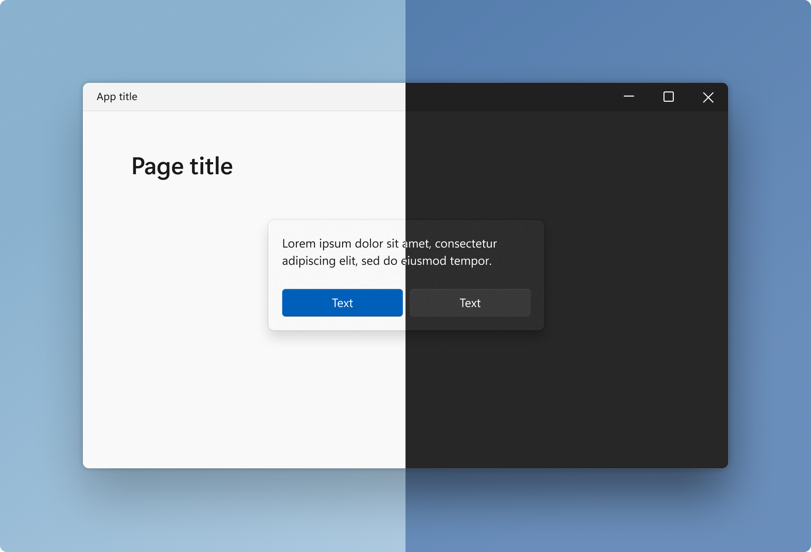
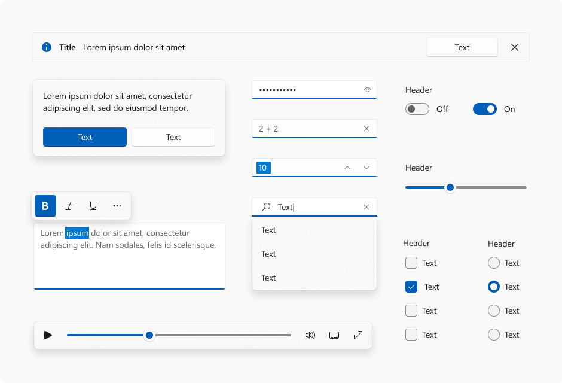
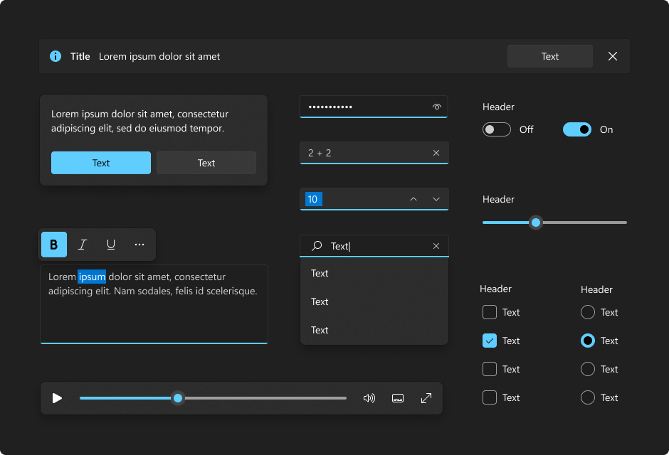

# Color in Windows 11

Windows 11 employs color to help users focus on their tasks by indicating a visual hierarchy and structure between user interface elements. Color is context appropriate and used to provide a calming foundation, subtly enhancing user interactions and emphasizing significant items only when necessary.

## Color Modes

Windows 11 supports two color modes: light and dark. Each mode consists of a set of neutral color values that are automatically adjusted to ensure optimal contrast.

In both light and dark color modes, darker colors indicate background surfaces of less importance. Important surfaces are highlighted with lighter and brighter colors. See [layering & elevation](layering.md) for more information.

## Accent color

:::row:::
    :::column:::
        
    :::column-end:::
    :::column:::
        
    :::column-end:::
:::row-end:::

Accent color is used to emphasize important elements in the user interface and to indicate the state of an interactive object or control. Accent color values are generated automatically and optimized for contrast in both light and dark modes. Accent colors are used sparingly to highlight important elements and convey information about an interactive element's state.

## Examples

> [!TIP]
> [!div class="nextstepaction"]
> [Open the WinUI 3 Gallery app and see Color principles in action](winui3gallery:/item/Colors).

> The **WinUI 3 Gallery** app includes interactive examples of most WinUI 3 controls, features, and functionality. Get the app from the [Microsoft Store](https://www.microsoft.com/store/productId/9P3JFPWWDZRC) or get the source code on [GitHub](https://github.com/microsoft/WinUI-Gallery)
