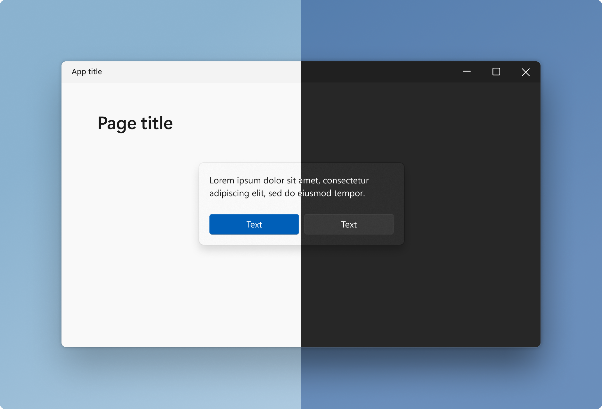
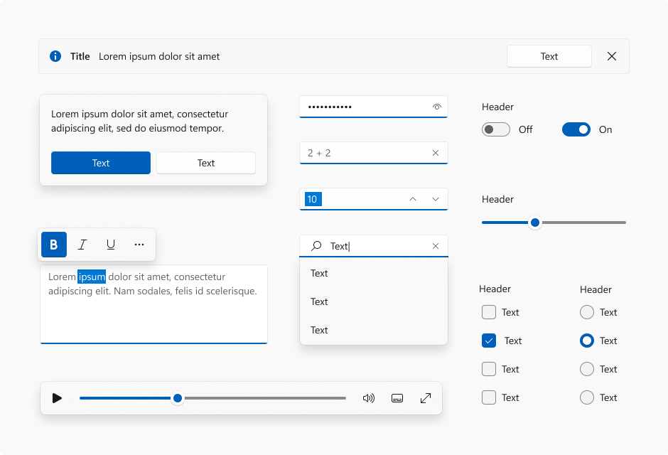
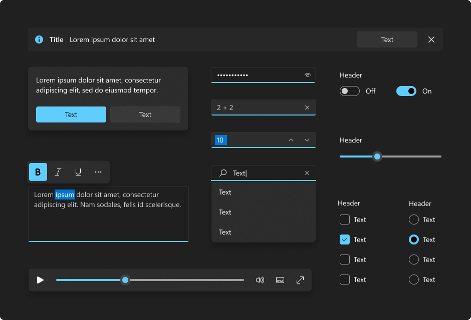

# Color in Windows

Windows employs color to help users focus on their tasks by indicating a visual hierarchy and structure between user interface elements. Color is context appropriate and used to provide a calming foundation, subtly enhancing user interactions and emphasizing significant items only when necessary.

> [!TIP]
> This article describes how the [Fluent Design language](https://fluent2.microsoft.design/) is applied to Windows apps. For more information, see [**Fluent Design - Color**](https://fluent2.microsoft.design/color).

## Color modes and themes

Windows supports two color modes, or themes: light and dark. Each mode consists of a set of neutral color values that are automatically adjusted to ensure optimal contrast. Windows apps can use a light or dark application theme, which affects the colors of the app's background, text, icons, and [common controls](../../develop/ui/controls/index.md).

In both light and dark color modes, darker colors indicate background surfaces of less importance. Important surfaces are highlighted with lighter and brighter colors. See [layering & elevation](layering.md) for more information.

By default, your Windows app's theme is the user's theme preference from Windows Settings or the device's default theme. However, you can set the theme specifically for your app. To learn how to change themes, use theme brushes, and customize accent colors in code, see [Theming in Windows apps](../../develop/ui/theming.md).

## Accent color

:::row:::
    :::column:::
        
    :::column-end:::
    :::column:::
        
    :::column-end:::
:::row-end:::

Accent color is used to emphasize important elements in the user interface and to indicate the state of an interactive object or control. Accent color values are generated automatically and optimized for contrast in both light and dark modes. Accent colors are used sparingly to highlight important elements and convey information about an interactive element's state.

## Examples

> [!div class="nextstepaction"]
> [Open the WinUI 3 Gallery app and see Color principles in action](winui3gallery://item/Color)

[!INCLUDE [winui-3-gallery](../../../includes/winui-3-gallery.md)]

## Color principles

:::row:::
    :::column:::
**Use color meaningfully.**
When color is used sparingly to highlight important elements, it can help create a user interface that is fluid and intuitive.
    :::column-end:::
    :::column:::
**Use color to indicate interactivity.**
It's a good idea to choose one color to indicate elements of your application that are interactive. For example, many web pages use blue text to denote a hyperlink.
    :::column-end:::
:::row-end:::

:::row:::
    :::column:::
**Color is personal.**
In Windows, users can choose an accent color and a light or dark theme, which are reflected throughout their experience. You can choose how to incorporate the user's accent color and theme into your application, personalizing their experience.
    :::column-end:::
    :::column:::
**Color is cultural.**
Consider how the colors you use will be interpreted by people from different cultures. For example, in some cultures the color blue is associated with virtue and protection, while in others it represents mourning.
    :::column-end:::
:::row-end:::

## Usability

:::row:::
    :::column:::

    :::column-end:::
    :::column span="2":::
**Contrast**

Make sure that elements and images have sufficient contrast to differentiate between them, regardless of the accent color or theme.

When considering what colors to use in your application, accessibility should be a primary concern. Use the guidance below to make sure your application is accessible to as many users as possible.
    :::column-end:::
:::row-end:::

:::row:::
    :::column:::

    :::column-end:::
    :::column span="2":::
**Lighting**

Be aware that variation in ambient lighting can affect the usability of your app. For example, a page with a black background might unreadable outside due to screen glare, while a page with a white background might be painful to look at in a dark room.
    :::column-end:::
:::row-end:::

:::row:::
    :::column:::

    :::column-end:::
    :::column span="2":::
**Colorblindness**

Be aware of how colorblindness could affect the usability of your application. For example, a user with red-green colorblindness will have difficulty distinguishing red and green elements from each other. About **8 percent of men** and **0.5 percent of women** are red-green colorblind, so avoid using these color combinations as the sole differentiator between application elements.
    :::column-end:::
:::row-end:::

## Related

- [Theming in Windows apps](../../develop/ui/theming.md)
- [XAML Styles](../../develop/platform/xaml/xaml-styles.md)
- [XAML Theme Resources](../../develop/platform/xaml/xaml-theme-resources.md)
- [WinUI 3 Gallery - Colors](winui3gallery://item/Colors)
