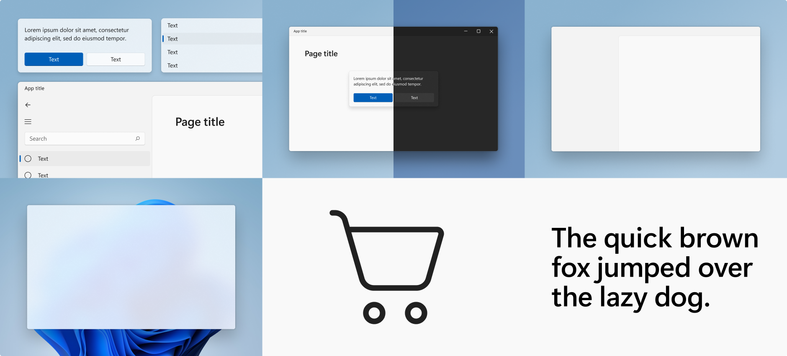

# Windows 11 design principles

Windows 11 marks a visual evolution of the operating system. We have evolved our design language alongside with Fluent to create a design which is human, universal and truly feels like Windows.

The design principles below have guided us throughout the journey of making Windows the best-in-class implementation of Fluent.

## Effortless

Windows 11 is faster and more intuitive. It's easy to do what I want, with focus and precision.

## Calm

Windows 11 is softer and decluttered; it fades into the background to help me stay calm and focused. The experience feels warm, ethereal and approachable.

## Personal

Windows 11 adapts seamlessly to the way I use my device. It bends and flexes to my individual needs and preferences so that I can truly express myself.

## Familiar

Windows 11 balances a new, refreshed look and feel with the familiarity of the Windows I already know. There is no learning curve; I can pick it up and go.

## Complete + Coherent

Windows 11 offers a visually seamless experience across platforms. I can work in many platforms and still have a consistent Windows experience.
