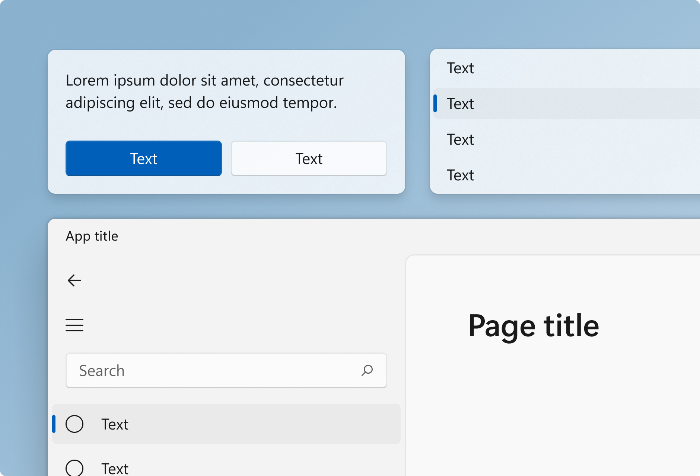
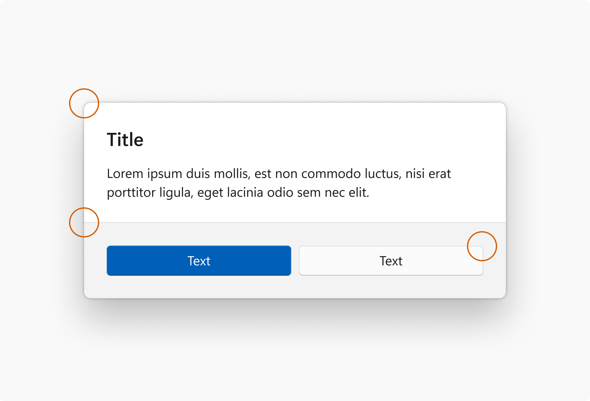
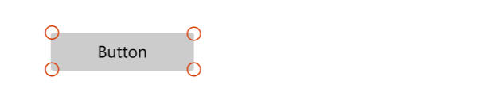
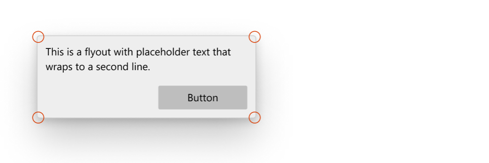
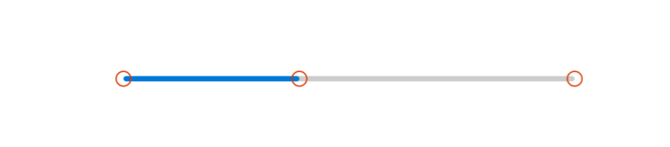
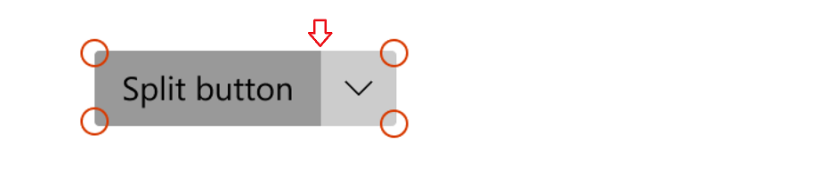
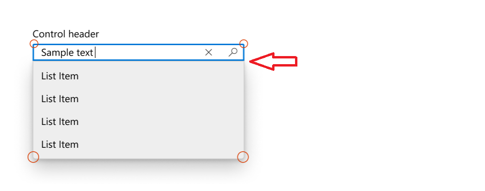

# Geometry in Windows

Geometry describes the shape, size and position of UI elements on screen. These fundamental design elements help experiences feel coherent across the entire design system.

Windows geometry has been crafted to support modern app experiences. Progressively rounded corners, nested elements, and consistent gutters combine to create a soft, calm, and approachable effect that emphasizes unity of purpose and ease of use.

> [!TIP]
> This article describes how the [Fluent Design language](https://fluent2.microsoft.design/) is applied to Windows apps. For more information, see [**Fluent Design - Shapes**](https://fluent2.microsoft.design/shapes).

## Rounded corners

Windows 11 applies rounded corners to all top-level app windows. The same applies to most common controls such as Button and ListView.

Windows 11 uses three levels of rounding depending on what UI component is being rounded and how that component is arranged relative to neighboring elements.

| Corner radius | Usage                     |
|---------------|---------------------------|
| 8px           | Top-level containers such as app windows, flyouts and dialogs are rounded using an 8px corner radius. |
| 4px           | In-page elements such as buttons and list backplates are rounded using a 4px corner radius.           |
| 0px           | Straight edges that intersect with other straight edges are not rounded.                              |
| 0px           | Window corners are not rounded when windows are snapped or maximized.                                 |

### Rectangle UI elements

Standard controls that users see on screen at all times use a **4px** corner radius. This includes controls like Button, CheckBox, ComboBox, TextBox, and ListView.

### Flyout and overlay UI elements

Transient UI elements that appear temporarily on screen, or overlay other UI, use an **8px** corner radius. This includes elements like ContentDialog, Flyout, MenuFlyout, and TeachingTip. ToolTip is an exception, using **4px** due to its small size.

### Bar elements

UI elements shaped like bars or lines use a **4px** corner radius. This includes controls like ProgressBar, ScrollBar, and Slider.

### When not to round

There are instances where the corner of a control should not be rounded, and we don't round these by default.

- When multiple UI elements that are housed inside a container touch each other, such as the two parts of a SplitButton. There should be no space when they contact.

- When a flyout UI element is connected to a UI that invokes the flyout on one side.

## Customizing corner radius

The default corner radii are controlled by two global resources: `ControlCornerRadius` (default 4px) and `OverlayCornerRadius` (default 8px). You can override these values in your App.xaml to change the rounding across all controls in your app.

If you're building a Win32 desktop app, you can opt in to rounded corners for your app windows using the DWM API. For details, see [Apply rounded corners in desktop apps](../../desktop/modernize/ui/apply-rounded-corners.md).

