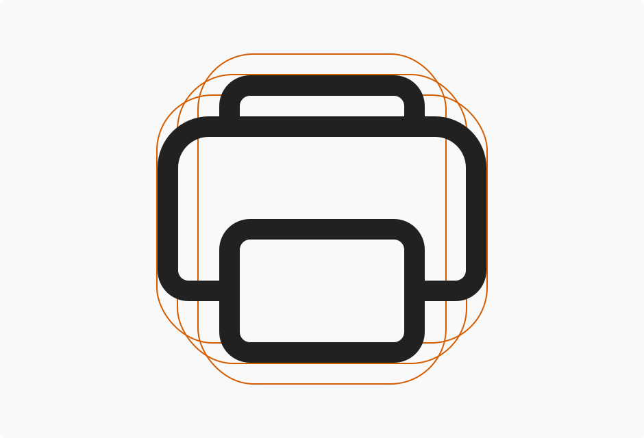

# Iconography in Windows 11

Iconography is a set of visual images and symbols that help users understand and move through your app. Icons are used throughout the user interface as visual metaphors that represent a concept, action, or status.

Windows 11 uses three types of icons: application, system, and file type. This article focuses on the first two.

## Application icons

Application icons represent your app in the Windows shell. They're primarily used to open your application, but they also represent your app wherever it appears in the Windows shell.

App icons should represent your app's core functionality through a metaphor. For more information about designing and constructing your app's icon, see [Iconography in Windows](../style/iconography/overview.md).

## System icons

Windows 11 introduces a new system icon font, [Segoe Fluent Icons](..\downloads\index.md#fonts). This new font complements [geometry](geometry.md) in Windows 11.

All glyphs in Segoe Fluent Icons are drawn in a monoline style. That means they're created through a single stroke of 1 epx.

Glyphs in Segoe Fluent Icons follow three aesthetic principles:

- **Minimal**: Glyphs contain only the details that are necessary to communicate the concept.
- **Harmonious**: Glyphs are based on simple and geometric forms.
- **Evolved**: Glyphs use modern metaphors that are easily understood.

### Sizing

Font metrics for Segoe Fluent Icons match how designers and developers are accustomed to working with SVG and bitmap icons.

Each font glyph is designed so that the footprint of the icon area is a square em. An icon with a 16-epx font size is the equivalent of a 16x16-epx icon, to make sizing and positioning more predictable.

### Anatomy

You can visually construct system icon glyphs by combining a base icon with a modifier icon.

_Base icons_ are the main element of a visual metaphor. Base elements should occupy the entire icon footprint.

_Modifier icons_ modify the meaning of the base icon. Modifier elements should be placed in one of the bottom quadrants of the icon footprint.

:::row:::
    :::column:::
        
    :::column-end:::
    :::column span="3":::
        **Base icon only** 
        On its own, the paper sheet icon communicates the concept of a _file_.
    :::column-end:::
:::row-end:::
:::row:::
    :::column:::
        
    :::column-end:::
    :::column span="3":::
        **Base icon + modifier icon** 
        Adding an up arrow to the file icon changes the meaning of the icon to represent an _uploaded file_.
    :::column-end:::
:::row-end:::

### Layering

Icon layering is a technique that you use to overlap two glyphs. We recommend using icon layering to create a different state of the same icon (for example, an active or selected state).

### Localization

Understand the cultural connotations of symbols. Although iconography doesn't require localization in most cases, certain icons might be acceptable in one culture but not in another. Validate your iconography choices with the context in which you'll use them.

## Examples

> [!TIP]
> [!div class="nextstepaction"]
> [Open the WinUI 3 Gallery app and see Iconography principles in action](winui3gallery:/item/Icons).
> The **WinUI 3 Gallery** app includes interactive examples of most WinUI 3 controls, features, and functionality. Get the app from the [Microsoft Store](https://www.microsoft.com/store/productId/9P3JFPWWDZRC) or get the source code on [GitHub](https://github.com/microsoft/WinUI-Gallery)
