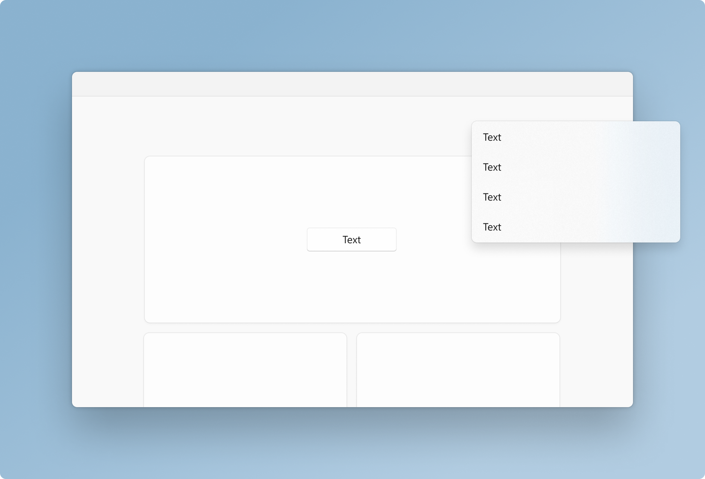
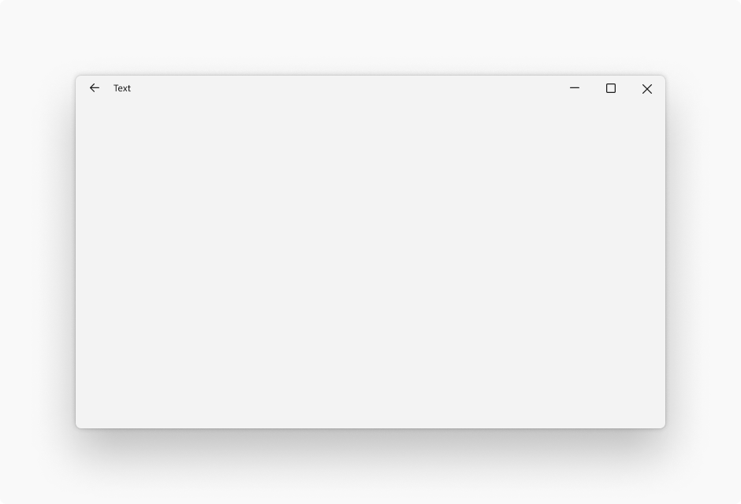
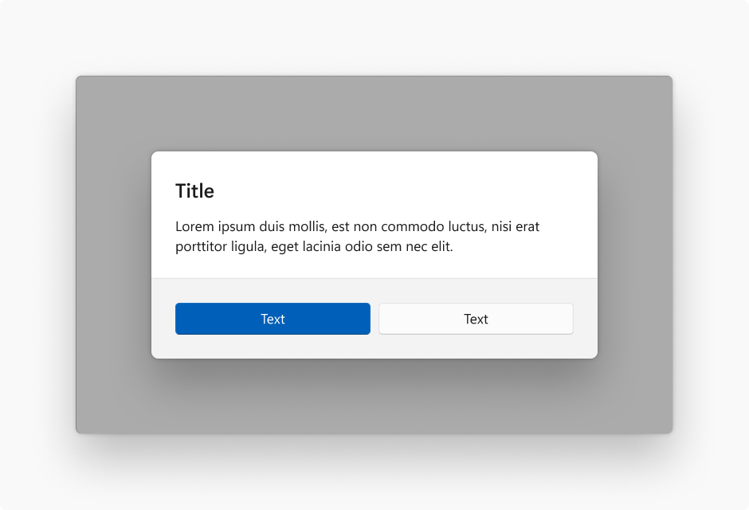
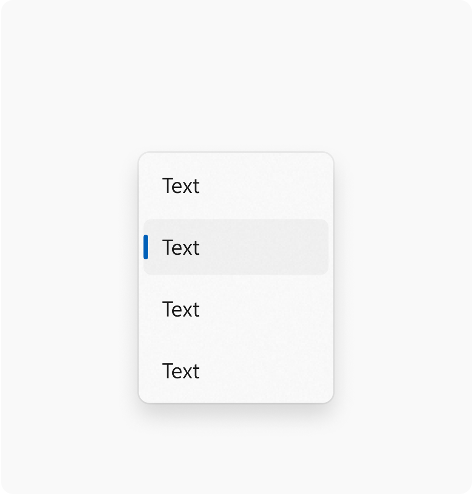
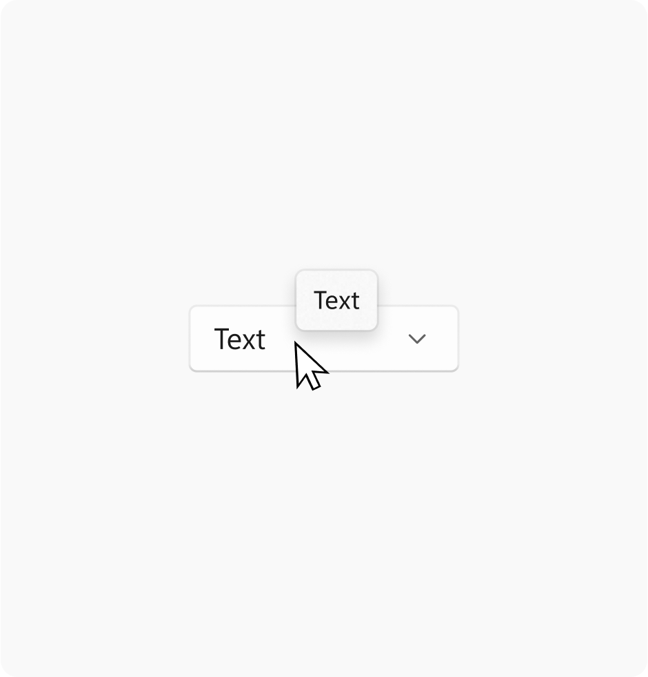
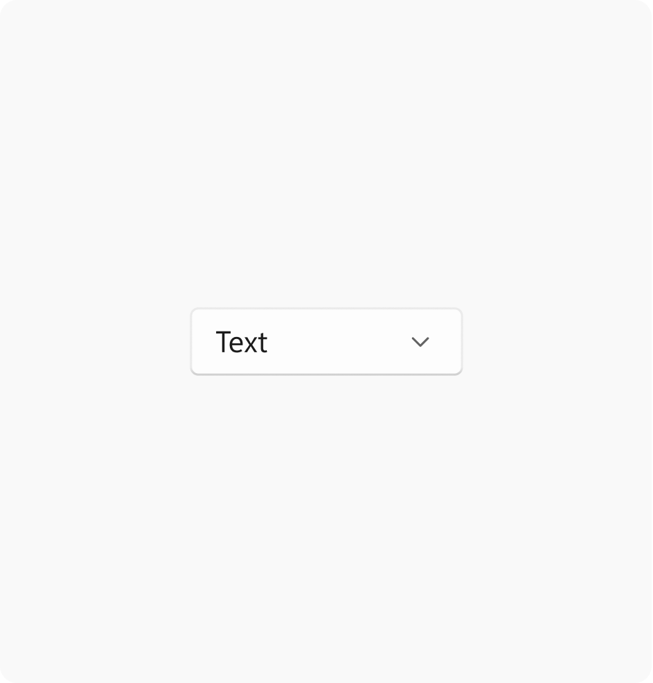
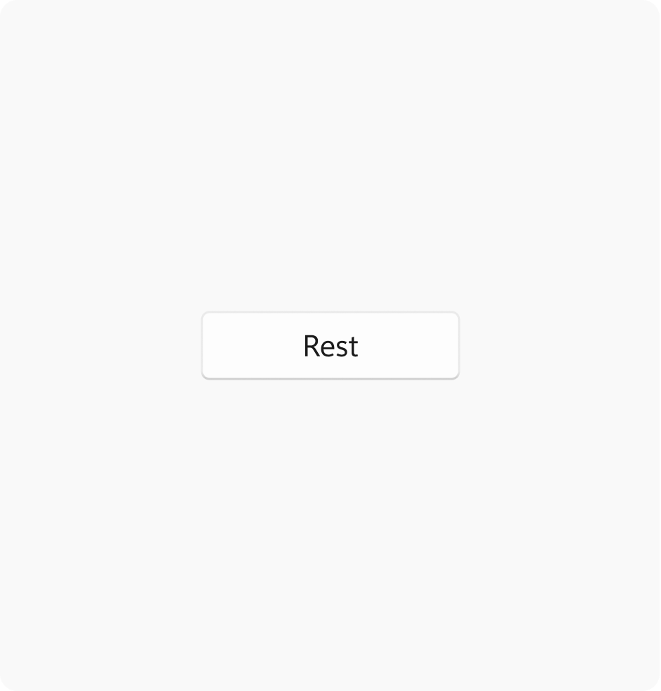
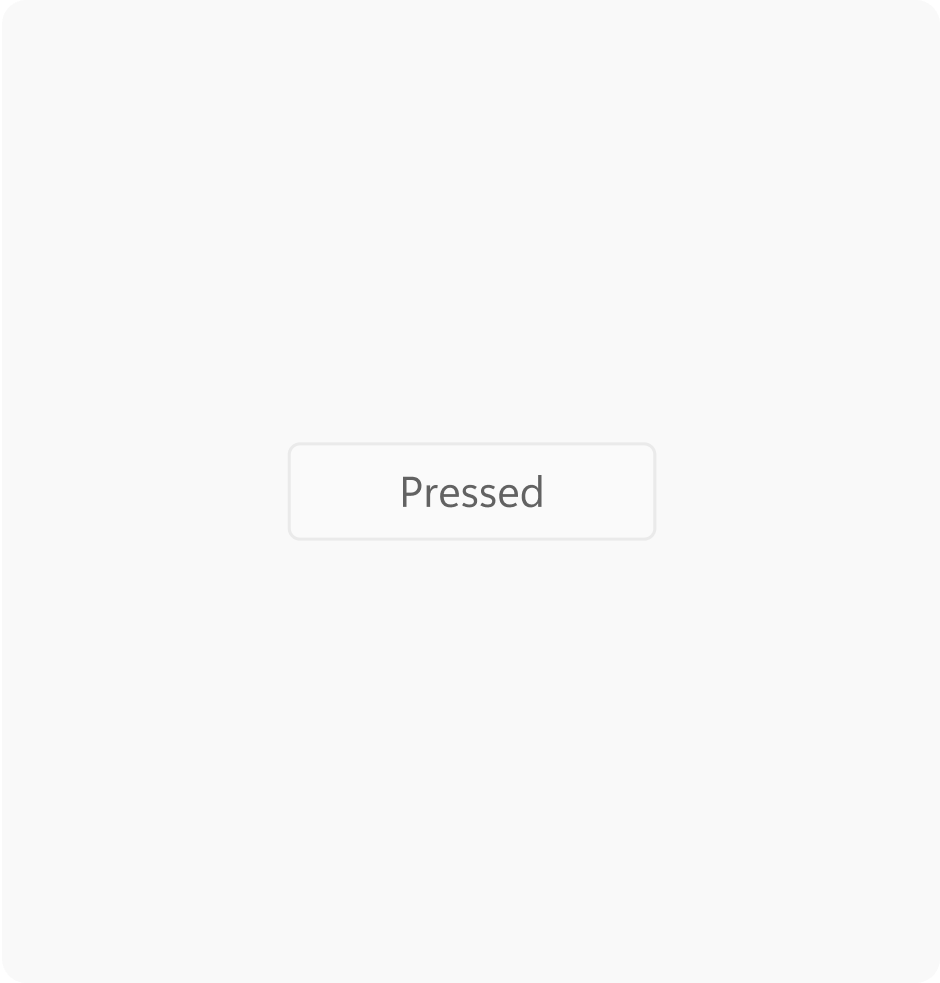

# Layering and elevation in Windows 11

Windows 11 uses layering and elevation as its foundation for app hierarchy. Hierarchy communicates important information about how to navigate within an app while keeping the user's attention focused on the most important content. Layering and elevation are powerful visual cues that modernize experiences and help them feel coherent within Windows.

## Layering

:::row:::
    :::column:::
        
    :::column-end:::
    :::column:::
        
    :::column-end:::
:::row-end:::

Layering is the concept of overlapping one surface with another, creating two or more visually distinguished areas within the same application.  

> [!NOTE]
> Layering in Windows 11 is tightly coupled with the use of materials. Please reference the [materials section](materials.md) for specific guidance on how those are applied.

Windows 11 uses a two-layer system for applications. These two layers create hierarchy and provide clarity, keeping users focused on what's most important.

- The **base** layer is an app's foundation. It is the bottommost layer of every app, and contains controls related to app menus, commands, and navigation.
- The **content** layer focuses the user on the app's central experience. The content layer may be on contiguous element, or separated into cards that segment content.

## Elevation

Elevation is the depth component of the spatial relationship one surface has to another with respect to their position on the desktop. When two or more objects occupy the same location on the screen, only the object with the highest elevation will be rendered at that location.

Shadows and contour (outlines) are used on controls and surfaces to subtly communicate an object's elevation, and to help draw focus where needed within an experience. Windows 11 uses the following values to express elevation with shadow and contour.

:::row:::
    :::column:::
        
    :::column-end:::
    :::column span="":::
        **Window** Elevation value: 128 Stroke width: 1
    :::column-end:::
:::row-end:::

:::row:::
    :::column:::
        
    :::column-end:::
    :::column span="1":::
        **Dialog** Elevation value: 128 Stroke width: 1
    :::column-end:::
:::row-end:::

:::row:::
    :::column:::
        
    :::column-end:::
    :::column span="1":::
        **Flyout** Elevation value: 32 Stroke width: 1
    :::column-end:::
:::row-end:::

:::row:::
    :::column:::
        
    :::column-end:::
    :::column span="1":::
        **Tooltip** Elevation value: 16 Stroke width: 1
    :::column-end:::
:::row-end:::

:::row:::
    :::column:::
        
    :::column-end:::
    :::column span="1":::
        **Card** Elevation value: 8 Stroke width: 1
    :::column-end:::
:::row-end:::

:::row:::
    :::column:::
        
    :::column-end:::
    :::column span="1":::
        **Control** Elevation value: 2 Stroke width: 1
    :::column-end:::
:::row-end:::

:::row:::
    :::column:::
        
    :::column-end:::
    :::column span="1":::
        **Layer** Elevation value: 1 Stroke width: 1
    :::column-end:::
:::row-end:::

Controls in Windows 11 vary their elevation and contour to indicate state. The intensity of the rendered shadow changes depending on the theme at parity of value.

:::row:::
    :::column:::
        
    :::column-end:::
    :::column span="1":::
        **Rest** Elevation value: 2 Stroke width: 1
    :::column-end:::
:::row-end:::

:::row:::
    :::column:::
        
    :::column-end:::
    :::column span="1":::
        **Hover** Elevation value: 2 Stroke width: 1
    :::column-end:::
:::row-end:::

:::row:::
    :::column:::
        
    :::column-end:::
    :::column span="1":::
        **Pressed** Elevation value: 1 Stroke width: 1
    :::column-end:::
:::row-end:::
