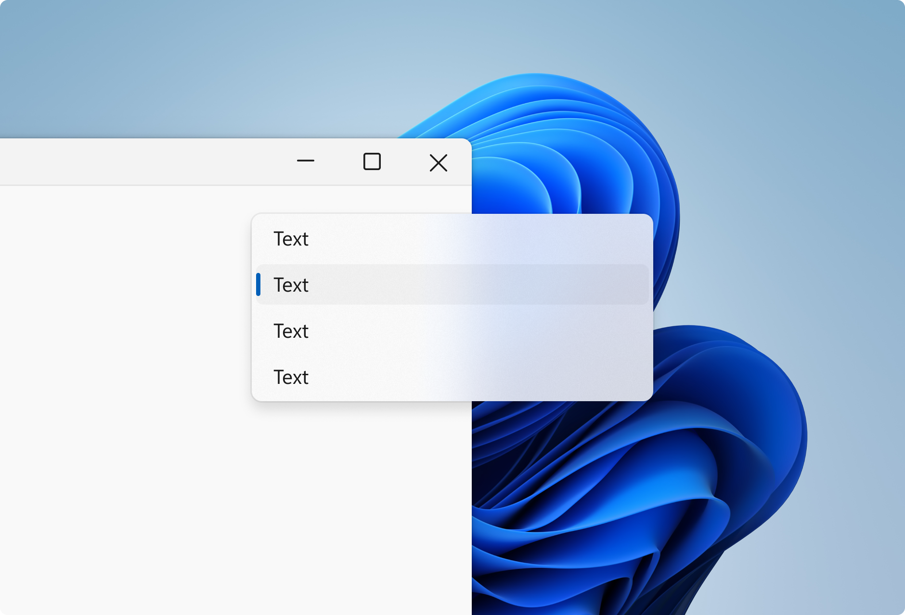
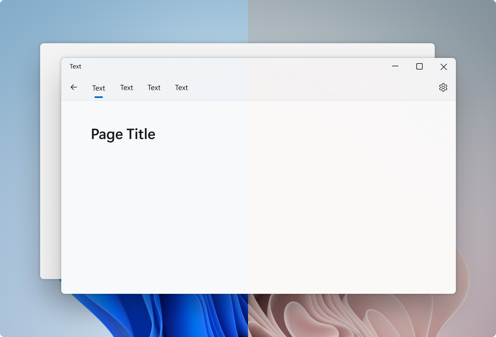
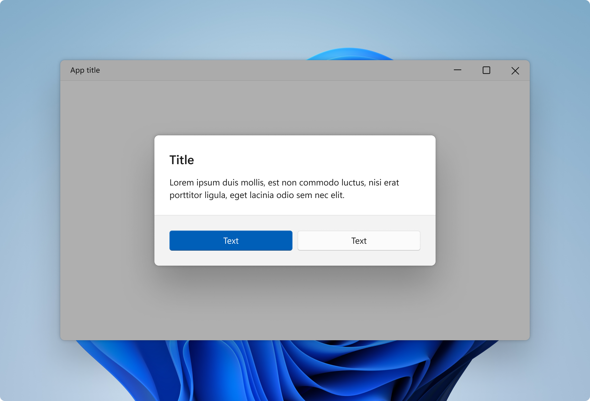

# Materials in Windows 11

Materials are visual effects applied to UX surfaces that resemble real life artifacts. Windows 11 uses two primary types of materials: occluding and transparent. Occluding materials, like acrylic and mica, are used as base layers beneath interactive UI controls. Transparent materials such as smoke are used to highlight immersive surfaces.

Mica, Acrylic and Smoke each have a specific purpose in how they are used throughout Windows.

## Acrylic

Acrylic is a semi-transparent material that replicates the effect of frosted glass. In Windows 11, acrylic has been updated to be brighter and more translucent, allowing for a stronger contextual relationship with the visuals behind it. Acrylic is used only for transient, light-dismiss surfaces such as flyouts and context menus.

Acrylic is mode aware; it supports both light and dark mode.

## Mica

Mica is a new opaque material introduced in Windows 11. Mica surfaces are subtly tinted with the user's desktop background color.

Mica is mode aware; it supports both light and dark modes. Mica also indicates window focus with active and inactive states as a built in feature.

## Smoke

Smoke emphasizes an important UI surface by dimming the surfaces beneath so that they recede into the background. Smoke is used to signal blocking interaction below a modal UI such as a dialog.

Smoke is not mode aware; it is always translucent black in both light and dark mode.
