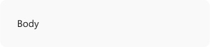

# Typography in Windows 11

As the visual representation of language, typography's main task is to communicate information. The Windows 11 type system helps you create structure and hierarchy in your content in order to maximize legibility and readability in your UI.

[Segoe UI Variable](..\downloads\index.md#fonts) is the new system font for Windows. It is a refreshed take on the classic Segoe and uses variable font technology to dynamically provide great legibility at very small sizes, and improved outlines at display sizes.

## Metrics

https://github.com/MicrosoftDocs/windows-dev-docs/blob/docs/hub/apps/design/signature-experiences/typography.md
### Weights

| Weight name   | Weight axis value | Visual |
|---------------|:-----------------:|--------|
| **Light**     | 300               |  |
| **Semilight** | 350               |  |
| **Regular**   | 400               |  |
| **Semibold**  | 600               |  |
| **Bold**      | 700               |  |

### Optical axis

Segoe UI Variable supports two axes: **weight** and **optical size**. The weight axis is incremental, while the optical size axis is automatic and on by default. The optical size axis controls the shape and size of the counters in the font, to prioritize legibility at the small sizes and personality at the large sizes.

## Using Segoe Fluent Variable

### Type ramp

Windows 11 uses the following values for various types of text in the UI.

| Example                                                           | Weight           | Size/line height |
|-------------------------------------------------------------------|------------------|------------------|
| | Small            | 12/16 epx        |
|  | Text             | 14/20 epx        |
| | Text semibold    | 14/20 epx        |
| | Text             | 18/24 epx        |
| | Display semibold | 20/28 epx        |
| | Display semibold | 28/36 epx        |
| | Display semibold | 40/52 epx        |
| | Display semibold | 68/92 epx        |

## Typography best practices in Windows 11

Windows 11 uses Segoe UI Variable with the following attributes based on the context in which the text is being displayed.

| Attribute          | Value                       | Notes       |
|--------------------|-----------------------------|-------------|
| **Weight**         | Regular, Semibold           | Use regular weight for most text, use Semibold for titles |
| **Alignment**      | Left, Center                | Align left by default, Align center only in rare cases such as text below icons |
| **Minimum values** | 14px Semibold, 12px Regular | Text smaller than these sizes and weights are illegible in some languages |
| **Casing**         | Sentence case               | Use sentence casing for all UI text, including titles |
| **Truncation**     | Ellipses and clipping       | Use ellipses in most cases; clipping is only used in rare cases |

## Examples

> [!TIP]
> [!div class="nextstepaction"]
> [Open the WinUI 3 Gallery app and see Typography principles in action](winui3gallery:/item/Typography).

> The **WinUI 3 Gallery** app includes interactive examples of most WinUI 3 controls, features, and functionality. Get the app from the [Microsoft Store](https://www.microsoft.com/store/productId/9P3JFPWWDZRC) or get the source code on [GitHub](https://github.com/microsoft/WinUI-Gallery)
