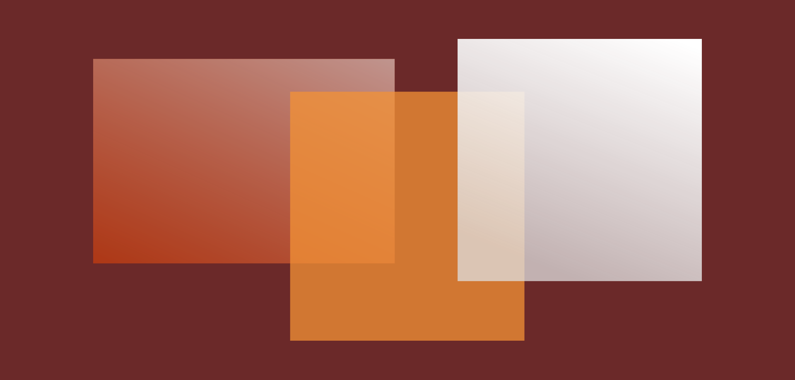
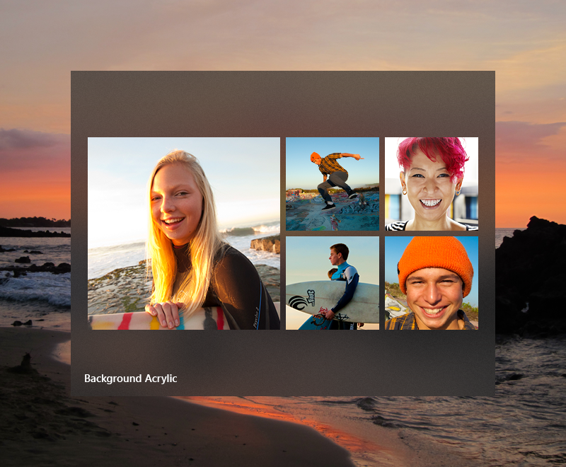
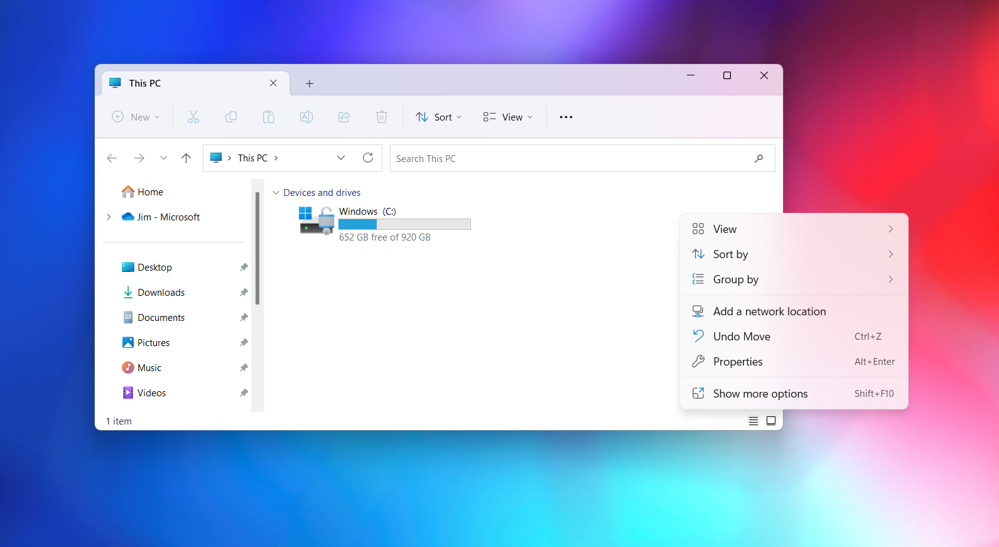
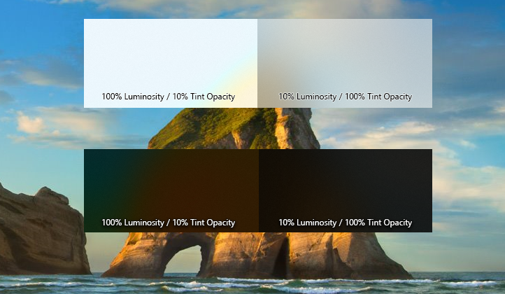
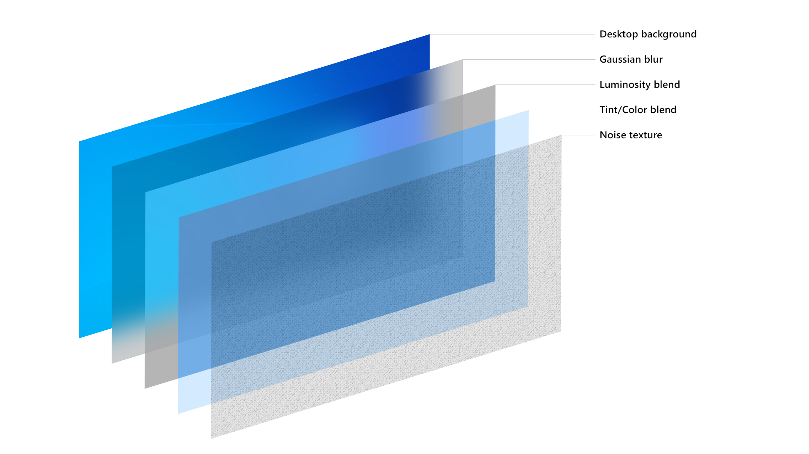

# Acrylic material



Acrylic is a type of [Brush](/windows/windows-app-sdk/api/winrt/microsoft.ui.xaml.media.brush) that creates a translucent texture. You can apply acrylic to app surfaces to add depth and help establish a visual hierarchy.

> **Important APIs**: [AcrylicBrush class](/windows/windows-app-sdk/api/winrt/microsoft.ui.xaml.media.acrylicbrush), [Background property](/windows/windows-app-sdk/api/winrt/microsoft.ui.xaml.controls.control.background), [Window.SystemBackdrop property](/windows/windows-app-sdk/api/winrt/microsoft.ui.xaml.window.systembackdrop), [DesktopAcrylicBackdrop class](/windows/windows-app-sdk/api/winrt/microsoft.ui.xaml.media.desktopacrylicbackdrop)

:::row:::
    :::column:::
Acrylic in light theme

    :::column-end:::
    :::column:::
Acrylic in dark theme

    :::column-end:::
:::row-end:::

## Acrylic and the Fluent Design System

 The Fluent Design System helps you create modern, bold UI that incorporates light, depth, motion, material, and scale. Acrylic is a Fluent Design System component that adds physical texture (material) and depth to your app. To learn more, see [Fluent Design - Material](https://fluent2.microsoft.design/material).

## Acrylic blend types

Acrylic's most noticeable characteristic is its transparency. There are two acrylic blend types that change what's visible through the material:

- **Background acrylic** reveals the desktop wallpaper and other windows that are behind the currently active app, adding depth between application windows while celebrating the user's personalization preferences.
- **In-app acrylic** adds a sense of depth within the app frame, providing both focus and hierarchy.

 

 

 Avoid layering multiple acrylic surfaces: multiple layers of background acrylic can create distracting optical illusions.

## When to use acrylic

Consider the following usage patterns to decide how best to incorporate acrylic into your app.

### Transient surfaces

- Use **background acrylic** for transient UI elements.

For apps with context menus, flyouts, non-modal popups, or light-dismiss panes, we recommend that you use background acrylic, especially if these surfaces draw outside the frame of the main app window. Using acrylic in transient scenarios helps maintain a visual relationship with the content that triggered the transient UI.



Many XAML controls draw acrylic by default. [MenuFlyout](../controls/menus.md), [AutoSuggestBox](../controls/auto-suggest-box.md), [ComboBox](../controls/combo-box.md), and similar controls with light-dismiss popups all use acrylic while open.

### Supporting UI and vertical panes

- Use **in-app acrylic** for supporting UI, such as on surfaces that may overlap content when scrolled or interacted with.

If you are using in-app acrylic on navigation surfaces, consider extending content beneath the acrylic pane to improve the flow in your app. Using [NavigationView](../controls/navigationview.md) will do this for you automatically. However, to avoid creating a striping effect, try not to place multiple pieces of acrylic edge-to-edge - this can create an unwanted seam between the two blurred surfaces. Acrylic is a tool to bring visual harmony to your designs, but when used incorrectly can result in visual noise.

For vertical panes or surfaces that help section off content of your app, we recommend you use an opaque background instead of acrylic. If your vertical panes open on top of content, like in NavigationView's **Compact** or **Minimal** modes, we suggest you use in-app acrylic to help maintain the page's context when the user has this pane open.

> [!NOTE]
> Rendering acrylic surfaces is GPU-intensive, which can increase device power consumption and shorten battery life. Acrylic effects are automatically disabled when a device enters Battery Saver mode. Users can disable acrylic effects for all apps by turning off _Transparency effects_ in Settings > Personalization > Colors.

## Usability and adaptability

Acrylic automatically adapts its appearance for a wide variety of devices and contexts.

In High Contrast mode, users continue to see the familiar background color of their choosing in place of acrylic. In addition, both background acrylic and in-app acrylic appear as a solid color:

- When the user turns off _Transparency effects_ in Settings > Personalization > Colors.
- When Battery Saver mode is activated.
- When the app runs on low-end hardware.

In addition, only background acrylic will replace its translucency and texture with a solid color:

- When an app window on desktop deactivates.
- When the app is running on Xbox, HoloLens, or in tablet mode.

### Legibility considerations

It's important to ensure that any text your app presents to users meets contrast ratios (see [Accessible text requirements](../accessibility/accessible-text-requirements.md)). We've optimized the acrylic resources such that text meets contrast ratios on top of acrylic. We don't recommend placing accent-colored text on your acrylic surfaces because these combinations are likely to not pass minimum contrast ratio requirements at the default 14px font size. Try to avoid placing [hyperlinks](../controls/hyperlinks.md) over acrylic elements. Also, if you choose to customize the acrylic tint color or opacity level, keep the impact on legibility in mind.

## Apply acrylic in your app

> [!IMPORTANT]
> How you apply background acrylic differs between WinUI 3 and WinUI 2/UWP.
>
> **WinUI 2/UWP**: The AcrylicBrush class has a [BackgroundSource](/windows/winui/api/microsoft.ui.xaml.media.acrylicbrush.backgroundsource) property that specifies whether you want background or in-app acrylic. You use an AcrylicBrush to apply both types of acrylic. See the AcrylicBrush classes for specific information and examples: [Microsoft.UI.Xaml.Media.AcrylicBrush (WinUI 2)](/windows/winui/api/microsoft.ui.xaml.media.acrylicbrush), [Windows.UI.Xaml.Media.AcrylicBrush (UWP)](/uwp/api/windows.ui.xaml.media.acrylicbrush).
>
> **WinUI 3**: The [AcrylicBrush](/windows/windows-app-sdk/api/winrt/microsoft.ui.xaml.media.acrylicbrush) class only supports in-app acrylic. You use the [DesktopAcrylicBackdrop](/windows/windows-app-sdk/api/winrt/microsoft.ui.xaml.media.desktopacrylicbackdrop) class to apply background acrylic.

### Background acrylic

To apply background acrylic in a WinUI 3 app, set the element's `SystemBackdrop` property to an instance of [DesktopAcrylicBackdrop](/windows/windows-app-sdk/api/winrt/microsoft.ui.xaml.media.desktopacrylicbackdrop). For more info, see [Apply Mica or Acrylic materials in desktop apps for Windows 11](/windows/apps/windows-app-sdk/system-backdrop-controller).

These elements have a `SystemBackdrop` property:

- [CommandBarFlyoutCommandBar.SystemBackdrop](/windows/windows-app-sdk/api/winrt/microsoft.ui.xaml.controls.primitives.commandbarflyoutcommandbar.systembackdrop)
- [ContentIsland.SystemBackdrop](/windows/windows-app-sdk/api/winrt/microsoft.ui.content.contentisland.systembackdrop)
- [DesktopWindowXamlSource.SystemBackdrop](/windows/windows-app-sdk/api/winrt/microsoft.ui.xaml.hosting.desktopwindowxamlsource.systembackdrop)
- [FlyoutBase.SystemBackdrop](/windows/windows-app-sdk/api/winrt/microsoft.ui.xaml.controls.primitives.flyoutbase.systembackdrop)
- [MenuFlyoutPresenter.SystemBackdrop](/windows/windows-app-sdk/api/winrt/microsoft.ui.xaml.controls.menuflyoutpresenter.systembackdrop)
- [Popup.SystemBackdrop](/windows/windows-app-sdk/api/winrt/microsoft.ui.xaml.controls.primitives.popup.systembackdrop)
- [Window.SystemBackdrop](/windows/windows-app-sdk/api/winrt/microsoft.ui.xaml.window.systembackdrop)

### In-app acrylic

You can apply in-app acrylic to your app's surfaces using a XAML [AcrylicBrush](/windows/windows-app-sdk/api/winrt/microsoft.ui.xaml.media.acrylicbrush) or predefined `AcrylicBrush` theme resources.

WinUI includes a collection of brush theme resources that respect the app's theme and fall back to solid colors as needed. To paint a specific surface, apply one of the theme resources to element backgrounds just as you would apply any other brush resource.

```xaml
<Grid Background="{ThemeResource AcrylicInAppFillColorDefaultBrush}">
```

> [!NOTE]
>You can view these resources in the [AcrylicBrush theme resources file, in the microsoft-ui-xaml GitHub repo](https://github.com/microsoft/microsoft-ui-xaml/blob/6aed8d97fdecfe9b19d70c36bd1dacd9c6add7c1/dev/Materials/Acrylic/AcrylicBrush_19h1_themeresources.xaml#L11).
>
> For WinUI 2, resources that include _Background_ in their names represent background acrylic, while _InApp_ refers to in-app acrylic.
>
> WinUI 3 includes the _Background_ resources for compatibility, but they behave the same as _InApp_ resources.

#### Custom acrylic brush

You may choose to add a color tint to your app's acrylic to show branding or provide visual balance with other elements on the page. To show color rather than grayscale, you'll need to define your own acrylic brushes using the following properties.

- **TintColor**: the color/tint overlay layer.
- **TintOpacity**: the opacity of the tint layer.
- **TintLuminosityOpacity**: controls the amount of saturation that is allowed through the acrylic surface from the background.
- **BackgroundSource**: (WinUI 2/UWP only) the flag to specify whether you want background or in-app acrylic.
- **FallbackColor**: the solid color that replaces acrylic in Battery Saver. For background acrylic, fallback color also replaces acrylic when your app isn't in the active desktop window.




To add an acrylic brush, define the three resources for dark, light, and high contrast themes. In high contrast, we recommend that you use a [SolidColorBrush](/windows/windows-app-sdk/api/winrt/microsoft.ui.xaml.media.solidcolorbrush) with the same `x:Key` as the dark/light AcrylicBrush.

> [!NOTE]
> If you don't specify a `TintLuminosityOpacity` value, the system will automatically adjust its value based on your TintColor and TintOpacity.

```xaml
<ResourceDictionary.ThemeDictionaries>
    <ResourceDictionary x:Key="Default">
        <AcrylicBrush x:Key="MyAcrylicBrush"
            BackgroundSource="HostBackdrop"
            TintColor="#FFFF0000"
            TintOpacity="0.8"
            TintLuminosityOpacity="0.5"
            FallbackColor="#FF7F0000"/>
    </ResourceDictionary>

    <ResourceDictionary x:Key="HighContrast">
        <SolidColorBrush x:Key="MyAcrylicBrush"
            Color="{ThemeResource SystemColorWindowColor}"/>
    </ResourceDictionary>

    <ResourceDictionary x:Key="Light">
        <AcrylicBrush x:Key="MyAcrylicBrush"
            BackgroundSource="HostBackdrop"
            TintColor="#FFFF0000"
            TintOpacity="0.8"
            TintLuminosityOpacity="0.5"
            FallbackColor="#FFFF7F7F"/>
    </ResourceDictionary>
</ResourceDictionary.ThemeDictionaries>
```

The following sample shows how to declare an AcrylicBrush in code.

```csharp
AcrylicBrush myBrush = new AcrylicBrush();
myBrush.TintColor = Color.FromArgb(255, 202, 24, 37);
myBrush.FallbackColor = Color.FromArgb(255, 202, 24, 37);
myBrush.TintOpacity = 0.6;

grid.Fill = myBrush;
```

## Do's and don'ts

- **Do** use acrylic on transient surfaces.
- **Do** extend acrylic to at least one edge of your app to provide a seamless experience by subtly blending with the app's surroundings.
- **Don't** put desktop acrylic on large background surfaces of your app.
- **Don't** place multiple acrylic panes next to each other because this results in an undesirable visible seam.
- **Don't** place accent-colored text over acrylic surfaces.

## How we designed acrylic

We fine-tuned acrylic's key components to arrive at its unique appearance and properties. We started with translucency, blur, and noise to add visual depth and dimension to flat surfaces. We added an exclusion blend mode layer to ensure contrast and legibility of UI placed on an acrylic background. Finally, we added color tint for personalization opportunities. In concert these layers add up to a fresh, usable material.


<br/>The acrylic recipe: background, blur, exclusion blend, color/tint overlay, noise

## Examples

> [!div class="nextstepaction"]
> [Open the WinUI 3 Gallery app and see background Acrylic in action](winui3gallery://item/SystemBackdrops).

> [!div class="nextstepaction"]
> [Open the WinUI 3 Gallery app and see the in-app AcrylicBrush in action](winui3gallery://item/Acrylic).

[!INCLUDE [winui-3-gallery](../../../includes/winui-3-gallery.md)]

## Related articles

[Fluent Design overview](../index.md)