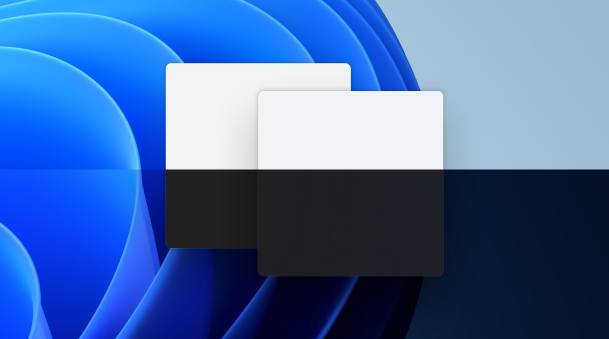
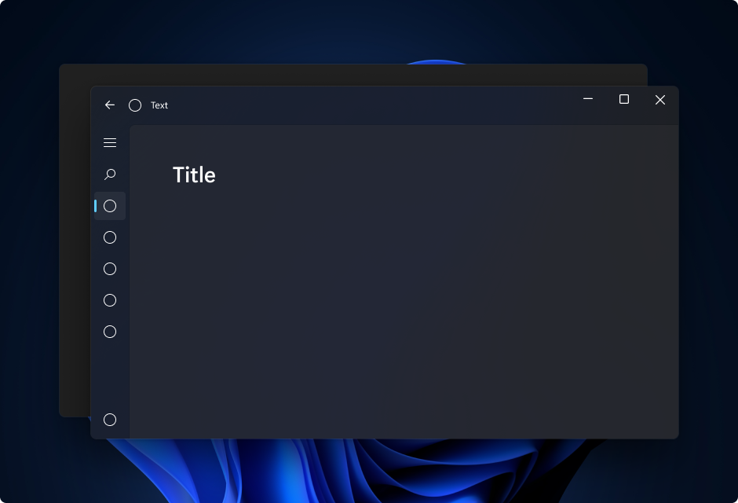
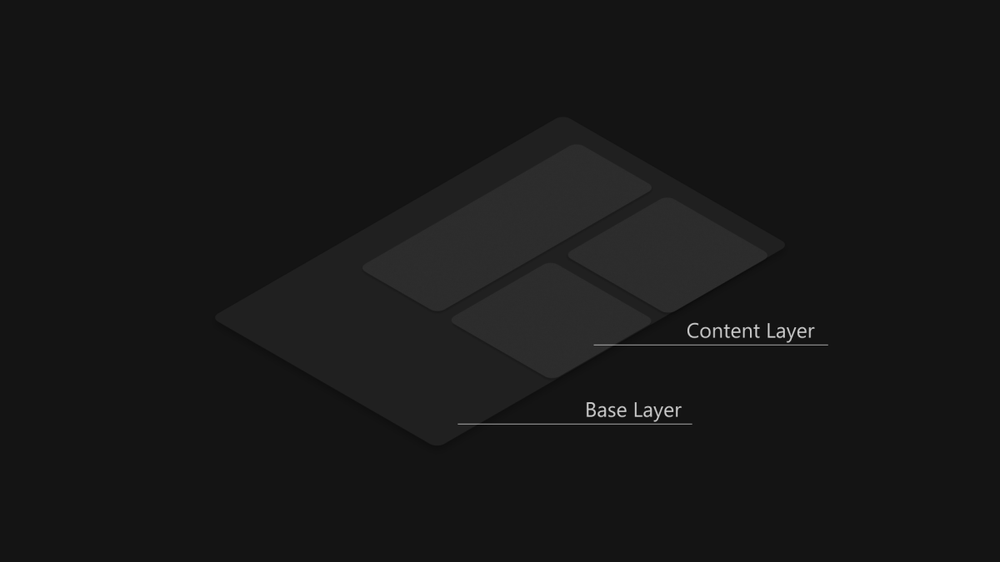
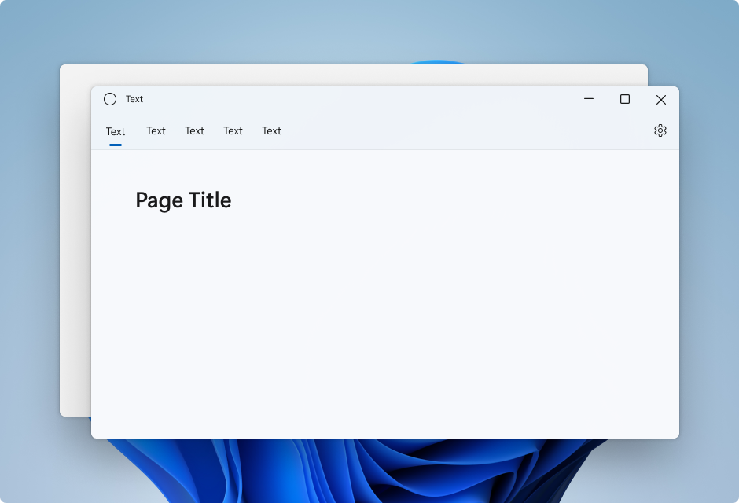

# Mica material

_Mica_ is an opaque, dynamic material that incorporates theme and desktop wallpaper to paint the background of long-lived windows such as apps and settings. You can apply Mica to your application backdrop to delight users and create visual hierarchy, aiding productivity, by increasing clarity about which window is in focus. Mica is specifically designed for app performance as it only samples the desktop wallpaper once to create its visualization. Mica is available for UWP apps that use WinUI 2 and apps that use Windows App SDK 1.1 or later, while running on Windows 11 version 22000 or later.



:::row:::
    :::column:::
Mica in light theme</br>

    :::column-end:::
    :::column:::
Mica in dark theme</br>

    :::column-end:::
:::row-end:::

_Mica Alt_ is a variant of Mica, with stronger tinting of the user's desktop background color. You can apply Mica Alt to your app's backdrop to provide a deeper visual hierarchy than Mica, especially when creating an app with a tabbed title bar. Mica Alt is available for apps that use Windows App SDK 1.1 or later, while running on Windows 11 version 22000 or later.

These images show the difference between Mica and Mica Alt in a title bar with tabs. The first image uses Mica and the second image uses Mica Alt.

:::image type="content" source="images/mica-tabs.png" alt-text="Screenshot of Mica in a title bar with tabs.":::

:::image type="content" source="images/mica-alt-tabs.png" alt-text="Screenshot of Mica Alt in a title bar with tabs.":::

## When to use Mica or Mica Alt

Mica and Mica Alt are materials that appear on the backdrop of your application — behind all other content. Each material is opaque and incorporates the user's theme and desktop wallpaper to create its highly personalized appearance. As the user moves the window across the screen, the Mica material dynamically adapts to create a rich visualization using the wallpaper underneath the application. In addition, the material helps users focus on the current task by falling back to a neutral color when the app is inactive.

We recommend that you apply Mica or Mica Alt as the base layer of your app, and prioritize visibility in the title bar area. For more specific layering guidance see [Layering and Elevation](../signature-experiences/layering.md) and [App layering with Mica](#app-layering-with-mica).

## Usability and adaptability

The Mica materials automatically adapt their appearance for a wide variety of devices and contexts. They are designed for performance as they capture the background wallpaper only once to create their visualizations.

In High Contrast mode, users continue to see the familiar background color of their choosing in place of Mica or Mica Alt. In addition, the Mica materials will appear as a solid fallback color (SolidBackgroundFillColorBase for Mica, SolidBackgroundFillColorBaseAlt for Mica Alt) when:

* The user turns off transparency in Settings > Personalization > Color.
* Battery Saver mode is activated.
* The app runs on low-end hardware.
* An app window on desktop deactivates.
* The Windows app is running on Xbox or HoloLens.
* The Windows version is below 22000.

## App layering with Mica

:::row:::
    :::column:::
Standard pattern content layer<br/>

    :::column-end:::
    :::column:::
Card pattern content layer<br/>

    :::column-end:::
:::row-end:::

Mica is ideal as a foundation layer in your app's hierarchy due to its inactive and active states and subtle personalization. To follow the two-layer [Layering and Elevation](../signature-experiences/layering.md) system, we encourage you to apply Mica as the base layer of your app and add an additional content layer that sits on top of the base layer. The content layer should pick up the material behind it, Mica, using the LayerFillColorDefaultBrush, a low-opacity solid color, as its background. Our recommended content layer patterns are:

* Standard pattern: A contiguous background for large areas that need a distinct hierarchial differentiation from the base layer. The LayerFillColorDefaultBrush should be applied to the container backgrounds of your WinUI app surfaces (e.g. Grids, StackPanels, Frames, etc.).
* Card pattern: Segmented cards for apps that are designed with multiple sectioned and discontinuous UI components. For the definition of the card UI using the LayerFillColorDefaultBrush, see [Layering and Elevation](../signature-experiences/layering.md) guidance.

To give your app's window a seamless look, Mica should be visible in the title bar if you choose to apply the material to your app. You can show Mica in the title bar by extending your app into the non-client area and creating a transparent custom title bar. For more info, see [Title bar](../basics/titlebar-design.md).

The following examples showcase common implementations of the layering strategy with [NavigationView](../controls/navigationview.md) where Mica is visible in the title bar area.

* Standard pattern in Left NavigationView.
* Standard pattern in Top NavigationView.
* Card pattern in Left NavigationView.

### Standard pattern in Left NavigationView

By default, NavigationView in Left mode includes the content layer in its content area. This example extends Mica into the title bar area and creates a custom title bar.


### Standard pattern in Top NavigationView

By default, NavigationView in Top mode includes the content layer in its content area. This example extends Mica into the title bar area and creates a custom title bar.



### Card pattern in Left NavigationView

To follow the card pattern using a NavigationView you will need to remove the default content layer by overriding the background and border theme resources. Then, you can create the cards in the content area of the control. This example creates several cards, extends Mica into the title bar area, and creates a custom title bar. For more information on card UI, see [Layering and Elevation](../signature-experiences/layering.md) guidance.


## App layering with Mica Alt

Mica Alt is an alternative to Mica as a foundation layer in your app's hierarchy with the same features like inactive and active states and subtle personalization. We encourage you to apply Mica Alt as the base layer of your app when requiring contrast between title bar elements and the commanding areas of your app (e.g. navigation, menus).

A common scenario for using Mica Alt is when you are creating an application with a tabbed title bar. To follow the [Layering and Elevation](../signature-experiences/layering.md) guidance we encourage you to apply Mica Alt as the base layer of your app, add a commanding layer that sits on top of the base layer, and finally add an additional content layer that sits on top of the commanding layer. The commanding layer should pick up the material behind it, Mica Alt, using the `LayerOnMicaBaseAltFillColorDefaultBrush`, a low-opacity solid color, as its background. The content layer should pick up the layers below it, using the `LayerFillColorDefaultBrush`, another low-opacity solid color. The layer system is as follows:

* Mica Alt
* Commanding layer: Requires distinct hierarchical differentiation from the base layer. The `LayerOnMicaBaseAltFillColorDefaultBrush` should be applied to the commanding areas of your WinUI app surfaces (e.g. MenuBar, navigation structure, etc.)
* Content layer: A contiguous background for large areas that need a distinct hierarchial differentiation from the commanding layer. The `LayerFillColorDefaultBrush` should be applied to the container backgrounds of your WinUI app surfaces (e.g. Grids, StackPanels, Frames, etc.).

To give your app's window a seamless look, Mica Alt should be visible in the title bar if you choose to apply the material to your app. You can show Mica Alt in the title bar by extending your app into the non-client area and creating a transparent custom title bar.

## Recommendations

* **Do** apply backdrop material to the back-most layer (replacing the `ApplicationPageBackgroundThemeBrush` if present).
* **Do** set all background layers that you want to see Mica in to *transparent* so the Mica shows through.  
* **Don't** apply backdrop material more than once in an application.
* **Don't** apply backdrop material to a UI element. The backdrop material will not appear on the element itself. It will only appear if all layers between the UI element and the window are set to transparent.

## How to use Mica

You can use Mica in UWP apps that use WinUI 2, or in apps that use Windows App SDK 1.1 or later. You can use Mica Alt in apps that use Windows App SDK 1.1 or later.

### Use Mica with the Windows App SDK

To use Mica in a XAML app that uses the Windows App SDK and WinUI 3, set the [Window.SystemBackdrop](/windows/windows-app-sdk/api/winrt/microsoft.ui.xaml.window.systembackdrop) property to [MicaBackdrop](/windows/windows-app-sdk/api/winrt/microsoft.ui.xaml.media.micabackdrop).

These examples show how to do this in XAML and in code.

### Mica

```xaml
<Window
    ... >

    <Window.SystemBackdrop>
        <MicaBackdrop Kind="BaseAlt"/>
    </Window.SystemBackdrop>

</Window>
```

```csharp
public MainWindow()
{
    this.InitializeComponent();

    SystemBackdrop = new MicaBackdrop() 
                        { Kind = MicaKind.BaseAlt };
}
```

For more info about using the Composition `MicaController` APIs, see [Apply Mica or Acrylic materials in desktop apps for Windows 11](../../windows-app-sdk/system-backdrop-controller.md).

To use backdrop materials in a Win32 app, see [Apply Mica in Win32 desktop apps for Windows 11](../../desktop/modernize/apply-mica-win32.md).

### Use Mica with WinUI 2 for UWP

> **Important APIs**: [BackdropMaterial class](/uwp/api/microsoft.ui.xaml.controls.backdropmaterial)

You can apply Mica in a UWP app with the [BackdropMaterial](/uwp/api/microsoft.ui.xaml.controls.backdropmaterial) class. We recommend that you set the BackdropMaterial attached property on a XAML element that is the root of your XAML content, as it will apply to the entire content region (such as a Window). If your app has a Frame that navigates multiple pages, you should set this property on the Frame. Otherwise, you should set this property on the Page of your app.

```xaml
<Page muxc:BackdropMaterial.ApplyToRootOrPageBackground="True">
    <TextBlock>Hello world</TextBlock>
</Page>
```

The following examples show how to implement the standard layering patterns shown previously. Each of these examples use and require the same title bar code-behind, shown in the last example.

#### Example: Standard pattern in Left NavigationView

By default, NavigationView in Left mode includes the content layer in its content area. This example extends Mica into the title bar area and creates a custom title bar.

```xaml
<Page
    x:Class="LeftNavView.MainPage"
    xmlns="http://schemas.microsoft.com/winfx/2006/xaml/presentation"
    xmlns:x="http://schemas.microsoft.com/winfx/2006/xaml"
    xmlns:local="using:LeftNavView"
    xmlns:d="http://schemas.microsoft.com/expression/blend/2008"
    xmlns:mc="http://schemas.openxmlformats.org/markup-compatibility/2006"
    xmlns:muxc="using:Microsoft.UI.Xaml.Controls"
    mc:Ignorable="d"
    muxc:BackdropMaterial.ApplyToRootOrPageBackground="True">
    <Page.Resources>
        <!--This top margin is the height of the custom TitleBar-->
        <Thickness x:Key="NavigationViewContentMargin">0,48,0,0</Thickness>
    </Page.Resources>
    <Grid>
        <Border x:Name="AppTitleBar"
                IsHitTestVisible="True"
                VerticalAlignment="Top"
                Background="Transparent"
                Height="48"
                Canvas.ZIndex="1" 
                Margin="48,0,0,0">
            <StackPanel Orientation="Horizontal">
                <Image x:Name="AppFontIcon"
                    HorizontalAlignment="Left" 
                    VerticalAlignment="Center"
                    Source="Assets/Square44x44Logo.png" 
                    Width="16" 
                    Height="16"/>
                <TextBlock x:Name="AppTitle"
                    Text="Test App Title"
                    VerticalAlignment="Center"
                    Margin="12, 0, 0, 0"
                    Style="{StaticResource CaptionTextBlockStyle}" />
            </StackPanel>
        </Border>
        <muxc:NavigationView x:Name="NavigationViewControl"
            IsTitleBarAutoPaddingEnabled="False"            
            IsBackButtonVisible="Visible"           
            Header="Title" 
            DisplayModeChanged="NavigationViewControl_DisplayModeChanged"
            Canvas.ZIndex="0">
            <muxc:NavigationView.MenuItems>
                <muxc:NavigationViewItem Icon="Target" Content="Text"/>
                <muxc:NavigationViewItem Icon="Target" Content="Text"/>
                <muxc:NavigationViewItem Icon="Target" Content="Text"/>
                <muxc:NavigationViewItem Icon="Target" Content="Text"/>
                <muxc:NavigationViewItem Icon="Target" Content="Text"/>
            </muxc:NavigationView.MenuItems>
            <Grid>
                <Frame x:Name="contentFrame">
                    <Grid>
                        <TextBlock Padding="56,16,0,0">Page content!</TextBlock>
                    </Grid>
                </Frame>
            </Grid>
        </muxc:NavigationView>
    </Grid>
</Page>
```

#### Example: Standard pattern in Top NavigationView

By default, NavigationView in Top mode includes the content layer in its content area. This example extends Mica into the title bar area and creates a custom title bar.

```xaml
<Page
    x:Class="TopNavView.MainPage"
    xmlns="http://schemas.microsoft.com/winfx/2006/xaml/presentation"
    xmlns:x="http://schemas.microsoft.com/winfx/2006/xaml"
    xmlns:local="using:TopNavView"
    xmlns:d="http://schemas.microsoft.com/expression/blend/2008"
    xmlns:mc="http://schemas.openxmlformats.org/markup-compatibility/2006"
    xmlns:muxc="using:Microsoft.UI.Xaml.Controls"
    mc:Ignorable="d"
    muxc:BackdropMaterial.ApplyToRootOrPageBackground="True">
    <Page.Resources>
        <CornerRadius x:Key="NavigationViewContentGridCornerRadius">0</CornerRadius>
    </Page.Resources>
    <Grid>
        <Border x:Name="AppTitleBar"
                IsHitTestVisible="True"
                VerticalAlignment="Top"
                Background="Transparent"
                Height="32"
                Margin="48,0,0,0">
            <StackPanel Orientation="Horizontal">
                <Image x:Name="AppFontIcon"
                    HorizontalAlignment="Left" 
                    VerticalAlignment="Center"
                    Source="Assets/Square44x44Logo.png" 
                    Width="16" 
                    Height="16"/>
                <TextBlock x:Name="AppTitle"
                    Text="Test App Title"
                    VerticalAlignment="Center"
                    Margin="12,0,0,0"
                    Style="{StaticResource CaptionTextBlockStyle}" />
            </StackPanel>
        </Border>
            <muxc:NavigationView x:Name="NavigationViewControl"          
            Header="Page Title" 
            DisplayModeChanged="NavigationViewControl_DisplayModeChanged"
            PaneDisplayMode="Top">
                <muxc:NavigationView.MenuItems>
                    <muxc:NavigationViewItem Content="Text"/>
                    <muxc:NavigationViewItem Content="Text"/>
                    <muxc:NavigationViewItem Content="Text"/>
                    <muxc:NavigationViewItem Content="Text"/>
                    <muxc:NavigationViewItem Content="Text"/>
            </muxc:NavigationView.MenuItems>
                <Grid>
                    <Frame x:Name="contentFrame">
                        <Grid>
                            <TextBlock Padding="56,16,0,0">Page content!</TextBlock>
                        </Grid>
                    </Frame>
                </Grid>
            </muxc:NavigationView>
    </Grid>
</Page>
```

#### Example: Card pattern in Left NavigationView

To follow the card pattern using a NavigationView you will need to remove the default content layer by overriding the background and border theme resources. Then, you can create the cards in the content area of the control. This example creates several cards, extends Mica into the title bar area, and creates a custom title bar. For more information on card UI, see [Layering and Elevation](../signature-experiences/layering.md) guidance.

```xaml
<Page
    x:Class="CardLayout.MainPage"
    xmlns="http://schemas.microsoft.com/winfx/2006/xaml/presentation"
    xmlns:x="http://schemas.microsoft.com/winfx/2006/xaml"
    xmlns:local="using:CardLayout"
    xmlns:d="http://schemas.microsoft.com/expression/blend/2008"
    xmlns:mc="http://schemas.openxmlformats.org/markup-compatibility/2006"
    xmlns:muxc="using:Microsoft.UI.Xaml.Controls"
    mc:Ignorable="d"
    muxc:BackdropMaterial.ApplyToRootOrPageBackground="True">
    <Page.Resources>
        <!--This top margin is the height of the custom TitleBar-->
        <Thickness x:Key="NavigationViewContentMargin">0,48,0,0</Thickness>
        <Thickness x:Key="NavigationViewContentGridBorderThickness">0</Thickness>
        <SolidColorBrush x:Key="NavigationViewContentBackground" Color="Transparent"></SolidColorBrush>
    </Page.Resources>

    <Grid>
        <Border x:Name="AppTitleBar"
                IsHitTestVisible="True"
                VerticalAlignment="Top"
                Background="Transparent"
                Height="48"
                Canvas.ZIndex="1" 
                Margin="48,0,0,0">
            <StackPanel Orientation="Horizontal">
                <Image x:Name="AppFontIcon"
                    HorizontalAlignment="Left" 
                    VerticalAlignment="Center"
                    Source="Assets/Square44x44Logo.png" 
                    Width="16" 
                    Height="16"/>
                <TextBlock x:Name="AppTitle"
                    Text="Test App Title"
                    VerticalAlignment="Center"
                    Margin="12,0,0,0"
                    Style="{StaticResource CaptionTextBlockStyle}" />
            </StackPanel>
        </Border>

        <muxc:NavigationView x:Name="NavigationViewControl"
            IsTitleBarAutoPaddingEnabled="False"            
            IsBackButtonVisible="Visible"           
            Header="Title" 
            DisplayModeChanged="NavigationViewControl_DisplayModeChanged"
            Canvas.ZIndex="0">
            <muxc:NavigationView.MenuItems>
                <muxc:NavigationViewItem Icon="Target" Content="Text"/>
                <muxc:NavigationViewItem Icon="Target" Content="Text"/>
                <muxc:NavigationViewItem Icon="Target" Content="Text"/>
                <muxc:NavigationViewItem Icon="Target" Content="Text"/>
                <muxc:NavigationViewItem Icon="Target" Content="Text"/>
            </muxc:NavigationView.MenuItems>
            <Grid>
                <Frame x:Name="contentFrame">
                    <StackPanel Orientation="Vertical" Margin="40,16,0,0">
                        <Border Width="600" Height="200" Background="{ThemeResource LayerFillColorDefaultBrush}"
                                VerticalAlignment="Top" 
                                HorizontalAlignment="Left" 
                                Margin="16"
                                CornerRadius="8"
                                BorderThickness="1"
                                BorderBrush="{ThemeResource CardStrokeColorDefaultBrush}">
                            <TextBlock VerticalAlignment="Center" HorizontalAlignment="Center">Content here!</TextBlock>
                        </Border>
                        <Border Width="600" Height="200" Background="{ThemeResource LayerFillColorDefaultBrush}"
                                VerticalAlignment="Top" 
                                HorizontalAlignment="Left" 
                                Margin="16" 
                                CornerRadius="8"
                                BorderThickness="1"
                                BorderBrush="{ThemeResource CardStrokeColorDefaultBrush}">
                            <TextBlock VerticalAlignment="Center" HorizontalAlignment="Center">Content here!</TextBlock>
                        </Border>
                        <Border Width="600" Height="200" Background="{ThemeResource LayerFillColorDefaultBrush}"
                                VerticalAlignment="Top" 
                                HorizontalAlignment="Left" 
                                Margin="16"
                                CornerRadius="8"
                                BorderThickness="1"
                                BorderBrush="{ThemeResource CardStrokeColorDefaultBrush}">
                            <TextBlock VerticalAlignment="Center" HorizontalAlignment="Center">Content here!</TextBlock>
                        </Border>
                    </StackPanel>
                </Frame>
            </Grid>
        </muxc:NavigationView>
    </Grid>
</Page>
```

#### Title bar code-behind

The previous three app layout XAML pages use this code-behind to create a custom title bar adaptive to app state and visibility.

For more information see [Title bar customization](../../develop/title-bar.md).

```csharp
public MainPage()
{
    this.InitializeComponent();
    var titleBar = ApplicationView.GetForCurrentView().TitleBar;

    titleBar.ButtonBackgroundColor = Colors.Transparent;
    titleBar.ButtonInactiveBackgroundColor = Colors.Transparent;

    // Hide default title bar.
    var coreTitleBar = CoreApplication.GetCurrentView().TitleBar;
    coreTitleBar.ExtendViewIntoTitleBar = true;
    UpdateTitleBarLayout(coreTitleBar);

    // Set XAML element as a draggable region.
    Window.Current.SetTitleBar(AppTitleBar);

    // Register a handler for when the size of the overlaid caption control changes.
    // For example, when the app moves to a screen with a different DPI.
    coreTitleBar.LayoutMetricsChanged += CoreTitleBar_LayoutMetricsChanged;

    // Register a handler for when the title bar visibility changes.
    // For example, when the title bar is invoked in full screen mode.
    coreTitleBar.IsVisibleChanged += CoreTitleBar_IsVisibleChanged;

    //Register a handler for when the window changes focus
    Window.Current.Activated += Current_Activated;
}

private void CoreTitleBar_LayoutMetricsChanged(CoreApplicationViewTitleBar sender, object args)
{
    UpdateTitleBarLayout(sender);
}

private void UpdateTitleBarLayout(CoreApplicationViewTitleBar coreTitleBar)
{
    // Update title bar control size as needed to account for system size changes.
    AppTitleBar.Height = coreTitleBar.Height;

    // Ensure the custom title bar does not overlap window caption controls
    Thickness currMargin = AppTitleBar.Margin;
    AppTitleBar.Margin = new Thickness(currMargin.Left, currMargin.Top, coreTitleBar.SystemOverlayRightInset, currMargin.Bottom);
}

private void CoreTitleBar_IsVisibleChanged(CoreApplicationViewTitleBar sender, object args)
{
    if (sender.IsVisible)
    {
        AppTitleBar.Visibility = Visibility.Visible;
    }
    else
    {
        AppTitleBar.Visibility = Visibility.Collapsed;
    }
}

// Update the TitleBar based on the inactive/active state of the app
private void Current_Activated(object sender, Windows.UI.Core.WindowActivatedEventArgs e)
{
    SolidColorBrush defaultForegroundBrush = (SolidColorBrush)Application.Current.Resources["TextFillColorPrimaryBrush"];
    SolidColorBrush inactiveForegroundBrush = (SolidColorBrush)Application.Current.Resources["TextFillColorDisabledBrush"];

    if (e.WindowActivationState == Windows.UI.Core.CoreWindowActivationState.Deactivated)
    {
        AppTitle.Foreground = inactiveForegroundBrush;
    }
    else
    {
        AppTitle.Foreground = defaultForegroundBrush;
    }
}

// Update the TitleBar content layout depending on NavigationView DisplayMode
private void NavigationViewControl_DisplayModeChanged(Microsoft.UI.Xaml.Controls.NavigationView sender, Microsoft.UI.Xaml.Controls.NavigationViewDisplayModeChangedEventArgs args)
{
    const int topIndent = 16;
    const int expandedIndent = 48;
    int minimalIndent = 104;

    // If the back button is not visible, reduce the TitleBar content indent.
    if (NavigationViewControl.IsBackButtonVisible.Equals(Microsoft.UI.Xaml.Controls.NavigationViewBackButtonVisible.Collapsed))
    {
        minimalIndent = 48;
    }

    Thickness currMargin = AppTitleBar.Margin;
    
    // Set the TitleBar margin dependent on NavigationView display mode
    if (sender.PaneDisplayMode == Microsoft.UI.Xaml.Controls.NavigationViewPaneDisplayMode.Top)
    {
        AppTitleBar.Margin = new Thickness(topIndent, currMargin.Top, currMargin.Right, currMargin.Bottom);
    }
    else if (sender.DisplayMode == Microsoft.UI.Xaml.Controls.NavigationViewDisplayMode.Minimal)
    {
        AppTitleBar.Margin = new Thickness(minimalIndent, currMargin.Top, currMargin.Right, currMargin.Bottom);
    }          
    else
    {
        AppTitleBar.Margin = new Thickness(expandedIndent, currMargin.Top, currMargin.Right, currMargin.Bottom);
    }
}
```

## Related articles

- [Materials](../signature-experiences/materials.md)
- [Layering and Elevation](../signature-experiences/layering.md)
- [Apply Mica or Acrylic materials in desktop apps for Windows 11](../../windows-app-sdk/system-backdrop-controller.md)
- [Apply Mica in Win32 desktop apps for Windows 11](../../desktop/modernize/apply-mica-win32.md)
- [BackdropMaterial class](/uwp/api/microsoft.ui.xaml.controls.backdropmaterial)
- [NavigationView](../controls/navigationview.md)
