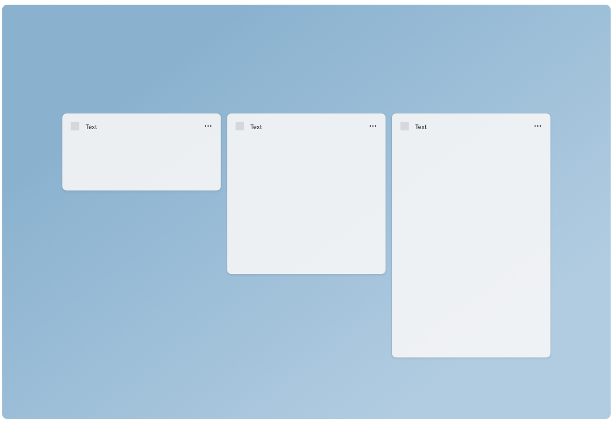
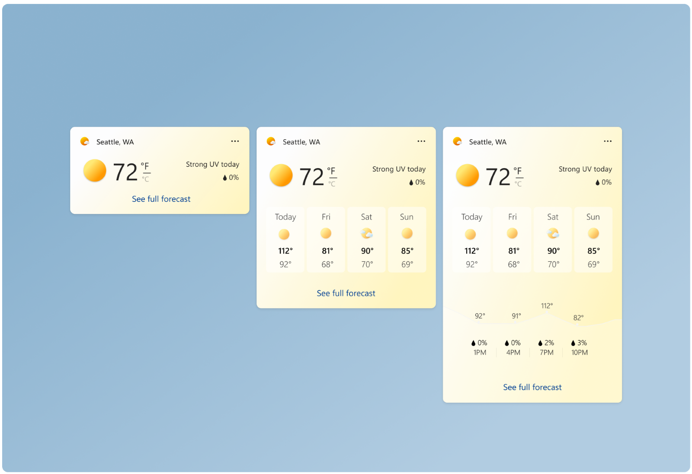
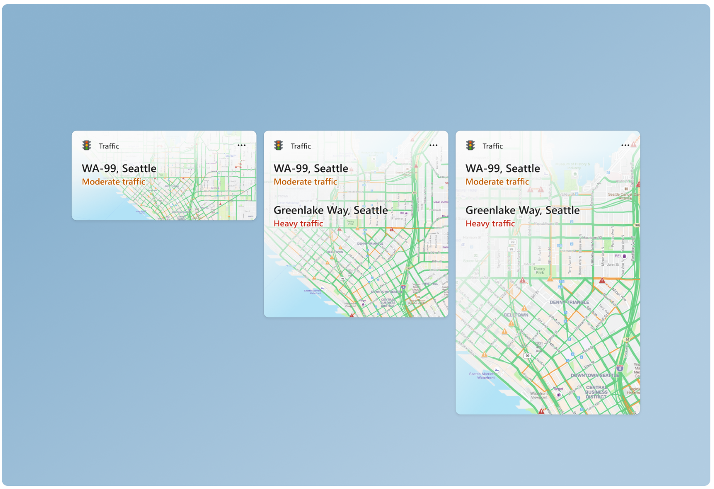
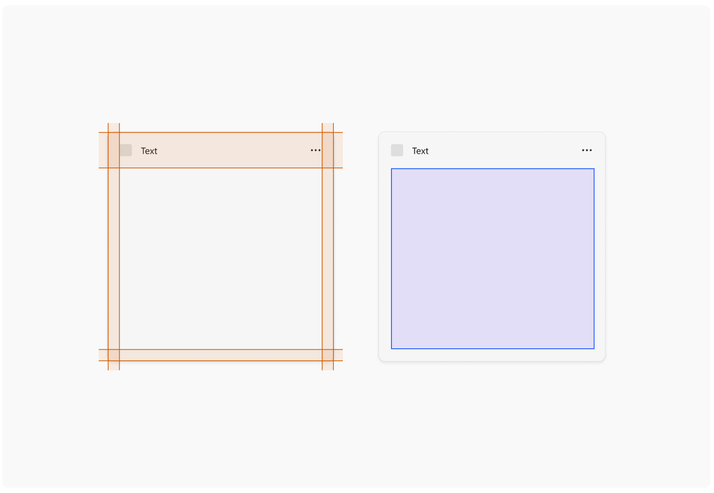
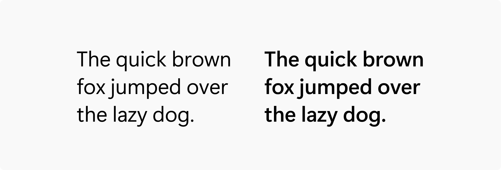
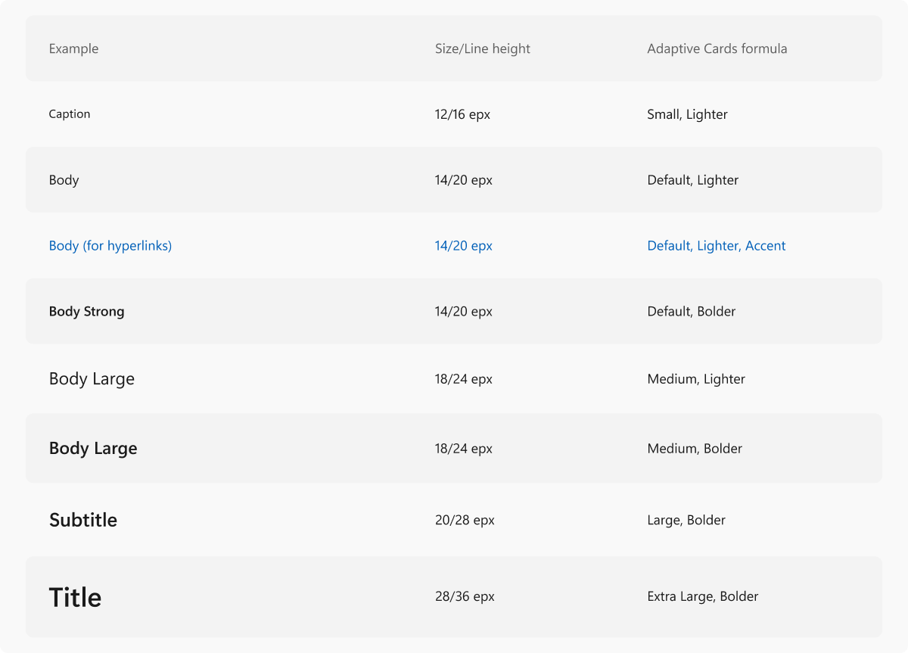
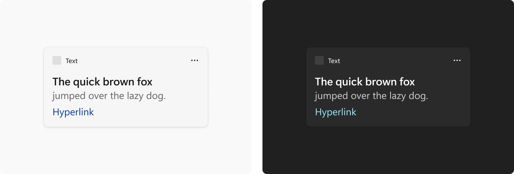
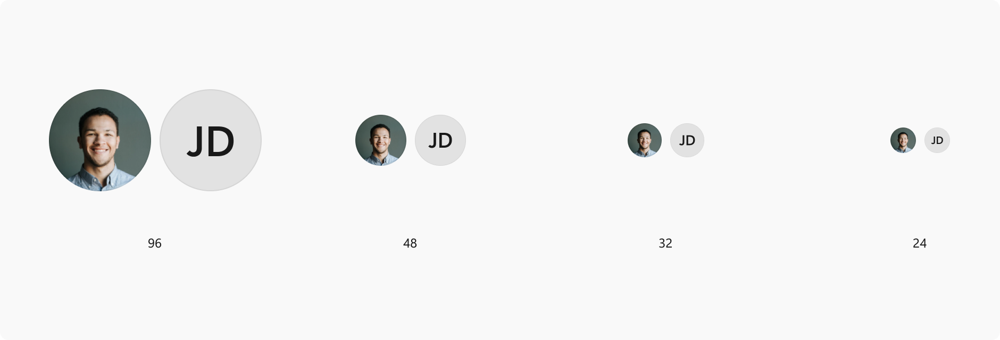
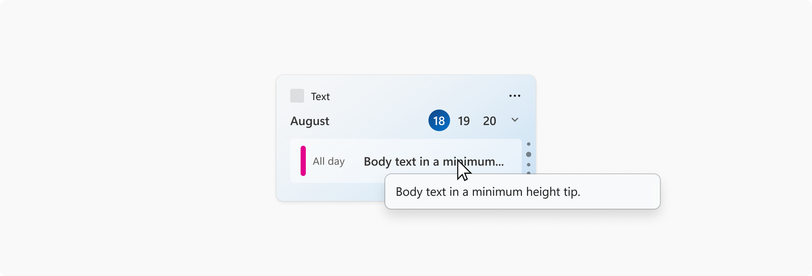

# Widget design fundamentals

This article provides detailed guidance for designing the UI for a Windows widget.

## Widget sizes

Widgets provide three sizes for the user to choose from. It is recommended that you create and consider all 3 sizes and adapt your design specifically for each size. Small and medium sizes provide better discoverability as they get surfaced more often within the dynamic feed. Large sizes are useful for displaying more in-depth information. Supporting multiple sizes allows flexibility in users customizing the widgets they choose to pin to the widgets board.  

### Small

The widget principles *glanceable* and *focused* become more important in design decisions made for the small size widget. The small size widget should not try to force all of the functionality that could comfortably fit in a large widget. Focus on one user interaction or piece of key information that can be surfaced here with 1 touch target. 

### Medium

The medium size widget allows more room compared to the small, and so more functionality or additional information can be included. The medium widget could also provide the same focused experience as the small widget, but provide 2-3 touch targets.

### Large  

Large sizes allow for more information to be presented, but the content should still be focused and easily consumable. Alternatively, a large size card could highlight one image or topic and have a more immersive experience. The large size should have no more than 3-4 touch targets.

## Color and theming

Windows 11 supports two color modes: light and dark. Each mode consists of a set of neutral color values that are automatically adjusted to ensure optimal contrast. For each widget size you support, make sure to create separate designs for light and dark themes so that the widget integrates seamlessly within the wider operating system and user’s theme choice. The widget background supports customization with either a solid light/dark background, gradient tint, or image background. 

When choosing background colors, images, and content, make sure that there is enough color contrast to ensure legibility and accessibility.  

The Web Content Accessibility Guidelines (WCAG) 2.0 level AA requires a contrast ratio of at least 4.5:1 for normal text and 3:1 for large text. WCAG 2.1 requires a contrast ratio of at least 3:1 for graphics and user interface components (such as form input borders). WCAG Level AAA requires a contrast ratio of at least 7:1 for normal text and 4.5:1 for large text. Large text is defined as 14 point (typically 18.66px) and bold or larger, or 18 point (typically 24px) or larger. 

## Margins

Each widget has a 16px margin around it and a 48px [Attribution area](widgets-states-and-ui.md#attribution-area) in which content cannot be placed. The only component that can live in the right side margin and bottom margin are the pagination dots. For examples of the positioning of the pagination dots, see the pagination section of [Widget interaction design guidance](../../design/widgets/widgets-interaction-design.md#pagination).

For widgets that use containers, the gutter between each element is 4px, and the containers should touch the edges of the margins. Your content should also use spacing and sizing values of [Multiples of Four Px](/windows/apps/design/layout/screen-sizes-and-breakpoints-for-responsive-design#multiples-of-four) to achieve a clean, pixel perfect design across different screen resolutions.
 
You should also consult the guidance for spacing and gutters in [Content design basics for Windows apps](/windows/apps/design/basics/content-basics ) when designing your content.

## Typography

For accessibility, the following table presents the text of the table shown in the image above. 

| Example | Size / Line height | Adaptive cards formula |
|---------|--------------------|------------------------|
| Caption  | 12/16 epx | Small, Lighter |
| Body     | 14/20 epx | Default, Lighter |
| Body (for hyperlinks) | 14/20 epx | Default, Lighter, Accent |
| Body Strong | 14/20 epx | Default, Bolder |
| Body Large | 18/24 epx | Medium, Lighter |
| Body Largest | 18/24 epx | Medium, Bolder |
| Subtitle | 20/28 epx | Large, Bolder |
| Title | 28/36 epx | Extra Large, Bolder | 

Segoe UI is the typeface used in Widgets and across Windows. The above type ramp includes the formulations of how to properly set the right styles in the Adaptive Cards Designer. Typeface styling should not deviate from the specified formulas above. For more information on using the Adaptive Cards Designer to create widget templates, see [Create a widget template with the Adaptive Card Designer](widgets-create-a-template.md).

Within the Adaptive Cards Designer, titles and body copy use the default color associated with the widget theme. An additional option to differentiate title from body copy further is to use the subtle version of the default color. The accent color is only used for hyperlinks.  

## Iconography

## Profile pictures

If your widget includes showing user profiles (for example, a social media feed or stream) use one of the following allowed circle profile sizes: 96x96px, 48x48px, 32x32px, or 24x24px.

## Tool tips

Tool tips can be used when title text gets truncated in the widget. For best practices, text should fit neatly within the widget space and not need truncation however, that may not always happen depending on scenarios like language localization, system text scaling, or when quoting something (i.e. article title, name of a song). This does not apply to body text on a widget.
