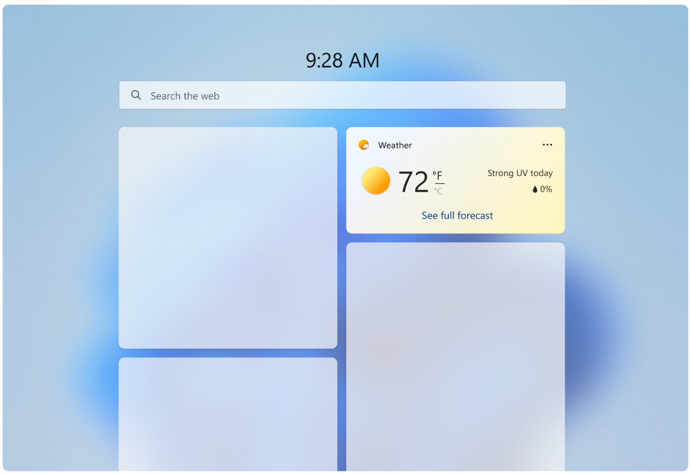
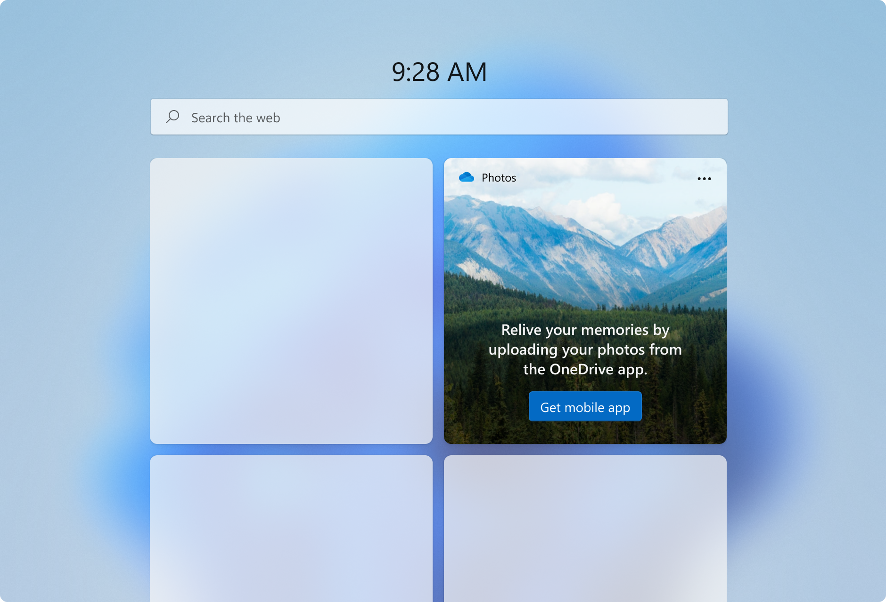
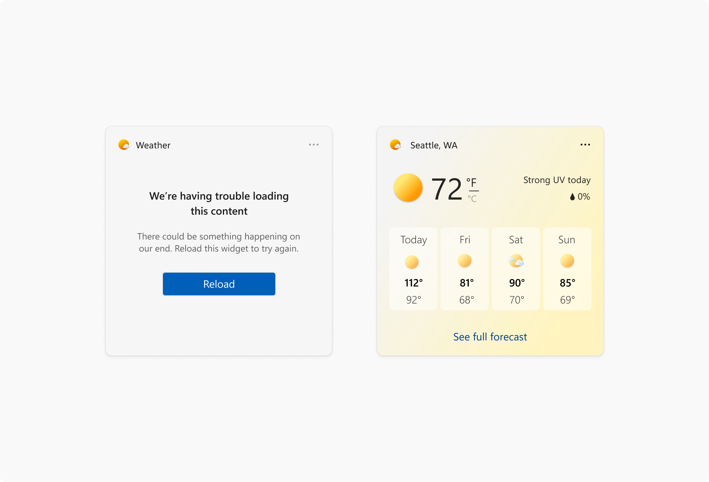
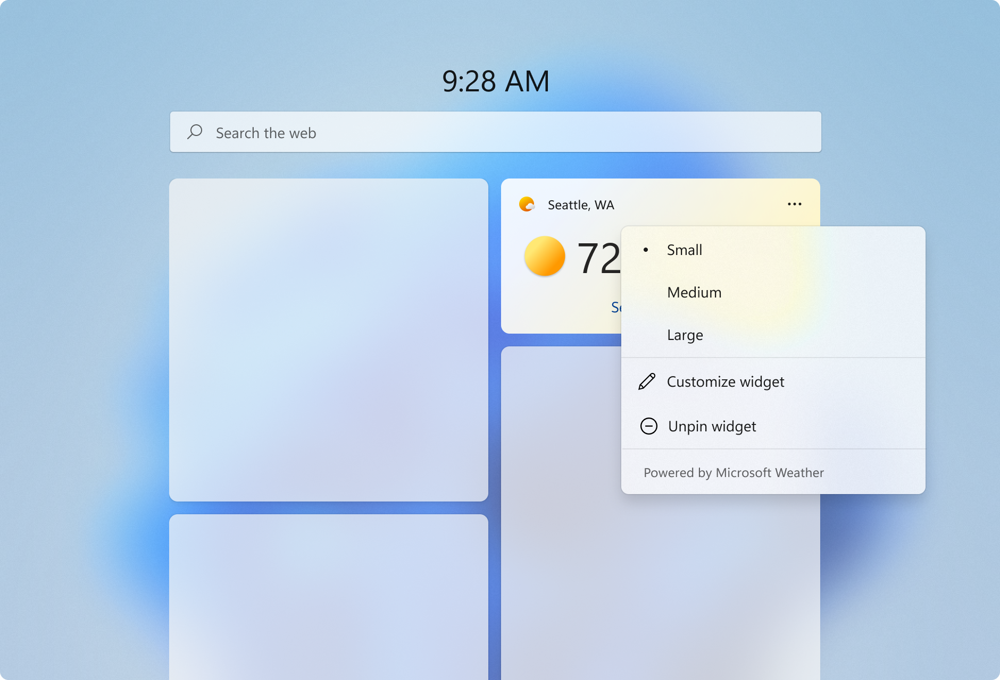
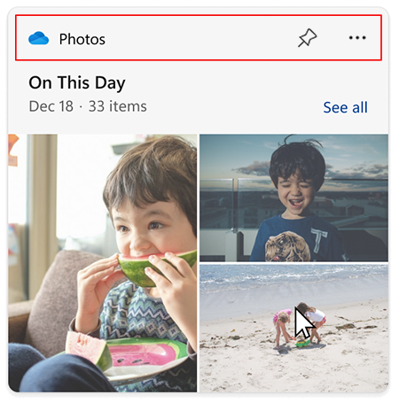

# Widget states and built-in UI components

> [!NOTE]
> **Some information relates to pre-released product, which may be substantially modified before it's commercially released. Microsoft makes no warranties, express or implied, with respect to the information provided here.**
> [!IMPORTANT]
> The feature described in this topic is available in Dev Channel preview builds of Windows starting with build 25217. For information on preview builds of Windows, see [Windows 10 Insider Preview](https://insider.windows.com/en-us/preview-windows).

## Widget states

When a widget is displayed on the Widgets Board, there are several different states that it can be in, depending on the current state of the widgets board and your app, such as when the widget is loading, when the widget is in an error state, or when the user has customized the widgets layout. Some states are designed and implemented by your app while others are built into the Widgets host. This section shows and describes each widget state. Keep in mind that widgets support both light and dark themes, so the built-in states and the states you customize may both look different depending on the current theme.

### Default state

The default state is what the widget looks like when it is running normally. This is the primary user experience for your widget. You design the layout for your widget's default state. Although the UI of your widget's default state may change in response to user configuration, your widget's default state should be fully implemented and should not be empty before user configuration. If your widget requires the user to sign-in, you may want to implement a signed-out state, described below. For design guidance for creating the default state for your widget, see [Widget design fundamentals](widgets-design-fundamentals.md). 

**DO**

- When in the default, active state a widget should feel personal and connected to user.
- Widgets should show engaging content that brings the user value in the current moment.
- Give the user the ability to start interacting with widget right away.
- Provide a UI that reflects the UI of your app, while staying within the design constraints for widgets, in order to maximize consistency and to lessen the learning curve. 
- Consider using the user’s location to pre-populate the data for content like sports and suggested calendars to add instead of generic data.
- Allow ample breathing space between elements. 

**DON’T** 

- Use your widget for generic commercial offers. The content should reflect the user's desires and intent. 
- Avoid busy, complex layouts.

Aim for comfortable information density and healthy negative space within each widget size to help with the glance and go model. If you have a lot of information to include, consider the next size up to show more content. Also consider how difficult/easy the content will be for a user to glance and consume. 

Consider adding moments of surprise + delight to your widgets to elevate the experience. For example, for the Family or Calendar widgets you could highlight a child’s birthday via different visual treatments. 

This is the state with the most design flexibility. Use the guidelines in this articles as well as [Widget principles](index.md#widget-principles), [Widget design fundamentals](widgets-design-fundamentals.md), and [Widget interaction design guidance](widgets-interaction-design.md) to design how you want to layout your content.

### Signed-out state (for widgets that require authentication)

Some widget scenarios may require that the user must sign in or perform other actions to be able to see personalized widget content. When the user is not signed in, you should consider presenting non-personalized content.

### Error state - system provided

If for some reason, the Widgets Board can't retrieve the layout or data for a widget, it will display an error state. Windows will show the widget header with an error message and a reload button. This message will look the same for every widget.  

If there is cached content available to be displayed, the widget header will show when data was last refreshed in the following format:
1. The number of minutes if less than an hour  
1. Rounding to the nearest hour if over an hour 
 
Long widget partner names will get truncated while showing a cached message at 15 characters max.

### Customization state

Starting with Windows App SDK 1.4, widgets can provide a customization template that provides controls for the user to customize the widget's appearance or the data displayed by the widget. The customization UI is defined in a JSON template. 

## Built-in widget UI components

Some UI elements of a widget are built into the widgets experience and, while these elements are not customizable by widget providers, it's important to be aware of what these elements are and how they behave.

### Context menu (system provided)

The context menu is displayed when the user clicks on the three-dot icon on the top right. This menu allows users to select their preferred widget size and access the widget's configuration state. Partners will use the same template widget register “powered by ___”. 

### Attribution area

The attribution area is rendered by the widgets board based on the widget name and icon provided during widget registration. For more information on registering widgets, see [Widget provider package manifest XML format](../../develop/widgets/widget-provider-manifest.md).

