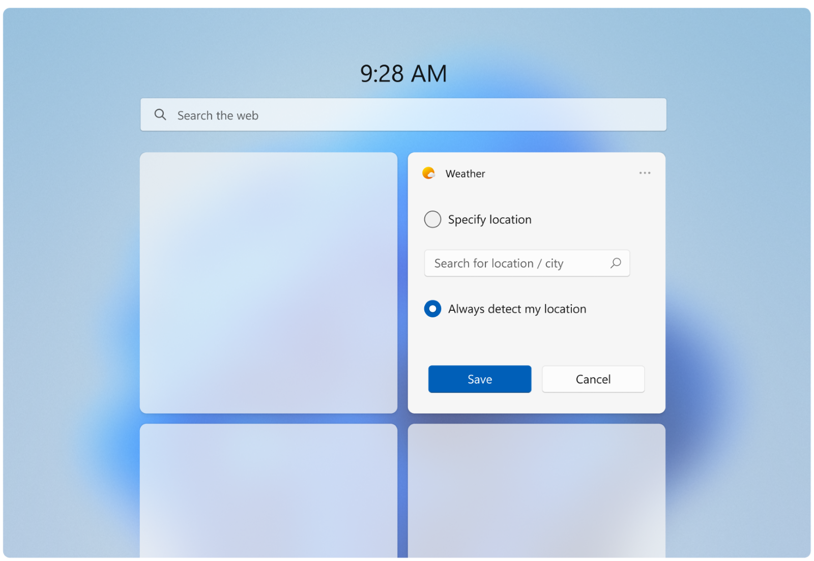
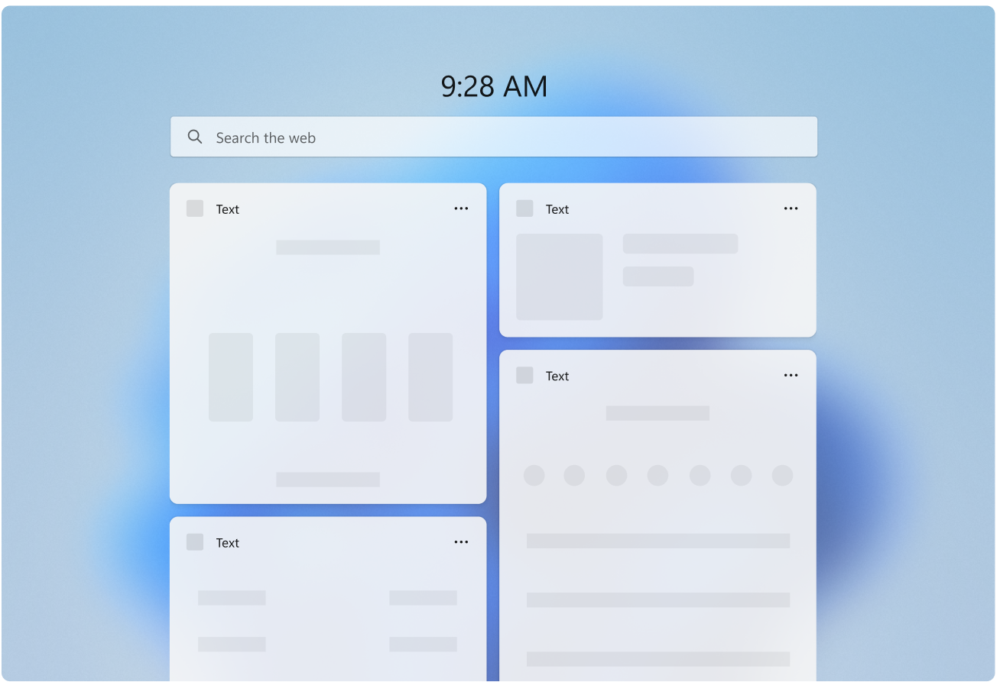

# Widget states and built-in UI components

## Widget states

When a widget is displayed on the Widget Board, there are several different states that it can be in, depending on the current state of the Widget Board and your app, such as when the widget is loading, when the widget is in an error state, or when the user has customized the widgets layout. Some states are designed and implemented by your app while others are built into the Widgets Board. This section shows and describes each widget state. Keep in mind that widgets support both light and dark themes, so the built-in states and the states you customize may both look different depending on the current theme.

### Default state

The default state is what the widget looks like when it is running normally. This is the primary user experience for your widget. You design the layout for your widget's default state. Although the UI of your widget's default state may change in response to user configuration, your widget's default state should be fully implemented and should not be empty before user configuration. If your widget requires the user to sign-in, you may want to implement a signed-out state, described below. For design guidance for creating the default state for your widget, see [Widget design fundamentals](widgets-design-fundamentals.md). 

**DO**

- When in the default, active state a widget should feel personal and connected to user.
- Widgets should show engaging content that brings the user value in the current moment.
- Give the user the ability to start interacting with widget right away.
- Provide a UI that reflects the UI of your app, while staying within the design constraints for widgets, in order to maximize consistency and to lessen the learning curve. 
- Consider using the user’s location to pre-populate the data for content like sports and suggested calendars to add instead of generic data.
- Allow ample breathing space between elements. 

**DON’T** 

- Use your widget for generic commercial offers. The content should reflect the user's desires and intent. 
- Avoid busy, complex layouts.

Aim for comfortable information density and healthy negative space within each widget size to help with the glance and go model. If you have a lot of information to include, consider the next size up to show more content. Also consider how difficult/easy the content will be for a user to glance and consume. 

Consider adding moments of surprise + delight to your widgets to elevate the experience. For example, for the Family or Calendar widgets you could highlight a child’s birthday via different visual treatments. 

This is the state with the most design flexibility. Use the guidelines in this articles as well as [Widget principles](index.md#widget-principles), [Widget design fundamentals](widgets-design-fundamentals.md), and [Widget interaction design guidance](widgets-interaction-design.md) to design how you want to layout your content.

### Signed-out state (for widgets that require authentication)

Some widget scenarios may require that the user must sign in or perform other actions to be able to see personalized widget content. When the user is not signed in, you should consider presenting non-personalized content.

### Error state - system provided

If for some reason, the Widgets Board can't retrieve the layout or data for a widget, it will display an error state. Windows will show the widget header with an error message and a reload button. This message will look the same for every widget.
  
There are two main scenarios that will cause the error state to be displayed:
  
1. When the Widget Board fails to navigate to the widget’s content (in case of a network issue or the app being down).  
1. When the widget is not able to receive a valid authentication token. The reload button will initiate the authentication flow again.  

If there is cached content available to be displayed, the widget header will show when data was last refreshed in the following format:
1. The number of minutes if less than an hour  
1. Rounding to the nearest hour if over an hour 
 
Long widget partner names will get truncated while showing a cached message at 15 characters max.

## Built-in widget UI components

Some UI elements of a widget are built into the widgets experience and, while these elements are not customizable by widget providers, it's important to be aware of what these elements are and how they behave.

### Context menu (system provided)

The context menu is displayed when the user clicks on the three-dot icon on the top right. This menu allows users to select their preferred widget size and access the widget's configuration state. Partners will use the same template widget register “powered by ___”. 

### Configuration mode 

Your widget can have a configuration page to allow users to refine the content they see within the widget, such as picking the current location for a weather widget or picking a team to show for a sports widget. Users can get to this configuration page by clicking **Customize Widget** in the built-in context menu. The configuration state is designed and implemented by the widget provider.

The configuration page can only be designed and displayed in medium and large widget sizes. To give the small widget more space when in configuration mode, the widget can flip to a medium and then back to small once user has finished editing their options. All other size widgets will stay at their original size when in the configuration state

### Loading state

The loading state is what the widget displays when data is loading. The title bar area is the only are that does not have to greyscale placeholder UI- this is the only area that will render during this loading time. To give users a preview of what your widget looks like, use geometrical shapes in the content region. Try using fewer, bigger blocks/shapes. This state will be shown while Widgets Board is navigating to widgets’ endpoints. 

Create loading states for all your widget sizes in both themes using TBD.

### Attribution area

The attribution area is rendered by the Widget board based on the widget name and icon provided during widget registration. For more information on registering widgets, see [TBD](tbd).

