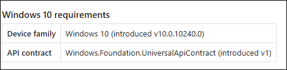
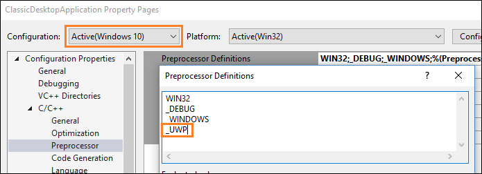

---
description: Enhance your desktop application for Windows users by using Windows Runtime APIs.
title: Call Windows Runtime APIs in desktop apps
ms.date: 04/02/2021
ms.topic: article
keywords: windows 10, uwp
ms.localizationpriority: medium
ms.custom: 19H1
---

# Call Windows Runtime APIs in desktop apps

This topic describes how to set up your desktop app projects to use Windows Runtime (WinRT) APIs provided by the Windows OS, and to add modern Windows 11 and Windows 10 experiences to your desktop apps.

Some Windows Runtime (WinRT) APIs are not supported in desktop apps. For more information, see [Windows Runtime APIs not supported in desktop apps](desktop-to-uwp-supported-api.md).

## Modify a .NET project to use Windows Runtime APIs

There are several options for .NET projects:

* Starting in .NET 6, you can specify the Target Framework Moniker (TFM) in your project file to access WinRT APIs. This option is supported in projects that target Windows 10, version 1809 or later.
* For earlier versions of .NET, you can install the [`Microsoft.Windows.SDK.Contracts`](https://www.nuget.org/packages/Microsoft.Windows.SDK.Contracts) NuGet package to add all necessary references to your project. This option is supported in projects that target Windows 10, version 1803 or later.
* If your project multi-targets .NET 6 (or later) and earlier versions of .NET, then you can configure the project file to use both options.

### .NET 6 and later: Use the Target Framework Moniker option

This option is supported only in projects that use .NET 6 (or later) and target Windows 10, version 1809 or a later OS release. By specifying a Windows OS version-specific TFM in the project file, a reference is added to the appropriate [Windows SDK targeting package](https://www.nuget.org/packages/Microsoft.Windows.SDK.NET.Ref). For more background info about this scenario, see the blog post [Calling Windows APIs in .NET](https://blogs.windows.com/windowsdeveloper/2020/09/03/calling-windows-apis-in-net5/).

1. With your project open in Visual Studio, right-click your project in **Solution Explorer** and choose **Edit Project File**. Your project file will look similar to this.

    > [!NOTE]
    > The example below shows an **OutputType** of *WinExe*, which specifies a Windows GUI executable (and prevents a console window from opening when the app runs). If your app doesn't have a GUI, then your **OutputType** will have a different value. You can call WinRT APIs from Windows GUI apps, console apps, and libraries. Also, your value for **TargetFramework** might not exactly match the example below.

    ```xml
    <Project Sdk="Microsoft.NET.Sdk">
      <PropertyGroup>
        <OutputType>WinExe</OutputType>
        <TargetFramework>net5.0</TargetFramework>
      </PropertyGroup>
    </Project>
    ```

2. Leaving all other settings as they are, replace the value of the **TargetFramework** element with one of the following strings:

    * **net6.0-windows10.0.17763.0**: If your app targets Windows 10, version 1809.
    * **net6.0-windows10.0.18362.0**: If your app targets Windows 10, version 1903.
    * **net6.0-windows10.0.19041.0**: If your app targets Windows 10, version 2004.
    * **net6.0-windows10.0.22000.0**: If your app targets Windows 11.

    For example, the following element is for a project that targets Windows 10, version 2004.

    ```xml
    <TargetFramework>net6.0-windows10.0.19041.0</TargetFramework>
    ```
    
    In later versions of .NET, you can replace the value with the relevant version, for example **net6.0-windows10.0.19041.0**.

3. Save your changes and close the project file.

#### WinRT APIs not supported in .NET 6 or later

In .NET 6 and later, there are several Windows Runtime (WinRT) APIs in the **Windows.UI** namespace that aren't supported. For the APIs listed below, equivalent versions of the APIs exist in the WinUI (**Microsoft.UI**) namespace (for example, [**Microsoft.UI.Text**](/windows/windows-app-sdk/api/winrt/microsoft.ui.text)). The following WinRT APIs are *not* supported on .NET 6 and later:

* [**Windows.UI.Colors**](/uwp/api/Windows.UI.Colors) class
* [**Windows.UI.ColorHelper**](/uwp/api/Windows.UI.ColorHelper) class
* [**Windows.UI.Text**](/uwp/api/windows.ui.text) (all classes in this namespace **except** for **Windows.UI.Text.FontStretch**, **Windows.UI.Text.FontStyle**, **Windows.UI.Text.FontWeight**, **Windows.UI.Text.UnderlineType**, and all classes under the **Windows.UI.Text.Core** namespace)
* [**Windows.UI.Xaml**](/uwp/api/windows.ui.xaml) (all classes in this namespace)

#### Supporting multiple Windows OS versions 

The Windows OS version-specific **TargetFramework** property determines the version of the Windows SDK that your app is compiled with. This property determines the set of accessible APIs at build time, and provides default values for both **TargetPlatformVersion** and **TargetPlatformMinVersion** (if not explicitly set). The **TargetPlatformVersion** property doesn't need to be explicitly defined in the project file, since it's automatically set by the **TargetFramework** OS version.

The **TargetPlatformMinVersion** can be overridden to be less than the **TargetPlatformVersion** (determined by the version in the **TargetFramework** property). This permits an app to run on earlier OS versions. For example, you can set the following in your project file to support your app downlevel to Windows 10, version 1809. 

 ```xml
<Project Sdk="Microsoft.NET.Sdk">
  <PropertyGroup>
    <OutputType>WinExe</OutputType>
    <TargetFramework>net6.0-windows10.0.19041.0</TargetFramework>
    <TargetPlatformMinVersion>10.0.17763.0</TargetPlatformMinVersion>
  </PropertyGroup>
</Project>
```

Note that setting the **TargetPlatformMinVersion** to a version below the **TargetPlatformVersion** creates the potential for calling unavailable APIs. When calling WinRT APIs that are not available on all supported OS versions, we recommend guarding these calls with **ApiInformation** checks. For more information, see [Version adaptive apps](/windows/uwp/debug-test-perf/version-adaptive-apps).

### Earlier versions of .NET: Install the Microsoft.Windows.SDK.Contracts NuGet package

Use this option if your app uses .NET Core 3.x or .NET Framework. This option is supported in projects that target Windows 10, version 1803 or later.

1. Make sure [package references](/nuget/consume-packages/package-references-in-project-files) are enabled:

    1. In Visual Studio, click **Tools -> NuGet Package Manager -> Package Manager Settings**.
    2. Make sure **PackageReference** is selected for **Default package management format**.

2. With your project open in Visual Studio, right-click your project in **Solution Explorer** and choose **Manage NuGet Packages**.

3. In the **NuGet Package Manager** window, select the **Browse** tab and search for `Microsoft.Windows.SDK.Contracts`.

4. After the `Microsoft.Windows.SDK.Contracts` package is found, in the right pane of the **NuGet Package Manager** window select the **Version** of the package you want to install based on the version of Windows 10 you want to target:

    * **10.0.19041.xxxx**: Choose this for Windows 10, version 2004.
    * **10.0.18362.xxxx**: Choose this for Windows 10, version 1903.
    * **10.0.17763.xxxx**: Choose this for Windows 10, version 1809.
    * **10.0.17134.xxxx**: Choose this for Windows 10, version 1803.

5. Click **Install**.

### Configure projects that multi-target different versions of .NET

If your project multi-targets .NET 6 (or later) and earlier versions (including .NET Core 3.x and .NET Framework), then you can configure the project file to use the Target Framework Moniker (TFM) to automatically pull in the WinRT API references for .NET 6 (or later), and use the `Microsoft.Windows.SDK.Contracts` NuGet package for earlier versions.

1. With your project open in Visual Studio, right-click your project in **Solution Explorer** and choose **Edit Project File**. The following example demonstrates a project file for an app that uses .NET Core 3.1.

    > [!NOTE]
    > The example below shows an **OutputType** of *WinExe*, which specifies a Windows GUI executable (and prevents a console window from opening when the app runs). If your app doesn't have a GUI, then your **OutputType** will have a different value. You can call WinRT APIs from Windows GUI apps, console apps, and libraries. Also, your value for **TargetFramework** might not exactly match the example below.

    ```xml
    <Project Sdk="Microsoft.NET.Sdk.WindowsDesktop">
      <PropertyGroup>
        <OutputType>WinExe</OutputType>
        <TargetFramework>netcoreapp3.1</TargetFramework>
        <UseWindowsForms>true</UseWindowsForms>
      </PropertyGroup>
    </Project>
    ```

2. Replace the **TargetFramework** element in the file with a **TargetFrameworks** element (note the plural). In this element, specify the Target Framework Monikers (TFMs) for all the versions of .NET you want to target, separated by semi-colons. 

    * For .NET 6 or later, use one of the following Target Framework Monikers (TFMs):
        * **net6.0-windows10.0.17763.0**: If your app targets Windows 10, version 1809.
        * **net6.0-windows10.0.18362.0**: If your app targets Windows 10, version 1903.
        * **net6.0-windows10.0.19041.0**: If your app targets Windows 10, version 2004.
    * For .NET Core 3.x, use **netcoreapp3.0** or **netcoreapp3.1**.
    * For .NET Framework, use **net46**.

    The following example demonstrates how to multi-target .NET Core 3.1 and .NET 6 (for Windows 10, version 2004).

    ```xml
    <TargetFrameworks>netcoreapp3.1;net6.0-windows10.0.19041.0</TargetFrameworks>
    ```

3. After the **PropertyGroup** element, add a **PackageReference** element that includes a conditional statement that installs the `Microsoft.Windows.SDK.Contracts` NuGet package for any versions of .NET Core 3.x or .NET Framework that your app targets. The **PackageReference** element must be a child of an **ItemGroup** element. The following example demonstrates how to do this for .NET Core 3.1.

    ```xml
    <ItemGroup>
      <PackageReference Condition="'$(TargetFramework)' == 'netcoreapp3.1'"
                        Include="Microsoft.Windows.SDK.Contracts"
                        Version="10.0.19041.0" />
    </ItemGroup>
    ```

    When you're done, your project file should look similar to this.

    ```xml
    <Project Sdk="Microsoft.NET.Sdk.WindowsDesktop">
      <PropertyGroup>
        <OutputType>WinExe</OutputType>
        <TargetFrameworks>netcoreapp3.1;net6.0-windows10.0.19041.0</TargetFrameworks>
        <UseWPF>true</UseWPF>
      </PropertyGroup>
      <ItemGroup>
        <PackageReference Condition="'$(TargetFramework)' == 'netcoreapp3.1'"
                         Include="Microsoft.Windows.SDK.Contracts"
                         Version="10.0.19041.0" />
      </ItemGroup>
    </Project>
    ```

4. Save your changes and close the project file.

## Modify a C++ desktop (Win32) project to use Windows Runtime APIs

Use [C++/WinRT](/windows/uwp/cpp-and-winrt-apis/) to consume WinRT APIs. C++/WinRT is an entirely standard modern C++17 language projection for WinRT APIs, implemented as a header-file-based library, and designed to provide you with first-class access to the modern Windows API.

To configure your project for C++/WinRT:

* For new projects, you can install the [C++/WinRT Visual Studio Extension (VSIX)](https://marketplace.visualstudio.com/items?itemName=CppWinRTTeam.cppwinrt101804264) and use one of the C++/WinRT project templates included in that extension.
* For existing projects, you can install the [Microsoft.Windows.CppWinRT](https://www.nuget.org/packages/Microsoft.Windows.CppWinRT/) NuGet package in the project.

For more details about these options, see [Visual Studio support for C++/WinRT, and the VSIX](/windows/uwp/cpp-and-winrt-apis/intro-to-using-cpp-with-winrt#visual-studio-support-for-cwinrt-xaml-the-vsix-extension-and-the-nuget-package).

## Add Windows 10 experiences

Now you're ready to add modern experiences that light up when users run your application on Windows 10. Use this design flow.

:white_check_mark: **First, decide what experiences you want to add**

There's lots to choose from. For example, you can simplify your purchase order flow by using [monetization APIs](/windows/uwp/monetize), or [direct attention to your application](/windows/uwp/design/shell/tiles-and-notifications/adaptive-interactive-toasts) when you have something interesting to share, such as a new picture that another user has posted.


Even if users ignore or dismiss your message, they can see it again in the action center, and then click on the message to open your app. This increases engagement with your application and has the added bonus of making your application appear deeply integrated with the operating system. We'll show you the code for that experience a bit later in this article.

Visit the [UWP documentation](/windows/uwp/get-started/) for more ideas.

:white_check_mark: **Decide whether to enhance or extend**

You'll often hear us use the terms *enhance* and *extend*, so we'll take a moment to explain exactly what each of these terms mean.

We use the term *enhance* to describe WinRT APIs that you can call directly from your desktop app whether or not it's a packaged app. When you've chosen a Windows 10 experience, identify the APIs that you need to create it, and then see if that API appears in [this list](desktop-to-uwp-supported-api.md). This is a list of APIs that you can call directly from your desktop app. If your API does not appear in this list, that's because the functionality associated with that API can run only within a UWP process. Often times, these include APIs that render UWP XAML such as a UWP map control or a Windows Hello security prompt.

> [!NOTE]
> Although APIs that render UWP XAML typically cannot be called directly from your desktop, you might be able to use alternative approaches. If you want to host UWP XAML controls or other custom visual experiences, you can use [XAML Islands](xaml-islands/xaml-islands.md) (starting in Windows 10, version 1903) and the [Visual layer](ui/visual-layer-in-desktop-apps.md) (starting in Windows 10, version 1803). These features can be used in packaged or unpackaged desktop apps.

If you have chosen to package your desktop app, then another option is to *extend* the application by adding a UWP project to your solution. The desktop project is still the entry point of your application, but the UWP project gives you access to all of the APIs that do not appear in [this list](desktop-to-uwp-supported-api.md). The desktop app can communicate with the UWP process by using a an app service and we have lots of guidance on how to set that up. If you want to add an experience that requires a UWP project, see [Extend with UWP components](desktop-to-uwp-extend.md).

:white_check_mark: **Reference API contracts**

If you can call the API directly from your desktop app, open a browser and search for the reference topic for that API.
Beneath the summary of the API, you'll find a table that describes the API contract for that API. Here's an example of that table:



If you have a .NET-based desktop app, add a reference to that API contract, and then set the **Copy Local** property of that file to **False**. If you have a C++-based project, add to your **Additional Include Directories**, a path to the folder that contains this contract.

:white_check_mark: **Call the APIs to add your experience**

Here's the code that you'd use to show the notification window that we looked at earlier. These APIs appear in this [list](desktop-to-uwp-supported-api.md) so you can add this code to your desktop app and run it right now.

```csharp
using Windows.Foundation;
using Windows.System;
using Windows.UI.Notifications;
using Windows.Data.Xml.Dom;
...

private void ShowToast()
{
    string title = "featured picture of the day";
    string content = "beautiful scenery";
    string image = "https://picsum.photos/360/180?image=104";
    string logo = "https://picsum.photos/64?image=883";

    string xmlString =
    $@"<toast><visual>
       <binding template='ToastGeneric'>
       <text>{title}</text>
       <text>{content}</text>
       <image src='{image}'/>
       <image src='{logo}' placement='appLogoOverride' hint-crop='circle'/>
       </binding>
      </visual></toast>";

    XmlDocument toastXml = new XmlDocument();
    toastXml.LoadXml(xmlString);

    ToastNotification toast = new ToastNotification(toastXml);

    ToastNotificationManager.CreateToastNotifier().Show(toast);
}
```

```cppwinrt
#include <sstream>
#include <winrt/Windows.Data.Xml.Dom.h>
#include <winrt/Windows.UI.Notifications.h>

using namespace winrt::Windows::Foundation;
using namespace winrt::Windows::System;
using namespace winrt::Windows::UI::Notifications;
using namespace winrt::Windows::Data::Xml::Dom;

void UWP::ShowToast()
{
    std::wstring const title = L"featured picture of the day";
    std::wstring const content = L"beautiful scenery";
    std::wstring const image = L"https://picsum.photos/360/180?image=104";
    std::wstring const logo = L"https://picsum.photos/64?image=883";

    std::wostringstream xmlString;
    xmlString << L"<toast><visual><binding template='ToastGeneric'>" <<
        L"<text>" << title << L"</text>" <<
        L"<text>" << content << L"</text>" <<
        L"<image src='" << image << L"'/>" <<
        L"<image src='" << logo << L"'" <<
        L" placement='appLogoOverride' hint-crop='circle'/>" <<
        L"</binding></visual></toast>";

    XmlDocument toastXml;

    toastXml.LoadXml(xmlString.str().c_str());

    ToastNotificationManager::CreateToastNotifier().Show(ToastNotification(toastXml));
}
```

```cppcx
using namespace Windows::Foundation;
using namespace Windows::System;
using namespace Windows::UI::Notifications;
using namespace Windows::Data::Xml::Dom;

void UWP::ShowToast()
{
    Platform::String ^title = "featured picture of the day";
    Platform::String ^content = "beautiful scenery";
    Platform::String ^image = "https://picsum.photos/360/180?image=104";
    Platform::String ^logo = "https://picsum.photos/64?image=883";

    Platform::String ^xmlString =
        L"<toast><visual><binding template='ToastGeneric'>" +
        L"<text>" + title + "</text>" +
        L"<text>"+ content + "</text>" +
        L"<image src='" + image + "'/>" +
        L"<image src='" + logo + "'" +
        L" placement='appLogoOverride' hint-crop='circle'/>" +
        L"</binding></visual></toast>";

    XmlDocument ^toastXml = ref new XmlDocument();

    toastXml->LoadXml(xmlString);

    ToastNotificationManager::CreateToastNotifier()->Show(ref new ToastNotification(toastXml));
}
```

To learn more about notifications, see [Adaptive and Interactive toast notifications](/windows/uwp/design/shell/tiles-and-notifications/adaptive-interactive-toasts).

## Support Windows XP, Windows Vista, and Windows 7/8 install bases

You can modernize your application for Windows 10 without having to create a new branch and maintain separate code bases.

If you want to build separate binaries for Windows 10 users, use conditional compilation. If you'd prefer to build one set of binaries that you deploy to all Windows users, use runtime checks.

Let's take a quick look at each option.

### Conditional compilation

You can keep one code base and compile a set of binaries just for Windows 10 users.

First, add a new build configuration to your project.


For that build configuration, create a constant that to identify code that calls WinRT APIs.  

For .NET-based projects, the constant is called a **Conditional Compilation Constant**.


For C++-based projects, the constant is called a **Preprocessor Definition**.



Add that constant before any block of UWP code.

```csharp
[System.Diagnostics.Conditional("_UWP")]
private void ShowToast()
{
 ...
}
```

```C++
#if _UWP
void UWP::ShowToast()
{
 ...
}
#endif
```

The compiler builds that code only if that constant is defined in your active build configuration.

### Runtime checks

You can compile one set of binaries for all of your Windows users regardless of which version of Windows they run. Your application calls WinRT APIs only if the user is runs your application as a packaged application on Windows 10.

The easiest way to add runtime checks to your code is to install this Nuget package: [Desktop Bridge Helpers](https://www.nuget.org/packages/DesktopBridge.Helpers/) and then use the ``IsRunningAsUWP()`` method to gate off all code that calls WinRT APIs. See this blog post for more details: [Desktop Bridge - Identify the application's context](/archive/blogs/appconsult/desktop-bridge-identify-the-applications-context).

## Related Samples

* [Hello World Sample](https://github.com/Microsoft/DesktopBridgeToUWP-Samples/tree/master/Samples/HelloWorldSample)
* [Secondary Tile](https://github.com/Microsoft/DesktopBridgeToUWP-Samples/tree/master/Samples/SecondaryTileSample)
* [Store API Sample](https://github.com/Microsoft/DesktopBridgeToUWP-Samples/tree/master/Samples/StoreSample)
* [WinForms application that implements a UWP UpdateTask](https://github.com/Microsoft/DesktopBridgeToUWP-Samples/tree/master/Samples/WinFormsUpdateTaskSample)
* [Desktop app bridge to UWP Samples](https://github.com/Microsoft/DesktopBridgeToUWP-Samples)

## Find answers to your questions

Have questions? Ask us on Stack Overflow. Our team monitors these [tags](https://stackoverflow.com/questions/tagged/project-centennial+or+desktop-bridge). You can also ask on our [forums](https://social.msdn.microsoft.com/Forums/en-US/home?filter=alltypes&sort=relevancedesc&searchTerm=%5BDesktop%20Converter%5D).
