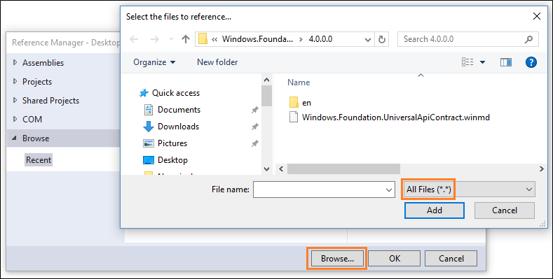

---
Description: Enhance your desktop application for Windows 10 users by using Windows Runtime APIs.
title: Call Windows Runtime APIs in desktop apps
ms.date: 08/20/2019
ms.topic: article
keywords: windows 10, uwp
ms.author: mcleans
author: mcleanbyron
ms.localizationpriority: medium
ms.custom: 19H1
---

# Call Windows Runtime APIs in desktop apps

You can use Universal Windows Platform (UWP) APIs to add modern experiences to your desktop apps that light up for Windows 10 users.

First, set up your project with the required references. Then, call Windows Runtime APIs from your code to add Windows 10 experiences to your desktop app. You can build separately for Windows 10 users or distribute the same binaries to all users regardless of which version of Windows they run.

Some Windows Runtime APIs are supported only in desktop apps that have [package identity](modernize-packaged-apps.md). For more information, see [Available Windows Runtime APIs](desktop-to-uwp-supported-api.md).

## Set up your project

You'll have to make a few changes to your project to use Windows Runtime APIs.

### Modify a .NET project to use Windows Runtime APIs

There are two options for .NET projects:

* If your app targets Windows 10 version 1803 or later, you can install a NuGet package that provides all the necessary references.
* Alternatively, you can add the references manually.

#### To use the NuGet option

1. Make sure [package references](/nuget/consume-packages/package-references-in-project-files) are enabled:

    1. In Visual Studio, click **Tools -> NuGet Package Manager -> Package Manager Settings**.
    2. Make sure **PackageReference** is selected for **Default package management format**.

2. With your project open in Visual Studio, right-click your project in **Solution Explorer** and choose **Manage NuGet Packages**.

3. In the **NuGet Package Manager** window, select the **Browse** tab and search for `Microsoft.Windows.SDK.Contracts`.

4. After the `Microsoft.Windows.SDK.Contracts` package is found, in the right pane of the **NuGet Package Manager** window select the **Version** of the package you want to install based on the version of Windows 10 you want to target:

    * **10.0.18362.xxxx**: Choose this for Windows 10, version 1903.
    * **10.0.17763.xxxx**: Choose this for Windows 10, version 1809.
    * **10.0.17134.xxxx**: Choose this for Windows 10, version 1803.

5. Click **Install**.

#### To add the required references manually

1. Open the **Reference Manager** dialog box, choose the **Browse** button, and then select  **All Files**.

    

2. Add a reference to all of the following files.

    |File|Location|
    |--|--|
    |System.Runtime.WindowsRuntime.dll|C:\Windows\Microsoft.NET\Framework\v4.0.30319|
    |System.Runtime.WindowsRuntime.UI.Xaml.dll|C:\Windows\Microsoft.NET\Framework\v4.0.30319|
    |System.Runtime.InteropServices.WindowsRuntime.dll|C:\Windows\Microsoft.NET\Framework\v4.0.30319|
    |windows.winmd|C:\Program Files (x86)\Windows Kits\10\UnionMetadata\\<*sdk version*>\Facade|
    |Windows.Foundation.UniversalApiContract.winmd|C:\Program Files (x86)\Windows Kits\10\References\\<*sdk version*>\Windows.Foundation.UniversalApiContract\\<*version*>|
    |Windows.Foundation.FoundationContract.winmd|C:\Program Files (x86)\Windows Kits\10\References\\<*sdk version*>\Windows.Foundation.FoundationContract\\<*version*>|

3. In the **Properties** window, set the **Copy Local** field of each *.winmd* file to **False**.

    

### Modify a C++ Win32 project to use Windows Runtime APIs

Use [C++/WinRT](/windows/uwp/cpp-and-winrt-apis/) to consume Windows Runtime APIs. C++/WinRT is an entirely standard modern C++17 language projection for Windows Runtime (WinRT) APIs, implemented as a header-file-based library, and designed to provide you with first-class access to the modern Windows API.

To configure your project for C++/WinRT:

* For new projects, you can install the [C++/WinRT Visual Studio Extension (VSIX)](https://marketplace.visualstudio.com/items?itemName=CppWinRTTeam.cppwinrt101804264) and use one of the C++/WinRT project templates included in that extension.
* For existing projects, you can install the [Microsoft.Windows.CppWinRT](https://www.nuget.org/packages/Microsoft.Windows.CppWinRT/) NuGet package in the project.

For more details about these options, see [this article](/windows/uwp/cpp-and-winrt-apis/intro-to-using-cpp-with-winrt#visual-studio-support-for-cwinrt-xaml-the-vsix-extension-and-the-nuget-package).

## Add Windows 10 experiences

Now you're ready to add modern experiences that light up when users run your application on Windows 10. Use this design flow.

:white_check_mark: **First, decide what experiences you want to add**

There's lots to choose from. For example, you can simplify your purchase order flow by using [monetization APIs](/windows/uwp/monetize), or [direct attention to your application](/windows/uwp/design/shell/tiles-and-notifications/adaptive-interactive-toasts) when you have something interesting to share, such as a new picture that another user has posted.


Even if users ignore or dismiss your message, they can see it again in the action center, and then click on the message to open your app. This increases engagement with your application and has the added bonus of making your application appear deeply integrated with the operating system. We'll show you the code for that experience a bit later in this article.

Visit the [UWP documentation](/windows/uwp/get-started/) for more ideas.

:white_check_mark: **Decide whether to enhance or extend**

You'll often hear us use the terms *enhance* and *extend*, so we'll take a moment to explain exactly what each of these terms mean.

We use the term *enhance* to describe Windows Runtime APIs that you can call directly from your desktop app (whether or not you have chosen to package your application in an MSIX package). When you've chosen a Windows 10 experience, identify the APIs that you need to create it, and then see if that API appears in [this list](desktop-to-uwp-supported-api.md). This is a list of APIs that you can call directly from your desktop app. If your API does not appear in this list, that's because the functionality associated with that API can run only within a UWP process. Often times, these include APIs that render UWP XAML such as a UWP map control or a Windows Hello security prompt.

> [!NOTE]
> Although APIs that render UWP XAML typically cannot be called directly from your desktop, you might be able to use alternative approaches. If you want to host UWP XAML controls or other custom visual experiences, you can use [XAML Islands](xaml-islands.md) (starting in Windows 10, version 1903) and the [Visual layer](visual-layer-in-desktop-apps.md) (starting in Windows 10, version 1803). These features can be used in packaged or unpackaged desktop apps.

If you have chosen to package your desktop app in an MSIX package, another option is to *extend* the application by adding a UWP project to your solution. The desktop project is still the entry point of your application, but the UWP project gives you access to all of the APIs that do not appear in [this list](desktop-to-uwp-supported-api.md). The desktop app can communicate with the UWP process by using a an app service and we have lots of guidance on how to set that up. If you want to add an experience that requires a UWP project, see [Extend with UWP components](desktop-to-uwp-extend.md).

:white_check_mark: **Reference API contracts**

If you can call the API directly from your desktop app, open a browser and search for the reference topic for that API.
Beneath the summary of the API, you'll find a table that describes the API contract for that API. Here's an example of that table:


If you have a .NET-based desktop app, add a reference to that API contract, and then set the **Copy Local** property of that file to **False**. If you have a C++-based project, add to your **Additional Include Directories**, a path to the folder that contains this contract.

:white_check_mark: **Call the APIs to add your experience**

Here's the code that you'd use to show the notification window that we looked at earlier. These APIs appear in this [list](desktop-to-uwp-supported-api.md) so you can add this code to your desktop app and run it right now.

```csharp
using Windows.Foundation;
using Windows.System;
using Windows.UI.Notifications;
using Windows.Data.Xml.Dom;
...

private void ShowToast()
{
    string title = "featured picture of the day";
    string content = "beautiful scenery";
    string image = "https://picsum.photos/360/180?image=104";
    string logo = "https://picsum.photos/64?image=883";

    string xmlString =
    $@"<toast><visual>
       <binding template='ToastGeneric'>
       <text>{title}</text>
       <text>{content}</text>
       <image src='{image}'/>
       <image src='{logo}' placement='appLogoOverride' hint-crop='circle'/>
       </binding>
      </visual></toast>";

    XmlDocument toastXml = new XmlDocument();
    toastXml.LoadXml(xmlString);

    ToastNotification toast = new ToastNotification(toastXml);

    ToastNotificationManager.CreateToastNotifier().Show(toast);
}
```

```C++
using namespace Windows::Foundation;
using namespace Windows::System;
using namespace Windows::UI::Notifications;
using namespace Windows::Data::Xml::Dom;

void UWP::ShowToast()
{
	Platform::String ^title = "featured picture of the day";
	Platform::String ^content = "beautiful scenery";
	Platform::String ^image = "https://picsum.photos/360/180?image=104";
	Platform::String ^logo = "https://picsum.photos/64?image=883";

	Platform::String ^xmlString =
		L"<toast><visual><binding template='ToastGeneric'>" +
		L"<text>" + title + "</text>" +
		L"<text>"+ content + "</text>" +
		L"<image src='" + image + "'/>" +
		L"<image src='" + logo + "'" +
		L" placement='appLogoOverride' hint-crop='circle'/>" +
		L"</binding></visual></toast>";

	XmlDocument ^toastXml = ref new XmlDocument();

	toastXml->LoadXml(xmlString);

	ToastNotificationManager::CreateToastNotifier()->Show(ref new ToastNotification(toastXml));
}
```

To learn more about notifications, see [Adaptive and Interactive toast notifications](/windows/uwp/design/shell/tiles-and-notifications/adaptive-interactive-toasts).

## Support Windows XP, Windows Vista, and Windows 7/8 install bases

You can modernize your application for Windows 10 without having to create a new branch and maintain separate code bases.

If you want to build separate binaries for Windows 10 users, use conditional compilation. If you'd prefer to build one set of binaries that you deploy to all Windows users, use runtime checks.

Let's take a quick look at each option.

### Conditional compilation

You can keep one code base and compile a set of binaries just for Windows 10 users.

First, add a new build configuration to your project.


For that build configuration, create a constant that to identify code that calls Windows Runtime APIs.  

For .NET-based projects, the constant is called a **Conditional Compilation Constant**.


For C++-based projects, the constant is called a **Preprocessor Definition**.


Add that constant before any block of UWP code.

```csharp

[System.Diagnostics.Conditional("_UWP")]
private void ShowToast()
{
 ...
}

```

```C++

#if _UWP
void UWP::ShowToast()
{
 ...
}
#endif

```

The compiler builds that code only if that constant is defined in your active build configuration.

### Runtime checks

You can compile one set of binaries for all of your Windows users regardless of which version of Windows they run. Your application calls Windows Runtime APIs only if the user is runs your application as a packaged application on Windows 10.

The easiest way to add runtime checks to your code is to install this Nuget package: [Desktop Bridge Helpers](https://www.nuget.org/packages/DesktopBridge.Helpers/) and then use the ``IsRunningAsUWP()`` method to gate off all code that calls Windows Runtime APIs. see this blog post for more details: [Desktop Bridge - Identify the application's context](/archive/blogs/appconsult/desktop-bridge-identify-the-applications-context).

## Related Samples

* [Hello World Sample](https://github.com/Microsoft/DesktopBridgeToUWP-Samples/tree/master/Samples/HelloWorldSample)
* [Secondary Tile](https://github.com/Microsoft/DesktopBridgeToUWP-Samples/tree/master/Samples/SecondaryTileSample)
* [Store API Sample](https://github.com/Microsoft/DesktopBridgeToUWP-Samples/tree/master/Samples/StoreSample)
* [WinForms application that implements a UWP UpdateTask](https://github.com/Microsoft/DesktopBridgeToUWP-Samples/tree/master/Samples/WinFormsUpdateTaskSample)
* [Desktop app bridge to UWP Samples](https://github.com/Microsoft/DesktopBridgeToUWP-Samples)

## Find answers to your questions

Have questions? Ask us on Stack Overflow. Our team monitors these [tags](https://stackoverflow.com/questions/tagged/project-centennial+or+desktop-bridge). You can also ask us [here](https://social.msdn.microsoft.com/Forums/en-US/home?filter=alltypes&sort=relevancedesc&searchTerm=%5BDesktop%20Converter%5D).