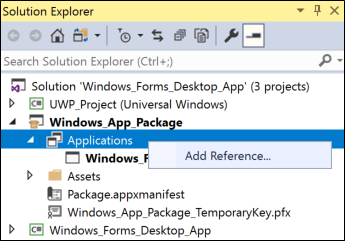
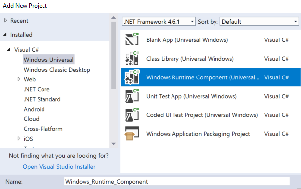
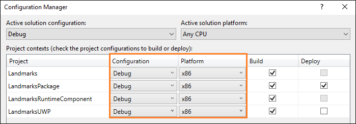
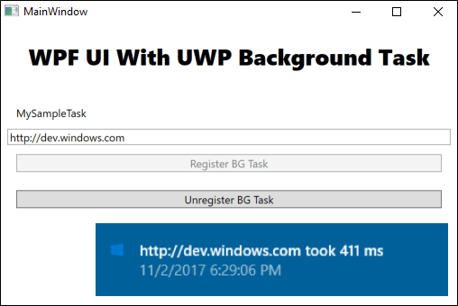
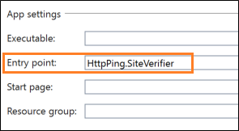

# Extend your desktop app with modern UWP components

Some Windows experiences (For example, a touch-enabled UI page) must run inside of an AppContainer. If you want to add such experiences, then extend your desktop app with UWP projects and Windows Runtime components.

In many cases you can call Windows Runtime APIs directly from your desktop application, so before you review this guide, see [Enhance for Windows](desktop-to-uwp-enhance.md).

> [!NOTE]
> The features described in this topic require that your app is packaged (has package identity at runtime). That includes packaged apps (see [Create a new project for a packaged WinUI 3 desktop app](../../winui/winui3/create-your-first-winui3-app.md#packaged-create-a-new-project-for-a-packaged-c-or-c-winui-3-desktop-app)) and packaged apps with external location (see [Grant package identity by packaging with external location](./grant-identity-to-nonpackaged-apps.md)). Also see [Features that require package identity](./modernize-packaged-apps.md).

## First, set up your solution

Add one or more UWP projects and runtime components to your solution.

Start with a solution that contains a **Windows Application Packaging Project** with a reference to your desktop application.

This image shows an example solution.


If your solution doesn't contain a packaging project, see [Package your desktop application by using Visual Studio](/windows/msix/desktop/desktop-to-uwp-packaging-dot-net).

### Configure the desktop application

Make sure that your desktop application has references to the files that you need to call Windows Runtime APIs.

To do this, see [Call Windows Runtime APIs in desktop apps](desktop-to-uwp-enhance.md).

### Add a UWP project

Add a **Blank App (Universal Windows)** to your solution.

This is where you'll build a modern XAML UI or use APIs that run only within a UWP process.


In your packaging project, right-click the **Applications** node, and then click **Add Reference**.



Then, add a reference the UWP project.


Your solution will look something like this:


### (Optional) Add a Windows Runtime component

To accomplish some scenarios, you'll have to add code to a Windows Runtime component.



Then, from your UWP project, add a reference to the runtime component. Your solution will look something like this:


### Build your solution

Build your solution to ensure that no errors appear. If you receive errors, open **Configuration Manager** and ensure that your projects target the same platform.



Let's take a look at a few things you can do with your UWP projects and runtime components.

## Show a modern XAML UI

As part of your application flow, you can incorporate modern XAML-based user interfaces into your desktop application. These user interfaces are naturally adaptive to different screen sizes and resolutions and support modern interactive models such as touch and ink.

For example, with a small amount of XAML markup, you can give users with powerful map-related visualization features.

This image shows a Windows Forms application that opens a XAML-based modern UI that contains a map control.


>[!NOTE]
>This example shows a XAML UI by adding a UWP project to the solution. That is the stable supported approach to showing XAML UIs in a desktop application. The alternative to this approach is to add UWP XAML controls directly to your desktop application by using a XAML Island. XAML Islands are currently available as a developer preview. Although we encourage you to try them out in your own prototype code now, we do not recommend that you use them in production code at this time. These APIs and controls will continue to mature and stabilize in future Windows releases. To learn more about XAML Islands, see [UWP controls in desktop applications](xaml-islands/xaml-islands.md)

### The design pattern

To show a XAML-based UI, do these things:

:one: [Set up your solution](#set-up-your-solution)

:two: [Create a XAML UI](#xaml-UI)

:three: [Add a protocol extension to the UWP project](#add-a-protocol-extension)

:four: [Start the UWP app from your desktop app](#start)

:five: [In the UWP project, show the page that you want](#parse)

### Set up your solution

For general guidance on how to set up your solution, see the [First, set up your solution](#first-set-up-your-solution) section at the beginning of this guide.

Your solution would look something like this:


In this example, the Windows Forms project is named **Landmarks** and the UWP project that contains the XAML UI is named **MapUI**.

<a id="xaml-UI"></a>

### Create a XAML UI

Add a XAML UI to your UWP project. Here's the XAML for a basic map.

```xml
<Grid Background="{ThemeResource ApplicationPageBackgroundThemeBrush}" Margin="12,20,12,14">
    <Grid.ColumnDefinitions>
        <ColumnDefinition Width="Auto"/>
        <ColumnDefinition Width="*"/>
    </Grid.ColumnDefinitions>
    <maps:MapControl x:Name="myMap" Grid.Column="0" Width="500" Height="500"
                     ZoomLevel="{Binding ElementName=zoomSlider,Path=Value, Mode=TwoWay}"
                     Heading="{Binding ElementName=headingSlider,Path=Value, Mode=TwoWay}"
                     DesiredPitch="{Binding ElementName=desiredPitchSlider,Path=Value, Mode=TwoWay}"
                     HorizontalAlignment="Left"
                     MapServiceToken="<Your Key Goes Here" />
    <Grid Grid.Column="1" Margin="12">
        <StackPanel>
            <Slider Minimum="1" Maximum="20" Header="ZoomLevel" Name="zoomSlider" Value="17.5"/>
            <Slider Minimum="0" Maximum="360" Header="Heading" Name="headingSlider" Value="0"/>
            <Slider Minimum="0" Maximum="64" Header=" DesiredPitch" Name="desiredPitchSlider" Value="32"/>
        </StackPanel>
    </Grid>
</Grid>
```

### Add a protocol extension

In **Solution Explorer**, open the **package.appxmanifest** file of the Packaging project in your solution, and add this extension.

```xml
<Extensions>
  <uap:Extension Category="windows.protocol" Executable="MapUI.exe" EntryPoint="MapUI.App">
    <uap:Protocol Name="xamluidemo" />
  </uap:Extension>
</Extensions>
```

Give the protocol a name, provide the name of the executable produced by the UWP project, and the name of the entry point class.

You can also open the **package.appxmanifest** in the designer, choose the **Declarations** tab, and then add the extension there.


> [!NOTE]
> Map controls download data from the internet so if you use one, you'll have to add the "internet client" capability to your manifest as well.

<a id="start"></a>

### Start the UWP app

First, from your desktop application, create a [Uri](/dotnet/api/system.uri) that includes the protocol name and any parameters you want to pass into the UWP app. Then, call the [LaunchUriAsync](/uwp/api/windows.system.launcher.launchuriasync) method.

```csharp

private void Statue_Of_Liberty_Click(object sender, EventArgs e)
{
    ShowMap(40.689247, -74.044502);
}

private async void ShowMap(double lat, double lon)
{
    string str = "xamluidemo://";

    Uri uri = new Uri(str + "location?lat=" +
        lat.ToString() + "&?lon=" + lon.ToString());

    var success = await Windows.System.Launcher.LaunchUriAsync(uri);

}
```

<a id="parse"></a>

### Parse parameters and show a page

In the **App** class of your UWP project, override the **OnActivated** event handler. If the app is activated by your protocol, parse the parameters and then open the page that you want.

```csharp
protected override void OnActivated(Windows.ApplicationModel.Activation.IActivatedEventArgs e)
{
    if (e.Kind == ActivationKind.Protocol)
    {
        ProtocolActivatedEventArgs protocolArgs = (ProtocolActivatedEventArgs)e;
        Uri uri = protocolArgs.Uri;
        if (uri.Scheme == "xamluidemo")
        {
            Frame rootFrame = new Frame();
            Window.Current.Content = rootFrame;
            rootFrame.Navigate(typeof(MainPage), uri.Query);
            Window.Current.Activate();
        }
    }
}
```

In the code behind your XAML page, override the ``OnNavigatedTo`` method to use the parameters passed into the page. In this case, we'll use the latitude and longitude that were passed into this page to show a location in a map.

```csharp
protected override void OnNavigatedTo(NavigationEventArgs e)
 {
     if (e.Parameter != null)
     {
         WwwFormUrlDecoder decoder = new WwwFormUrlDecoder(e.Parameter.ToString());

         double lat = Convert.ToDouble(decoder[0].Value);
         double lon = Convert.ToDouble(decoder[1].Value);

         BasicGeoposition pos = new BasicGeoposition();

         pos.Latitude = lat;
         pos.Longitude = lon;

         myMap.Center = new Geopoint(pos);

         myMap.Style = MapStyle.Aerial3D;

     }

     base.OnNavigatedTo(e);
 }
```

## Making your desktop application a share target

You can make your desktop application a share target so that users can easily share data such as pictures from other apps that support sharing.

For example, users could choose your application to share pictures from Microsoft Edge, the Photos app. Here's a WPF sample application that has that capability.

.

See the complete sample [here](https://github.com/Microsoft/Windows-Packaging-Samples/tree/master/ShareTarget)

### The design pattern

To make your application a share target, do these things:

:one: [Add a share target extension](#share-extension)

:two: [Override the OnShareTargetActivated event handler](#override)

:three: [Add desktop extensions to the UWP project](#desktop-extensions)

:four: [Add the full trust process extension](#full-trust)

:five: [Modify the desktop application to get the shared file](#modify-desktop)

<a id="share-extension"></a>

The following steps  

### Add a share target extension

In **Solution Explorer**, open the **package.appxmanifest** file of the Packaging project in your solution and add the share target extension.

```xml
<Extensions>
      <uap:Extension
          Category="windows.shareTarget"
          Executable="ShareTarget.exe"
          EntryPoint="App">
        <uap:ShareTarget>
          <uap:SupportedFileTypes>
            <uap:SupportsAnyFileType />
          </uap:SupportedFileTypes>
          <uap:DataFormat>Bitmap</uap:DataFormat>
        </uap:ShareTarget>
      </uap:Extension>
</Extensions>  
```

Provide the name of the executable produced by the UWP project, and the name of the entry point class. This markup assumes that the name of the executable for your UWP app is `ShareTarget.exe`.

You'll also have to specify what types of files can be shared with your app. In this example, we are making the [WPF PhotoStoreDemo](https://github.com/Microsoft/WPF-Samples/tree/master/Sample%20Applications/PhotoStoreDemo) desktop application a share target for bitmap images so we specify `Bitmap` for the supported file type.

<a id="override"></a>

### Override the OnShareTargetActivated event handler

Override the **OnShareTargetActivated** event handler in the **App** class of your UWP project.

This event handler is called when users choose your app to share their files.

```csharp

protected override void OnShareTargetActivated(ShareTargetActivatedEventArgs args)
{
    shareWithDesktopApplication(args.ShareOperation);
}

private async void shareWithDesktopApplication(ShareOperation shareOperation)
{
    if (shareOperation.Data.Contains(StandardDataFormats.StorageItems))
    {
        var items = await shareOperation.Data.GetStorageItemsAsync();
        StorageFile file = items[0] as StorageFile;
        IRandomAccessStreamWithContentType stream = await file.OpenReadAsync();

        await file.CopyAsync(ApplicationData.Current.LocalFolder);
            shareOperation.ReportCompleted();

        await FullTrustProcessLauncher.LaunchFullTrustProcessForCurrentAppAsync();
    }
}
```

In this code, we save the image that is being shared by the user into a apps local storage folder. Later, we'll modify the desktop application to pull images from that same folder. The desktop application can do that because it is included in the same package as the UWP app.

<a id="desktop-extensions"></a>

### Add desktop extensions to the UWP project

Add the **Windows Desktop Extensions for the UWP** extension to the UWP app project. You'll see more than one version of the extension (for example, 10.0.18362.0 and 10.0.19041.0). For info about how to choose a version, see [Extension SDKs, and how to reference them](/uwp/extension-sdks/device-families-overview#extension-sdks-and-how-to-reference-them).


<a id="full-trust"></a>

### Add the full trust process extension

In **Solution Explorer**, open the **package.appxmanifest** file of the Packaging project in your solution, and then add the full trust process extension next to the share target extension that you add this file earlier.

```xml
<Extensions>
  ...
      <desktop:Extension Category="windows.fullTrustProcess" Executable="PhotoStoreDemo\PhotoStoreDemo.exe" />
  ...
</Extensions>  
```

This extension will enable the UWP app to start the desktop application to which you would like the share a file. In example, we refer to the executable of the [WPF PhotoStoreDemo](https://github.com/Microsoft/WPF-Samples/tree/master/Sample%20Applications/PhotoStoreDemo) desktop application.

<a id="modify-desktop"></a>

### Modify the desktop application to get the shared file

Modify your desktop application to find and process the shared file. In this example, the UWP app stored the shared file in the local app data folder. Therefore, we would modify the [WPF PhotoStoreDemo](https://github.com/Microsoft/WPF-Samples/tree/master/Sample%20Applications/PhotoStoreDemo) desktop application to pull photos from that folder.

```csharp
Photos.Path = Windows.Storage.ApplicationData.Current.LocalFolder.Path;
```

For instances of the desktop application that are already open by the user, we might also handle the [FileSystemWatcher](/dotnet/api/system.io.filesystemwatcher) event and pass in the path to the file location. That way any open instances of the desktop application will show the shared photo.

```csharp
...

   FileSystemWatcher watcher = new FileSystemWatcher(Photos.Path);

...

private void Watcher_Created(object sender, FileSystemEventArgs e)
{
    // new file got created, adding it to the list
    Dispatcher.BeginInvoke(System.Windows.Threading.DispatcherPriority.Normal, new Action(() =>
    {
        if (File.Exists(e.FullPath))
        {
            ImageFile item = new ImageFile(e.FullPath);
            Photos.Insert(0, item);
            PhotoListBox.SelectedIndex = 0;
            CurrentPhoto.Source = (BitmapSource)item.Image;
        }
    }));
}

```

## Create a background task

You add a background task to run code even when the app is suspended. Background tasks are great for small tasks that don't require the user interaction. For example, your task can download mail, show a toast notification about an incoming chat message, or react to a change in a system condition.

Here's a WPF sample application that registers a background task.



The task makes an http request and measures the time that it takes for the request to return a response. Your tasks will likely be much more interesting, but this sample is great for learning the basic mechanics of a background task.

See the complete sample [here](https://github.com/Microsoft/Windows-Packaging-Samples/tree/master/BGTask).

### The design pattern

To create a background service, do these things:

:one: [Implement the background task](#implement-task)

:two: [Configure the background task](#configure-background-task)

:three: [Register the background task](#register-background-task)

<a id="implement-task"></a>

### Implement the background task

Implement the background task by adding code to a Windows Runtime component project.

```csharp
public sealed class SiteVerifier : IBackgroundTask
{
    public async void Run(IBackgroundTaskInstance taskInstance)
    {

        taskInstance.Canceled += TaskInstance_Canceled;
        BackgroundTaskDeferral deferral = taskInstance.GetDeferral();
        var msg = await MeasureRequestTime();
        ShowToast(msg);
        deferral.Complete();
    }

    private async Task<string> MeasureRequestTime()
    {
        string msg;
        try
        {
            var url = ApplicationData.Current.LocalSettings.Values["UrlToVerify"] as string;
            var http = new HttpClient();
            Stopwatch clock = Stopwatch.StartNew();
            var response = await http.GetAsync(new Uri(url));
            response.EnsureSuccessStatusCode();
            var elapsed = clock.ElapsedMilliseconds;
            clock.Stop();
            msg = $"{url} took {elapsed.ToString()} ms";
        }
        catch (Exception ex)
        {
            msg = ex.Message;
        }
        return msg;
    }
```

<a id="configure-background-task"></a>

### Configure the background task

In the manifest designer, open the **package.appxmanifest** file of the Packaging project in your solution.

In the **Declarations** tab, add a **Background Tasks** declaration.


Then, choose the desired properties. Our sample uses the **Timer** property.


Provide the fully qualified name of the class in your Windows Runtime component that implements the background task.



<a id="register-background-task"></a>

### Register the background task

Add code to your desktop application project that registers the background task.

```csharp
public void RegisterBackgroundTask(String triggerName)
{
    var current = BackgroundTaskRegistration.AllTasks
        .Where(b => b.Value.Name == triggerName).FirstOrDefault().Value;

    if (current is null)
    {
        BackgroundTaskBuilder builder = new BackgroundTaskBuilder();
        builder.Name = triggerName;
        builder.SetTrigger(new MaintenanceTrigger(15, false));
        builder.TaskEntryPoint = "HttpPing.SiteVerifier";
        builder.Register();
        System.Diagnostics.Debug.WriteLine("BGTask registered:" + triggerName);
    }
    else
    {
        System.Diagnostics.Debug.WriteLine("Task already:" + triggerName);
    }
}
```

## Find answers to your questions

Have questions? Ask us on Stack Overflow. Our team monitors these [tags](https://stackoverflow.com/questions/tagged/project-centennial+or+desktop-bridge). You can also ask us [here](https://social.msdn.microsoft.com/Forums/en-US/home?filter=alltypes&sort=relevancedesc&searchTerm=%5BDesktop%20Converter%5D).