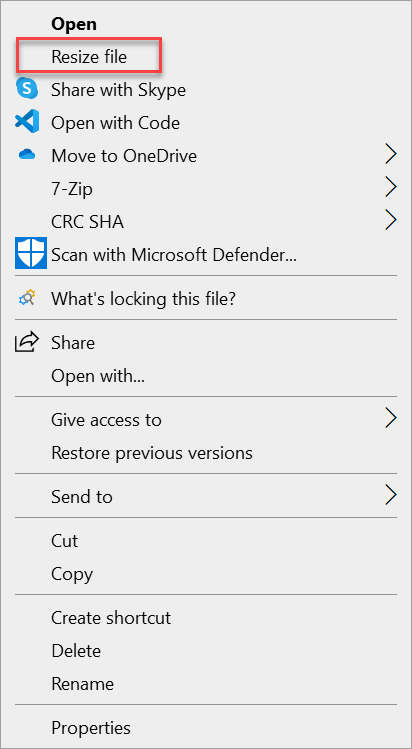
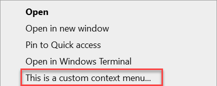
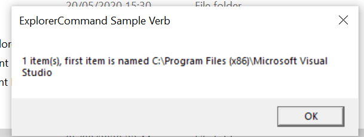

# Integrate a packaged desktop app with File Explorer

Some Windows apps define File Explorer extensions that add context menu entries that enable customers to perform options related to the app. Older Windows app deployment technologies such MSI and ClickOnce define File Explorer extensions through the registry. The registry has a series of hives which control File Explorer extensions and other types of Shell extensions. These installers typically create a series of registry keys to configure the various items to include in the context menu.

If you package your Windows app using [MSIX](/windows/msix/), the registry is virtualized, and therefore your app can't register File Explorer extensions via the registry. Instead, you must define your File Explorer extensions via package extensions, which you define in the package manifest. This article describes several ways to do this.

You can find the complete sample code used in this article [on GitHub](https://github.com/microsoft/Windows-AppConsult-Samples-DesktopBridge/tree/main/Docs-ContextMenuSample).

## Add a context menu entry that supports startup parameters

One of the simplest ways to integrate with File Explorer is to define a package extension that adds your app to the list of available apps in the context menu when a user right-clicks a specific file type in File Explorer. If the user opens your app, your extension can pass parameters to your app.

This scenario has several limitations:

* It works only in combination with the [file type association feature](/windows/uwp/launch-resume/handle-file-activation). You can display additional options in the context menu only for file types which are associated with the main app (for example, your app supports opening a file by double-clicking it in File Explorer).
* The options in the context menu will be displayed only if your app is set as default for that file type.
* The only supported action is to launch the main executable of the app (that is, the same executable that is connected to the Start menu entry). However, every action can specify different parameters, which you can use when the apps start to understand which action triggered the execution and perform different tasks.

Despite these limitations, this approach is sufficient for many scenarios. For example, if you're building an image editor, you can easily add an entry in the context menu to resize an image, which will launch the image editor directly with a wizard to start the resizing process.

### Implement the context menu entry

To support this scenario, add an [Extension](/uwp/schemas/appxpackage/uapmanifestschema/element-uap-extension) element with the category `windows.fileTypeAssociation` to your package manifest. This element must be added as a child of the [Extensions](/uwp/schemas/appxpackage/uapmanifestschema/element-1-extensions) element under the [Application](/uwp/schemas/appxpackage/uapmanifestschema/element-application) element.

The following example demonstrates a registration for an app that enables context menus for files with the `.foo` extension. This example specifies the `.foo` extension because this is a fake extension that is typically not registered to other apps on any given computer. If you need to manage a file type which might already be taken (like .txt or .jpg), remember that you won't be able to see the option until your app is set as default for that file type. This example is an excerpt from the [Package.appxmanifest](https://github.com/microsoft/Windows-AppConsult-Samples-DesktopBridge/blob/main/Docs-ContextMenuSample/ContextMenuSample.Package/Package.appxmanifest) file in the related sample on GitHub.

```xml
<Extensions>
  <uap3:Extension Category="windows.fileTypeAssociation">
    <uap3:FileTypeAssociation Name="foo" Parameters="&quot;%1&quot;">
      <uap:SupportedFileTypes>
        <uap:FileType>.foo</uap:FileType>
      </uap:SupportedFileTypes>
      <uap2:SupportedVerbs>
        <uap3:Verb Id="Resize" Parameters="&quot;%1&quot; /p">Resize file</uap3:Verb>
      </uap2:SupportedVerbs>
    </uap3:FileTypeAssociation>
  </uap3:Extension>
</Extensions>
```

This example assumes that the following namespaces and aliases are declared in the root `<Package>` element in the manifest.

```xml
<Package
  xmlns="http://schemas.microsoft.com/appx/manifest/foundation/windows10"
  xmlns:uap="http://schemas.microsoft.com/appx/manifest/uap/windows10"
  xmlns:uap2="http://schemas.microsoft.com/appx/manifest/uap/windows10/2"
  xmlns:uap3="http://schemas.microsoft.com/appx/manifest/uap/windows10/3"
  xmlns:rescap="http://schemas.microsoft.com/appx/manifest/foundation/windows10/restrictedcapabilities"
  IgnorableNamespaces="uap uap2 uap3 rescap">
  ...
</Package>
```

The [FileTypeAssociation](/uwp/schemas/appxpackage/uapmanifestschema/element-uap-filetypeassociation) element associates your app with the file type(s) you want to support. For more details, see [Associate your packaged application with a set of file types](desktop-to-uwp-extensions.md#associate-your-packaged-application-with-a-set-of-file-types). Here are the most important items related to this element.

| Attribute or element | Description |
|----------------------|-------------|
| `Name` attribute | Matches the name of the extension you want to register minus the dot (in the previous example, `foo`). |
| `Parameters` attribute | Contains the parameters you want to pass to your application when the user double-clicks a file with such extension. Typically, at least, you pass `%1`, which is a special parameter that contains the path of the selected file. This way, when you double click on a file, the application knows its full path and can load it. |
| [SupportedFileTypes](/uwp/schemas/appxpackage/uapmanifestschema/element-uap-supportedfiletypes) element | Specifies the name(s) of the extension you want to register, including the dot (in this example, `.foo`). You can specify multiple `<FileType>` entries you want to support more file types. |

To define the context menu integration, you must also add the [SupportedVerbs](/uwp/schemas/appxpackage/uapmanifestschema/element-uap2-supportedverbs) child element. This element contains one or more [Verb](/uwp/schemas/appxpackage/uapmanifestschema/element-uap3-verb) elements that define the options that will be listed when a user right-clicks a file with the .foo extension in File Explorer. For more details, see [Add options to the context menus of files that have a certain file type](desktop-to-uwp-extensions.md#add-options-to-the-context-menus-of-files-that-have-a-certain-file-type). Here are the most important items related to the [Verb](/uwp/schemas/appxpackage/uapmanifestschema/element-uap3-verb) element.

| Attribute or element | Description |
|----------------------|-------------|
| `Id` attribute | Specifies the unique identifier for the action.|
| `Parameters` attribute | Similar to the [FileTypeAssociation](/uwp/schemas/appxpackage/uapmanifestschema/element-uap-filetypeassociation) element, this attribute for the [Verb](/uwp/schemas/appxpackage/uapmanifestschema/element-uap3-verb) element contains the parameters that are passed to your application when the user clicks the context menu entry. Typically, other than the `%1` special parameter to get the path of the selected file, you pass also one or more parameters to get the context. This enables your app to understand that it was opened from a context menu entry.  |
| Element value | The value of the [Verb](/uwp/schemas/appxpackage/uapmanifestschema/element-uap3-verb) element contains the label to display in the context menu entry (in this example, **Resize file**). |

### Access the startup parameters in your app code

The way your app receives the parameters depends on the type of app you have created. For example, a WPF app typically processes startup event args in the `OnStartup` method of the `App` class. You can check if there are startup parameters and, based on the outcome, take the most appropriate action (like opening a specific window of the application instead of the main one).

```csharp
public partial class App : Application
{
    protected override void OnStartup(StartupEventArgs e)
    {
        if (e.Args.Contains("Resize"))
        {
            // Open a specific window of the app.
        }
        else
        {
            MainWindow main = new MainWindow();
            main.Show();
        }
    }
}
```

The following screenshot demonstrates the **Resize File** context menu entry created by the previous example.



## Support generic files or folders and perform complex tasks

Although using the [FileTypeAssociation](/uwp/schemas/appxpackage/uapmanifestschema/element-uap-filetypeassociation) extension in the package manifest as described in the previous section is sufficient for many scenarios, you may find it limiting. The two biggest challenges are:

* You can handle only file types you are associated with. For example, you can't handle a generic folder.
* You can only launch the app with a series of parameters. You can't perform advanced operations, like launching another executable or performing a task without opening the main app.

To achieve these goals, you must create a [Shell extension](/windows/win32/shell/shell-exts), which provides more powerful ways to integrate with File Explorer. In this scenario, you create a DLL that contains everything required to manage the file context menu, including the label, icon, state, and tasks to perform. Because this functionality is implemented in a DLL, you can do nearly everything that you can do with a normal app. After you implement the DLL, you must register it via extensions you define in your package manifest.

> [!NOTE]
> The process described in this section has one limitation. After the MSIX package that contains the extension is installed on a target computer, File Explorer must be restarted before the Shell extension can be loaded. To accomplish this, the user can restart the computer, or they can restart the **explorer.exe** process using **Task Manager**.

### Implement the Shell extension

Shell extensions are based on [COM (Component Object Model)](/windows/win32/com/component-object-model--com--portal). Your DLL exposes one or more COM objects that are registered in the system registry. Windows discovers these COM objects and integrates your extension with File Explorer. Because you're integrating your code with the Windows Shell, performance and memory footprint is important. Therefore, these kinds of extensions are typically built with C++.

For sample code that illustrates how to implement Shell extensions, see the [ExplorerCommandVerb](https://github.com/microsoft/Windows-AppConsult-Samples-DesktopBridge/tree/main/Docs-ContextMenuSample/ExplorerCommandVerb) project in the related sample on GitHub. This project is based on [this sample](https://github.com/microsoft/Windows-classic-samples/tree/master/Samples/Win7Samples/winui/shell/appshellintegration/ExplorerCommandVerb) in the Windows desktop samples, and it has several revisions to make the sample more easy to use with the latest versions of Visual Studio.

This project contains a lot of boilerplate code for different tasks, such as dynamic vs static menus and manual registration of the DLL. Most of this code isn't needed if you're packaging your app using MSIX, because the packaging support will take care of these tasks for you. The [ExplorerCommandVerb.cpp](https://github.com/microsoft/Windows-AppConsult-Samples-DesktopBridge/blob/main/Docs-ContextMenuSample/ExplorerCommandVerb/ExplorerCommandVerb.cpp) file contains the implementation of the context menu, and this is the main code file of interest for this walkthrough.

The key function is `CExplorerCommandVerb::Invoke`. This is the function that is invoked when a user clicks on the entry in the context menu. In the sample, to minimize the impact on the performance, the operation is performed on another thread, so you will actually find the real implementation in `CExplorerCommandVerb::_ThreadProc`.

```cpp
DWORD CExplorerCommandVerb::_ThreadProc()
{
	IShellItemArray* psia;
	HRESULT hr = CoGetInterfaceAndReleaseStream(_pstmShellItemArray, IID_PPV_ARGS(&psia));
	_pstmShellItemArray = NULL;
	if (SUCCEEDED(hr))
	{
		DWORD count;
		psia->GetCount(&count);

		IShellItem2* psi;
		HRESULT hr = GetItemAt(psia, 0, IID_PPV_ARGS(&psi));
		if (SUCCEEDED(hr))
		{
			PWSTR pszName;
			hr = psi->GetDisplayName(SIGDN_DESKTOPABSOLUTEPARSING, &pszName);
			if (SUCCEEDED(hr))
			{
				WCHAR szMsg[128];
				StringCchPrintf(szMsg, ARRAYSIZE(szMsg), L"%d item(s), first item is named %s", count, pszName);

				MessageBox(_hwnd, szMsg, L"ExplorerCommand Sample Verb", MB_OK);

				CoTaskMemFree(pszName);
			}

			psi->Release();
		}
		psia->Release();
	}

	return 0;
}
```

When a user right-clicks on a file or folder, this function displays a message box with the full path of the selected file or folder. If you want to customize the Shell extension in other ways, you can extend the following functions in the sample:

- You can change the [GetTitle](/windows/win32/api/shobjidl_core/nf-shobjidl_core-iexplorercommand-gettitle) function to customize the label of the entry in the context menu.
- You can change the [GetIcon](/windows/win32/api/shobjidl_core/nf-shobjidl_core-iexplorercommand-geticon) function to customize the icon displayed near the entry in the context menu.
- You can change the [GetTooltip](/windows/win32/api/shobjidl_core/nf-shobjidl_core-iexplorercommand-gettooltip) function to customize the tooltip which is displayed when you hover the entry in the context menu.

### Register the Shell extension

Because the Shell extension is based on COM, the implementation DLL must be exposed as a COM server so that Windows can integrate it with File Explorer. Typically, this is done by assigning a unique ID (called CLSID) to the COM server and by registering it in a specific hive of the system registry. In the [ExplorerCommandVerb](https://github.com/microsoft/Windows-AppConsult-Samples-DesktopBridge/tree/main/Docs-ContextMenuSample/ExplorerCommandVerb) project, the CLSID for the `CExplorerCommandVerb` extension is defined in the [Dll.h](https://github.com/microsoft/Windows-AppConsult-Samples-DesktopBridge/blob/main/Docs-ContextMenuSample/ExplorerCommandVerb/Dll.h) file.

```cpp
class __declspec(uuid("CC19E147-7757-483C-B27F-3D81BCEB38FE")) CExplorerCommandVerb;
```

When you package a Shell extension DLL in an MSIX package, you follow a similar approach. However, the GUID must registered inside the package manifest instead of the registry, as explained [here](https://blogs.windows.com/windowsdeveloper/2017/04/13/com-server-ole-document-support-desktop-bridge/).

In your package manifest, start by adding the following namespaces to your **Package** element.

```xml
<Package
  xmlns:desktop="http://schemas.microsoft.com/appx/manifest/desktop/windows10"
  xmlns:desktop4="http://schemas.microsoft.com/appx/manifest/desktop/windows10/4"
  xmlns:desktop5="http://schemas.microsoft.com/appx/manifest/desktop/windows10/5"
  xmlns:com="http://schemas.microsoft.com/appx/manifest/com/windows10" 
  IgnorableNamespaces="desktop desktop4 desktop5 com">
    
    ...
</Package>
```

To register the CLSID, add a [com.Extension](/uwp/schemas/appxpackage/uapmanifestschema/element-com-comserver) element with the category `windows.comServer` to your package manifest. This element must be added as a child of the [Extensions](/uwp/schemas/appxpackage/uapmanifestschema/element-1-extensions) element under the [Application](/uwp/schemas/appxpackage/uapmanifestschema/element-application) element. This example is an excerpt from the [Package.appxmanifest](https://github.com/microsoft/Windows-AppConsult-Samples-DesktopBridge/blob/main/Docs-ContextMenuSample/ContextMenuSample.Package/Package.appxmanifest) file in the related sample on GitHub.

```xml
<com:Extension Category="windows.comServer">
  <com:ComServer>
    <com:SurrogateServer DisplayName="ContextMenuSample">
      <com:Class Id="CC19E147-7757-483C-B27F-3D81BCEB38FE" Path="ExplorerCommandVerb.dll" ThreadingModel="STA"/>
    </com:SurrogateServer>
  </com:ComServer>
</com:Extension>
```

There are two critical attributes to configure in the [com:Class](/uwp/schemas/appxpackage/uapmanifestschema/element-com-surrogateserver-class) element.

| Attribute | Description |
|----------------------|-------------|
| `Id` attribute | This must match with the CLSID of the object you want to register. In this example, this is the CLSID declared in the `Dll.h` file associated to the `CExplorerCommandVerb` class. |
| `Path` attribute | This must contain the name of the DLL that exposes the COM object. This example includes the DLL in the root of the package, so it can just specify the name of the DLL generated by the `ExplorerCommandVerb` project. |

Next, add another extension that registers the file context menu. To do this, add a [desktop4:Extension](/uwp/schemas/appxpackage/uapmanifestschema/element-desktop4-extension) element with the category `windows.fileExplorerContextMenus` to your package manifest. This element must also be added as a child of the [Extensions](/uwp/schemas/appxpackage/uapmanifestschema/element-1-extensions) element under the [Application](/uwp/schemas/appxpackage/uapmanifestschema/element-application) element.

```xml
<desktop4:Extension Category="windows.fileExplorerContextMenus">
  <desktop4:FileExplorerContextMenus>
    <desktop5:ItemType Type="Directory">
      <desktop5:Verb Id="Command1" Clsid="CC19E147-7757-483C-B27F-3D81BCEB38FE" />
    </desktop5:ItemType>
  </desktop4:FileExplorerContextMenus>
</desktop4:Extension>
```

There are two critical attributes to configure under the [desktop4:Extension](/uwp/schemas/appxpackage/uapmanifestschema/element-desktop4-extension) element.

| Attribute or element | Description |
|----------------------|-------------|
| `Type` attribute of [desktop5:ItemType](/uwp/schemas/appxpackage/uapmanifestschema/element-desktop5-itemtype) | This defines the type of items you want to associate with the context menu. It could be a star (`*`) if you want to display it for all the files; it could be a specific file extension (`.foo`); or it can be available for folders (`Directory`). |
| `Clsid` attribute of [desktop5:Verb](/uwp/schemas/appxpackage/uapmanifestschema/element-desktop5-verb) | This must match the CLSID that you have previously registered as COM server in the package manifest file. |

### Configure the DLL in the package

Include the DLL that implements the Shell extension (in this sample, **ExplorerCommandVerb.dll**) in the root of the MSIX package. If you're using the [Windows Application Packaging Project](/windows/msix/desktop/desktop-to-uwp-packaging-dot-net), the easiest solution is to copy and paste the DLL into the project and make sure that the **Copy to Output Directory** option for the DLL file properties is set to **Copy if newer**.

To make sure that the package always includes the most recent version of the DLL, you can add a [post-build event](/visualstudio/ide/specifying-custom-build-events-in-visual-studio) to the Shell extension project so that, every time you build it, the DLL is copied to the Windows Application Packaging Project.

### Restart File Explorer

After you install the Shell extension package, you must restart File Explorer before the Shell extension can be loaded. This is a limitation of Shell extensions that are deployed and registered via MSIX packages.

To test the Shell extension, restart your PC or restart the **explorer.exe** process using **Task Manager**. After you do to that, you should be able to see the entry in the context menu.



If you click on it, the `CExplorerCommandVerb::_ThreadProc` function will be called to display the message box with the path of the selected folder.


