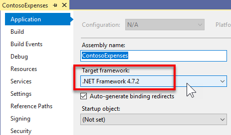
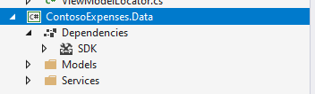
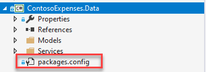
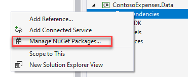
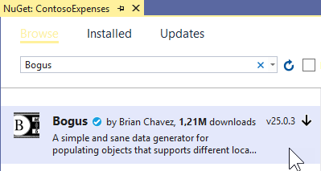
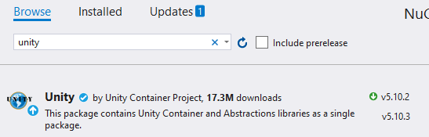
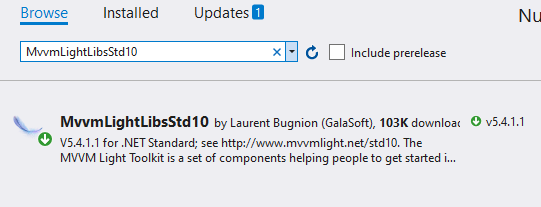
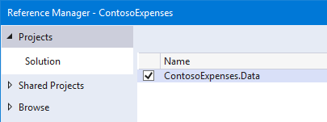
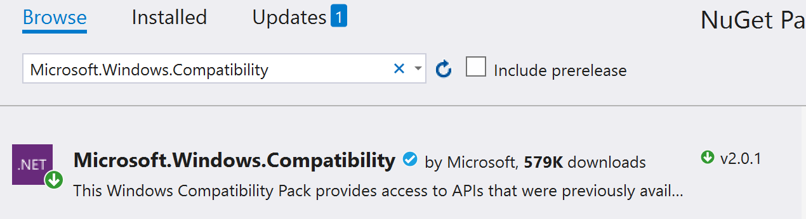
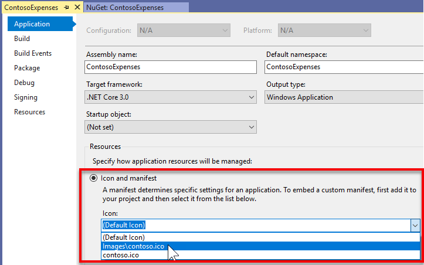

# Part 1: Migrate the Contoso Expenses app to .NET Core 3

This is the first part of a tutorial that demonstrates how to modernize a sample WPF desktop app named Contoso Expenses. For an overview of the tutorial, prerequisites, and instructions for downloading the sample app, see [Tutorial: Modernize a WPF app](modernize-wpf-tutorial.md).
  
In this part of the tutorial, you will migrate the entire Contoso Expenses app from the .NET Framework 4.7.2 to [.NET Core 3](modernize-wpf-tutorial.md#net-core-3). Before you start this part of the tutorial, make sure you [open and build the ContosoExpenses sample](modernize-wpf-tutorial.md#get-the-contoso-expenses-sample-app) in Visual Studio 2019.

> [!NOTE]
> For more information about migrating a WPF application from the .NET Framework to .NET Core 3, see [this blog series](https://devblogs.microsoft.com/dotnet/migrating-a-sample-wpf-app-to-net-core-3-part-1/).

## Migrate the ContosoExpenses project to .NET Core 3

In this section, you'll migrate the ContosoExpenses project in the Contoso Expenses app to .NET Core 3. You'll do this by creating a new project file that contains the same files as the existing ContosoExpenses project but targets .NET Core 3 instead of the .NET Framework 4.7.2. This enables you to maintain a single solution with both .NET Framework and .NET Core versions of the app.

1. Verify that the ContosoExpenses project currently targets the .NET Framework 4.7.2. In Solution Explorer, right-click the **ContosoExpenses** project, choose **Properties**, and confirm that the **Target framework** property on the **Application** tab is set to the .NET Framework 4.7.2.

    

3. In Windows Explorer, navigate to the **C:\WinAppsModernizationWorkshop\Lab\Exercise1\01-Start\ContosoExpenses** folder and create a new text file named **ContosoExpenses.Core.csproj**.

4. Right click on the file, choose **Open with**, and then open it in a text editor of your choice, such as Notepad, Visual Studio Code or Visual Studio.

5. Copy the following text to the file and save it.

    ```xml
    <Project Sdk="Microsoft.NET.Sdk.WindowsDesktop">

      <PropertyGroup>
        <OutputType>WinExe</OutputType>
        <TargetFramework>netcoreapp3.0</TargetFramework>
        <UseWPF>true</UseWPF>
     </PropertyGroup>

    </Project>
    ```

6. Close the file and return to the **ContosoExpenses** solution in Visual Studio.

7. Right-click the **ContosoExpenses** solution and choose **Add -> Existing Project**. Select the **ContosoExpenses.Core.csproj** file you just created in the `C:\WinAppsModernizationWorkshop\Lab\Exercise1\01-Start\ContosoExpenses` folder to add it to the solution.

The **ContosoExpenses.Core.csproj** includes the following elements:

* The **Project** element specifies an SDK version of **Microsoft.NET.Sdk.WindowsDesktop**. This refers to .NET applications for Windows Desktop, and it includes components for WPF and Windows Forms apps.
* The **PropertyGroup** element contains child elements that indicate the project output is an executable (not a DLL), targets .NET Core 3, and uses WPF. For a Windows Forms app, you would use a **UseWinForms** element instead of the **UseWPF** element.

> [!NOTE]
> When working with the .csproj format introduced with .NET Core 3.0, all the files in the same folder as the .csproj are considered part of the project. Therefore, you don't have to specify every file included in the project. You must specify only those files for which you want to define a custom build action or that you want to exclude.

## Migrate the ContosoExpenses.Data project to .NET Standard

The **ContosoExpenses** solution includes a **ContosoExpenses.Data** class library that contains models and interfaces for services and targets .NET 4.7.2. .NET Core 3.0 apps can use .NET Framework libraries, as long as they don't use APIs which aren't available in .NET Core. However, the best modernization path is to move your libraries to .NET Standard. This will make sure that your library is fully supported by your .NET Core 3.0 app. Additionally, you can reuse the library also with other platforms, such as web (through ASP.NET Core) and mobile (through Xamarin).

To migrate the **ContosoExpenses.Data** project to .NET Standard:

1. In Visual Studio, right-click the **ContosoExpenses.Data** project and choose **Unload Project**. Right-click the project again and then choose **Edit ContosoExpenses.Data.csproj**.

2. Delete the entire contents of the project file.

3. Copy and paste the following XML and save the file.

    ```xml
    <Project Sdk="Microsoft.NET.Sdk">

      <PropertyGroup>
        <TargetFramework>netstandard2.0</TargetFramework>
      </PropertyGroup>

    </Project>
    ```

4. Right-click the **ContosoExpenses.Data** project and choose **Reload Project**.

## Configure NuGet packages and dependencies

When you migrated the **ContosoExpenses.Core** and **ContosoExpenses.Data** projects in the previous sections, you removed the NuGet package references from the projects. In this section, you'll add these references back.

To configure NuGet packages for the **ContosoExpenses.Data** project:

1. In the **ContosoExpenses.Data** project, expand the **Dependencies** node. Note that the **NuGet** section is missing.

    

    If you open the **Packages.config** in the **Solution Explorer** you will find the 'old' references of the NuGet packages used the project when it was using the full .NET Framework.

    

    Here is the content of the **Packages.config** file. You will notice that all the NuGet Packages target the Full .NET Framework 4.7.2:

    ```xml
    <?xml version="1.0" encoding="utf-8"?>
    <packages>
      <package id="Bogus" version="26.0.2" targetFramework="net472" />
      <package id="LiteDB" version="4.1.4" targetFramework="net472" />
    </packages>
    ```

2. In the **ContosoExpenses.Data** project, delete the **Packages.config** file.

4. In the **ContosoExpenses.Data** project, right-click the **Dependencies** node and choose **Manage NuGet Packages**.

  

5. In the **NuGet Package Manager** window, click **Browse**. Search for the `Bogus` package and install the latest stable version.

    

6. Search for the `LiteDB` package and install the latest stable version.

    

    You may be wondering where these list of NuGet packages is stored, since the project no longer has a packages.config file. The referenced NuGet packages are stored directly in the .csproj file. You can check this by viewing the contents of the **ContosoExpenses.Data.csproj** project file in a text editor. You will find the following lines added at the end of the file:

    ```xml
    <ItemGroup>
       <PackageReference Include="Bogus" Version="26.0.2" />
       <PackageReference Include="LiteDB" Version="4.1.4" />
    </ItemGroup>
    ```

    > [!NOTE]
    > You may also notice that you're installing the same packages for this .NET Core 3 project as the ones used by .NET Framework 4.7.2 projects. NuGet packages supports multi-targeting. Library authors can include different versions of a library in the same package, compiled for different architectures and platforms. These packages support the full .NET Framework as well as .NET Standard 2.0, which is compatible with .NET Core 3 projects. For more info about the differences .NET Framework, .NET Core and .NET Standard, see [.NET Standard](/dotnet/standard/net-standard).

To configure NuGet packages for the **ContosoExpenses.Core** project:

1. In the **ContosoExpenses.Core** project, open the **packages.config** file. Notice that it currently contains the following references that target the .NET Framework 4.7.2.

    ```xml
    <?xml version="1.0" encoding="utf-8"?>
    <packages>
      <package id="CommonServiceLocator" version="2.0.2" targetFramework="net472" />
      <package id="MvvmLightLibs" version="5.4.1.1" targetFramework="net472" />
      <package id="System.Runtime.CompilerServices.Unsafe" version="4.5.2" targetFramework="net472" />
      <package id="Unity" version="5.10.2" targetFramework="net472" />
    </packages>
    ```

    In the following steps you'll .NET Standard versions of the `MvvmLightLibs` and `Unity` packages. The other two are dependencies automatically downloaded by NuGet when you install these two libraries.

2. In the **ContosoExpenses.Core** project, delete the **Packages.config** file.

3. Right-click the **ContosoExpenses.Core** project and choose **Manage NuGet Packages**.

4. In the **NuGet Package Manager** window, click **Browse**. Search for the `Unity` package and install the latest stable version.

    

5. Search for the `MvvmLightLibsStd10` package and install the latest stable version. This is the .NET Standard version of the `MvvmLightLibs` package. For this package, the author chose to package the .NET Standard version of the library in a separate package than the .NET Framework version.

    

6. In the **ContosoExpenses.Core** project, right-click the **Dependencies** node and choose **Add Reference**.

7. In the **Projects > Solution** category, select **ContosoExpenses.Data** and click **OK**.

    

## Disable auto-generated assembly attributes

At this point in the migration process, if you try to build the **ContosoExpenses.Core** project you'll see some errors.


This problem is happening because the new .csproj format introduced with .NET Core 3.0 stores the assembly info in the project file rather than the **AssemblyInfo.cs** file. To fix these errors, disable this behavior and let the project continue to use the **AssemblyInfo.cs** file.

1. In Visual Studio, right-click the **ContosoExpenses.Core** project and choose **Unload Project**. Right-click the project again and then choose **Edit ContosoExpenses.Core.csproj**.

1. Add the following element in the **PropertyGroup** section and save the file.

    ```XML
    <GenerateAssemblyInfo>false</GenerateAssemblyInfo>
    ```

    After adding this element, the **PropertyGroup** section should now look like this:

    ```XML
    <PropertyGroup>
      <OutputType>WinExe</OutputType>
      <TargetFramework>netcoreapp3.0</TargetFramework>
      <UseWPF>true</UseWPF>
      <GenerateAssemblyInfo>false</GenerateAssemblyInfo>
    </PropertyGroup>
    ```

3. Right-click the **ContosoExpenses.Core** project and choose **Reload Project**.

4. Right-click the **ContosoExpenses.Data** project and choose **Unload Project**. Right-click the project again and then choose **Edit ContosoExpenses.Data.csproj**.

5. Add the same entry in the **PropertyGroup** section and save the file.

    ```xml
    <GenerateAssemblyInfo>false</GenerateAssemblyInfo>
    ```

    After adding this element, the **PropertyGroup** section should now look like this:

    ```xml
    <PropertyGroup>
      <TargetFramework>netstandard2.0</TargetFramework>
      <GenerateAssemblyInfo>false</GenerateAssemblyInfo>
    </PropertyGroup>
    ```

6. Right-click the **ContosoExpenses.Data** project and choose **Reload Project**.

## Add the Windows Compatibility Pack

If you now try to compile the **ContosoExpenses.Core** and **ContosoExpenses.Data** projects, you'll see that the previous errors are now fixed but there are still some errors in the **ContosoExpenses.Data** library similar to these.

`Services\RegistryService.cs(9,26,9,34): error CS0103: The name 'Registry' does not exist in the current context`
`Services\RegistryService.cs(12,26,12,34): error CS0103: The name 'Registry' does not exist in the current context`
`Services\RegistryService.cs(12,97,12,123): error CS0103: The name 'RegistryKeyPermissionCheck' does not exist in the current context`

These errors are a result of converting the **ContosoExpenses.Data** project from a .NET Framework library (which is specific for Windows) to a .NET Standard library, which can run on multiple platforms including Linux, Android, iOS, and more. The **ContosoExpenses.Data** project contains a class called **RegistryService**, which interacts with the registry, a Windows-only concept.

To resolve these errors, install the [Windows Compatibility](https://www.nuget.org/packages/Microsoft.Windows.Compatibility) NuGet package. This package provides support for many Windows-specific APIs to be used in a .NET Standard library. The library will no longer be cross-platform after using this package, but it will still target .NET Standard. 

1. Right-click on the **ContosoExpenses.Data** project.
2. Choose **Manage NuGet Packages**.
3. In the **NuGet Package Manager** window, click **Browse**. Search for the `Microsoft.Windows.Compatibility` package and install the latest stable version.

    

4. Now try again to compile the project, by right clicking on the **ContosoExpenses.Data** project and choosing **Build**.

This time the build process will complete without errors.

## Test and debug the migration

Now that the projects are building successfully, you are ready to run and test the app to see if there are any runtime errors.

1. Right-click the **ContosoExpenses.Core** project and choose **Set as Startup Project**.

2. Press F5 to start the **ContosoExpenses.Core** project in the debugger. You'll see an exception similar to the following.

    

    This exception is being raised because when you deleted the content from the .csproj file at the beginning of the migration, you removed the information about the **Build action** for the image files. The following steps fix this issue.

3. Stop the debugger.

4. Right-click the **ContosoExpenses.Core** project and choose **Unload Project**. Right-click the project again and then choose **Edit ContosoExpenses.Core.csproj**.

5. Before the closing **Project** element, add the following entry:

    ```xml
    <ItemGroup>
      <Content Include="Images/*">
        <CopyToOutputDirectory>PreserveNewest</CopyToOutputDirectory>
      </Content>
    </ItemGroup>
    ```

6. Right-click the **ContosoExpenses.Core** project and choose **Reload Project**.

7. To assign the Contoso.ico to the app, right-click the **ContosoExpenses.Core** project and choose **Properties**. In the opened page, click drop-down under **Icon** and select `Images\contoso.ico`.

    

8. Click **Save**.

9. Press F5 to start the **ContosoExpenses.Core** project in the debugger. Confirm that the app now runs.

## Next steps

At this point in the tutorial, you have successfully migrated the Contoso Expenses app to .NET Core 3. You are now ready for [Part 2: Add a UWP InkCanvas control using XAML Islands](modernize-wpf-tutorial-2.md).

> [!NOTE]
> If you have a high resolution screen, you may notice that the app looks very small. You'll address this problem in the next step of the tutorial.