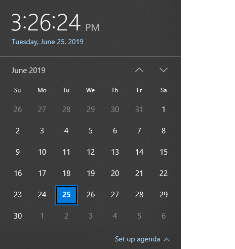
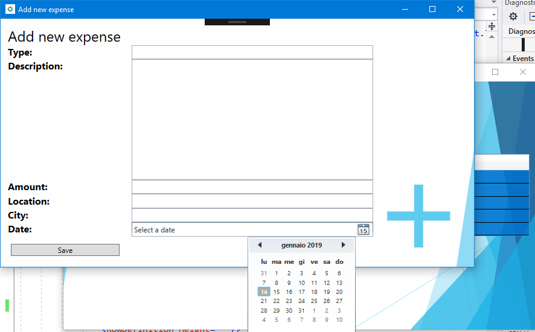

# Part 3: Add a UWP CalendarView control using XAML Islands

This is the third part of a tutorial that demonstrates how to modernize a sample WPF desktop app named Contoso Expenses. For an overview of the tutorial, prerequisites, and instructions for downloading the sample app, see [Tutorial: Modernize a WPF app](modernize-wpf-tutorial.md). This article assumes you have already completed [part 2](modernize-wpf-tutorial-2.md).

In the fictional scenario of this tutorial, the Contoso development team wants to make it easier to choose the date for an expense report on a touch-enabled device. In this part of the tutorial, you will add a UWP [CalendarView](/windows/uwp/design/controls-and-patterns/calendar-view) control to the app. This is the same control that is used in the Windows date and time functionality on the taskbar.



Unlike the **InkCanvas** control you added in [part 2](modernize-wpf-tutorial-2.md), the Windows Community Toolkit does not provide a wrapped version of the UWP **CalendarView** that can be used in WPF apps. As an alternative, you'll host an **InkCanvas** in the generic [WindowsXamlHost](/windows/communitytoolkit/controls/wpf-winforms/windowsxamlhost) control. You can use this control to host any first-party UWP control provided by the Windows SDK or WinUI library or any custom UWP control created by a third party. The **WindowsXamlHost** control is provided by the `Microsoft.Toolkit.Wpf.UI.XamlHost` package NuGet package. This package is included with the `Microsoft.Toolkit.Wpf.UI.Controls` NuGet package that you installed in [part 2](modernize-wpf-tutorial-2.md).

> [!NOTE]
> This tutorial only demonstrates how to use [WindowsXamlHost](/windows/communitytoolkit/controls/wpf-winforms/windowsxamlhost) to host the first-party **CalendarView** control provided by the Windows SDK. For a walkthrough that demonstrates how to host a custom control, see [Host a custom UWP control in a WPF app using XAML Islands](xaml-islands/host-custom-control-with-xaml-islands.md).

In order to use the **WindowsXamlHost** control, you'll need to directly call WinRT APIs from code in the WPF app. The `Microsoft.Windows.SDK.Contracts` NuGet package contains the references necessary to enable you to call WinRT APIs from the app. This package is also included in the `Microsoft.Toolkit.Wpf.UI.Controls` NuGet package that you installed in [part 2](modernize-wpf-tutorial-2.md).

## Add the WindowsXamlHost control

1. In **Solution Explorer**, expand the **Views** folder in the **ContosoExpenses.Core** project and double-click the **AddNewExpense.xaml** file. This is the form used to add a new expense to the list. Here is how it appears in the current version of the app.

    

    The date picker control included in WPF is meant for traditional computers with mouse and keyboard. Choosing a date with a touch screen isn't really feasible, due to the small size of the control and the limited space between each day in the calendar.

2. At the top of the **AddNewExpense.xaml** file, add the following attribute to the **Window** element.

    ```xml
    xmlns:xamlhost="clr-namespace:Microsoft.Toolkit.Wpf.UI.XamlHost;assembly=Microsoft.Toolkit.Wpf.UI.XamlHost"
    ```

    After adding this attribute, the **Window** element should now look like this.

    ```xml
    <Window x:Class="ContosoExpenses.Views.AddNewExpense"
            xmlns="http://schemas.microsoft.com/winfx/2006/xaml/presentation"
            xmlns:x="http://schemas.microsoft.com/winfx/2006/xaml"
            xmlns:d="http://schemas.microsoft.com/expression/blend/2008"
            xmlns:mc="http://schemas.openxmlformats.org/markup-compatibility/2006"
            xmlns:xamlhost="clr-namespace:Microsoft.Toolkit.Wpf.UI.XamlHost;assembly=Microsoft.Toolkit.Wpf.UI.XamlHost"
            DataContext="{Binding Source={StaticResource ViewModelLocator},Path=AddNewExpenseViewModel}"
            xmlns:local="clr-namespace:ContosoExpenses"
            mc:Ignorable="d"
            Title="Add new expense" Height="450" Width="800"
            Background="{StaticResource AddNewExpenseBackground}">
    ```

3. Change the **Height** attribute of the **Window** element from 450 to 800. This is needed because the UWP **CalendarView** control takes more space than the WPF date picker.

    ```xml
    <Window x:Class="ContosoExpenses.Views.AddNewExpense"
            xmlns="http://schemas.microsoft.com/winfx/2006/xaml/presentation"
            xmlns:x="http://schemas.microsoft.com/winfx/2006/xaml"
            xmlns:d="http://schemas.microsoft.com/expression/blend/2008"
            xmlns:mc="http://schemas.openxmlformats.org/markup-compatibility/2006"
            xmlns:xamlhost="clr-namespace:Microsoft.Toolkit.Wpf.UI.XamlHost;assembly=Microsoft.Toolkit.Wpf.UI.XamlHost"
            DataContext="{Binding Source={StaticResource ViewModelLocator},Path=AddNewExpenseViewModel}"
            xmlns:local="clr-namespace:ContosoExpenses"
            mc:Ignorable="d"
            Title="Add new expense" Height="800" Width="800"
            Background="{StaticResource AddNewExpenseBackground}">
    ```

4. Locate the `DatePicker` element near the bottom of the file, and replace this element with the following XAML.

    ```xml
    <xamlhost:WindowsXamlHost InitialTypeName="Windows.UI.Xaml.Controls.CalendarView" Grid.Column="1" Grid.Row="6" Margin="5, 0, 0, 0" x:Name="CalendarUwp"  />
    ```

    This XAML adds the **WindowsXamlHost** control. The **InitialTypeName** property indicates the full name of the UWP control you want to host (in this case, **Windows.UI.Xaml.Controls.CalendarView**).

5. Press F5 to build and run the app in the debugger. Choose an employee from the list and then press the **Add new expense** button. Confirm that the following page hosts the new UWP **CalendarView** control.

    

6. Close the app.

## Interact with the WindowsXamlHost control

Next, you'll update the app to process the selected date, display it on the screen, and populate the **Expense** object to save in the database.

The UWP [CalendarView](/uwp/api/Windows.UI.Xaml.Controls.CalendarView) contains two members that are relevant for this scenario:

- The **SelectedDates** property contains the date selected by the user.
- The **SelectedDatesChanged** event is raised when the user selects a date.

However, the **WindowsXamlHost** control is a generic host control for *any* kind of UWP control. As such, it doesn't expose a property called **SelectedDates** or an event called **SelectedDatesChanged**, because they are specific of the **CalendarView** control. To access these members, you must write code that casts the **WindowsXamlHost** to the **CalendarView** type. The best place to do this is in response to the **ChildChanged** event of the **WindowsXamlHost** control, which is raised when the hosted control has been rendered.

1. In the **AddNewExpense.xaml** file, add an event handler for the **ChildChanged** event of the **WindowsXamlHost** control you added earlier. When you are done, the **WindowsXamlHost** element should look like this.

    ```xml
    <xamlhost:WindowsXamlHost InitialTypeName="Windows.UI.Xaml.Controls.CalendarView" Grid.Column="1" Grid.Row="6" Margin="5, 0, 0, 0" x:Name="CalendarUwp"  ChildChanged="CalendarUwp_ChildChanged" />
    ```

2. In the same file, locate the **Grid.RowDefinitions** element of the main **Grid**. Add one more **RowDefinition** element with the **Height** equal to **Auto** at the end of the list of child elements. When you are done, the **Grid.RowDefinitions** element should look like this (there should now be 9 **RowDefinition** elements).

    ```xml
    <Grid.RowDefinitions>
        <RowDefinition Height="Auto"/>
        <RowDefinition Height="Auto"/>
        <RowDefinition Height="Auto"/>
        <RowDefinition Height="Auto"/>
        <RowDefinition Height="Auto"/>
        <RowDefinition Height="Auto"/>
        <RowDefinition Height="Auto"/>
        <RowDefinition Height="Auto"/>
        <RowDefinition Height="Auto"/>
    </Grid.RowDefinitions>
    ```

4. Add the following XAML after the **WindowsXamlHost** element and before the **Button** element near the end of the file.

    ```xml
    <TextBlock Text="Selected date:" FontSize="16" FontWeight="Bold" Grid.Row="7" Grid.Column="0" />
    <TextBlock Text="{Binding Path=Date}" FontSize="16" Grid.Row="7" Grid.Column="1" />
    ```

5. Locate the **Button** element near the end of the file and change the **Grid.Row** property from **7** to **8**. This shifts the button down one row in the grid because you added a new row.

    ```xml
    <Button Content="Save" Grid.Row="8" Grid.Column="0" Command="{Binding Path=SaveExpenseCommand}" Margin="5, 12, 0, 0" HorizontalAlignment="Left" Width="180" />
    ```

6. Open the **AddNewExpense.xaml.cs** code file.

7. Add the following statement to the top of the file.

    ```csharp
    using Microsoft.Toolkit.Wpf.UI.XamlHost;
    ```

8. Add the following event handler to the `AddNewExpense` class. This code implements the **ChildChanged** event of the **WindowsXamlHost** control you declared earlier in the XAML file.

    ```csharp
    private void CalendarUwp_ChildChanged(object sender, System.EventArgs e)
    {
        WindowsXamlHost windowsXamlHost = (WindowsXamlHost)sender;

        Windows.UI.Xaml.Controls.CalendarView calendarView =
            (Windows.UI.Xaml.Controls.CalendarView)windowsXamlHost.Child;

        if (calendarView != null)
        {
            calendarView.SelectedDatesChanged += (obj, args) =>
            {
                if (args.AddedDates.Count > 0)
                {
                    Messenger.Default.Send<SelectedDateMessage>(new SelectedDateMessage(args.AddedDates[0].DateTime));
                }
            };
        }
    }
    ```

    This code uses the **Child** property of the **WindowsXamlHost** control to access the UWP **CalendarView** control. The code then subscribes to the **SelectedDatesChanged** event, which is triggered when the user selects a date from the calendar. This event handler passes the selected date to the ViewModel where the new **Expense** object is created and saved to the database. To do this, the code uses the messaging infrastructure provided by the MVVM Light NuGet package. The code sends a message called **SelectedDateMessage** to the ViewModel, which will receive it and set the **Date** property with the selected value. In this scenario the **CalendarView** control is configured for single selection mode, so the collection will contain only one element.

    At this point, the project still won't compile because it is missing the implementation for the **SelectedDateMessage** class. The following steps implement this class.

9. In **Solution Explorer**, right-click the **Messages** folder and choose **Add -> Class**. Name the new class **SelectedDateMessage** and click **Add**.

10. Replace the contents of the **SelectedDateMessage.cs** code file with the following code. This code adds a using statement for the `GalaSoft.MvvmLight.Messaging` namespace (from the MVVM Light NuGet package), inherits from the **MessageBase** class, and adds **DateTime** property that is initialized through the public constructor. When you are done, the file should look like this.

    ```csharp
    using GalaSoft.MvvmLight.Messaging;
    using System;
    
    namespace ContosoExpenses.Messages
    {
        public class SelectedDateMessage: MessageBase
        {
            public DateTime SelectedDate { get; set; }
    
            public SelectedDateMessage(DateTime selectedDate)
            {
                this.SelectedDate = selectedDate;
            }
        }
    }
    ```

11. Next, you'll update the ViewModel to receive this message and populate the **Date** property of the ViewModel. In **Solution Explorer**, expand the **ViewModels** folder and open the **AddNewExpenseViewModel.cs** file.

12. Locate the public constructor for the `AddNewExpenseViewModel` class and add the following code to the end of the constructor. This code registers to receive the **SelectedDateMessage**, extract the selected date from it through the **SelectedDate** property, and we use it to set the **Date** property exposed by the ViewModel. Because this property is bound with the **TextBlock** control you added earlier, you can see the date selected by the user.

    ```csharp
    Messenger.Default.Register<SelectedDateMessage>(this, message =>
    {
        Date = message.SelectedDate;
    });
    ```

    When you are done, the `AddNewExpenseViewModel` constructor should look like this. 

    ```csharp
    public AddNewExpenseViewModel(IDatabaseService databaseService, IStorageService storageService)
    {
        this.databaseService = databaseService;
        this.storageService = storageService;

        Date = DateTime.Today;

        Messenger.Default.Register<SelectedDateMessage>(this, message =>
        {
            Date = message.SelectedDate;
        });
    }
    ```

    > [!NOTE]
    > The `SaveExpenseCommand` method in the same code file does the work of saving the expenses to the database. This method uses the **Date** property to create the new **Expense** object. This property is now being populated by the **CalendarView** control through the `SelectedDateMessage` message you just created.

13. Press F5 to build and run the app in the debugger. Choose one of the available employees and then click the **Add new expense** button. Complete all fields in the form and choose a date from the new **CalendarView** control. Confirm the selected date is displayed as a string below the control.

14. Press the **Save** button. The form will be closed and the new expense is added to the end of the list of expenses. The first column with the expense date should be the date you selected in the **CalendarView** control.

## Next steps

At this point in the tutorial, you have successfully replaced a WPF date time control with the UWP **CalendarView** control, which supports touch and digital pens in addition to mouse and keyboard input. Although the Windows Community Toolkit doesn't provide a wrapped version of the UWP **CalendarView** control that can be used directly in a WPF app, you were able to host the control by using the generic [WindowsXamlHost](/windows/communitytoolkit/controls/wpf-winforms/windowsxamlhost) control.

You are now ready for [Part 4: Add Windows user activities and notifications](modernize-wpf-tutorial-4.md).