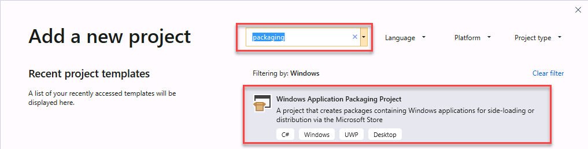
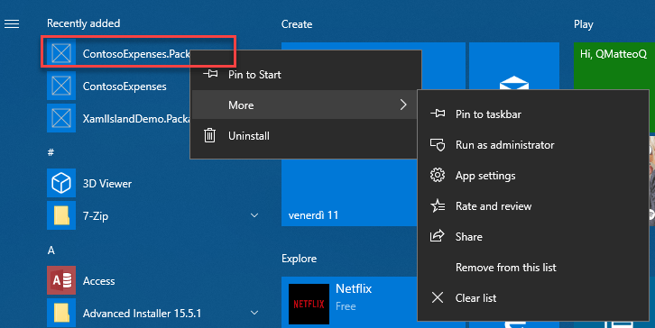
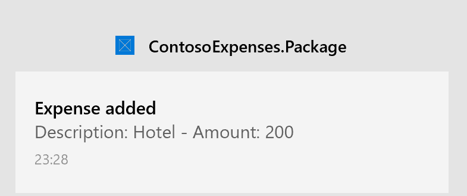

# Part 5: Package and deploy with MSIX

This is the final part of a tutorial that demonstrates how to modernize a sample WPF desktop app named Contoso Expenses. For an overview of the tutorial, prerequisites, and instructions for downloading the sample app, see [Tutorial: Modernize a WPF app](modernize-wpf-tutorial.md). This article assumes you have already completed [part 4](modernize-wpf-tutorial-4.md).

In [part 4](modernize-wpf-tutorial-4.md) you learned that some WinRT APIs, including the notifications API, require package identity before they can be used in an app. You can obtain package identity by packaging Contoso Expenses using [MSIX](/windows/msix), the packaging format introduced in Windows 10 to package and deploy Windows applications. MSIX provides advantages for developers and IT Pros, including:

- Optimized network usage and storage space.
- Complete clean uninstall, thanks to a lightweight container where the app is executed. No registry keys and temporary files are left on the system.
- Decouples OS updates from application updates and customizations.
- Simplifies the install, update, and uninstall process.

In this part of the tutorial you'll learn how to package the Contoso Expenses app in an MSIX package.

## Package the application

Visual Studio 2019 provides an easy way to package a desktop application by using the Windows Application Packaging Project. 

1. In **Solution Explorer**, right-click the **ContosoExpenses** solution and choose **Add -> New project**.

    

3. In the **Add a new project** dialog box, search for `packaging`, choose the **Windows Application Packaging Project** project template in the C# category, and click **Next**.

    

4. Name the new project `ContosoExpenses.Package` and click **Create**.

5. Select **Windows 10, version 1903 (10.0; Build 18362)** for both the **Target version** and **Minimum version** and click **OK**.

    The **ContosoExpenses.Package** project is added to the **ContosoExpenses** solution. This project includes a [package manifest](/uwp/schemas/appxpackage/uapmanifestschema/schema-root), which describes the application, and some default assets that are used for items such as the icon in the Programs menu and the tile in the Start screen. However, unlike a UWP project, the packaging project doesn't contain code. Its purpose is to package an existing desktop app.

6. In the **ContosoExpenses.Package** project, right-click the **Applications** node and choose **Add reference**. This node specifies which applications in your solution will be included in the package.

6. In the list of projects, select **ContosoExpenses.Core** and click **OK**.

7. Expand the **Applications** node and confirm that the the **ContosoExpense.Core** project is referenced and highlighted in bold. This means that it will be used as a starting point for the package.

8. Right-click the **ContosoExpenses.Package** project and choose **Set As Startup Project**.

9. Press **F5** to start the packaged app in the debugger.

At this point, you can notice some changes that indicate the app is now running as packaged:

- The icon in the taskbar or in the Start menu is now the default asset that is included in every **Windows Application Packaging Project**.
- If you right-click the **ContosoExpense.Package** application listed in the Start menu, you'll notice options that are typically reserved for apps downloaded from the Microsoft Store, such as **App settings**, **Rate and review** and **Share**.

    

- If you want to uninstall the app, you can right-click **ContosoExpense.Package** in the Start menu and choose **Uninstall**. The app will be immediately removed, without leaving any leftover on the system.

## Test the notification

Now that you have packaged the Contoso Expenses app with MSIX, you can test the notification scenario which wasn't working at the end of [part 4](modernize-wpf-tutorial-4.md).

1. In the Contoso Expenses app, choose an employee from the list and then click the **Add new expense** button.
2. Complete all fields in the form and press **Save**.
3. Confirm that you see an OS notification.

