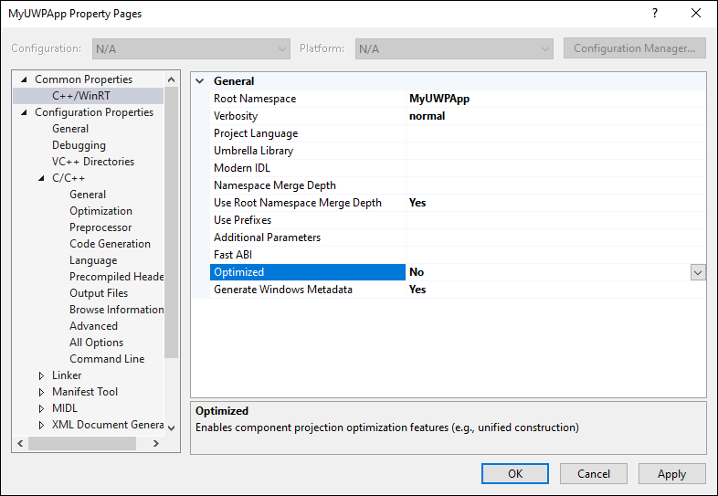
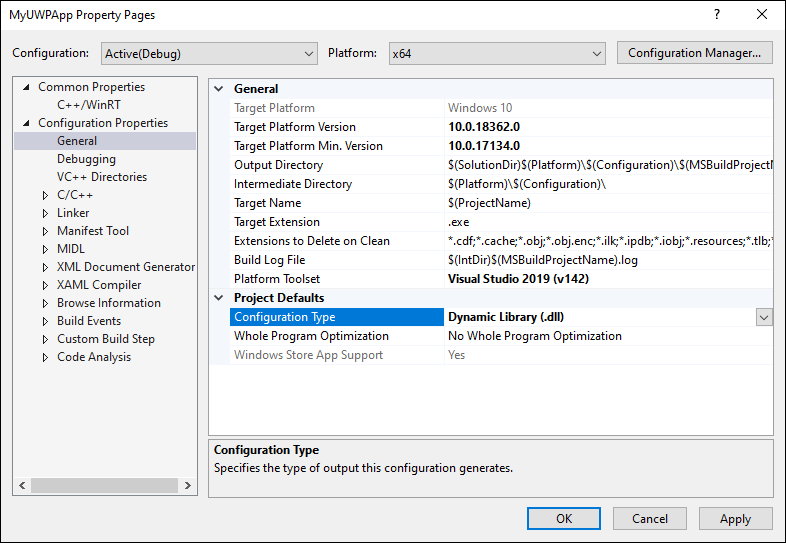
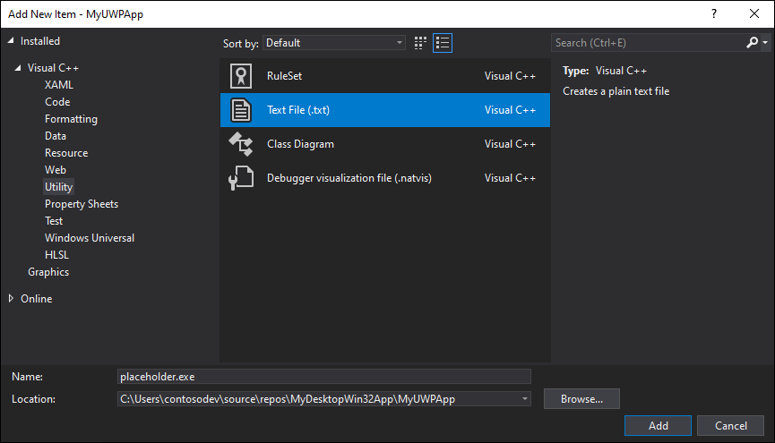
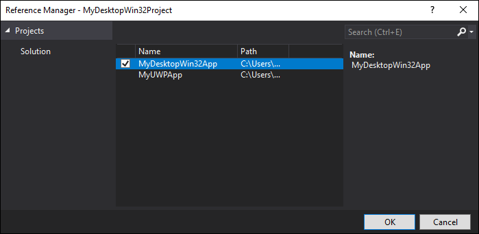
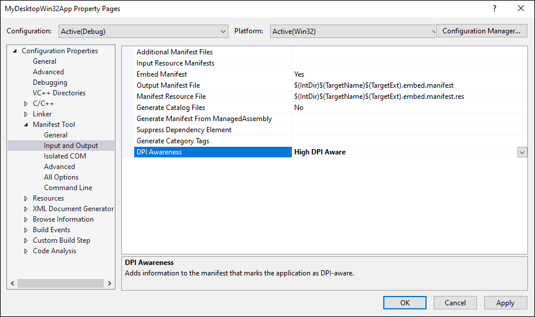
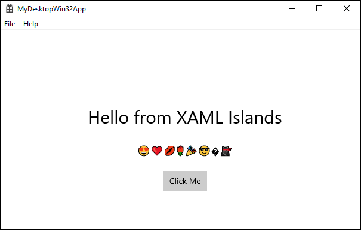

# Host a custom WinRT XAML control in a C++ desktop (Win32) app

> [!IMPORTANT]
> This topic uses or mentions types from the [CommunityToolkit/Microsoft.Toolkit.Win32](https://github.com/CommunityToolkit/Microsoft.Toolkit.Win32) GitHub repo. For important info about XAML Islands support, please see the [XAML Islands Notice](https://github.com/CommunityToolkit/Microsoft.Toolkit.Win32#xaml-islands-notice) in that repo.

This article demonstrates how to use the [WinRT XAML hosting API](using-the-xaml-hosting-api.md) to host a custom WinRT XAML control in a new C++ desktop app. If you have an existing C++ desktop app project, you can adapt these steps and code examples for your project.

To host a custom WinRT XAML control, you'll create the following projects and components as part of this walkthrough:

* **Windows Desktop Application project**. This project implements a native C++ desktop app. You'll add code to this project that uses the WinRT XAML hosting API to host a custom WinRT XAML control.

* **UWP app project (C++/WinRT)**. This project implements a custom WinRT XAML control. It also implements a root metadata provider for loading metadata for custom WinRT XAML types in the project.

## Requirements

* Visual Studio 2019 version 16.4.3 or later.
* Windows 10, version 1903 SDK (version 10.0.18362) or later.
* [C++/WinRT Visual Studio Extension (VSIX)](https://marketplace.visualstudio.com/items?itemName=CppWinRTTeam.cppwinrt101804264) installed with Visual Studio. C++/WinRT is an entirely standard modern C++17 language projection for Windows Runtime (WinRT) APIs, implemented as a header-file-based library, and designed to provide you with first-class access to the modern Windows API. For more information, see  [C++/WinRT](/windows/uwp/cpp-and-winrt-apis/).

## Create a desktop application project

1. In Visual Studio, create a new **Windows Desktop Application** project named **MyDesktopWin32App**. This project template is available under the **C++**, **Windows**, and **Desktop** project filters.

2. In **Solution Explorer**, right-click the solution node, click **Retarget solution**, select the **10.0.18362.0** or a later SDK release, and then click **OK**.

3. Install the [Microsoft.Windows.CppWinRT](https://www.nuget.org/packages/Microsoft.Windows.CppWinRT/) NuGet package to enable support for [C++/WinRT](/windows/uwp/cpp-and-winrt-apis) in your project:

    1. Right-click the **MyDesktopWin32App** project in **Solution Explorer** and choose **Manage NuGet Packages**.
    2. Select the **Browse** tab, search for the [Microsoft.Windows.CppWinRT](https://www.nuget.org/packages/Microsoft.Windows.CppWinRT/) package, and install the latest version of this package.

4. In the **Manage NuGet Packages** window, install the following additional NuGet packages:

    * [Microsoft.Toolkit.Win32.UI.SDK](https://www.nuget.org/packages/Microsoft.Toolkit.Win32.UI.SDK) (latest stable version). This package provides several build and run time assets that enable XAML Islands to work in your app.
    * [Microsoft.Toolkit.Win32.UI.XamlApplication](https://www.nuget.org/packages/Microsoft.Toolkit.Win32.UI.XamlApplication) (latest stable version). This package defines the [Microsoft.Toolkit.Win32.UI.XamlHost.XamlApplication](https://github.com/windows-toolkit/Microsoft.Toolkit.Win32/tree/master/Microsoft.Toolkit.Win32.UI.XamlApplication) class, which you will use later in this walkthrough.
    * [Microsoft.VCRTForwarders.140](https://www.nuget.org/packages/Microsoft.VCRTForwarders.140).

5. Add a reference to the Windows Runtime metadata:
   1. In **Solution Explorer**, right-click on your project **References** node and select **Add Reference**.
   2. Click the **Browse** button at the bottom of the page and navigate to the UnionMetadata folder in your SDK install path. By default the SDK will be installed to `C:\Program Files (x86)\Windows Kits\10\UnionMetadata`. 
   3. Then, select the folder named after the Windows version you are targetting (e.g. 10.0.18362.0) and inside of that folder pick the `Windows.winmd` file.
   4. Click **OK** to close the **Add Reference** dialog.

6. Build the solution and confirm that it builds successfully.

## Create a UWP app project

Next, add a **UWP (C++/WinRT)** app project to your solution and make some configuration changes to this project. Later in this walkthrough, you'll add code to this project to implement a custom WinRT XAML control and define an instance of the [Microsoft.Toolkit.Win32.UI.XamlHost.XamlApplication](https://github.com/windows-toolkit/Microsoft.Toolkit.Win32/tree/master/Microsoft.Toolkit.Win32.UI.XamlApplication) class. 

1. In **Solution Explorer**, right-click the solution node and select **Add** -> **New Project**.

2. Add a **Blank App (C++/WinRT)** project to your solution. Name the project **MyUWPApp** and make sure the target version and minimum version are both set to **Windows 10, version 1903** or later.

3. Install the [Microsoft.Toolkit.Win32.UI.XamlApplication](https://www.nuget.org/packages/Microsoft.Toolkit.Win32.UI.XamlApplication) NuGet package in the **MyUWPApp** project. This package defines the [Microsoft.Toolkit.Win32.UI.XamlHost.XamlApplication](https://github.com/windows-toolkit/Microsoft.Toolkit.Win32/tree/master/Microsoft.Toolkit.Win32.UI.XamlApplication) class, which you will use later in this walkthrough.

    1. Right-click the **MyUWPApp** project and choose **Manage NuGet Packages**.
    2. Select the **Browse** tab, search for the [Microsoft.Toolkit.Win32.UI.XamlApplication](https://www.nuget.org/packages/Microsoft.Toolkit.Win32.UI.XamlApplication) package, and install the latest stable version of this package.

4. Right-click the **MyUWPApp** node and select **Properties**. On the **Common Properties** -> **C++/WinRT** page, set the **Verbosity** property to **normal** and then click **Apply**. When you are done, the properties page should look like this.

    

5. On the **Configuration Properties** -> **General** page of the properties window, set **Configuration Type** to **Dynamic Library (.dll)**, and then click **OK** to close the properties window.

    

6. Add a placeholder executable file to the **MyUWPApp** project. This placeholder executable file is required for Visual Studio to generate the required project files and properly build the project.

    1. In **Solution Explorer**, right-click the **MyUWPApp** project node and select **Add** -> **New Item**.
    2. In the **Add New Item** dialog, select **Utility** in the left page, and then select **Text File (.txt)**. Enter the name **placeholder.exe** and click **Add**.
      
    3. In **Solution Explorer**, select the **placeholder.exe** file. In the **Properties** window, make sure the **Content** property is set to **True**.
    4. In **Solution Explorer**, right-click the **Package.appxmanifest** file in the **MyUWPApp** project, select **Open With**, and select **XML (Text) Editor**, and click **OK**.
    5. Find the **&lt;Application&gt;** element and change the **Executable** attribute to the value `placeholder.exe`. When you are done, the **&lt;Application&gt;** element should look similar to this.

        ```xml
        <Application Id="App" Executable="placeholder.exe" EntryPoint="MyUWPApp.App">
          <uap:VisualElements DisplayName="MyUWPApp" Description="Project for a single page C++/WinRT Universal Windows Platform (UWP) app with no predefined layout"
            Square150x150Logo="Assets\Square150x150Logo.png" Square44x44Logo="Assets\Square44x44Logo.png" BackgroundColor="transparent">
            <uap:DefaultTile Wide310x150Logo="Assets\Wide310x150Logo.png">
            </uap:DefaultTile>
            <uap:SplashScreen Image="Assets\SplashScreen.png" />
          </uap:VisualElements>
        </Application>
        ```

    6. Save and close the **Package.appxmanifest** file.

7. In **Solution Explorer**, right-click the **MyUWPApp** node and select **Unload Project**.
8. Right-click the **MyUWPApp** node and select **Edit MyUWPApp.vcxproj**.
9. Find the `<Import Project="$(VCTargetsPath)\Microsoft.Cpp.Default.props" />` element and replace it with the following XML. This XML adds several new properties immediately before the element.

    ```xml
    <PropertyGroup Label="Globals">
        <WindowsAppContainer>true</WindowsAppContainer>
        <AppxGeneratePriEnabled>true</AppxGeneratePriEnabled>
        <ProjectPriIndexName>App</ProjectPriIndexName>
        <AppxPackage>true</AppxPackage>
    </PropertyGroup>
    <Import Project="$(VCTargetsPath)\Microsoft.Cpp.Default.props" />
    ```

10. Save and close the project file.
11. In **Solution Explorer**, right-click the **MyUWPApp** node and select **Reload Project**.

## Configure the solution

In this section, you'll update the solution that contains both projects to configure project dependencies and build properties required for the projects to build correctly.

1. In **Solution Explorer**, right-click the solution node and add a new XML file named **Solution.props**.
2. Add the following XML to the **Solution.props** file.

    ```xml
    <?xml version="1.0" encoding="utf-8"?>
    <Project xmlns="http://schemas.microsoft.com/developer/msbuild/2003">
      <PropertyGroup>
        <IntDir>$(SolutionDir)\obj\$(Platform)\$(Configuration)\$(MSBuildProjectName)\</IntDir>
        <OutDir>$(SolutionDir)\bin\$(Platform)\$(Configuration)\$(MSBuildProjectName)\</OutDir>
        <GeneratedFilesDir>$(IntDir)Generated Files\</GeneratedFilesDir>
      </PropertyGroup>
    </Project>
    ```

3. From the **View** menu, click **Property Manager** (depending on your configuration, this may be under **View** -> **Other Windows**).
4. In the **Property Manager** window, right-click **MyDesktopWin32App** and select **Add Existing Property Sheet**. Navigate to the **Solution.props** file you just added and click **Open**.
5. Repeat the previous step to add the **Solution.props** file to the **MyUWPApp** project in the **Property Manager** window.
6. Close the **Property Manager** window.
7. Confirm that the property sheet changes were saved properly. In **Solution Explorer**, right-click the **MyDesktopWin32App** project and choose **Properties**. Click **Configuration Properties** -> **General**, and confirm that the **Output Directory** and **Intermediate Directory** properties have the values you added to the **Solution.props** file. You can also confirm the same for the **MyUWPApp** project.
    

8. In **Solution Explorer**, right-click the solution node and choose **Project Dependencies**. In the **Projects** drop-down, make sure that **MyDesktopWin32App** is selected, and select **MyUWPApp** in the **Depends On** list.
    

9. Click **OK**.

## Add code to the UWP app project

You're now ready to add code to the **MyUWPApp** project to perform these tasks:

* Implement a custom WinRT XAML control. Later in this walkthrough, you'll add code that hosts this control in the **MyDesktopWin32App** project.
* Define a type that derives from the [Microsoft.Toolkit.Win32.UI.XamlHost.XamlApplication](https://github.com/windows-toolkit/Microsoft.Toolkit.Win32/tree/master/Microsoft.Toolkit.Win32.UI.XamlApplication) class in the Windows Community Toolkit.

### Define a custom WinRT XAML control

1. In **Solution Explorer**, right-click **MyUWPApp** and select **Add** -> **New Item**. Select the **Visual C++** node in the left pane, select **Blank User Control (C++/WinRT)**, name it **MyUserControl**, and click **Add**.
2. In the XAML editor, replace the contents of the **MyUserControl.xaml** file with the following XAML and then save the file.

    ```xml
    <UserControl
        x:Class="MyUWPApp.MyUserControl"
        xmlns="http://schemas.microsoft.com/winfx/2006/xaml/presentation"
        xmlns:x="http://schemas.microsoft.com/winfx/2006/xaml"
        xmlns:local="using:MyUWPApp"
        xmlns:d="http://schemas.microsoft.com/expression/blend/2008"
        xmlns:mc="http://schemas.openxmlformats.org/markup-compatibility/2006"
        mc:Ignorable="d">

        <StackPanel HorizontalAlignment="Center" Spacing="10" 
                    Padding="20" VerticalAlignment="Center">
            <TextBlock HorizontalAlignment="Center" TextWrapping="Wrap" 
                           Text="Hello from XAML Islands" FontSize="30" />
            <TextBlock HorizontalAlignment="Center" Margin="15" TextWrapping="Wrap"
                           Text="😍❤💋🌹🎉😎�🐱‍👤" FontSize="16" />
            <Button HorizontalAlignment="Center" 
                    x:Name="Button" Click="ClickHandler">Click Me</Button>
        </StackPanel>
    </UserControl>
    ```

### Define a XamlApplication class

Next, revise the default **App** class in the **MyUWPApp** project to derive from the [Microsoft.Toolkit.Win32.UI.XamlHost.XamlApplication](https://github.com/windows-toolkit/Microsoft.Toolkit.Win32/tree/master/Microsoft.Toolkit.Win32.UI.XamlApplication) class provided by the Windows Community Toolkit. This class supports the [IXamlMetadataProvider](/uwp/api/Windows.UI.Xaml.Markup.IXamlMetadataProvider) interface, which enables your app to discover and load metadata for custom WinRT XAML controls in assemblies in the current directory of your application at run time. This class also initializes the WinRT XAML framework for the current thread. Later in this walkthrough you'll update the desktop project to create an instance of this class.

  > [!NOTE]
  > Each solution that uses XAML Islands can contain only one project that defines a `XamlApplication` object. All custom WinRT XAML controls in your app share the same `XamlApplication` object. 

1. In **Solution Explorer**, right-click the **MainPage.xaml** file in the **MyUWPApp** project. Click **Remove** and then **Delete** to delete this file permanently from the project.
2. In the **MyUWPApp** project, expand **App.xaml** file.
3. Replace the contents of the **App.xaml**, **App.cpp**, **App.h**, and **App.idl** files with the following code.

    * **App.xaml**:

        ```xml
        <Toolkit:XamlApplication
            x:Class="MyUWPApp.App"
            xmlns:Toolkit="using:Microsoft.Toolkit.Win32.UI.XamlHost"
            xmlns="http://schemas.microsoft.com/winfx/2006/xaml/presentation"
            xmlns:x="http://schemas.microsoft.com/winfx/2006/xaml"
            xmlns:local="using:MyUWPApp">
        </Toolkit:XamlApplication>
        ```

    * **App.idl**:

        ```IDL
        namespace MyUWPApp
        {
             [default_interface]
             runtimeclass App : Microsoft.Toolkit.Win32.UI.XamlHost.XamlApplication
             {
                App();
             }
        }
        ```

    * **App.h**:

        ```cpp
        #pragma once
        #include "App.g.h"
        #include "App.base.h"
        namespace winrt::MyUWPApp::implementation
        {
            class App : public AppT2<App>
            {
            public:
                App();
                ~App();
            };
        }
        namespace winrt::MyUWPApp::factory_implementation
        {
            class App : public AppT<App, implementation::App>
            {
            };
        }
        ```

    * **App.cpp**:

        ```cpp
        #include "pch.h"
        #include "App.h"
        #include "App.g.cpp"
        using namespace winrt;
        using namespace Windows::UI::Xaml;
        namespace winrt::MyUWPApp::implementation
        {
            App::App()
            {
                Initialize();
                AddRef();
                m_inner.as<::IUnknown>()->Release();
            }
            App::~App()
            {
                Close();
            }
        }
        ```

        > [!NOTE]
        > The `#include "App.g.cpp"` statement is necessary when the **Optimized** property on the **Common Properties** -> **C++/WinRT** page of the project properties is set to **Yes**. This is the default for new C++/WinRT projects. For more details about the effects of the **Optimized** property, see [this section](/windows/uwp/cpp-and-winrt-apis/author-apis#opt-in-to-uniform-construction-and-direct-implementation-access).

4. Add a new header file to the **MyUWPApp** project named **app.base.h**.
5. Add the following code to the **app.base.h** file, save the file, and close it.

    ```cpp
    #pragma once
    namespace winrt::MyUWPApp::implementation
    {
        template <typename D, typename... I>
        struct App_baseWithProvider : public App_base<D, ::winrt::Windows::UI::Xaml::Markup::IXamlMetadataProvider>
        {
            using IXamlType = ::winrt::Windows::UI::Xaml::Markup::IXamlType;
            IXamlType GetXamlType(::winrt::Windows::UI::Xaml::Interop::TypeName const& type)
            {
                return _appProvider.GetXamlType(type);
            }
            IXamlType GetXamlType(::winrt::hstring const& fullName)
            {
                return _appProvider.GetXamlType(fullName);
            }
            ::winrt::com_array<::winrt::Windows::UI::Xaml::Markup::XmlnsDefinition> GetXmlnsDefinitions()
            {
                return _appProvider.GetXmlnsDefinitions();
            }
        private:
            bool _contentLoaded{ false };
            winrt::MyUWPApp::XamlMetaDataProvider _appProvider;
        };
        template <typename D, typename... I>
        using AppT2 = App_baseWithProvider<D, I...>;
    }
    ```

6. Build the solution and confirm that it builds successfully.

## Configure the desktop project to consume custom control types

Before the **MyDesktopWin32App** app can host a custom WinRT XAML control in a XAML Island, it must be configured to consume custom control types from the **MyUWPApp** project. There are two ways to do this, and you can choose either option as you complete this walkthrough.

### Option 1: Package the app using MSIX

You can package the app in an [MSIX package](/windows/msix) for deployment. MSIX is the modern app packaging technology for Windows, and it is based on a combination of MSI, .appx, App-V and ClickOnce installation technologies.

1. Add a new [Windows Application Packaging Project](/windows/msix/desktop/desktop-to-uwp-packaging-dot-net) to your solution. As you create the project, name it **MyDesktopWin32Project** and select **Windows 10, version 1903 (10.0; Build 18362)** for both the **Target version** and **Minimum version**.

2. In the packaging project, right-click the **Applications** node and choose **Add reference**. In the list of projects, select the check box next to the **MyDesktopWin32App** project and click **OK**.
    

3. For info about distributing/deploying the package, see [Manage your MSIX deployment](/windows/msix/desktop/managing-your-msix-deployment-overview). 

> [!NOTE]
> If you choose to not package your application in an [MSIX package](/windows/msix) for deployment, then computers that run your app must have the [Visual C++ Runtime](https://support.microsoft.com/en-us/help/2977003/the-latest-supported-visual-c-downloads) installed.

### Option 2: Create an application manifest

You can add an [application manifest](/windows/desktop/SbsCs/application-manifests) to your app.

1. Right-click the **MyDesktopWin32App** project and select **Add** -> **New Item**. 
2. In the **Add New Item** dialog, click **Web** in the left pane and select **XML File (.xml)**. 
3. Name the new file **app.manifest** and click **Add**.
4. Replace the contents of the new file with the following XML. This XML registers custom control types in the **MyUWPApp** project.

    ```xml
    <?xml version="1.0" encoding="utf-8"?>
    <assembly
     xmlns="urn:schemas-microsoft-com:asm.v1"
     xmlns:asmv3="urn:schemas-microsoft-com:asm.v3"
     manifestVersion="1.0">
      <asmv3:file name="MyUWPApp.dll">
        <activatableClass
            name="MyUWPApp.App"
            threadingModel="both"
            xmlns="urn:schemas-microsoft-com:winrt.v1" />
        <activatableClass
            name="MyUWPApp.XamlMetadataProvider"
            threadingModel="both"
            xmlns="urn:schemas-microsoft-com:winrt.v1" />
        <activatableClass
            name="MyUWPApp.MyUserControl"
            threadingModel="both"
            xmlns="urn:schemas-microsoft-com:winrt.v1" />
      </asmv3:file>
    </assembly>
    ```

## Configure additional desktop project properties

Next, update the **MyDesktopWin32App** project to define a macro for additional include directories and configure additional properties.

1. In **Solution Explorer**, right-click the **MyDesktopWin32App** project and select **Unload Project**.

2. Right-click **MyDesktopWin32App (Unloaded)** and select **Edit MyDesktopWin32App.vcxproj**.

3. Add the following XML just before the closing `</Project>` tag at the end of the file. Then, save and close the file.

    ```xml
      <!-- Configure these for your UWP project -->
      <PropertyGroup>
        <AppProjectName>MyUWPApp</AppProjectName>
      </PropertyGroup>
      <PropertyGroup>
        <AppIncludeDirectories>$(SolutionDir)\obj\$(Platform)\$(Configuration)\$(AppProjectName)\;$(SolutionDir)\obj\$(Platform)\$(Configuration)\$(AppProjectName)\Generated Files\;</AppIncludeDirectories>
      </PropertyGroup>
      <ItemGroup>
        <ProjectReference Include="..\$(AppProjectName)\$(AppProjectName).vcxproj" />
      </ItemGroup>
      <!-- End Section-->
    ```

4. In **Solution Explorer**, right-click **MyDesktopWin32App (unloaded)** and select **Reload Project**.

5. Right-click the **MyDesktopWin32App** project, select **Properties**, and expand **Manifest Tool** -> **Input and Output** in the left pane. Set the **DPI Awareness** property to **Per Monitor High DPI Aware**. If you do not set this property, you may encounter a manifest configuration error in certain high DPI scenarios.

    

6. Click **OK** to close the **Property Pages** dialog.

## Host the custom WinRT XAML control in the desktop project

Finally, you're ready to add code to the **MyDesktopWin32App** project to host the custom WinRT XAML control you defined earlier in the **MyUWPApp** project.

1. In the **MyDesktopWin32App** project, open the **framework.h** file and comment out the following line of code. Save the file when you're done.

    ```cpp
    #define WIN32_LEAN_AND_MEAN
    ```

2. Open the **MyDesktopWin32App.h** file and replace the contents of this file with the following code to reference necessary C++/WinRT header files. Save the file when you're done.

    ```cpp
    #pragma once

    #include "resource.h"
    #include <winrt/Windows.Foundation.Collections.h>
    #include <winrt/Windows.system.h>
    #include <winrt/windows.ui.xaml.hosting.h>
    #include <windows.ui.xaml.hosting.desktopwindowxamlsource.h>
    #include <winrt/windows.ui.xaml.controls.h>
    #include <winrt/Windows.ui.xaml.media.h>
    #include <winrt/Windows.UI.Core.h>
    #include <winrt/MyUWPApp.h>

    using namespace winrt;
    using namespace Windows::UI;
    using namespace Windows::UI::Composition;
    using namespace Windows::UI::Xaml::Hosting;
    using namespace Windows::Foundation::Numerics;
    using namespace Windows::UI::Xaml::Controls;
    ```

3. Open the **MyDesktopWin32App.cpp** file and add the following code to the `Global Variables:` section.

    ```cpp
    winrt::MyUWPApp::App hostApp{ nullptr };
    winrt::Windows::UI::Xaml::Hosting::DesktopWindowXamlSource _desktopWindowXamlSource{ nullptr };
    winrt::MyUWPApp::MyUserControl _myUserControl{ nullptr };
    ```

4. In the same file, add the following code to the `Forward declarations of functions included in this code module:` section.

    ```cpp
    void AdjustLayout(HWND);
    ```

5. In the same file, add the following code immediately after the `TODO: Place code here.` comment in the `wWinMain` function.

    ```cpp
    // TODO: Place code here.
    winrt::init_apartment(winrt::apartment_type::single_threaded);
    hostApp = winrt::MyUWPApp::App{};
    _desktopWindowXamlSource = winrt::Windows::UI::Xaml::Hosting::DesktopWindowXamlSource{};
    ```

6. In the same file, replace the default `InitInstance` function with the following code.

    ```cpp
    BOOL InitInstance(HINSTANCE hInstance, int nCmdShow)
    {
        hInst = hInstance; // Store instance handle in our global variable

        HWND hWnd = CreateWindowW(szWindowClass, szTitle, WS_OVERLAPPEDWINDOW,
            CW_USEDEFAULT, 0, CW_USEDEFAULT, 0, nullptr, nullptr, hInstance, nullptr);

        if (!hWnd)
        {
            return FALSE;
        }

        // Begin XAML Islands walkthrough code.
        if (_desktopWindowXamlSource != nullptr)
        {
            auto interop = _desktopWindowXamlSource.as<IDesktopWindowXamlSourceNative>();
            check_hresult(interop->AttachToWindow(hWnd));
            HWND hWndXamlIsland = nullptr;
            interop->get_WindowHandle(&hWndXamlIsland);
            RECT windowRect;
            ::GetWindowRect(hWnd, &windowRect);
            ::SetWindowPos(hWndXamlIsland, NULL, 0, 0, windowRect.right - windowRect.left, windowRect.bottom - windowRect.top, SWP_SHOWWINDOW);
            _myUserControl = winrt::MyUWPApp::MyUserControl();
            _desktopWindowXamlSource.Content(_myUserControl);
        }
        // End XAML Islands walkthrough code.

        ShowWindow(hWnd, nCmdShow);
        UpdateWindow(hWnd);

        return TRUE;
    }
    ```

7. In the same file, add the following new function to the end of the file.

    ```cpp
    void AdjustLayout(HWND hWnd)
    {
        if (_desktopWindowXamlSource != nullptr)
        {
            auto interop = _desktopWindowXamlSource.as<IDesktopWindowXamlSourceNative>();
            HWND xamlHostHwnd = NULL;
            check_hresult(interop->get_WindowHandle(&xamlHostHwnd));
            RECT windowRect;
            ::GetWindowRect(hWnd, &windowRect);
            ::SetWindowPos(xamlHostHwnd, NULL, 0, 0, windowRect.right - windowRect.left, windowRect.bottom - windowRect.top, SWP_SHOWWINDOW);
        }
    }
    ```

8. In the same file, locate the `WndProc` function. Replace the default `WM_DESTROY` handler in the switch statement with the following code.

    ```cpp
    case WM_DESTROY:
        PostQuitMessage(0);
        if (_desktopWindowXamlSource != nullptr)
        {
            _desktopWindowXamlSource.Close();
            _desktopWindowXamlSource = nullptr;
        }
        break;
    case WM_SIZE:
        AdjustLayout(hWnd);
        break;
    ```

9. Save the file.
10. Build the solution and confirm that it builds successfully.

## Add a control from the WinUI 2 library to the custom control

Traditionally, WinRT XAML controls have been released as part of the Windows OS and made available to developers through the Windows SDK. The [WinUI library](/uwp/toolkits/winui/) is an alternative approach, where updated versions of WinRT XAML controls from the Windows SDK are distributed in a NuGet package that is not tied to Windows SDK releases. This library also includes new controls that aren't part of the Windows SDK and the default UWP platform.

This section demonstrates how to add a WinRT XAML control from the WinUI 2 library to your user control.

> [!NOTE]
> Currently, XAML Islands only supports hosting controls from the WinUI 2 library. Support for hosting controls from the WinUI 3 library is coming in a later release.

1. In the **MyUWPApp** project, install the latest prerelease or release version of the [Microsoft.UI.Xaml](https://www.nuget.org/packages/Microsoft.UI.Xaml) NuGet package.

    * If you chose to [package the MyDesktopWin32App project using MSIX](#option-1-package-the-app-using-msix) earlier in this walkthrough, you can install either the prerelease or release version of the [Microsoft.UI.Xaml](https://www.nuget.org/packages/Microsoft.UI.Xaml) NugGet package. Packaged desktop apps can use either the prerelease or release version of this package.
    * If you chose not to package the **MyDesktopWin32App** project, you must install the prerelease version of the [Microsoft.UI.Xaml](https://www.nuget.org/packages/Microsoft.UI.Xaml) NuGet package. Unpackaged desktop apps must use the prerelease version of this package.

2. In the pch.h file in this project, add the following `#include` statements and save your changes. These statements bring a required set of projection headers from the WinUI library into your project. This step is required for any C++/WinRT project that uses the WinUI library. For more information, see [this article](/uwp/toolkits/winui/getting-started#additional-steps-for-a-cwinrt-project).

    ```cpp
    #include "winrt/Microsoft.UI.Xaml.Automation.Peers.h"
    #include "winrt/Microsoft.UI.Xaml.Controls.Primitives.h"
    #include "winrt/Microsoft.UI.Xaml.Media.h"
    #include "winrt/Microsoft.UI.Xaml.XamlTypeInfo.h"
    ```

3. In the App.xaml file in the same project, add the following child element to the `<xaml:XamlApplication>` element and save your changes.

    ```xml
    <Application.Resources>
        <XamlControlsResources xmlns="using:Microsoft.UI.Xaml.Controls" />
    </Application.Resources>
    ```

    After adding this element, the contents of this file should now look similar to this.

    ```xml
    <Toolkit:XamlApplication
        x:Class="MyUWPApp.App"
        xmlns:Toolkit="using:Microsoft.Toolkit.Win32.UI.XamlHost"
        xmlns="http://schemas.microsoft.com/winfx/2006/xaml/presentation"
        xmlns:x="http://schemas.microsoft.com/winfx/2006/xaml"
        xmlns:local="using:MyUWPApp">
        <Application.Resources>
            <XamlControlsResources xmlns="using:Microsoft.UI.Xaml.Controls"/>
        </Application.Resources>
    </Toolkit:XamlApplication>
    ```

4. In the same project, open the MyUserControl.xaml file and add the following namespace declaration to the `<UserControl>` element.

    ```xml
    xmlns:winui="using:Microsoft.UI.Xaml.Controls"
    ```

5. In the same file, add a `<winui:RatingControl />` element as a child of the `<StackPanel>` and save your changes. This element adds an instance of the [RatingControl](/uwp/api/microsoft.ui.xaml.controls.ratingcontrol) class from the WinUI library. After adding this element, the `<StackPanel>` should now look similar to this.

    ```xml
    <StackPanel HorizontalAlignment="Center" Spacing="10" 
                Padding="20" VerticalAlignment="Center">
        <TextBlock HorizontalAlignment="Center" TextWrapping="Wrap" 
                       Text="Hello from XAML Islands" FontSize="30" />
        <TextBlock HorizontalAlignment="Center" Margin="15" TextWrapping="Wrap"
                       Text="😍❤💋🌹🎉😎�🐱‍👤" FontSize="16" />
        <Button HorizontalAlignment="Center" 
                x:Name="Button" Click="ClickHandler">Click Me</Button>
        <winui:RatingControl />
    </StackPanel>
    ```

6. Build the solution and confirm that it builds successfully.

## Test the app

Run the solution and confirm that **MyDesktopWin32App** opens with the following window.



## Next steps

Many desktop applications that host XAML Islands will need to handle additional scenarios in order to provide a smooth user experience. For example, desktop applications may need to handle keyboard input in XAML Islands, focus navigation between XAML Islands and other UI elements, and layout changes.

For more information about handling these scenarios and pointers to related code samples, see [Advanced scenarios for XAML Islands in C++ desktop apps](advanced-scenarios-xaml-islands-cpp.md).

## Related topics

* [Host WinRT XAML controls in desktop apps (XAML Islands)](xaml-islands.md)
* [Using the WinRT XAML hosting API in a desktop Win32 app](using-the-xaml-hosting-api.md)
* [Host a standard WinRT XAML control in a desktop Win32 app](host-standard-control-with-xaml-islands-cpp.md)
* [Advanced scenarios for XAML Islands in desktop Win32 apps](advanced-scenarios-xaml-islands-cpp.md)
* [XAML Islands code samples](https://github.com/microsoft/Xaml-Islands-Samples)
