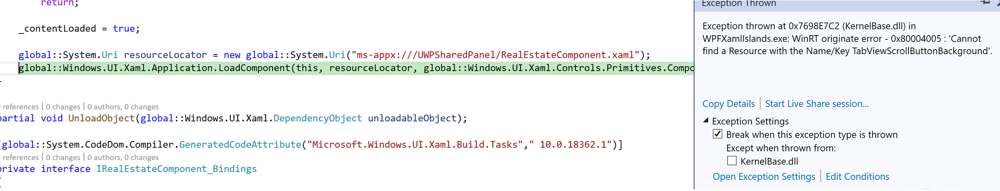

# Host a custom WinRT XAML control in a WPF app using XAML Islands

> [!IMPORTANT]
> This topic uses or mentions types from the [CommunityToolkit/Microsoft.Toolkit.Win32](https://github.com/CommunityToolkit/Microsoft.Toolkit.Win32) GitHub repo. For important info about XAML Islands support, please see the [XAML Islands Notice](https://github.com/CommunityToolkit/Microsoft.Toolkit.Win32#xaml-islands-notice) in that repo.

This article demonstrates how to use the [WindowsXamlHost](/windows/communitytoolkit/controls/wpf-winforms/windowsxamlhost) control in the Windows Community Toolkit to host a custom WinRT XAML control in a WPF app that targets .NET Core 3.1. The custom control contains several first-party controls from the Windows SDK and binds a property in one of the WinRT XAML controls to a string in the WPF app. This article also demonstrates how to also host a control from the [WinUI library](/uwp/toolkits/winui/).

Although this article demonstrates how to do this in a WPF app, the process is similar for a Windows Forms app. For an overview about hosting WinRT XAML controls in WPF and Windows Forms apps, see [this article](xaml-islands.md#wpf-and-windows-forms-applications).

> [!NOTE]
> Using XAML Islands to host WinRT XAML controls in WPF and Windows Forms apps is currently supported only in apps that target .NET Core 3.x. XAML Islands are not yet supported in apps that target .NET, or in apps that any version of the .NET Framework.

## Required components

To host a custom WinRT XAML control in a WPF (or Windows Forms) app, you'll need the following components in your solution. This article provides instructions for creating each of these components.

* **The project and source code for your app**. Using the [WindowsXamlHost](/windows/communitytoolkit/controls/wpf-winforms/windowsxamlhost) control to host custom controls is supported only in apps that target .NET Core 3.x.

* **The custom WinRT XAML control**. You'll need the source code for the custom control you want to host so you can compile it with your app. Typically, the custom control is defined in a UWP class library project that you reference in the same solution as your WPF or Windows Forms project.

* **A UWP app project that defines a root Application class that derives from XamlApplication**. Your WPF or Windows Forms project must have access to an instance of the [Microsoft.Toolkit.Win32.UI.XamlHost.XamlApplication](https://github.com/windows-toolkit/Microsoft.Toolkit.Win32/tree/master/Microsoft.Toolkit.Win32.UI.XamlApplication) class provided by the Windows Community Toolkit so that it can discover and load custom UWP XAML controls. The recommended way to do this is to define this object in a separate UWP app project that is part of the solution for your WPF or Windows Forms app. 

    > [!NOTE]
    > Your solution can contain only one project that defines a `XamlApplication` object. All custom WinRT XAML controls in your app share the same `XamlApplication` object. The project that defines the `XamlApplication` object must include references to all other WinRT libraries and projects that are used host to controls on the XAML Island.

## Create a WPF project

Before getting started, follow these instructions to create a WPF project and configure it to host XAML Islands. If you have an existing WPF project, you can adapt these steps and code examples for your project.

> [!NOTE]
> If you have an existing project that targets the .NET Framework, you'll need to migrate your project to .NET Core 3.1. For more information, see [this blog series](https://devblogs.microsoft.com/dotnet/migrating-a-sample-wpf-app-to-net-core-3-part-1/).

1. If you haven't done so already, install the latest version of the [.NET Core 3.1 SDK](https://dotnet.microsoft.com/download/dotnet/current).

2. In Visual Studio 2019, create a new **WPF App (.NET Core)** project.

3. Make sure [package references](/nuget/consume-packages/package-references-in-project-files) are enabled:

    1. In Visual Studio, click **Tools -> NuGet Package Manager -> Package Manager Settings**.
    2. Make sure **PackageReference** is selected for **Default package management format**.

4. Right-click your WPF project in **Solution Explorer** and choose **Manage NuGet Packages**.

5. Select the **Browse** tab, search for the [Microsoft.Toolkit.Wpf.UI.XamlHost](https://www.nuget.org/packages/Microsoft.Toolkit.Wpf.UI.XamlHost) package and install the latest stable version. This package provides everything you need to use the **WindowsXamlHost** control to host a WinRT XAML control, including other related NuGet packages.
    > [!NOTE]
    > Windows Forms apps must use the [Microsoft.Toolkit.Forms.UI.XamlHost](https://www.nuget.org/packages/Microsoft.Toolkit.Forms.UI.XamlHost) package.

6. Configure your solution to target a specific platform such as x86 or x64. Custom WinRT XAML controls are not supported in projects that target **Any CPU**.

    1. In **Solution Explorer**, right-click the solution node and select **Properties** -> **Configuration Properties** -> **Configuration Manager**.
    2. Under **Active solution platform**, select **New**. 
    3. In the **New Solution Platform** dialog, select **x64** or **x86** and press **OK**. 
    4. Close the open dialog boxes.

## Define a XamlApplication class in a UWP app project

Next, add a UWP app project to your solution and revise the default `App` class in this project to derive from the [Microsoft.Toolkit.Win32.UI.XamlHost.XamlApplication](https://github.com/windows-toolkit/Microsoft.Toolkit.Win32/tree/master/Microsoft.Toolkit.Win32.UI.XamlApplication) class provided by the Windows Community Toolkit. This class supports the [IXamlMetadataProvider](/uwp/api/Windows.UI.Xaml.Markup.IXamlMetadataProvider) interface, which enables your app to discover and load metadata for custom UWP XAML controls in assemblies in the current directory of your application at run time. This class also initializes the UWP XAML framework for the current thread. 

1. In **Solution Explorer**, right-click the solution node and select **Add** -> **New Project**.
2. Add a **Blank App (Universal Windows)** project to your solution. Make sure the target version and minimum version are both set to **Windows 10, version 1903 (Build 18362)** or a later release.
3. In the UWP app project, install the [Microsoft.Toolkit.Win32.UI.XamlApplication](https://www.nuget.org/packages/Microsoft.Toolkit.Win32.UI.XamlApplication) NuGet package (latest stable version).
4. Open the **App.xaml** file and replace the contents of this file with the following XAML. Replace `MyUWPApp` with the namespace of your UWP app project.

    ```xml
    <xaml:XamlApplication
        x:Class="MyUWPApp.App"
        xmlns="http://schemas.microsoft.com/winfx/2006/xaml/presentation"
        xmlns:x="http://schemas.microsoft.com/winfx/2006/xaml"
        xmlns:xaml="using:Microsoft.Toolkit.Win32.UI.XamlHost"
        xmlns:local="using:MyUWPApp">
    </xaml:XamlApplication>
    ```

5. Open the **App.xaml.cs** file and replace the contents of this file with the following code. Replace `MyUWPApp` with the namespace of your UWP app project.

    ```csharp
    namespace MyUWPApp
    {
        public sealed partial class App : Microsoft.Toolkit.Win32.UI.XamlHost.XamlApplication
        {
            public App()
            {
                this.Initialize();
            }
        }
    }
    ```

6. Delete the **MainPage.xaml** file from the UWP app project.
7. Clean the UWP app project and then build it.

## Add a reference to the UWP project in your WPF project

1. Specify the compatible framework version in the WPF project file. 

    1. In **Solution Explorer**, double-click the WPF project node to open the project file in the editor.
    2. In the first **PropertyGroup** element, add the following child element. Change the `19041` portion of the value as necessary to match the target and minimum OS build of the UWP project.

        ```xml
        <AssetTargetFallback>uap10.0.19041</AssetTargetFallback>
        ```

        When you're done, the **PropertyGroup** element should look similar to this.

        ```xml
        <PropertyGroup>
            <OutputType>WinExe</OutputType>
            <TargetFramework>netcoreapp3.1</TargetFramework>
            <UseWPF>true</UseWPF>
            <Platforms>AnyCPU;x64</Platforms>
            <AssetTargetFallback>uap10.0.19041</AssetTargetFallback>
        </PropertyGroup>
        ```

2. In **Solution Explorer**, right-click the **Dependencies** node under the WPF project and add a reference to your UWP app project.

## Instantiate the XamlApplication object in the entry point of your WPF app

Next, add code to the entry point for your WPF app to create an instance of the `App` class you just defined in the UWP project (this is the class that now derives from `XamlApplication`).

1. In your WPF project, right-click the project node, select **Add** -> **New Item**, and then select **Class**. Name the class **Program** and click **Add**.

2. Replace the generated `Program` class with the following code and then save the file. Replace `MyUWPApp` with the namespace of your UWP app project, and replace `MyWPFApp` with the namespace of your WPF app project.

    ```csharp
    public class Program
    {
        [System.STAThreadAttribute()]
        public static void Main()
        {
            using (new MyUWPApp.App())
            {
                MyWPFApp.App app = new MyWPFApp.App();
                app.InitializeComponent();
                app.Run();
            }
        }
    }
    ```

3. Right-click the project node and choose **Properties**.

4. On the **Application** tab of the properties, click the **Startup object** drop-down and choose the fully qualified name of the `Program` class you added in the previous step. 
    > [!NOTE]
    > By default, WPF projects define a `Main` entry point function in a generated code file that isn't intended to be modified. This step changes the entry point for your project to the `Main` method of the new `Program` class, which enables you to add code that runs as early in the startup process of the app as possible. 

5. Save your changes to the project properties.

## Create a custom WinRT XAML control

To host a custom WinRT XAML control in your WPF app, you must have the source code for the control so you can compile it with your app. Typically custom controls are defined in a UWP class library project for easy portability.

In this section, you will define a simple custom control in a new class library project. You can alternatively define the custom control in the UWP app project you created in the previous section. However, these steps do this in a separate class library project for illustrative purposes because this is typically how custom controls are implemented for portability.

If you already have a custom control, you can use it instead of the control shown here. However, you'll still need to configure the project that contains the control as shown in these steps.

1. In **Solution Explorer**, right-click the solution node and select **Add** -> **New Project**.
2. Add a **Class Library (Universal Windows)** project to your solution. Make sure the target version and minimum version are both set to the same target and minimum OS build as the UWP project.
3. Right-click the project file and select **Unload Project**. Right-click the project file again and select **Edit**.
4. Before the closing `</Project>` element, add the following XML to disable several properties and then save the project file. These properties must be enabled to host the custom control in a WPF (or Windows Forms) app.

    ```xml
    <PropertyGroup>
      <EnableTypeInfoReflection>false</EnableTypeInfoReflection>
      <EnableXBindDiagnostics>false</EnableXBindDiagnostics>
    </PropertyGroup>
    ```

5. Right-click the project file and select **Reload Project**.
6. Delete the default **Class1.cs** file and add a new **User Control** item to the project.
7. In the XAML file for the user control, add the following `StackPanel` as a child of the default `Grid`. This example adds a ``TextBlock`` control and then binds the ``Text`` attribute of that control to the ``XamlIslandMessage`` field.

    ```xml
    <StackPanel Background="LightCoral">
        <TextBlock>This is a simple custom WinRT XAML control</TextBlock>
        <Rectangle Fill="Blue" Height="100" Width="100"/>
        <TextBlock Text="{x:Bind XamlIslandMessage}" FontSize="50"></TextBlock>
    </StackPanel>
    ```

8. In the code-behind file for the user control, add the `XamlIslandMessage` field to the user control class as shown below.

    ```csharp
    public sealed partial class MyUserControl : UserControl
    {
        public string XamlIslandMessage { get; set; }

        public MyUserControl()
        {
            this.InitializeComponent();
        }
    }
    ```

9. Build the UWP class library project.
10. In your WPF project, right-click the **Dependencies** node and add a reference to the UWP class library project.
11. In the UWP app project you configured earlier, right-click the **References** node and add a reference to the UWP class library project.
12. Rebuild the entire solution and make sure all the projects build successfully.

## Host the custom WinRT XAML control in your WPF app

1. In **Solution Explorer**, expand the WPF project and open the MainWindow.xaml file or some other window in which you want to host the custom control.
2. In the XAML file, add the following namespace declaration to the `<Window>` element.

    ```xml
    xmlns:xaml="clr-namespace:Microsoft.Toolkit.Wpf.UI.XamlHost;assembly=Microsoft.Toolkit.Wpf.UI.XamlHost"
    ```

3. In the same file, add the following control to the `<Grid>` element. Change the `InitialTypeName` attribute to the fully qualified name of the user control in your UWP class library project.

    ```xml
    <xaml:WindowsXamlHost InitialTypeName="UWPClassLibrary.MyUserControl" ChildChanged="WindowsXamlHost_ChildChanged" />
    ```

4. Open the code-behind file and add the following code to the `Window` class. This code defines a `ChildChanged` event handler that assigns the value of the ``XamlIslandMessage`` field of the UWP custom control to the value of the `WPFMessage` field in the WPF app. Change `UWPClassLibrary.MyUserControl` to the fully qualified name of the user control in your UWP class library project.

    ```csharp
    private void WindowsXamlHost_ChildChanged(object sender, EventArgs e)
    {
        // Hook up x:Bind source.
        global::Microsoft.Toolkit.Wpf.UI.XamlHost.WindowsXamlHost windowsXamlHost =
            sender as global::Microsoft.Toolkit.Wpf.UI.XamlHost.WindowsXamlHost;
        global::UWPClassLibrary.MyUserControl userControl =
            windowsXamlHost.GetUwpInternalObject() as global::UWPClassLibrary.MyUserControl;

        if (userControl != null)
        {
            userControl.XamlIslandMessage = this.WPFMessage;
        }
    }

    public string WPFMessage
    {
        get
        {
            return "Binding from WPF to UWP XAML";
        }
    }
    ```

6. Build and run your app and confirm that the UWP user control displays as expected.

## Add a control from the WinUI 2 library to the custom control

Traditionally, WinRT XAML controls have been released as part of the Windows OS and made available to developers through the Windows SDK. The [WinUI library](/uwp/toolkits/winui/) is an alternative approach, where updated versions of WinRT XAML controls from the Windows SDK are distributed in a NuGet package that is not tied to Windows SDK releases. This library also includes new controls that aren't part of the Windows SDK and the default UWP platform.

This section demonstrates how to add a WinRT XAML control from the WinUI 2 library to your user control.

> [!NOTE]
> Currently, XAML Islands only supports hosting controls from the WinUI 2 library. Support for hosting controls from the WinUI 3 library is coming in a later release.

1. In the UWP app project, install the latest release or prerelease version of the [Microsoft.UI.Xaml](https://www.nuget.org/packages/Microsoft.UI.Xaml) NuGet package.

    > [!NOTE]
    > If your desktop app is packaged in an [MSIX package](/windows/msix), you can use either a prerelease or release version of the [Microsoft.UI.Xaml](https://www.nuget.org/packages/Microsoft.UI.Xaml) NugGet package. If your desktop app is not packaged using MSIX, you must install a prerelease version of the [Microsoft.UI.Xaml](https://www.nuget.org/packages/Microsoft.UI.Xaml) NuGet package.

2. In the App.xaml file in this project, add the following child element to the `<xaml:XamlApplication>` element.

    ```xml
    <Application.Resources>
        <XamlControlsResources xmlns="using:Microsoft.UI.Xaml.Controls" />
    </Application.Resources>
    ```

    After adding this element, the contents of this file should now look similar to this.

    ```xml
    <xaml:XamlApplication
        x:Class="MyUWPApp.App"
        xmlns="http://schemas.microsoft.com/winfx/2006/xaml/presentation"
        xmlns:x="http://schemas.microsoft.com/winfx/2006/xaml"
        xmlns:xaml="using:Microsoft.Toolkit.Win32.UI.XamlHost"
        xmlns:local="using:MyUWPApp">
        <Application.Resources>
            <XamlControlsResources xmlns="using:Microsoft.UI.Xaml.Controls" />
        </Application.Resources>
    </xaml:XamlApplication>
    ```

3. In the UWP class library project, install the latest version of the [Microsoft.UI.Xaml](https://www.nuget.org/packages/Microsoft.UI.Xaml) NuGet package (the same version that you installed in the UWP app project).

4. In the same project, open the XAML file for the user control and add the following namespace declaration to the `<UserControl>` element.

    ```xml
    xmlns:winui="using:Microsoft.UI.Xaml.Controls"
    ```

5. In the same file, add a `<winui:RatingControl />` element as a child of the `<StackPanel>`. This element adds an instance of the [RatingControl](/uwp/api/microsoft.ui.xaml.controls.ratingcontrol) class from the WinUI library. After adding this element, the `<StackPanel>` should now look similar to this.

    ```xml
    <StackPanel Background="LightCoral">
        <TextBlock>This is a simple custom WinRT XAML control</TextBlock>
        <Rectangle Fill="Blue" Height="100" Width="100"/>
        <TextBlock Text="{x:Bind XamlIslandMessage}" FontSize="50"></TextBlock>
        <winui:RatingControl />
    </StackPanel>
    ```

6. Build and run your app and confirm that the new rating control displays as expected.

## Package the app

You can optionally package the WPF app in an [MSIX package](/windows/msix) for deployment. MSIX is the modern app packaging technology for Windows, and it is based on a combination of MSI, .appx, App-V, and ClickOnce installation technologies.

The following instructions show you how to package the all the components in the solution in an MSIX package by using the [Windows Application Packaging Project](/windows/msix/desktop/desktop-to-uwp-packaging-dot-net) in Visual Studio 2019. These steps are necessary only if you want to package the WPF app in an MSIX package. 

> [!NOTE]
> If you choose to not package your application in an [MSIX package](/windows/msix) for deployment, then computers that run your app must have the [Visual C++ Runtime](https://support.microsoft.com/help/2977003/the-latest-supported-visual-c-downloads) installed.

1. Add a new [Windows Application Packaging Project](/windows/msix/desktop/desktop-to-uwp-packaging-dot-net) to your solution. As you create the project, select the same **Target version** and **Minimum version** as you selected for the UWP project.

2. In the packaging project, right-click the **Applications** node and choose **Add reference**. In the list of projects, select the WPF project in your solution and click **OK**.

    > [!NOTE]
    > If you want to publish your app in the Microsoft Store, you have to add reference to the UWP project in the packaging project.

3. Configure your solution to target a specific platform such as x86 or x64. This is required to build the WPF app into an MSIX package using the Windows Application Packaging Project.

    1. In **Solution Explorer**, right-click the solution node and select **Properties** -> **Configuration Properties** -> **Configuration Manager**.
    2. Under **Active solution platform**, select **x64** or **x86**.
    3. In the row for your WPF project, in the **Platform** column select **New**.
    4. In the **New Solution Platform** dialog, select **x64** or **x86** (the same platform you selected for **Active solution platform**) and click **OK**.
    5. Close the open dialog boxes.

4. Build and run the packaging project. Confirm that the WPF runs and the UWP custom control displays as expected.

5. For info about distributing/deploying the package, see [Manage your MSIX deployment](/windows/msix/desktop/managing-your-msix-deployment-overview). 

## Resolve "Cannot find a Resource" error when hosting a WinUI control

If you're hosting a custom control that contains a control from the WinUI library, you may encounter a problem where the control cannot be loaded in a packaged app and debugging the code shows the following error.



To resolve this error, copy the **App.xbf** file from the build output folder of the WPF project to the **\AppX\\<WPF project\>** build output folder of the packaging project. 

For example, if the WPF project is named **WPFXamlIslandsApp** and targets x86 platform, copy **App.xbf** from **\WPFXamlIslandsApp\bin\x86\Release\netcoreapp3.1** to **\WPFXamlIslandsApp.Pack\bin\x86\Release\AppX\WPFXamlIslandsAPP**.
    

## Related topics

* [Host UWP XAML controls in desktop apps (XAML Islands)](xaml-islands.md)
* [XAML Islands code samples](https://github.com/microsoft/Xaml-Islands-Samples)
* [WindowsXamlHost](/windows/communitytoolkit/controls/wpf-winforms/windowsxamlhost)
