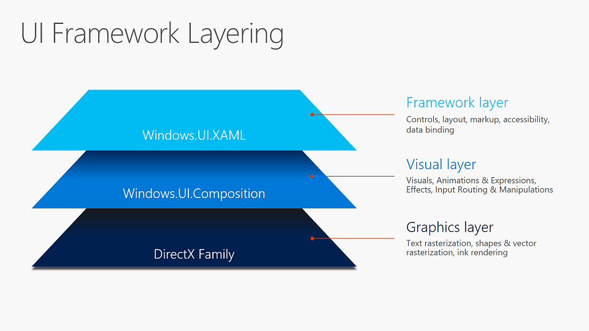
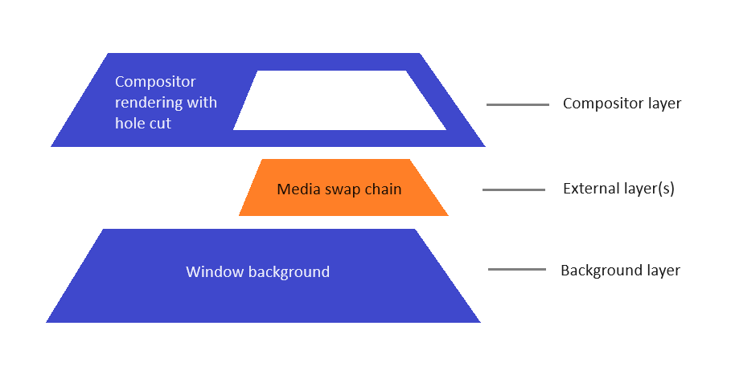

# Visual layer overview

The Visual layer provides a high performance, retained-mode API for graphics, effects, and animations, and is the foundation for all UI across Windows devices. You define your UI in a declarative manner, and the Visual layer relies on graphics hardware acceleration to ensure your content, effects, and animations are rendered in a smooth, glitch-free manner independent of the app's UI thread.

The types in [Microsoft.UI.Composition](/windows/windows-app-sdk/api/winrt/microsoft.ui.composition) form the Windows App SDK/WinUI 3 implementation of the Visual layer.

Notable highlights:

* Familiar WinRT APIs
* Architected for more dynamic UI and interactions
* Concepts aligned with design tools
* Linear scalability with no sudden performance cliffs

Your WinUI and Windows App SDK apps are already using the Visual layer via one of the UI frameworks. You can also take advantage of the Visual layer directly for custom rendering, effects, and animations with very little effort.

## What's in the Visual layer?

The primary functions of the Visual layer are:

1. **Content**: Lightweight compositing of custom drawn content
1. **Effects**: Real-time UI effects system whose effects can be animated, chained and customized
1. **Animations**: Expressive, framework-agnostic animations running independent of the UI thread

### Content

Content is hosted, transformed and made available for use by the animation and effects system using visuals. At the base of the class hierarchy is the [**Visual**](/windows/windows-app-sdk/api/winrt/microsoft.ui.composition.visual) class, a lightweight, thread-agile proxy in the app process for visual state in the compositor. Sub-classes of Visual include  [**ContainerVisual**](/windows/windows-app-sdk/api/winrt/microsoft.ui.composition.containervisual) to allow for children to create trees of visuals and [**SpriteVisual**](/windows/windows-app-sdk/api/winrt/microsoft.ui.composition.spritevisual) that contains content and can be painted with either solid colors, custom drawn content or visual effects. Together, these Visual types make up the visual tree structure for 2D UI and back most visible XAML FrameworkElements.

For more information, see the [Composition Visual](composition-visual-tree.md) overview.

### Effects

The Effects system in the Visual layer lets you apply a chain of filter and transparency effects to a Visual or a tree of Visuals. This is a UI effects system, not to be confused with image and media effects. Effects work in conjunction with the Animation system, allowing users to achieve smooth and dynamic animations of Effect properties, rendered independent of the UI thread. Effects in the Visual Layer provide the creative building blocks that can be combined and animated to construct tailored and interactive experiences.

In addition to animatable effect chains, the Visual Layer also supports a lighting model that allows Visuals to mimic material properties by responding to animatable lights. Visuals may also cast shadows. Lighting and shadows can be combined to create a perception of depth and realism.

For more information, see the [Composition Effects](composition-effects.md) overview.

### Animations

The animation system in the Visual layer lets you move visuals, animate effects, and drive transformations, clips, and other properties.  It is a framework agnostic system that has been designed from the ground up with performance in mind.  It runs independently from the UI thread to ensure smoothness and scalability.  While it lets you use familiar KeyFrame animations to drive property changes over time, it also lets you set up mathematical relationships between different properties, including user input, letting you directly craft seamless choreographed experiences.

For more information, see the [Composition animations](composition-animation.md) overview.

## Working with WinUI XAML

You can get to a Visual created by the XAML framework, and backing a visible FrameworkElement, by using the [**ElementCompositionPreview**](/windows/windows-app-sdk/api/winrt/microsoft.ui.xaml.hosting.elementcompositionpreview) class in [**Microsoft.UI.Xaml.Hosting**](/windows/windows-app-sdk/api/winrt/microsoft.ui.xaml.hosting). Note that Visuals created for you by the framework come with some limits on customization. This is because the framework is managing offsets, transforms, and lifetimes. You can, however, create your own Visuals and attach them to an existing WinUI element via ElementCompositionPreview, or by adding them to an existing ContainerVisual somewhere in the visual tree structure.

For more information, see the [Using the Visual layer with XAML](using-the-visual-layer-with-xaml.md) overview.

## Working with your desktop app

You can use the Visual layer to enhance the look, feel, and functionality of Win32 desktop apps built with the Windows App SDK, as well as WPF, Windows Forms, and C++ Win32 desktop apps. You can migrate islands of content to use the Visual layer and keep the rest of your UI in its existing framework. This means you can make significant updates and enhancements to your application UI without needing to make extensive changes to your existing code base.

For more information, see [Modernize your desktop app using the Visual layer](/windows/apps/desktop/modernize/visual-layer-in-desktop-apps).

## Differences from UWP

The **Microsoft.UI.Composition** namespace provides access to functionality that's nearly identical to the UWP Visual layer (**Windows.UI.Composition**), in the most commonly used scenarios. But there are exceptions and differences.

### Getting a Compositor instance

In desktop apps (a WinUI app is a desktop app), **Window.Current** is `null`. So you can't retrieve an instance of [Compositor](/windows/windows-app-sdk/api/winrt/microsoft.ui.composition.compositor) from `Window.Current.Compositor`. In WinUI apps, we recommend that you call [ElementCompositionPreview.GetElementVisual(UIElement)](/windows/windows-app-sdk/api/winrt/microsoft.ui.xaml.hosting.elementcompositionpreview.getelementvisual) to get a Composition [Visual](/windows/windows-app-sdk/api/winrt/microsoft.ui.composition.visual), and retrieve the `Compositor` from the visual's [Compositor](/windows/windows-app-sdk/api/winrt/microsoft.ui.composition.compositionobject.compositor) property. In cases where you don't have access to a **UIElement** (for example, if you create a [CompositionBrush](/windows/windows-app-sdk/api/winrt/microsoft.ui.composition.compositionbrush) in a class library), you can call [CompositionTarget.GetCompositorForCurrentThread](/windows/windows-app-sdk/api/winrt/microsoft.ui.xaml.media.compositiontarget.getcompositorforcurrentthread).

### External content

The **Microsoft.UI.Composition** compositor runs entirely within a Windows App SDK app and has access only to pixels that it drew. That means that any *external* content (content that wasn't drawn by the compositor) is unknown to the compositor, which creates certain limitations.

An example of external content is the (**Microsoft.UI.Xaml.Controls**) [MediaPlayerElement](/windows/windows-app-sdk/api/winrt/microsoft.ui.xaml.controls.mediaplayerelement). The Windows media stack provides to XAML an opaque media swap chain handle. XAML gives that handle to the compositor, which in turn hands it off to Windows (via **Windows.UI.Composition**) to display. Since the compositor can't see any of the pixels in the media swap chain, it can't composite that as part of the overall rendering for the window. Instead, it gives the media swap chain to Windows to render it below the compositor's rendering, with a hole cut out of the compositor's rendering in order to allow the media swap chain below it to be visible.

In the Windows App SDK/WinUI, the following APIs all create external content:

* [MediaPlayerElement](/windows/windows-app-sdk/api/winrt/microsoft.ui.xaml.controls.mediaplayerelement)
* [SwapChainPanel](/windows/windows-app-sdk/api/winrt/microsoft.ui.xaml.controls.swapchainpanel)
* [WebView2](/windows/windows-app-sdk/api/winrt/microsoft.ui.xaml.controls.webview2)
* [MicaBackdrop](/windows/windows-app-sdk/api/winrt/microsoft.ui.xaml.media.micabackdrop) and [DesktopAcrylicBackdrop](/windows/windows-app-sdk/api/winrt/microsoft.ui.xaml.media.desktopacrylicbackdrop), as well as the underlying [MicaController](/windows/windows-app-sdk/api/winrt/microsoft.ui.composition.systembackdrops.micacontroller) and [DesktopAcrylicController](/windows/windows-app-sdk/api/winrt/microsoft.ui.composition.systembackdrops.desktopacryliccontroller) that they use.

The model of handling external content creates these limitations:

* It's not possible to have compositor content behind external content. For example, it's not possible to give a **WebView2** a transparent background in order to see XAML buttons or images behind it. The only things that can be behind external content are *other* external content and the window background. Because of that, we discourage/disable transparency for external content.
* It's not possible to have compositor content sample from external content. For example, [AcrylicBrush](/windows/windows-app-sdk/api/winrt/microsoft.ui.xaml.media.acrylicbrush) isn't able to sample and blur any pixels from a **MediaPlayerElement**. **AcrylicBrush** will sample from the compositor's image, which is transparent black for external content areas. Similarly, **AcrylicBrush** in front of a **MicaBackdrop** or **DesktopAcrylicBackdrop** can't see any colors that those backdrops will draw; and instead, the brush will blur the transparent black.
* Another scenario is known as *destination invert*, which is used for the caret of text box controls to invert the pixels that the text insertion caret is in front of. That invert similarly samples from the compositor surface, and it will be impacted if the text box doesn't have an opaque background that's drawn by the compositor.
* Because the WinUI [SwapChainPanel](/windows/windows-app-sdk/api/winrt/microsoft.ui.xaml.controls.swapchainpanel) creates external content, it doesn't support transparency. Nor does it support applying [AcrylicBrush](/windows/windows-app-sdk/api/winrt/microsoft.ui.xaml.media.acrylicbrush) and other effects that use a [CompositionBackdropBrush](/windows/windows-app-sdk/api/winrt/microsoft.ui.composition.compositionbackdropbrush) in front of it.

## Samples

The Windows App SDK Samples project includes a comprehensive set of composition samples that demonstrate how to use the **Microsoft.UI.Composition** APIs to build rich visual experiences. These samples cover a wide range of scenarios — from basic layout and transforms to advanced effects, lighting, shadows, and InteractionTracker-based input handling like pull-to-refresh and parallax scrolling. Whether you're getting started with the Visual layer or looking for patterns to apply in your own app, these samples are a practical reference for seeing how the building blocks come together.

Explore the samples on GitHub: [WindowsAppSDK-Samples / SceneGraph](https://github.com/microsoft/WindowsAppSDK-Samples/tree/main/Samples/SceneGraph).

## Related topics

* [**Microsoft.UI.Composition API reference**](/windows/windows-app-sdk/api/winrt/microsoft.ui.composition)
* [Using the Visual layer in desktop apps](../../desktop/modernize/ui/visual-layer-in-desktop-apps.md)
