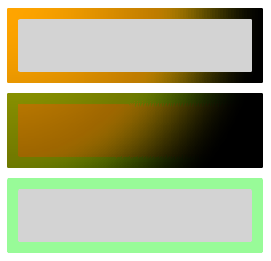

# XAML lighting in WinUI

[**CompositionLight**](/windows/windows-app-sdk/api/winrt/microsoft.ui.composition.compositionlight) objects are used in conjunction with [**SceneLightingEffect**](/windows/windows-app-sdk/api/winrt/microsoft.ui.composition.effects.scenelightingeffect) to simulate dynamic lighting and reflectivity.

You can apply lights to [**Visuals**](/windows/windows-app-sdk/api/winrt/microsoft.ui.composition.visual) and XAML [**UIElements**](/windows/windows-app-sdk/api/winrt/microsoft.ui.xaml.uielement).

## Applying lights to XAML UIElements

[**XamlLight**](/windows/windows-app-sdk/api/winrt/microsoft.ui.xaml.media.xamllight) objects are used to apply [**CompositionLights**](/windows/windows-app-sdk/api/winrt/microsoft.ui.composition.compositionlight) to dynamically light XAML UIElements. XamlLight provides methods for targeting UIElements or XAML Brushes, applying lights to trees of UIElements, and helping manage the lifetime of CompositionLight resources based on whether they're currently in use.

- If you target a **Brush** with a XamlLight then the portions of any UIElements using that Brush are lit by the light.
- If you target a **UIElement** with a XamlLight then the entire UIElement and its child UIElements are all lit by the light.

## Creating and using a XamlLight

[**XamlLight**](/windows/windows-app-sdk/api/winrt/microsoft.ui.xaml.media.xamllight) is a base class which can be used to create custom lights.

This example shows the definition for a custom XamlLight that applies a multicolored spotlight to targeted UIElements and Brushes in WinUI.

```csharp
public sealed class OrangeSpotLight : XamlLight
{
    // Register an attached property that lets you set a UIElement
    // or Brush as a target for this light type in markup.
    public static readonly DependencyProperty IsTargetProperty =
        DependencyProperty.RegisterAttached(
        "IsTarget",
        typeof(bool),
        typeof(OrangeSpotLight),
        new PropertyMetadata(null, OnIsTargetChanged)
    );

    public static void SetIsTarget(DependencyObject target, bool value)
    {
        target.SetValue(IsTargetProperty, value);
    }

    public static Boolean GetIsTarget(DependencyObject target)
    {
        return (bool)target.GetValue(IsTargetProperty);
    }

    // Handle attached property changed to automatically target and untarget UIElements and Brushes.
    private static void OnIsTargetChanged(DependencyObject obj, DependencyPropertyChangedEventArgs e)
    {
        var isAdding = (bool)e.NewValue;

        if (isAdding)
        {
            if (obj is UIElement)
            {
                XamlLight.AddTargetElement(GetIdStatic(), obj as UIElement);
            }
            else if (obj is Brush)
            {
                XamlLight.AddTargetBrush(GetIdStatic(), obj as Brush);
            }
        }
        else
        {
            if (obj is UIElement)
            {
                XamlLight.RemoveTargetElement(GetIdStatic(), obj as UIElement);
            }
            else if (obj is Brush)
            {
                XamlLight.RemoveTargetBrush(GetIdStatic(), obj as Brush);
            }
        }
    }

    protected override void OnConnected(UIElement newElement)
    {
        if (CompositionLight == null)
        {
            // OnConnected is called when the first target UIElement is shown on the screen.
            // This lets you delay creation of the composition object until it's actually needed.
            var spotLight = CompositionTarget.GetCompositorForCurrentThread().CreateSpotLight();
            spotLight.InnerConeColor = Colors.Orange;
            spotLight.OuterConeColor = Colors.Yellow;
            spotLight.InnerConeAngleInDegrees = 30;
            spotLight.OuterConeAngleInDegrees = 45;
            CompositionLight = spotLight;
        }
    }

    protected override void OnDisconnected(UIElement oldElement)
    {
        // OnDisconnected is called when there are no more target UIElements on the screen.
        // The CompositionLight should be disposed when no longer required.
        if (CompositionLight != null)
        {
            CompositionLight.Dispose();
            CompositionLight = null;
        }
    }

    protected override string GetId()
    {
        return GetIdStatic();
    }

    private static string GetIdStatic()
    {
        // This specifies the unique name of the light.
        // In most cases you should use the type's FullName.
        return typeof(OrangeSpotLight).FullName;
    }
}
```

```cppwinrt
// For the C++/WinRT code example below, you'll need to add a Midl File (.idl) file to your project.

// OrangeSpotLight.idl
namespace MyApp
{
    [default_interface]
    runtimeclass OrangeSpotLight : Microsoft.UI.Xaml.Media.XamlLight
    {
        OrangeSpotLight();
        static Microsoft.UI.Xaml.DependencyProperty IsTargetProperty{ get; };
        static Boolean GetIsTarget(Microsoft.UI.Xaml.DependencyObject target);
        static void SetIsTarget(Microsoft.UI.Xaml.DependencyObject target, Boolean value);
    }
}

// OrangeSpotLight.h
struct OrangeSpotLight : OrangeSpotLightT<OrangeSpotLight>
{
    OrangeSpotLight() = default;

    winrt::hstring GetId();

    static Microsoft::UI::Xaml::DependencyProperty IsTargetProperty() { return m_isTargetProperty; }

    static bool GetIsTarget(Microsoft::UI::Xaml::DependencyObject const& target)
    {
		return winrt::unbox_value<bool>(target.GetValue(m_isTargetProperty));
	}

    static void SetIsTarget(Microsoft::UI::Xaml::DependencyObject const& target, bool value)
    {
        target.SetValue(m_isTargetProperty, winrt::box_value(value));
    }

    void OnConnected(Microsoft::UI::Xaml::UIElement const& newElement);
    void OnDisconnected(Microsoft::UI::Xaml::UIElement const& oldElement);

    static void OnIsTargetChanged(Microsoft::UI::Xaml::DependencyObject const& d, Microsoft::UI::Xaml::DependencyPropertyChangedEventArgs const& e);

    inline static winrt::hstring GetIdStatic()
    {
        // This specifies the unique name of the light. In most cases you should use the type's full name.
        return winrt::xaml_typename<MyApp::OrangeSpotLight>().Name;
    }

private:
	static Microsoft::UI::Xaml::DependencyProperty m_isTargetProperty;
};

// OrangeSpotLight.cpp
Microsoft::UI::Xaml::DependencyProperty OrangeSpotLight::m_isTargetProperty =
    Microsoft::UI::Xaml::DependencyProperty::RegisterAttached(
        L"IsTarget",
        winrt::xaml_typename<bool>(),
        winrt::xaml_typename<MyApp::OrangeSpotLight>(),
        Microsoft::UI::Xaml::PropertyMetadata{ winrt::box_value(false), Microsoft::UI::Xaml::PropertyChangedCallback{ &OrangeSpotLight::OnIsTargetChanged } }
);

void OrangeSpotLight::OnConnected(Microsoft::UI::Xaml::UIElement const& /* newElement */)
{
    if (!CompositionLight())
    {
        // OnConnected is called when the first target UIElement is shown on the screen. This enables delaying composition object creation until it's actually necessary.
        auto spotLight{ Microsoft::UI::Xaml::Media::CompositionTarget::GetCompositorForCurrentThread().CreateSpotLight() };
        spotLight.InnerConeColor(Microsoft::UI::Colors::Orange());
        spotLight.OuterConeColor(Microsoft::UI::Colors::Yellow());
        spotLight.InnerConeAngleInDegrees(30);
        spotLight.OuterConeAngleInDegrees(45);
        CompositionLight(spotLight);
    }
}

void OrangeSpotLight::OnDisconnected(Microsoft::UI::Xaml::UIElement const& /* oldElement */)
{
    // OnDisconnected is called when there are no more target UIElements on the screen.
    // Dispose of composition resources when no longer in use.
    if (CompositionLight())
    {
        CompositionLight(nullptr);
    }
}

winrt::hstring OrangeSpotLight::GetId()
{
    return OrangeSpotLight::GetIdStatic();
}

void OrangeSpotLight::OnIsTargetChanged(Microsoft::UI::Xaml::DependencyObject const& d, Microsoft::UI::Xaml::DependencyPropertyChangedEventArgs const& e)
{
    auto uie{ d.try_as<Microsoft::UI::Xaml::UIElement>() };
    auto brush{ d.try_as<Microsoft::UI::Xaml::Media::Brush>() };

    auto isAdding = winrt::unbox_value<bool>(e.NewValue());
    if (isAdding)
    {

        if (uie)
        {
            Microsoft::UI::Xaml::Media::XamlLight::AddTargetElement(OrangeSpotLight::GetIdStatic(), uie);
        }
        else if (brush)
        {
            Microsoft::UI::Xaml::Media::XamlLight::AddTargetBrush(OrangeSpotLight::GetIdStatic(), brush);
        }
    }
    else
    {
        if (uie)
        {
            Microsoft::UI::Xaml::Media::XamlLight::RemoveTargetElement(OrangeSpotLight::GetIdStatic(), uie);
        }
        else if (brush)
        {
            Microsoft::UI::Xaml::Media::XamlLight::RemoveTargetBrush(OrangeSpotLight::GetIdStatic(), brush);
        }
    }
}

// MainPage.h
...
#include "OrangeSpotLight.h"
...
struct MainPage : MainPageT<MainPage>
{
    MainPage()
    {
        InitializeComponent();

		OrangeSpotLight::SetIsTarget(spotlitBrush(), true);
		OrangeSpotLight::SetIsTarget(spotlitUIElement(), true);
	}
...
};
```

You can then apply this light to any XAML UIElement or Brush to light them. This example shows different potential usages.

> [!Important]
> For [C++/WinRT](/windows/apps/develop/cpp-winrt/intro-to-using-cpp-with-winrt), remove the two occurrences of `local:OrangeSpotLight.IsTarget="True"` from the markup below. The attached properties are already set in code-behind.

```xaml
<StackPanel Width="100">
    <StackPanel.Lights>
        <local:OrangeSpotLight/>
    </StackPanel.Lights>

    <!-- This border is lit by the OrangeSpotLight, but its content is not. -->
    <Border BorderThickness="4" Margin="2">
        <Border.BorderBrush>
            <SolidColorBrush x:Name="spotlitBrush" Color="White" local:OrangeSpotLight.IsTarget="True"/>
        </Border.BorderBrush>
        <Rectangle Fill="LightGray" Height="20"/>
    </Border>

    <!-- This border and its content are lit by the OrangeSpotLight. -->
    <Border x:Name="spotlitUIElement" BorderThickness="4" BorderBrush="PaleGreen" Margin="2"
            local:OrangeSpotLight.IsTarget="True">
        <Rectangle Fill="LightGray" Height="20"/>
    </Border>

    <!-- This border and its content are not lit by the OrangeSpotLight. -->
    <Border BorderThickness="4" BorderBrush="PaleGreen" Margin="2">
        <Rectangle Fill="LightGray" Height="20"/>
    </Border>
</StackPanel>
```

The results of this XAML look like this.



> [!Important]
> Setting UIElement.Lights in markup as shown in the above example is only supported for apps with a Minimum Version equal to the Windows 10 Creators Update or later. For apps that target earlier versions, lights must be created in code-behind.

## Additional Resources

* Advanced UI and Composition samples in the [WindowsCompositionSamples GitHub](https://github.com/microsoft/WindowsCompositionSamples).