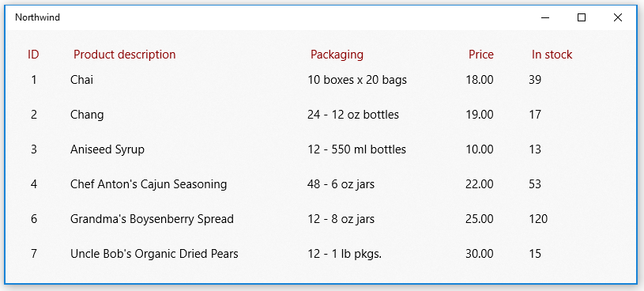
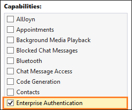

# Use a SQL Server database in a Windows app

Your app can connect directly to a SQL Server database and then store and retrieve data by using classes in the [System.Data.SqlClient](/dotnet/api/system.data.sqlclient) namespace.

## Getting started

In this guide, we'll show you one way to do that in your Windows App SDK apps. If you install the [Northwind](/dotnet/framework/data/adonet/sql/linq/downloading-sample-databases) sample database onto your SQL Server instance, and then use these snippets, you'll end up with a basic UI that shows products from the Northwind sample database.



The snippets that appear in this guide are based on this [UWP sample app](https://github.com/StefanWickDev/IgniteDemos/tree/master/NorthwindDemo).

## First, set up your solution

To connect your app directly to a SQL Server database, your app can target any minimum version of Windows supported by Windows App SDK.  You can find that information in the properties page of your project.

1. Open the **Package.appxmanifest** file of your Windows App SDK project in the manifest designer.
1. In the **Capabilities** tab, select the **Enterprise Authentication** checkbox if you are using Windows Authentication for authenticating your SQL Server.



> [!IMPORTANT]
> You will also need to select **Internet (Client & Server)**, **Internet (Client)**, and **Private Networks (Client & Server)**, regardless of whether or not you're using Windows Authentication.

## Add and retrieve data in a SQL Server database

In this section, we'll do these things:

:one: Add a connection string.

:two: Create a class to hold product data.

:three: Retrieve products from the SQL Server database.

:four: Add a basic user interface.

:five: Populate the UI with Products.

> [!NOTE]
> This section illustrates one way to organize your data access code. It's meant only to provide an example of how you can use  [System.Data.SqlClient](/dotnet/api/system.data.sqlclient) to store and retrieve data from a SQL Server database. You can organize your code in any way that makes the most sense to your application's design.

### Add a connection string

In the **App.xaml.cs** file, add a property to the `App` class, that gives other classes in your solution access to the connection string.

Our connection string points to the Northwind database in a SQL Server Express instance.

```csharp
sealed partial class App : Application
{
    // Connection string for using Windows Authentication.
    private string connectionString =
        @"Data Source=YourServerName\SQLEXPRESS;Initial Catalog=NORTHWIND;Integrated Security=SSPI";

    public string ConnectionString { get => connectionString; set => connectionString = value; }

    ...
}
```

> [!IMPORTANT]
> In production applications, connection information should be stored securely in app configuration (see [**Adding Azure App Configuration by using Visual Studio Connected Services**](/visualstudio/azure/vs-azure-tools-connected-services-app-configuration)). Connection strings and other secrets should never be hard-coded.

### Create a class to hold product data

We'll create a class that implements the [INotifyPropertyChanged](/dotnet/api/system.componentmodel.inotifypropertychanged) event so that we can bind attributes in our XAML UI to the properties in this class.

```csharp
public class Product : INotifyPropertyChanged
{
    public int ProductID { get; set; }
    public string ProductCode { get { return ProductID.ToString(); } }
    public string ProductName { get; set; }
    public string QuantityPerUnit { get; set; }
    public decimal UnitPrice { get; set; }
    public string UnitPriceString { get { return UnitPrice.ToString("######.00"); } }
    public int UnitsInStock { get; set; }
    public string UnitsInStockString { get { return UnitsInStock.ToString("#####0"); } }
    public int CategoryId { get; set; }

    public event PropertyChangedEventHandler PropertyChanged;
    private void NotifyPropertyChanged(string propertyName)
    {
        PropertyChanged?.Invoke(this, new PropertyChangedEventArgs(propertyName));
    }
}
```

### Retrieve products from the SQL Server database

In the **MainWindow.xaml.cs** file of the Windows App SDK project, create a method that gets products from the Northwind sample database, and then returns them as an [ObservableCollection](/dotnet/api/system.collections.objectmodel.observablecollection-1) collection of `Product` instances.

```csharp
public ObservableCollection<Product> GetProducts(string connectionString)
{
    const string GetProductsQuery = "select ProductID, ProductName, QuantityPerUnit," +
       " UnitPrice, UnitsInStock, Products.CategoryID " +
       " from Products inner join Categories on Products.CategoryID = Categories.CategoryID " +
       " where Discontinued = 0";

    var products = new ObservableCollection<Product>();
    try
    {
        using (var conn = new SqlConnection(connectionString))
        {
            conn.Open();
            if (conn.State == System.Data.ConnectionState.Open)
            {
                using (SqlCommand cmd = conn.CreateCommand())
                {
                    cmd.CommandText = GetProductsQuery;
                    using (SqlDataReader reader = cmd.ExecuteReader())
                    {
                        while (reader.Read())
                        {
                            var product = new Product();
                            product.ProductID = reader.GetInt32(0);
                            product.ProductName = reader.GetString(1);
                            product.QuantityPerUnit = reader.GetString(2);
                            product.UnitPrice = reader.GetDecimal(3);
                            product.UnitsInStock = reader.GetInt16(4);
                            product.CategoryId = reader.GetInt32(5);
                            products.Add(product);
                        }
                    }
                }
            }
        }
        return products;
    }
    catch (Exception eSql)
    {
        Debug.WriteLine($"Exception: {eSql.Message}");
    }
    return null;
}
```

### Add a basic user interface

Add the following XAML to the **MainWindow.xaml** file of the Windows App SDK project.

This XAML creates a [ListView](/windows/windows-app-sdk/api/winrt/microsoft.ui.xaml.controls.listview) to show each product that you returned in the previous snippet, and binds the attributes of each row in the `ListView` to the properties that we defined in the `Product` class.

```xml
<Grid Background="{ThemeResource SystemControlAcrylicWindowBrush}">
    <RelativePanel>
        <ListView Name="InventoryList"
                  SelectionMode="Single"
                  ScrollViewer.VerticalScrollBarVisibility="Auto"
                  ScrollViewer.IsVerticalRailEnabled="True"
                  ScrollViewer.VerticalScrollMode="Enabled"
                  ScrollViewer.HorizontalScrollMode="Enabled"
                  ScrollViewer.HorizontalScrollBarVisibility="Auto"
                  ScrollViewer.IsHorizontalRailEnabled="True"
                  Margin="20">
            <ListView.HeaderTemplate>
                <DataTemplate>
                    <StackPanel Orientation="Horizontal"  >
                        <TextBlock Text="ID" Margin="8,0" Width="50" Foreground="DarkRed" />
                        <TextBlock Text="Product description" Width="300" Foreground="DarkRed" />
                        <TextBlock Text="Packaging" Width="200" Foreground="DarkRed" />
                        <TextBlock Text="Price" Width="80" Foreground="DarkRed" />
                        <TextBlock Text="In stock" Width="80" Foreground="DarkRed" />
                    </StackPanel>
                </DataTemplate>
            </ListView.HeaderTemplate>
            <ListView.ItemTemplate>
                <DataTemplate x:DataType="local:Product">
                    <StackPanel Orientation="Horizontal" >
                        <TextBlock Name="ItemId"
                                    Text="{x:Bind ProductCode}"
                                    Width="50" />
                        <TextBlock Name="ItemName"
                                    Text="{x:Bind ProductName}"
                                    Width="300" />
                        <TextBlock Text="{x:Bind QuantityPerUnit}"
                                   Width="200" />
                        <TextBlock Text="{x:Bind UnitPriceString}"
                                   Width="80" />
                        <TextBlock Text="{x:Bind UnitsInStockString}"
                                   Width="80" />
                    </StackPanel>
                </DataTemplate>
            </ListView.ItemTemplate>
        </ListView>
    </RelativePanel>
</Grid>
```

### Show products in the ListView

Open the **MainWindow.xaml.cs** file, and add code to the constructor of the `MainWindow` class that sets the **ItemSource** property of the [ListView](/windows/windows-app-sdk/api/winrt/microsoft.ui.xaml.controls.listview) to the [ObservableCollection](/dotnet/api/system.collections.objectmodel.observablecollection-1) of `Product` instances.

```csharp
public MainWindow()
{
    this.InitializeComponent();
    InventoryList.ItemsSource = GetProducts((App.Current as App).ConnectionString);
}
```

Start the project and see products from the Northwind sample database appear in the UI.


Explore the [System.Data.SqlClient](/dotnet/api/system.data.sqlclient) namespace to see what other things you can do with data in your SQL Server database.

## Trouble connecting to your database?

In most cases, some aspect of the SQL Server configuration needs to be changed. If you're able to connect to your database from another type of desktop application such as a Windows Forms or WPF application, ensure that you've enabled TCP/IP for SQL Server. You can do that in the **Computer Management** console. (See [Windows Tools/Administrative Tools](/windows/client-management/administrative-tools-in-windows-10#tools) for more information.)


Then, make sure that your SQL Server Browser service is running.


## Next step

> [!div class="nextstepaction"]
> [Use a SQLite database in a Windows app](sqlite-data-access.md)
