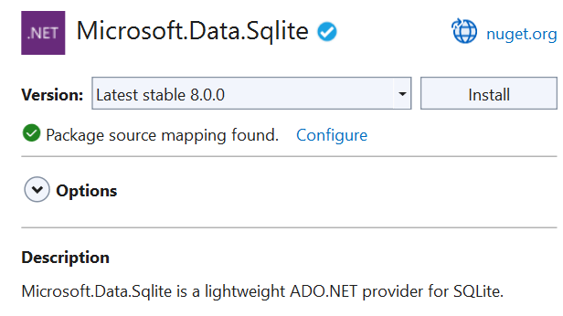

# Use a SQLite database in a Windows app

You can use SQLite to store and retrieve data in a lightweight database on the user's device. This guide shows you how to do it in your Windows App SDK apps.

## Some benefits of using SQLite for local storage

:heavy_check_mark: SQLite is lightweight and self-contained. It's a code library without any other dependencies. There's nothing to configure.

:heavy_check_mark: There's no database server. The client and the server run in the same process.

:heavy_check_mark: SQLite is in the public domain so you can freely use and distribute it with your app.

:heavy_check_mark: SQLite works across platforms and architectures.

You can read more about SQLite [here](https://sqlite.org/about.html).

## Choose an abstraction layer

We recommend that you use either [Entity Framework Core](/ef/core/) or the open-source [SQLite library](https://github.com/aspnet/Microsoft.Data.Sqlite/) built by Microsoft.

### Entity Framework Core

Entity Framework (EF) is an object-relational mapper that you can use to work with relational data by using domain-specific objects. If you've already used this framework to work with data in other .NET apps, you can use the same code in your Windows App SDK app and it will work with appropriate changes to the connection string.

To try it out, see [Getting Started with EF Core](/ef/core/get-started/overview/first-app).

### SQLite library

The [Microsoft.Data.Sqlite](/dotnet/api/microsoft.data.sqlite) library implements the interfaces in the [System.Data.Common](/dotnet/api/system.data.common) namespace. Microsoft actively maintains these implementations, and they provide an intuitive wrapper around the low-level native SQLite API.

The rest of this guide helps you to use this library.

## Set up your solution to use the Microsoft.Data.SQlite library

We'll start with a basic Windows App SDK project, and then install the SQLite NuGet package.

All supported versions of Windows support SQLite, so your app does not have to package SQLite libraries. Instead, your app can use the version of SQLite that comes installed with Windows. This helps you in a few ways.

:heavy_check_mark: Reduces the size of your application because you don't have to download the SQLite binary, and then package it as part of your application.

:heavy_check_mark: Prevents you from having to push a new version of your app to users in the event that SQLite publishes critical fixes to bugs and security vulnerabilities in SQLite. The Windows version of SQLite is maintained by Microsoft in coordination with SQLite.org.

:heavy_check_mark: App load time has the potential to be faster because most likely, the SDK version of SQLite will already be loaded into memory.

Let's start by adding a class to your project named **DataAccess**. If you plan to share your data access logic with other client code, you can use a .NET class library project to contain your data access code, but we won't use one in our example.

Right-click the solution, and then click **Manage NuGet Packages for Solution**.


At this point, you have a choice. You can use the version of SQLite that is included with Windows or if you have some reason to use a specific version of SQLite, you can include the SQLite library in your package. We are going to use the version of SQLite that's included with Windows.

Choose the **Browse** tab, search for the **Microsoft.Data.SQLite** package, and then install the latest stable version.



## Add and retrieve data in a SQLite database

We'll do these things:

:one: Prepare the data access class.

:two: Initialize the SQLite database.

:three: Insert data into the SQLite database.

:four: Retrieve data from the SQLite database.

:five: Add a basic user interface.

### Prepare the data access class

Open the `DataAccess` class in your project and make that class static.

>[!NOTE]
>While our example will place data access code in a static class, this is a design choice and is completely optional.

```csharp
public static class DataAccess
{
}
```

Add the following `using` statements to the top of this file.

```csharp
using Microsoft.Data.Sqlite;
using System.Collections.Generic;
```

### Initialize the SQLite database

Add a method to the `DataAccess` class that initializes the SQLite database.

```csharp
public async static void InitializeDatabase()
{ 
    await ApplicationData.Current.LocalFolder
            .CreateFileAsync("sqliteSample.db", CreationCollisionOption.OpenIfExists);
    string dbpath = Path.Combine(ApplicationData.Current.LocalFolder.Path,
                                 "sqliteSample.db");
    using (var db = new SqliteConnection($"Filename={dbpath}"))
    {
        db.Open();

        string tableCommand = "CREATE TABLE IF NOT " +
            "EXISTS MyTable (Primary_Key INTEGER PRIMARY KEY, " +
            "Text_Entry NVARCHAR(2048) NULL)";

        var createTable = new SqliteCommand(tableCommand, db);

        createTable.ExecuteReader();
    }
}
```

>[!NOTE]
> The code above that uses `ApplicationData` members will only work for packaged apps running in an app container. All other Windows apps should access `ApplicationData` members via the [ApplicationDataManager](/uwp/api/Windows.Management.Core.ApplicationDataManager) class.

This code creates the SQLite database and stores it in the application's local data store.

In this example, we name the database `sqlliteSample.db` but you can use whatever name you want as long as you use that name in all [SqliteConnection](/dotnet/api/microsoft.data.sqlite.sqliteconnection) objects that you instantiate. In a production application, connection information such as the database filename should be stored in app configuration rather than hard-coded (see [**Adding Azure App Configuration by using Visual Studio Connected Services**](/visualstudio/azure/vs-azure-tools-connected-services-app-configuration)).

In the constructor of the **App.xaml.cs** file of your project, call the `InitializeDatabase` method of the `DataAccess` class. This will ensure that the database is created or opened each time the app starts.

```csharp
public App()
{
    this.InitializeComponent();

    DataAccess.InitializeDatabase();
}
```

### Insert data into the SQLite database

Add a method to the `DataAccess` class that inserts data into the SQLite database. This code uses parameters in the query to prevent SQL injection attacks.

```csharp
public static void AddData(string inputText)
{
    string dbpath = Path.Combine(ApplicationData.Current.LocalFolder.Path,
                                 "sqliteSample.db");
    using (var db = new SqliteConnection($"Filename={dbpath}"))
    {
        db.Open();

        var insertCommand = new SqliteCommand();
        insertCommand.Connection = db;

        // Use parameterized query to prevent SQL injection attacks
        insertCommand.CommandText = "INSERT INTO MyTable VALUES (NULL, @Entry);";
        insertCommand.Parameters.AddWithValue("@Entry", inputText);

        insertCommand.ExecuteReader();
    }

}
```

### Retrieve data from the SQLite database

Add a method that gets all rows of data from a table in our SQLite database.

```csharp
public static List<string> GetData()
{
    var entries = new List<string>();
    string dbpath = Path.Combine(ApplicationData.Current.LocalFolder.Path,
                                 "sqliteSample.db");
    using (var db = new SqliteConnection($"Filename={dbpath}"))
    {
        db.Open();
        var selectCommand = new SqliteCommand
            ("SELECT Text_Entry from MyTable", db);

        SqliteDataReader query = selectCommand.ExecuteReader();

        while (query.Read())
        {
            entries.Add(query.GetString(0));
        }
    }

    return entries;
}
```

The [Read](/dotnet/api/microsoft.data.sqlite.sqlitedatareader.read#Microsoft_Data_Sqlite_SqliteDataReader_Read) method advances through the rows of returned data. It returns `true` if there are rows left, otherwise it returns `false`.

The [GetString](/dotnet/api/microsoft.data.sqlite.sqlitedatareader.getstring#Microsoft_Data_Sqlite_SqliteDataReader_GetString_System_Int32_) method returns the value of the specified column as a string. It accepts an integer value that represents the zero-based column ordinal of the data that you want. You can use similar methods such as [GetDataTime](/dotnet/api/microsoft.data.sqlite.sqlitedatareader.getdatetime#Microsoft_Data_Sqlite_SqliteDataReader_GetDateTime_System_Int32_) and [GetBoolean](/dotnet/api/microsoft.data.sqlite.sqlitedatareader.getboolean#Microsoft_Data_Sqlite_SqliteDataReader_GetBoolean_System_Int32_). Choose a method based on what type of data the column contains.

The ordinal parameter isn't as important in this example because we are selecting all of the entries in a single column. However, if multiple columns are part of your query, use the ordinal value to obtain the column you want to pull data from.

## Add a basic user interface

In the **MainWindow.xaml** file of the project, add the following XAML.

``` xaml
<Grid Background="{ThemeResource ApplicationPageBackgroundThemeBrush}">
    <StackPanel>
        <TextBox x:Name="Input_Box"/>
        <Button Click="AddData">Add</Button>
        <ListView x:Name="Output">
            <ListView.ItemTemplate>
                <DataTemplate>
                    <TextBlock Text="{Binding}"/>
                </DataTemplate>
            </ListView.ItemTemplate>
        </ListView>
    </StackPanel>
</Grid>
```

This basic user interface gives the user a `TextBox` that they can use to type a string that we'll add to the SQLite database. We'll connect the `Button` in this UI to an event handler that will retrieve data from the SQLite database and then show that data in the `ListView`.

In the **MainWindow.xaml.cs** file, add the following handler. This is the method that we associated with the `Click` event of the `Button` in the UI.

```csharp
private void AddData(object sender, RoutedEventArgs e)
{
    DataAccess.AddData(Input_Box.Text);

    Output.ItemsSource = DataAccess.GetData();
}
```

We also want to be sure that any existing data is loaded when the application starts. Add a line of code to the `MainWindow` constructor to call `GetData()`.

```csharp
public MainWindow()
{
    this.InitializeComponent();

    Output.ItemsSource = DataAccess.GetData();
}
```

That's it. Explore the [Microsoft.Data.Sqlite](/dotnet/api/microsoft.data.sqlite) to see what other things you can do with your SQLite database. Check out the links below to learn about other ways to use data in your Windows apps.

## Next steps

### Connect your app directly to a SQL Server database

See [Use a SQL Server database in a Windows app](sql-server-database.md).

### Share code between different apps across different platforms

See [Share code between desktop and UWP](/windows/uwp/porting/desktop-to-uwp-migrate).

### Add master detail pages with Azure SQL back ends

See [Customer Orders Database sample](https://github.com/Microsoft/Windows-appsample-customers-orders-database).
