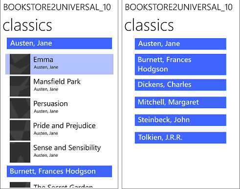

# Windows data binding in depth

In this article, we will describe the Windows App SDK data binding features for the APIs that reside in the [**Microsoft.UI.Xaml.Data** namespace](/windows/windows-app-sdk/api/winrt/microsoft.ui.xaml.data).

> [!NOTE]
> This topic describes data binding features in detail. For a short, practical introduction, see [Data binding overview](data-binding-overview.md).

## Important APIs

- [**{x:Bind} markup extension**](/windows/uwp/xaml-platform/x-bind-markup-extension)
- [**Binding class**](/windows/windows-app-sdk/api/winrt/microsoft.ui.xaml.data.binding)
- [**DataContext**](/windows/windows-app-sdk/api/winrt/microsoft.ui.xaml.frameworkelement.datacontext)
- [**INotifyPropertyChanged**](/windows/windows-app-sdk/api/winrt/microsoft.ui.xaml.data.inotifypropertychanged)

## Introduction

Data binding is a way for your app's UI to display data, and optionally to stay in sync with that data. Data binding allows you to separate the concern of data from the concern of UI, and that results in a simpler conceptual model as well as better readability, testability, and maintainability of your app.

You can use data binding to simply display values from a data source when the UI is first shown, but not to respond to changes in those values. This is a mode of binding called *one-time*, and it works well for a value that doesn't change during run-time. Alternatively, you can choose to "observe" the values and to update the UI when they change. This mode is called *one-way*, and it works well for read-only data. Ultimately, you can choose to both observe and update, so that changes that the user makes to values in the UI are automatically pushed back into the data source. This mode is called *two-way*, and it works well for read-write data. Here are some examples.

- You could use the one-time mode to bind an [**Image**](/windows/windows-app-sdk/api/winrt/microsoft.ui.xaml.controls.image) to the current user's photo.
- You could use the one-way mode to bind a [**ListView**](/windows/windows-app-sdk/api/winrt/microsoft.ui.xaml.controls.listview) to a collection of real-time news articles grouped by newspaper section.
- You could use the two-way mode to bind a [**TextBox**](/windows/windows-app-sdk/api/winrt/microsoft.ui.xaml.controls.textbox) to a customer's name in a form.

Independent of mode, there are two kinds of binding, and they're both typically declared in UI markup. You can choose to use either the [{x:Bind} markup extension](/windows/uwp/xaml-platform/x-bind-markup-extension) or the [{Binding} markup extension](/windows/uwp/xaml-platform/binding-markup-extension). And you can even use a mixture of the two in the same app—even on the same UI element. `{x:Bind}` was new in UWP for Windows 10 and it has better performance. All the details described in this topic apply to both kinds of binding unless we explicitly say otherwise.

### UWP Sample apps that demonstrate {x:Bind}

- [{x:Bind} sample](https://github.com/Microsoft/Windows-universal-samples/tree/master/Samples/XamlBind).
- [QuizGame](https://github.com/microsoft/Windows-appsample-networkhelper).
- [XAML UI Basics sample](https://github.com/Microsoft/Windows-universal-samples/tree/master/Samples/XamlUIBasics).

### UWP Sample apps that demonstrate {Binding}

- Download the [UWP Bookstore1](https://codeload.github.com/MicrosoftDocs/windows-topic-specific-samples/zip/Bookstore1Universal_10) app.
- Download the [Bookstore2](https://codeload.github.com/MicrosoftDocs/windows-topic-specific-samples/zip/Bookstore2Universal_10) app.

## Every binding involves these pieces

- A *binding source*. This is the source of the data for the binding, and it can be an instance of any class that has members whose values you want to display in your UI.
- A *binding target*. This is a [**DependencyProperty**](/windows/windows-app-sdk/api/winrt/microsoft.ui.xaml.dependencyproperty) of the [**FrameworkElement**](/windows/windows-app-sdk/api/winrt/microsoft.ui.xaml.frameworkelement) in your UI that displays the data.
- A *binding object*. This is the piece that transfers data values from the source to the target, and optionally from the target back to the source. The binding object is created at XAML load time from your [{x:Bind}](/windows/uwp/xaml-platform/x-bind-markup-extension) or [{Binding}](/windows/uwp/xaml-platform/binding-markup-extension) markup extension.

In the following sections, we'll take a closer look at the binding source, the binding target, and the binding object. And we'll link the sections together with the example of binding a button's content to a string property named `NextButtonText`, which belongs to a class named `HostViewModel`.

### Binding source

Here's a very rudimentary implementation of a class that we could use as a binding source.

``` csharp
public class HostViewModel
{
    public HostViewModel()
    {
        NextButtonText = "Next";
    }

    public string NextButtonText { get; set; }
}
```

That implementation of `HostViewModel`, and its property `NextButtonText`, are only appropriate for one-time binding. But one-way and two-way bindings are extremely common, and in those kinds of binding the UI automatically updates in response to changes in the data values of the binding source. In order for those kinds of binding to work correctly, you need to make your binding source *observable* to the binding object. So in our example, if we want to one-way or two-way bind to the `NextButtonText` property, then any changes that happen at run-time to the value of that property need to be made observable to the binding object.

One way of doing that is to derive the class that represents your binding source from [**DependencyObject**](/windows/windows-app-sdk/api/winrt/microsoft.ui.xaml.dependencyobject), and expose a data value through a [**DependencyProperty**](/windows/windows-app-sdk/api/winrt/microsoft.ui.xaml.dependencyproperty). That's how a [**FrameworkElement**](/windows/windows-app-sdk/api/winrt/microsoft.ui.xaml.frameworkelement) becomes observable. A `FrameworkElement` is a good binding source right out of the box.

A more lightweight way of making a class observable—and a necessary one for classes that already have a base class—is to implement [**System.ComponentModel.INotifyPropertyChanged**](/dotnet/api/system.componentmodel.inotifypropertychanged). This really just involves implementing a single event named `PropertyChanged`. An example using `HostViewModel` is below.

``` csharp
...
using System.ComponentModel;
using System.Runtime.CompilerServices;
...
public class HostViewModel : INotifyPropertyChanged
{
    private string nextButtonText;

    public event PropertyChangedEventHandler PropertyChanged = delegate { };

    public HostViewModel()
    {
        NextButtonText = "Next";
    }

    public string NextButtonText
    {
        get { return nextButtonText; }
        set
        {
            nextButtonText = value;
            OnPropertyChanged();
        }
    }

    public void OnPropertyChanged([CallerMemberName] string propertyName = null)
    {
        // Raise the PropertyChanged event, passing the name of the property whose value has changed.
        PropertyChanged?.Invoke(this, new PropertyChangedEventArgs(propertyName));
    }
}
```

Now the `NextButtonText` property is observable. When you author a one-way or a two-way binding to that property (we'll show how later), the resulting binding object subscribes to the `PropertyChanged` event. When that event is raised, the binding object's handler receives an argument containing the name of the property that has changed. That's how the binding object knows which property's value to go and read again.

So that you don't have to implement the pattern shown above multiple times, if you're using C# then you can just derive from the `BindableBase` base class that you'll find in the [QuizGame](https://github.com/microsoft/Windows-appsample-networkhelper) sample (in the "Common" folder). Here's an example of how that looks.

``` csharp
public class HostViewModel : BindableBase
{
    private string nextButtonText;

    public HostViewModel()
    {
        NextButtonText = "Next";
    }

    public string NextButtonText
    {
        get { return nextButtonText; }
        set { SetProperty(ref nextButtonText, value); }
    }
}
```

Raising the `PropertyChanged` event with an argument of [**String.Empty**](/dotnet/api/system.string.empty) or `null` indicates that all non-indexer properties on the object should be re-read. You can raise the event to indicate that indexer properties on the object have changed by using an argument of "Item\[*indexer*\]" for specific indexers (where *indexer* is the index value), or a value of "Item\[\]" for all indexers.

A binding source can be treated either as a single object whose properties contain data, or as a collection of objects. In C# code, you can one-time bind to an object that implements [**List&lt;T&gt;**](/dotnet/api/system.collections.generic.list-1) to display a collection that doesn't change at run-time. For an observable collection (observing when items are added to and removed from the collection), one-way bind to [**ObservableCollection&lt;T&gt;**](/dotnet/api/system.collections.objectmodel.observablecollection-1) instead. To bind to your own collection classes, use the guidance in the following table.

| Scenario | C# (CLR) | C++/WinRT |
|-|-|-|
| Bind to an object. | Can be any object. | Can be any object. |
| Get property change notifications from a bound object. | Object must implement [**INotifyPropertyChanged**](/dotnet/api/system.componentmodel.inotifypropertychanged). | Object must implement [**INotifyPropertyChanged**](/windows/windows-app-sdk/api/winrt/microsoft.ui.xaml.data.inotifypropertychanged). |
| Bind to a collection. | [**List&lt;T&gt;**](/dotnet/api/system.collections.generic.list-1) | [**IVector**](/uwp/api/windows.foundation.collections.ivector_t_) of [**IInspectable**](/windows/win32/api/inspectable/nn-inspectable-iinspectable), or [**IBindableObservableVector**](/windows/windows-app-sdk/api/winrt/microsoft.ui.xaml.interop.ibindableobservablevector). See [XAML items controls; bind to a C++/WinRT collection](/windows/uwp/cpp-and-winrt-apis/binding-collection) and [Collections with C++/WinRT](/windows/uwp/cpp-and-winrt-apis/collections). |
| Get collection change notifications from a bound collection. | [**ObservableCollection&lt;T&gt;**](/dotnet/api/system.collections.objectmodel.observablecollection-1)|[**IObservableVector**](/uwp/api/windows.foundation.collections.iobservablevector_t_) of [**IInspectable**](/windows/win32/api/inspectable/nn-inspectable-iinspectable). For example, [**winrt::single_threaded_observable_vector&lt;T&gt;**](/uwp/cpp-ref-for-winrt/single-threaded-observable-vector). |
| Implement a collection that supports binding. | Extend [**List&lt;T&gt;**](/dotnet/api/system.collections.generic.list-1) or implement [**IList**](/dotnet/api/system.collections.ilist), [**IList**](/dotnet/api/system.collections.generic.ilist-1)&lt;[**Object**](/dotnet/api/system.object)&gt;, [**IEnumerable**](/dotnet/api/system.collections.ienumerable), or [**IEnumerable**](/dotnet/api/system.collections.generic.ienumerable-1)&lt;Object&gt;. Binding to generic `IList<T>` and `IEnumerable<T>` is not supported. | Implement [**IVector**](/uwp/api/windows.foundation.collections.ivector_t_) of [**IInspectable**](/windows/win32/api/inspectable/nn-inspectable-iinspectable). See [XAML items controls; bind to a C++/WinRT collection](/windows/uwp/cpp-and-winrt-apis/binding-collection) and [Collections with C++/WinRT](/windows/uwp/cpp-and-winrt-apis/collections). |
| Implement a collection that supports collection change notifications. | Extend [**ObservableCollection&lt;T&gt;**](/dotnet/api/system.collections.objectmodel.observablecollection-1) or implement (non-generic) [**IList**](/dotnet/api/system.collections.ilist) and [**INotifyCollectionChanged**](/dotnet/api/system.collections.specialized.inotifycollectionchanged). | Implement [**IObservableVector**](/uwp/api/windows.foundation.collections.iobservablevector_t_) of [**IInspectable**](/windows/win32/api/inspectable/nn-inspectable-iinspectable), or [**IBindableObservableVector**](/windows/windows-app-sdk/api/winrt/microsoft.ui.xaml.interop.ibindableobservablevector). |
| Implement a collection that supports incremental loading. | Extend [**ObservableCollection&lt;T&gt;**](/dotnet/api/system.collections.objectmodel.observablecollection-1) or implement (non-generic) [**IList**](/dotnet/api/system.collections.ilist) and [**INotifyCollectionChanged**](/dotnet/api/system.collections.specialized.inotifycollectionchanged). Additionally, implement [**ISupportIncrementalLoading**](/windows/windows-app-sdk/api/winrt/microsoft.ui.xaml.data.isupportincrementalloading). | Implement [**IObservableVector**](/uwp/api/windows.foundation.collections.iobservablevector_t_) of [**IInspectable**](/windows/win32/api/inspectable/nn-inspectable-iinspectable), or [**IBindableObservableVector**](/windows/windows-app-sdk/api/winrt/microsoft.ui.xaml.interop.ibindableobservablevector). Additionally, implement [**ISupportIncrementalLoading**](/windows/windows-app-sdk/api/winrt/microsoft.ui.xaml.data.isupportincrementalloading) |

You can bind list controls to arbitrarily large data sources, and still achieve high performance, by using incremental loading. For example, you can bind list controls to Bing image query results without having to load all the results at once. Instead, you load only some results immediately, and load additional results as needed. To support incremental loading, you must implement [**ISupportIncrementalLoading**](/windows/windows-app-sdk/api/winrt/microsoft.ui.xaml.data.isupportincrementalloading) on a data source that supports collection change notifications. When the data binding engine requests more data, your data source must make the appropriate requests, integrate the results, and then send the appropriate notifications in order to update the UI.

### Binding target

In the two examples below, the `Button.Content` property is the binding target, and its value is set to a markup extension that declares the binding object. First [{x:Bind}](/windows/uwp/xaml-platform/x-bind-markup-extension) is shown, and then [{Binding}](/windows/uwp/xaml-platform/binding-markup-extension). Declaring bindings in markup is the common case (it's convenient, readable, and toolable). But you can avoid markup and imperatively (programmatically) create an instance of the [**Binding**](/windows/windows-app-sdk/api/winrt/microsoft.ui.xaml.data.binding) class instead if you need to.

``` xaml
<Button Content="{x:Bind ...}" ... />
```

``` xaml
<Button Content="{Binding ...}" ... />
```

### Binding object declared using {x:Bind}

There's one step we need to do before we author our [{x:Bind}](/windows/uwp/xaml-platform/x-bind-markup-extension) markup. We need to expose our binding source class from the class that represents our page of markup. We do that by adding a property (of type `HostViewModel` in this case) to our `MainWindow` window class.

``` csharp
namespace DataBindingInDepth
{
    public sealed partial class MainWindow : Window
    {
        public MainWindow()
        {
            this.InitializeComponent();
            ViewModel = new HostViewModel();
        }
    
        public HostViewModel ViewModel { get; set; }
    }
}
```

That done, we can now take a closer look at the markup that declares the binding object. The example below uses the same `Button.Content` binding target we used in the "Binding target" section earlier, and shows it being bound to the `HostViewModel.NextButtonText` property.

``` xaml
<!-- MainWindow.xaml -->
<Window x:Class="DataBindingInDepth.MainWindow" ... >
    <Button Content="{x:Bind Path=ViewModel.NextButtonText, Mode=OneWay}" ... />
</Window>
```

Notice the value that we specify for `Path`. This value is interpreted in the context of the window itself, and in this case the path begins by referencing the `ViewModel` property that we just added to the `MainWindow` page. That property returns a `HostViewModel` instance, and so we can *dot* into that object to access the `HostViewModel.NextButtonText` property. And we specify `Mode`, to override the [{x:Bind}](/windows/uwp/xaml-platform/x-bind-markup-extension) default of one-time.

The [**Path**](/windows/windows-app-sdk/api/winrt/microsoft.ui.xaml.data.binding.path) property supports a variety of syntax options for binding to nested properties, attached properties, and integer and string indexers. For more info, see [Property-path syntax](/windows/uwp/xaml-platform/property-path-syntax). Binding to string indexers gives you the effect of binding to dynamic properties without having to implement [**ICustomPropertyProvider**](/windows/windows-app-sdk/api/winrt/microsoft.ui.xaml.data.icustompropertyprovider). For other settings, see [{x:Bind} markup extension](/windows/uwp/xaml-platform/x-bind-markup-extension).

To illustrate that the `HostViewModel.NextButtonText` property is indeed observable, add a `Click` event handler to the button, and update the value of `HostViewModel.NextButtonText`. Build, run, and click the button to see the value of the button's `Content` update.

``` csharp
// MainWindow.xaml.cs
private void Button_Click(object sender, RoutedEventArgs e)
{
    ViewModel.NextButtonText = "Updated Next button text";
}
```

> [!NOTE]
> Changes to [**TextBox.Text**](/windows/windows-app-sdk/api/winrt/microsoft.ui.xaml.controls.textbox.text) are sent to a two-way bound source when the [**TextBox**](/windows/windows-app-sdk/api/winrt/microsoft.ui.xaml.controls.textbox) loses focus, and not after every user keystroke.

### DataTemplate and x:DataType

Inside a [**DataTemplate**](/windows/windows-app-sdk/api/winrt/microsoft.ui.xaml.datatemplate) (whether used as an item template, a content template, or a header template), the value of `Path` is not interpreted in the context of the window, but in the context of the data object being templated. When using `{x:Bind}` in a data template, so that its bindings can be validated (and efficient code generated for them) at compile-time, the `DataTemplate` needs to declare the type of its data object using `x:DataType`. The example given below could be used as the `ItemTemplate` of an items control bound to a collection of `SampleDataGroup` objects.

``` xaml
<DataTemplate x:Key="SimpleItemTemplate" x:DataType="data:SampleDataGroup">
    <StackPanel Orientation="Vertical" Height="50">
      <TextBlock Text="{x:Bind Title}"/>
      <TextBlock Text="{x:Bind Description}"/>
    </StackPanel>
  </DataTemplate>
```

### Weakly-typed objects in your Path

Consider for example that you have a type named `SampleDataGroup`, which implements a string property named `Title`. And you have a property `MainWindow.SampleDataGroupAsObject`, which is of type `object`, but which actually returns an instance of `SampleDataGroup`. The binding `<TextBlock Text="{x:Bind SampleDataGroupAsObject.Title}"/>` will result in a compile error because the `Title` property is not found on the type `object`. The remedy for this is to add a cast to your `Path` syntax like this: `<TextBlock Text="{x:Bind ((data:SampleDataGroup)SampleDataGroupAsObject).Title}"/>`. Here's another example where `Element` is declared as `object` but is actually a `TextBlock`: `<TextBlock Text="{x:Bind Element.Text}"/>`. And a cast remedies the issue: `<TextBlock Text="{x:Bind ((TextBlock)Element).Text}"/>`.

### If your data loads asynchronously

Code to support `{x:Bind}` is generated at compile-time in the partial classes for your windows. These files can be found in your `obj` folder, with names like (for C#) `<view name>.g.cs`. The generated code includes a handler for your window's [**Loading**](/windows/windows-app-sdk/api/winrt/microsoft.ui.xaml.frameworkelement.loading) event, and that handler calls the `Initialize` method on a generated class that represent's your window's bindings. `Initialize` in turn calls `Update` to begin moving data between the binding source and the target. `Loading` is raised just before the first measure pass of the window or user control. So if your data is loaded asynchronously it may not be ready by the time `Initialize` is called. So, after you've loaded data, you can force one-time bindings to be initialized by calling `this.Bindings.Update();`. If you only need one-time bindings for asynchronously-loaded data then it's much cheaper to initialize them this way than it is to have one-way bindings and to listen for changes. If your data does not undergo fine-grained changes, and if it's likely to be updated as part of a specific action, then you can make your bindings one-time, and force a manual update at any time with a call to `Update`.

> [!NOTE]
> `{x:Bind}` is not suited to late-bound scenarios, such as navigating the dictionary structure of a JSON object, nor duck typing. "Duck typing" is a weak form of typing based on lexical matches on property names (as in, "if it walks, swims, and quacks like a duck, then it's a duck"). With duck typing, a binding to the `Age` property would be equally satisfied with a `Person` or a `Wine` object (assuming that those types each had an `Age` property). For these scenarios, use the `{Binding}` markup extension.

### Binding object declared using {Binding}

[{Binding}](/windows/uwp/xaml-platform/binding-markup-extension) assumes, by default, that you're binding to the [**DataContext**](/windows/windows-app-sdk/api/winrt/microsoft.ui.xaml.frameworkelement.datacontext) of your markup window. So we'll set the `DataContext` of our window to be an instance of our binding source class (of type `HostViewModel` in this case). The example below shows the markup that declares the binding object. We use the same `Button.Content` binding target we used in the "Binding target" section earlier, and we bind to the `HostViewModel.NextButtonText` property.

``` xaml
<Window xmlns:viewmodel="using:DataBindingInDepth" ... >
    <Window.DataContext>
        <viewmodel:HostViewModel x:Name="viewModelInDataContext"/>
    </Window.DataContext>
    ...
    <Button Content="{Binding Path=NextButtonText}" ... />
</Window>
```

``` csharp
// MainWindow.xaml.cs
private void Button_Click(object sender, RoutedEventArgs e)
{
    viewModelInDataContext.NextButtonText = "Updated Next button text";
}
```

Notice the value that we specify for `Path`. This value is interpreted in the context of the window's [**DataContext**](/windows/windows-app-sdk/api/winrt/microsoft.ui.xaml.frameworkelement.datacontext), which in this example is set to an instance of `HostViewModel`. The path references the `HostViewModel.NextButtonText` property. We can omit `Mode`, because the [{Binding}](/windows/uwp/xaml-platform/binding-markup-extension) default of one-way works here.

The default value of [**DataContext**](/windows/windows-app-sdk/api/winrt/microsoft.ui.xaml.frameworkelement.datacontext) for a UI element is the inherited value of its parent. You can of course override that default by setting `DataContext` explicitly, which is in turn inherited by children by default. Setting `DataContext` explicitly on an element is useful when you want to have multiple bindings that use the same source.

A binding object has a `Source` property, which defaults to the [**DataContext**](/windows/windows-app-sdk/api/winrt/microsoft.ui.xaml.frameworkelement.datacontext) of the UI element on which the binding is declared. You can override this default by setting `Source`, `RelativeSource`, or `ElementName` explicitly on the binding (see [{Binding}](/windows/uwp/xaml-platform/binding-markup-extension) for details).

Inside a [**DataTemplate**](/windows/windows-app-sdk/api/winrt/microsoft.ui.xaml.datatemplate), the [**DataContext**](/windows/windows-app-sdk/api/winrt/microsoft.ui.xaml.frameworkelement.datacontext) is automatically set to the data object being templated. The example given below could be used as the `ItemTemplate` of an items control bound to a collection of any type that has string properties named `Title` and `Description`.

``` xaml
<DataTemplate x:Key="SimpleItemTemplate">
    <StackPanel Orientation="Vertical" Height="50">
      <TextBlock Text="{Binding Title}"/>
      <TextBlock Text="{Binding Description"/>
    </StackPanel>
  </DataTemplate>
```

> [!NOTE]
> By default, changes to [**TextBox.Text**](/windows/windows-app-sdk/api/winrt/microsoft.ui.xaml.controls.textbox.text) are sent to a two-way bound source when the [**TextBox**](/windows/windows-app-sdk/api/winrt/microsoft.ui.xaml.controls.textbox) loses focus. To cause changes to be sent after every user keystroke, set `UpdateSourceTrigger` to `PropertyChanged` on the binding in markup. You can also completely take control of when changes are sent to the source by setting `UpdateSourceTrigger` to `Explicit`. You then handle events on the text box (typically [**TextBox.TextChanged**](/windows/windows-app-sdk/api/winrt/microsoft.ui.xaml.controls.textbox.textchanged)), call [**GetBindingExpression**](/windows/windows-app-sdk/api/winrt/microsoft.ui.xaml.frameworkelement.getbindingexpression) on the target to get a [**BindingExpression**](/windows/windows-app-sdk/api/winrt/microsoft.ui.xaml.data.bindingexpression) object, and finally call [**BindingExpression.UpdateSource**](/windows/windows-app-sdk/api/winrt/microsoft.ui.xaml.data.bindingexpression.updatesource) to programmatically update the data source.

The [**Path**](/windows/windows-app-sdk/api/winrt/microsoft.ui.xaml.data.binding.path) property supports a variety of syntax options for binding to nested properties, attached properties, and integer and string indexers. For more info, see [Property-path syntax](/windows/uwp/xaml-platform/property-path-syntax). Binding to string indexers gives you the effect of binding to dynamic properties without having to implement [**ICustomPropertyProvider**](/windows/windows-app-sdk/api/winrt/microsoft.ui.xaml.data.icustompropertyprovider). The [**ElementName**](/windows/windows-app-sdk/api/winrt/microsoft.ui.xaml.data.binding.elementname) property is useful for element-to-element binding. The [**RelativeSource**](/windows/windows-app-sdk/api/winrt/microsoft.ui.xaml.data.binding.relativesource) property has several uses, one of which is as a more powerful alternative to template binding inside a [**ControlTemplate**](/windows/windows-app-sdk/api/winrt/microsoft.ui.xaml.controls.controltemplate). For other settings, see [{Binding} markup extension](/windows/uwp/xaml-platform/binding-markup-extension) and the [**Binding**](/windows/windows-app-sdk/api/winrt/microsoft.ui.xaml.data.binding) class.

## What if the source and the target are not the same type?

If you want to control the visibility of a UI element based on the value of a boolean property, or if you want to render a UI element with a color that's a function of a numeric value's range or trend, or if you want to display a date and/or time value in a UI element property that expects a string, then you'll need to convert values from one type to another. There will be cases where the right solution is to expose another property of the right type from your binding source class, and keep the conversion logic encapsulated and testable there. But that isn't flexible nor scalable when you have large numbers, or large combinations, of source and target properties. In that case you have a couple of options:

- If using `{x:Bind}` then you can bind directly to a function to do that conversion
- Or you can specify a value converter which is an object designed to perform the conversion

## Value Converters

Here's a value converter, suitable for a one-time or a one-way binding, that converts a [**DateTime**](/dotnet/api/system.datetime) value to a `string` value containing the month. The class implements [**IValueConverter**](/windows/windows-app-sdk/api/winrt/microsoft.ui.xaml.data.ivalueconverter).

``` csharp
public class DateToStringConverter : IValueConverter
{
    // Define the Convert method to convert a DateTime value to 
    // a month string.
    public object Convert(object value, Type targetType, 
        object parameter, string language)
    {
        // value is the data from the source object.
        DateTime thisDate = (DateTime)value;
        int monthNum = thisDate.Month;
        string month;
        switch (monthNum)
        {
            case 1:
                month = "January";
                break;
            case 2:
                month = "February";
                break;
            default:
                month = "Month not found";
                break;
        }
        // Return the value to pass to the target.
        return month;
    }

    // ConvertBack is not implemented for a OneWay binding.
    public object ConvertBack(object value, Type targetType, 
        object parameter, string language)
    {
        throw new NotImplementedException();
    }
}
```

And here's how you consume that value converter in your binding object markup.

``` xaml
<UserControl.Resources>
  <local:DateToStringConverter x:Key="Converter1"/>
</UserControl.Resources>
...
<TextBlock Grid.Column="0" 
  Text="{x:Bind ViewModel.Month, Converter={StaticResource Converter1}}"/>
<TextBlock Grid.Column="0" 
  Text="{Binding Month, Converter={StaticResource Converter1}}"/>
```

The binding engine calls the [**Convert**](/windows/windows-app-sdk/api/winrt/microsoft.ui.xaml.data.ivalueconverter.convert) and [**ConvertBack**](/windows/windows-app-sdk/api/winrt/microsoft.ui.xaml.data.ivalueconverter.convertback) methods if the [**Converter**](/windows/windows-app-sdk/api/winrt/microsoft.ui.xaml.data.binding.converter) parameter is defined for the binding. When data is passed from the source, the binding engine calls `Convert` and passes the returned data to the target. When data is passed from the target (for a two-way binding), the binding engine calls `ConvertBack` and passes the returned data to the source.

The converter also has optional parameters: [**ConverterLanguage**](/windows/windows-app-sdk/api/winrt/microsoft.ui.xaml.data.binding.converterlanguage), which allows specifying the language to be used in the conversion, and [**ConverterParameter**](/windows/windows-app-sdk/api/winrt/microsoft.ui.xaml.data.binding.converterparameter), which allows passing a parameter for the conversion logic. For an example that uses a converter parameter, see [**IValueConverter**](/windows/windows-app-sdk/api/winrt/microsoft.ui.xaml.data.ivalueconverter).

> [!NOTE]
> If there is an error in the conversion, do not throw an exception. Instead, return [**DependencyProperty.UnsetValue**](/windows/windows-app-sdk/api/winrt/microsoft.ui.xaml.dependencyproperty.unsetvalue), which will stop the data transfer.

To display a default value to use whenever the binding source cannot be resolved, set the `FallbackValue` property on the binding object in markup. This is useful to handle conversion and formatting errors. It is also useful to bind to source properties that might not exist on all objects in a bound collection of heterogeneous types.

If you bind a text control to a value that is not a string, the data binding engine will convert the value to a string. If the value is a reference type, the data binding engine will retrieve the string value by calling [**ICustomPropertyProvider.GetStringRepresentation**](/windows/windows-app-sdk/api/winrt/microsoft.ui.xaml.data.icustompropertyprovider.getstringrepresentation) or [**IStringable.ToString**](/windows/win32/api/windows.foundation/nf-windows-foundation-istringable-tostring) if available, and will otherwise call [**Object.ToString**](/dotnet/api/system.object.tostring#System_Object_ToString). Note, however, that the binding engine will ignore any `ToString` implementation that hides the base-class implementation. Subclass implementations should override the base class `ToString` method instead. Similarly, in native languages, all managed objects appear to implement [**ICustomPropertyProvider**](/windows/windows-app-sdk/api/winrt/microsoft.ui.xaml.data.icustompropertyprovider) and [**IStringable**](/windows/win32/api/windows.foundation/nn-windows-foundation-istringable). However, all calls to `GetStringRepresentation` and `IStringable.ToString` are routed to `Object.ToString` or an override of that method, and never to a new `ToString` implementation that hides the base-class implementation.

> [!NOTE]
> The [Windows Community Toolkit](/dotnet/communitytoolkit/windows/) provides a [BoolToVisibilityConverter](/dotnet/api/communitytoolkit.winui.ui.converters.booltovisibilityconverter). The converter maps `true` to the `Visible` enumeration value and `false` to `Collapsed` so you can bind a `Visibility` property to a boolean without creating a converter. To use the converter, your project must add the [CommunityToolkit.WinUI.Converters](https://www.nuget.org/packages/CommunityToolkit.WinUI.Converters) NuGet package.

## Function binding in {x:Bind}

`{x:Bind}` enables the final step in a binding path to be a function. This can be used to perform conversions, and to perform bindings that depend on more than one property. See [**Functions in x:Bind**](function-bindings.md)

<span id="resource-dictionaries-with-x-bind"></span>

## Element-to-element binding

You can bind the property of one XAML element to the property of another XAML element. Here's an example of how that looks in markup.

``` xaml
<TextBox x:Name="myTextBox" />
<TextBlock Text="{x:Bind myTextBox.Text, Mode=OneWay}" />
```

## Resource dictionaries with {x:Bind}

The [{x:Bind} markup extension](/windows/uwp/xaml-platform/x-bind-markup-extension) depends on code generation, so it needs a code-behind file containing a constructor that calls `InitializeComponent` (to initialize the generated code). You re-use the resource dictionary by instantiating its type (so that `InitializeComponent` is called) instead of referencing its filename. Here's an example of what to do if you have an existing resource dictionary and you want to use `{x:Bind}` in it.

``` xaml
<!-- TemplatesResourceDictionary.xaml -->
<ResourceDictionary
    x:Class="ExampleNamespace.TemplatesResourceDictionary"
    .....
    xmlns:examplenamespace="using:ExampleNamespace">
    
    <DataTemplate x:Key="EmployeeTemplate" x:DataType="examplenamespace:IEmployee">
        <Grid>
            <TextBlock Text="{x:Bind Name}"/>
        </Grid>
    </DataTemplate>
</ResourceDictionary>
```

``` csharp
// TemplatesResourceDictionary.xaml.cs
using Microsoft.UI.Xaml.Data;
 
namespace ExampleNamespace
{
    public partial class TemplatesResourceDictionary
    {
        public TemplatesResourceDictionary()
        {
            InitializeComponent();
        }
    }
}
```

``` xaml
<!-- MainWindow.xaml -->
<Window x:Class="ExampleNamespace.MainWindow"
    ....
    xmlns:examplenamespace="using:ExampleNamespace">

    <Window.Resources>
        <ResourceDictionary>
            .... 
            <ResourceDictionary.MergedDictionaries>
                <examplenamespace:TemplatesResourceDictionary/>
            </ResourceDictionary.MergedDictionaries>
        </ResourceDictionary>
    </Window.Resources>
</Window>
```

## Event binding and ICommand

[{x:Bind}](/windows/uwp/xaml-platform/x-bind-markup-extension) supports a feature called event binding. With this feature, you can specify the handler for an event using a binding, which is an additional option on top of handling events with a method on the code-behind file. Let's say you have a `ListViewDoubleTapped` event handler on your `MainWindow` class.

``` csharp
public sealed partial class MainWindow : Window
{
    ...
    public void ListViewDoubleTapped()
    {
        // Handle double-tapped logic
    }
}
```

You can then bind a ListView's **DoubleTapped** event to a method on the **MainWindow** like this.

``` xaml
<ListView DoubleTapped="{x:Bind ListViewDoubleTapped}" />
```

Overloaded methods cannot be used to handle an event with this technique. Also, if the method that handles the event has parameters then they must all be assignable from the types of all of the event's parameters, respectively. In this case, `ListViewDoubleTapped` is not overloaded and it has no parameters (but it would still be valid even if it took two `object` parameters).

The event binding technique is similar to implementing and consuming commands (a command is a property that returns an object that implements the [**ICommand**](/windows/windows-app-sdk/api/winrt/microsoft.ui.xaml.input.icommand) interface). Both [{x:Bind}](/windows/uwp/xaml-platform/x-bind-markup-extension) and [{Binding}](/windows/uwp/xaml-platform/binding-markup-extension) work with commands. So that you don't have to implement the command pattern multiple times, you can use the `DelegateCommand` helper class that you'll find in the [QuizGame](https://github.com/microsoft/Windows-appsample-networkhelper) UWP sample (in the "Common" folder).

## Binding to a collection of folders or files

You can use the APIs in the [**Windows.Storage**](/uwp/api/Windows.Storage) namespace to retrieve folder and file data in your packaged Windows App SDK apps. However, the various `GetFilesAsync`, `GetFoldersAsync`, and `GetItemsAsync` methods do not return values that are suitable for binding to list controls. Instead, you must bind to the return values of the [**GetVirtualizedFilesVector**](/uwp/api/windows.storage.bulkaccess.fileinformationfactory.getvirtualizedfilesvector), [**GetVirtualizedFoldersVector**](/uwp/api/windows.storage.bulkaccess.fileinformationfactory.getvirtualizedfoldersvector), and [**GetVirtualizedItemsVector**](/uwp/api/windows.storage.bulkaccess.fileinformationfactory.getvirtualizeditemsvector) methods of the [**FileInformationFactory**](/uwp/api/Windows.Storage.BulkAccess.FileInformationFactory) class. The following code example from the [StorageDataSource and GetVirtualizedFilesVector UWP sample](https://github.com/microsoftarchive/msdn-code-gallery-microsoft/tree/master/Official%20Windows%20Platform%20Sample/Windows%208.1%20Store%20app%20samples/99866-Windows%208.1%20Store%20app%20samples/StorageDataSource%20and%20GetVirtualizedFilesVector%20sample) shows the typical usage pattern. Remember to declare the **picturesLibrary** capability in your app package manifest, and confirm that there are pictures in your Pictures library folder.

``` csharp
protected override void OnNavigatedTo(NavigationEventArgs e)
{
    var library = Windows.Storage.KnownFolders.PicturesLibrary;
    var queryOptions = new Windows.Storage.Search.QueryOptions();
    queryOptions.FolderDepth = Windows.Storage.Search.FolderDepth.Deep;
    queryOptions.IndexerOption = Windows.Storage.Search.IndexerOption.UseIndexerWhenAvailable;

    var fileQuery = library.CreateFileQueryWithOptions(queryOptions);

    var fif = new Windows.Storage.BulkAccess.FileInformationFactory(
        fileQuery,
        Windows.Storage.FileProperties.ThumbnailMode.PicturesView,
        190,
        Windows.Storage.FileProperties.ThumbnailOptions.UseCurrentScale,
        false
        );

    var dataSource = fif.GetVirtualizedFilesVector();
    this.PicturesListView.ItemsSource = dataSource;
}
```

You will typically use this approach to create a read-only view of file and folder info. You can create two-way bindings to the file and folder properties, for example to let users rate a song in a music view. However, any changes are not persisted until you call the appropriate `SavePropertiesAsync` method (for example, [**MusicProperties.SavePropertiesAsync**](/uwp/api/windows.storage.fileproperties.musicproperties.savepropertiesasync)). You should commit changes when the item loses focus because this triggers a selection reset.

Note that two-way binding using this technique works only with indexed locations, such as **Music**. You can determine whether a location is indexed by calling the [**FolderInformation.GetIndexedStateAsync**](/uwp/api/windows.storage.bulkaccess.folderinformation.getindexedstateasync) method.

Note also that a virtualized vector can return `null` for some items before it populates their value. For example, you should check for `null` before you use the [**SelectedItem**](/windows/windows-app-sdk/api/winrt/microsoft.ui.xaml.controls.primitives.selector.selecteditem) value of a list control bound to a virtualized vector, or use [**SelectedIndex**](/windows/windows-app-sdk/api/winrt/microsoft.ui.xaml.controls.primitives.selector.selectedindex) instead.

## Binding to data grouped by a key

If you take a flat collection of items (books, for example, represented by a `BookSku` class) and you group the items by using a common property as a key (the `BookSku.AuthorName` property, for example) then the result is called grouped data. When you group data, it is no longer a flat collection. Grouped data is a collection of group objects, where each group object has:

- a key, and
- a collection of items whose property matches that key.

To take the books example again, the result of grouping the books by author name results in a collection of author name groups where each group has:

- a key, which is an author name, and
- a collection of the `BookSku` objects whose `AuthorName` property matches the group's key.

In general, to display a collection, you bind the [**ItemsSource**](/windows/windows-app-sdk/api/winrt/microsoft.ui.xaml.controls.itemscontrol.itemssource) of an items control (such as [**ListView**](/windows/windows-app-sdk/api/winrt/microsoft.ui.xaml.controls.listview) or [**GridView**](/windows/windows-app-sdk/api/winrt/microsoft.ui.xaml.controls.gridview)) directly to a property that returns a collection. If that's a flat collection of items then you don't need to do anything special. But if it's a collection of group objects (as it is when binding to grouped data) then you need the services of an intermediary object called a [**CollectionViewSource**](/windows/windows-app-sdk/api/winrt/microsoft.ui.xaml.data.collectionviewsource) which sits between the items control and the binding source. You bind the `CollectionViewSource` to the property that returns grouped data, and you bind the items control to the `CollectionViewSource`. An extra value-add of a `CollectionViewSource` is that it keeps track of the current item, so you can keep more than one items control in sync by binding them all to the same `CollectionViewSource`. You can also access the current item programmatically through the [**ICollectionView.CurrentItem**](/windows/windows-app-sdk/api/winrt/microsoft.ui.xaml.data.icollectionview.currentitem) property of the object returned by the [**CollectionViewSource.View**](/windows/windows-app-sdk/api/winrt/microsoft.ui.xaml.data.collectionviewsource.view) property.

To activate the grouping facility of a [**CollectionViewSource**](/windows/windows-app-sdk/api/winrt/microsoft.ui.xaml.data.collectionviewsource), set [**IsSourceGrouped**](/windows/windows-app-sdk/api/winrt/microsoft.ui.xaml.data.collectionviewsource.issourcegrouped) to `true`. Whether you also need to set the [**ItemsPath**](/windows/windows-app-sdk/api/winrt/microsoft.ui.xaml.data.collectionviewsource.itemspath) property depends on exactly how you author your group objects. There are two ways to author a group object: the "is-a-group" pattern, and the "has-a-group" pattern. In the "is-a-group" pattern, the group object derives from a collection type (for example, `List<T>`), so the group object actually is itself the group of items. With this pattern you do not need to set `ItemsPath`. In the "has-a-group" pattern, the group object has one or more properties of a collection type (such as `List<T>`), so the group "has a" group of items in the form of a property (or several groups of items in the form of several properties). With this pattern you need to set `ItemsPath` to the name of the property that contains the group of items.

The example below illustrates the "has-a-group" pattern. The window class has a property named [**DataContext**](/windows/windows-app-sdk/api/winrt/microsoft.ui.xaml.frameworkelement.datacontext), which returns an instance of our view model. The [**CollectionViewSource**](/windows/windows-app-sdk/api/winrt/microsoft.ui.xaml.data.collectionviewsource) binds to the `Authors` property of the view model (`Authors` is the collection of group objects) and also specifies that it's the `Author.BookSkus` property that contains the grouped items. Finally, the [**GridView**](/windows/windows-app-sdk/api/winrt/microsoft.ui.xaml.controls.gridview) is bound to the `CollectionViewSource`, and has its group style defined so that it can render the items in groups.

``` xaml
<Window.Resources>
    <CollectionViewSource
    x:Name="AuthorHasACollectionOfBookSku"
    Source="{x:Bind ViewModel.Authors}"
    IsSourceGrouped="true"
    ItemsPath="BookSkus"/>
</Window.Resources>
...
<GridView
ItemsSource="{x:Bind AuthorHasACollectionOfBookSku}" ...>
    <GridView.GroupStyle>
        <GroupStyle
            HeaderTemplate="{StaticResource AuthorGroupHeaderTemplateWide}" ... />
    </GridView.GroupStyle>
</GridView>
```

You can implement the "is-a-group" pattern in one of two ways. One way is to author your own group class. Derive the class from `List<T>` (where *T* is the type of the items). For example, `public class Author : List<BookSku>`. The second way is to use a [LINQ](/previous-versions/bb397926(v=vs.140)) expression to dynamically create group objects (and a group class) from like property values of the **BookSku** items. This approach—maintaining only a flat list of items and grouping them together on the fly—is typical of an app that accesses data from a cloud service. You get the flexibility to group books by author or by genre (for example) without needing special group classes such as **Author** and **Genre**.

The example below illustrates the "is-a-group" pattern using [LINQ](/dotnet/standard/linq/). This time we group books by genre, displayed with the genre name in the group headers. This is indicated by the "Key" property path in reference to the group [**Key**](/dotnet/api/system.linq.igrouping-2.key#System_Linq_IGrouping_2_Key) value.

``` csharp
using System.Linq;
...
private IOrderedEnumerable<IGrouping<string, BookSku>> genres;

public IOrderedEnumerable<IGrouping<string, BookSku>> Genres
{
    get
    {
        if (genres == null)
        {
            genres = from book in bookSkus
                     group book by book.genre into grp
                     orderby grp.Key
                     select grp;
        }
        return genres;
    }
}
```

Remember that when using [{x:Bind}](/windows/uwp/xaml-platform/x-bind-markup-extension) with data templates we need to indicate the type being bound to by setting an `x:DataType` value. If the type is generic then we can't express that in markup so we need to use [{Binding}](/windows/uwp/xaml-platform/binding-markup-extension) instead in the group style header template.

``` xaml
    <Grid.Resources>
        <CollectionViewSource x:Name="GenreIsACollectionOfBookSku"
        Source="{x:Bind Genres}"
        IsSourceGrouped="true"/>
    </Grid.Resources>
    <GridView ItemsSource="{x:Bind GenreIsACollectionOfBookSku}">
        <GridView.ItemTemplate x:DataType="local:BookTemplate">
            <DataTemplate>
                <TextBlock Text="{x:Bind Title}"/>
            </DataTemplate>
        </GridView.ItemTemplate>
        <GridView.GroupStyle>
            <GroupStyle>
                <GroupStyle.HeaderTemplate>
                    <DataTemplate>
                        <TextBlock Text="{Binding Key}"/>
                    </DataTemplate>
                </GroupStyle.HeaderTemplate>
            </GroupStyle>
        </GridView.GroupStyle>
    </GridView>
```

A [**SemanticZoom**](/windows/windows-app-sdk/api/winrt/microsoft.ui.xaml.controls.semanticzoom) control is a great way for your users to view and navigate grouped data. The [Bookstore2](https://codeload.github.com/MicrosoftDocs/windows-topic-specific-samples/zip/Bookstore2Universal_10) UWP sample app illustrates how to use the `SemanticZoom`. In that app, you can view a list of books grouped by author (the zoomed-in view) or you can zoom out to see a jump list of authors (the zoomed-out view). The jump list affords much quicker navigation than scrolling through the list of books. The zoomed-in and zoomed-out views are actually `ListView` or `GridView` controls bound to the same `CollectionViewSource`.



When you bind to hierarchical data—such as subcategories within categories—you can choose to display the hierarchical levels in your UI with a series of items controls. A selection in one items control determines the contents of subsequent items controls. You can keep the lists synchronized by binding each list to its own [**CollectionViewSource**](/windows/windows-app-sdk/api/winrt/microsoft.ui.xaml.data.collectionviewsource) and binding the `CollectionViewSource` instances together in a chain. This is called a master/details (or list/details) view. For more info, see [How to bind to hierarchical data and create a master/details view](bind-to-hierarchical-data-and-create-a-master-details-view.md).

<span id="debugging"></span>

## Diagnosing and debugging data binding problems

Your binding markup contains the names of properties (and, for C#, sometimes fields and methods). So when you rename a property, you'll also need to change any binding that references it. Forgetting to do that leads to a typical example of a data binding bug, and your app either won't compile or won't run correctly.

The binding objects created by [{x:Bind}](/windows/uwp/xaml-platform/x-bind-markup-extension) and [{Binding}](/windows/uwp/xaml-platform/binding-markup-extension) are largely functionally equivalent. But `{x:Bind}` has type information for the binding source, and it generates source code at compile-time. With `{x:Bind}` you get the same kind of problem detection that you get with the rest of your code. That includes compile-time validation of your binding expressions, and debugging by setting breakpoints in the source code generated as the partial class for your page. These classes can be found in the files in your `obj` folder, with names like (for C#) `<view name>.g.cs`). If you have a problem with a binding then turn on **Break On Unhandled Exceptions** in the Microsoft Visual Studio debugger. The debugger will break execution at that point, and you can then debug what has gone wrong. The code generated by `{x:Bind}` follows the same pattern for each part of the graph of binding source nodes, and you can use the info in the **Call Stack** window to help determine the sequence of calls that led up to the problem.

[{Binding}](/windows/uwp/xaml-platform/binding-markup-extension) does not have type information for the binding source. But when you run your app with the debugger attached, any binding errors appear in the **Output** and **XAML Binding Failures** windows in Visual Studio. For more information on debugging binding errors in Visual Studio, see [XAML data binding diagnostics](/visualstudio/xaml-tools/xaml-data-binding-diagnostics).

## Creating bindings in code

> [!NOTE]
> This section only applies to [{Binding}](/windows/uwp/xaml-platform/binding-markup-extension), because you can't create [{x:Bind}](/windows/uwp/xaml-platform/x-bind-markup-extension) bindings in code. However, some of the same benefits of `{x:Bind}` can be achieved with [**DependencyObject.RegisterPropertyChangedCallback**](/windows/windows-app-sdk/api/winrt/microsoft.ui.xaml.dependencyobject.registerpropertychangedcallback), which enables you to register for change notifications on any dependency property.

You can also connect UI elements to data using procedural code instead of XAML. To do this, create a new [**Binding**](/windows/windows-app-sdk/api/winrt/microsoft.ui.xaml.data.binding) object, set the appropriate properties, then call [**FrameworkElement.SetBinding**](/windows/windows-app-sdk/api/winrt/microsoft.ui.xaml.frameworkelement.setbinding) or [**BindingOperations.SetBinding**](/windows/windows-app-sdk/api/winrt/microsoft.ui.xaml.data.bindingoperations.setbinding). Creating bindings programmatically is useful when you want to choose the binding property values at run-time or share a single binding among multiple controls. Note, however, that you cannot change the binding property values after you call `SetBinding`.

The following example shows how to implement a binding in code.

``` xaml
<TextBox x:Name="MyTextBox" Text="Text"/>
```

``` csharp
// Create an instance of the MyColors class 
// that implements INotifyPropertyChanged.
var textcolor = new MyColors();

// Brush1 is set to be a SolidColorBrush with the value Red.
textcolor.Brush1 = new SolidColorBrush(Colors.Red);

// Set the DataContext of the TextBox MyTextBox.
MyTextBox.DataContext = textcolor;

// Create the binding and associate it with the text box.
var binding = new Binding { Path = new PropertyPath("Brush1") };
MyTextBox.SetBinding(TextBox.ForegroundProperty, binding);
```

## {x:Bind} and {Binding} feature comparison

| Feature | {x:Bind} vs. {Binding} | Notes |
|---------|-----------|-------|
| Path is the default property | `{x:Bind a.b.c}`<br/>-<br/>`{Binding a.b.c}` | |
| Path property | `{x:Bind Path=a.b.c}`<br/>-<br/>`{Binding Path=a.b.c}` | In `x:Bind`, `Path` is rooted at the Window by default, not the DataContext. |
| Indexer | `{x:Bind Groups[2].Title}`<br/>-<br/>`{Binding Groups[2].Title}` | Binds to the specified item in the collection. Only integer-based indexes are supported. |
| Attached properties | `{x:Bind Button22.(Grid.Row)}`<br/>-<br/>`{Binding Button22.(Grid.Row)}` | Attached properties are specified using parentheses. If the property is not declared in a XAML namespace, then prefix it with an xml namespace, which should be mapped to a code namespace at the head of the document. |
| Casting | `{x:Bind groups[0].(data:SampleDataGroup.Title)}`<br/>-<br/>Not needed for `{Binding}`. | Casts are specified using parentheses. If the property is not declared in a XAML namespace, then prefix it with an xml namespace, which should be mapped to a code namespace at the head of the document. |
| Converter | `{x:Bind IsShown, Converter={StaticResource BoolToVisibility}}`<br/>-<br/>`{Binding IsShown, Converter={StaticResource BoolToVisibility}}` | Converters must be declared at the root of the Window/Control/ResourceDictionary, or in **App.xaml**. |
| ConverterParameter, ConverterLanguage | `{x:Bind IsShown, Converter={StaticResource BoolToVisibility}, ConverterParameter=One, ConverterLanguage=fr-fr}`<br/>-<br/>`{Binding IsShown, Converter={StaticResource BoolToVisibility}, ConverterParameter=One, ConverterLanguage=fr-fr}` | Converters must be declared at the root of the Window/Control/ResourceDictionary, or in **App.xaml**. |
| TargetNullValue | `{x:Bind Name, TargetNullValue=0}`<br/>-<br/>`{Binding Name, TargetNullValue=0}` | Used when the leaf of the binding expression is null. Use single quotes for a string value. |
| FallbackValue | `{x:Bind Name, FallbackValue='empty'}`<br/>-<br/>`{Binding Name, FallbackValue='empty'}` | Used when any part of the path for the binding (except for the leaf) is null. |
| ElementName | `{x:Bind slider1.Value}`<br/>-<br/>`{Binding Value, ElementName=slider1}` | With `{x:Bind}` you're binding to a field; `Path` is rooted at the Window by default, so any named element can be accessed via its field. |
| RelativeSource: Self | `<Rectangle x:Name="rect1" Width="200" Height="{x:Bind rect1.Width}" ... />`<br/>-<br/>`<Rectangle Width="200" Height="{Binding Width, RelativeSource={RelativeSource Self}}" ... />` | With `{x:Bind}`, name the element and use its name in `Path`. |
| RelativeSource: TemplatedParent | Not needed for `{x:Bind}`<br/>-<br/>`{Binding <path>, RelativeSource={RelativeSource TemplatedParent}}` | With `{x:Bind}`, `TargetType` on `ControlTemplate` indicates binding to template parent. For `{Binding}`, regular template binding can be used in control templates for most uses. But use `TemplatedParent` where you need to use a converter, or a two-way binding. |
| Source | Not needed for `{x:Bind}`<br/>-<br/>`<ListView ItemsSource="{Binding Orders, Source={StaticResource MyData}}"/>` | For `{x:Bind}` you can directly use the named element, use a property or a static path. |
| Mode | `{x:Bind Name, Mode=OneWay}`<br/>-<br/>`{Binding Name, Mode=TwoWay}` | `Mode` can be `OneTime`, `OneWay`, or `TwoWay`. `{x:Bind}` defaults to `OneTime`; `{Binding}` defaults to `OneWay`. |
| UpdateSourceTrigger | `{x:Bind Name, Mode=TwoWay, UpdateSourceTrigger=PropertyChanged}`<br/>-<br/>`{Binding UpdateSourceTrigger=PropertyChanged}` | `UpdateSourceTrigger` can be `Default`, `LostFocus`, or `PropertyChanged`. `{x:Bind}` does not support `UpdateSourceTrigger=Explicit`. `{x:Bind}` uses `PropertyChanged` behavior for all cases except `TextBox.Text`, where it uses `LostFocus` behavior. |

## See also

- [Data binding overview](data-binding-overview.md)
- [Data binding and MVVM](data-binding-and-mvvm.md)
