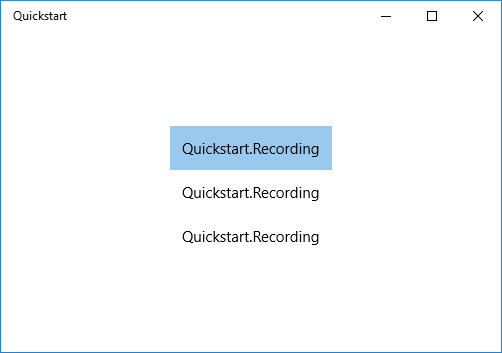
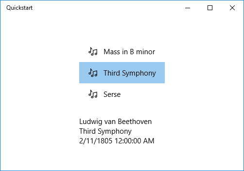
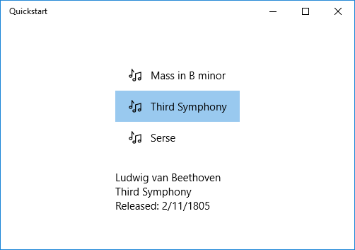

# Tutorial: Basic data binding

Data binding in WinUI 3 apps lets you efficiently connect controls to data sources. Learn how to bind a control to a single item or a collection of items, control item rendering, implement details views, and format data for display. For more details, see [Data binding in depth](data-binding-in-depth.md).

## Prerequisites

This topic assumes that you know how to create a basic WinUI app with Windows App SDK. For instructions on creating your first WinUI app, see [Create a WinUI app](/windows/apps/tutorials/winui-notes/).

## Create the project

Create a new **WinUI Blank App (Packaged)** C# project. Name it "Quickstart".

## Bind to a single item

Every binding consists of a binding target and a binding source. Typically, the target is a property of a control or other UI element, and the source is a property of a class instance (a data model, or a view model). This example shows how to bind a control to a single item. The target is the `Text` property of a `TextBlock`. The source is an instance of a simple class named `Recording` that represents an audio recording. Let's look at the class first.

Add a new class to your project, and name the class `Recording`.

``` csharp
namespace Quickstart
{
    public class Recording
    {
        public string ArtistName { get; set; }
        public string CompositionName { get; set; }
        public DateTime ReleaseDateTime { get; set; }
        public Recording()
        {
            ArtistName = "Wolfgang Amadeus Mozart";
            CompositionName = "Andante in C for Piano";
            ReleaseDateTime = new DateTime(1761, 1, 1);
        }
        public string OneLineSummary
        {
            get
            {
                return $"{CompositionName} by {ArtistName}, released: "
                    + ReleaseDateTime.ToString("d");
            }
        }
    }
    public class RecordingViewModel
    {
        private Recording defaultRecording = new();
        public Recording DefaultRecording { get { return defaultRecording; } }
    }
}
```

Next, expose the binding source class from the class that represents your window of markup. Add a property of type `RecordingViewModel` to **MainWindow.xaml.cs**.

``` csharp
namespace Quickstart
{
    public sealed partial class MainWindow : Window
    {
        public MainWindow()
        {
            this.InitializeComponent();
        }
        public RecordingViewModel ViewModel{ get; } = new RecordingViewModel();
    }
}
```

The last piece is to bind a `TextBlock` to the `ViewModel.DefaultRecording.OneLineSummary` property.

``` xaml
<Window x:Class="Quickstart.MainWindow" ... >
    <Grid>
        <TextBlock Text="{x:Bind ViewModel.DefaultRecording.OneLineSummary}"
                   HorizontalAlignment="Center"
                   VerticalAlignment="Center"/>
    </Grid>
</Window>
```

Here's the result.

:::image type="content" source="images/xaml-databinding0.png" alt-text="Screenshot of a WinUI app showing a TextBlock bound to a single item.":::

## Bind to a collection of items

A common scenario is to bind to a collection of business objects. In C#, use the generic [ObservableCollection&lt;T&gt;](/dotnet/api/system.collections.objectmodel.observablecollection-1) class for data binding. It implements the [INotifyCollectionChanged](/dotnet/api/system.collections.specialized.inotifycollectionchanged) interface, which provides change notification to bindings when items are added or removed. However, due to a known WinUI Release mode bug with .NET 8 and later, you might need to use a [List&lt;T&gt;](/dotnet/api/system.collections.generic.list-1) in some scenarios, especially if your collection is static and doesn't change after initialization. If your UI needs to update when the collection changes at runtime, use `ObservableCollection<T>`. If you only need to display a fixed set of items, `List<T>` is sufficient. Additionally, if you want your bound controls to update with changes to properties of objects in the collection, those objects should implement [INotifyPropertyChanged](/dotnet/api/system.componentmodel.inotifypropertychanged). For more info, see [Data binding in depth](data-binding-in-depth.md).

> [!NOTE]
> By using `List<T>`, you might not receive change notifications for collection changes. If you need to respond to changes, consider using `ObservableCollection<T>`. In this example, you don't need to respond to collection changes, so `List<T>` is sufficient.

The following example binds a [ListView](/windows/windows-app-sdk/api/winrt/microsoft.ui.xaml.controls.listview) to a collection of `Recording` objects. First, add the collection to your view model. Add these new members to the `RecordingViewModel` class.

``` csharp
public class RecordingViewModel
{
    ...
    private List<Recording> recordings = new();
    public List<Recording> Recordings{ get{ return recordings; } }
    public RecordingViewModel()
    {
        recordings.Add(new Recording(){ ArtistName = "Johann Sebastian Bach",
            CompositionName = "Mass in B minor", ReleaseDateTime = new DateTime(1748, 7, 8) });
        recordings.Add(new Recording(){ ArtistName = "Ludwig van Beethoven",
            CompositionName = "Third Symphony", ReleaseDateTime = new DateTime(1805, 2, 11) });
        recordings.Add(new Recording(){ ArtistName = "George Frideric Handel",
            CompositionName = "Serse", ReleaseDateTime = new DateTime(1737, 12, 3) });
    }
}
```

Then bind a [ListView](/windows/windows-app-sdk/api/winrt/microsoft.ui.xaml.controls.listview) to the `ViewModel.Recordings` property.

``` xaml
<Window x:Class="Quickstart.MainWindow" ... >
    <Grid>
        <ListView ItemsSource="{x:Bind ViewModel.Recordings}"
                  HorizontalAlignment="Center"
                  VerticalAlignment="Center"/>
    </Grid>
</Window>
```

You haven't yet provided a data template for the `Recording` class, so the best the UI framework can do is to call [ToString](/dotnet/api/system.object.tostring#System_Object_ToString) for each item in the [ListView](/windows/windows-app-sdk/api/winrt/microsoft.ui.xaml.controls.listview). The default implementation of `ToString` returns the type name.



To fix this issue, you can either override [ToString](/dotnet/api/system.object.tostring#System_Object_ToString) to return the value of `OneLineSummary`, or you can provide a data template. The data template option is a more common and flexible solution. You specify a data template by using the [ContentTemplate](/windows/windows-app-sdk/api/winrt/microsoft.ui.xaml.controls.contentcontrol.contenttemplate) property of a content control or the [ItemTemplate](/windows/windows-app-sdk/api/winrt/microsoft.ui.xaml.controls.itemscontrol.itemtemplate) property of an items control. Here are two ways you could design a data template for `Recording` together with an illustration of the result.

``` xaml
<ListView ItemsSource="{x:Bind ViewModel.Recordings}"
HorizontalAlignment="Center" VerticalAlignment="Center">
    <ListView.ItemTemplate>
        <DataTemplate x:DataType="local:Recording">
            <TextBlock Text="{x:Bind OneLineSummary}"/>
        </DataTemplate>
    </ListView.ItemTemplate>
</ListView>
```


``` xaml
<ListView ItemsSource="{x:Bind ViewModel.Recordings}"
HorizontalAlignment="Center" VerticalAlignment="Center">
    <ListView.ItemTemplate>
        <DataTemplate x:DataType="local:Recording">
            <StackPanel Orientation="Horizontal" Margin="6">
                <SymbolIcon Symbol="Audio" Margin="0,0,12,0"/>
                <StackPanel>
                    <TextBlock Text="{x:Bind ArtistName}" FontWeight="Bold"/>
                    <TextBlock Text="{x:Bind CompositionName}"/>
                </StackPanel>
            </StackPanel>
        </DataTemplate>
    </ListView.ItemTemplate>
</ListView>
```


For more information about XAML syntax, see [Create a UI with XAML](/visualstudio/xaml-tools/creating-a-ui-by-using-xaml-designer-in-visual-studio). For more information about control layout, see [Define layouts with XAML](/windows/apps/design/layout/layouts-with-xaml).

## Add a details view

You can choose to display all the details of `Recording` objects in [ListView](/windows/windows-app-sdk/api/winrt/microsoft.ui.xaml.controls.listview) items. But that approach takes up a lot of space. Instead, you can show just enough data in the item to identify it. When the user makes a selection, you can display all the details of the selected item in a separate piece of UI known as the details view. This arrangement is also known as a master/details view, or a list/details view.

You can implement this arrangement in two ways. You can bind the details view to the [SelectedItem](/windows/windows-app-sdk/api/winrt/microsoft.ui.xaml.controls.primitives.selector.selecteditem) property of the [ListView](/windows/windows-app-sdk/api/winrt/microsoft.ui.xaml.controls.listview). Or you can use a [CollectionViewSource](/windows/windows-app-sdk/api/winrt/microsoft.ui.xaml.data.collectionviewsource). In this case, you bind both the `ListView` and the details view to the `CollectionViewSource`. This approach takes care of the currently selected item for you. Both techniques are shown in the following sections, and they both give the same results (shown in the illustration).

> [!NOTE]
> So far in this topic, you used only the [{x:Bind} markup extension](/windows/apps/develop/platform/xaml/x-bind-markup-extension). But both of the techniques shown in the following sections require the more flexible (but less performant) [{Binding} markup extension](/windows/apps/develop/platform/xaml/binding-markup-extension).

First, here's the [SelectedItem](/windows/windows-app-sdk/api/winrt/microsoft.ui.xaml.controls.primitives.selector.selecteditem) technique. For a C# application, the only change necessary is to the markup.

``` xaml
<Window x:Class="Quickstart.MainWindow" ... >
    <Grid>
        <StackPanel HorizontalAlignment="Center" VerticalAlignment="Center">
            <ListView x:Name="recordingsListView" ItemsSource="{x:Bind ViewModel.Recordings}">
                <ListView.ItemTemplate>
                    <DataTemplate x:DataType="local:Recording">
                        <StackPanel Orientation="Horizontal" Margin="6">
                            <SymbolIcon Symbol="Audio" Margin="0,0,12,0"/>
                            <StackPanel>
                                <TextBlock Text="{x:Bind CompositionName}"/>
                            </StackPanel>
                        </StackPanel>
                    </DataTemplate>
                </ListView.ItemTemplate>
            </ListView>
            <StackPanel DataContext="{Binding SelectedItem, ElementName=recordingsListView}"
            Margin="0,24,0,0">
                <TextBlock Text="{Binding ArtistName}"/>
                <TextBlock Text="{Binding CompositionName}"/>
                <TextBlock Text="{Binding ReleaseDateTime}"/>
            </StackPanel>
        </StackPanel>
    </Grid>
</Window>
```

For the [CollectionViewSource](/windows/windows-app-sdk/api/winrt/microsoft.ui.xaml.data.collectionviewsource) technique, first add a `CollectionViewSource` as a resource of the top-level `Grid`.

``` xaml
<Grid.Resources>
    <CollectionViewSource x:Name="RecordingsCollection" Source="{x:Bind ViewModel.Recordings}"/>
</Grid.Resources>
```

> [!NOTE]
> The Window class in WinUI doesn't have a `Resources` property. You can add the `CollectionViewSource` to the top-level `Grid` (or other parent UI element like `StackPanel`) element instead. If you're working within a `Page`, you can add the `CollectionViewSource` to the `Page.Resources`.

Then, adjust the bindings on the [ListView](/windows/windows-app-sdk/api/winrt/microsoft.ui.xaml.controls.listview) (which no longer needs to be named) and on the details view to use the [CollectionViewSource](/windows/windows-app-sdk/api/winrt/microsoft.ui.xaml.data.collectionviewsource). By binding the details view directly to the `CollectionViewSource`, you imply that you want to bind to the current item in bindings where the path can't be found on the collection itself. There's no need to specify the `CurrentItem` property as the path for the binding, although you can do that if there's any ambiguity.

``` xaml
...
<ListView ItemsSource="{Binding Source={StaticResource RecordingsCollection}}">
...
<StackPanel DataContext="{Binding Source={StaticResource RecordingsCollection}}" ...>
...
```

And here's the identical result in each case.



## Format or convert data values for display

The rendering above has an issue. The `ReleaseDateTime` property isn't just a date; it's a [DateTime](/uwp/api/windows.foundation.datetime). So, it displays with more precision than you need. One solution is to add a string property to the `Recording` class that returns the equivalent of `ReleaseDateTime.ToString("d")`. Naming that property `ReleaseDate` indicates that it returns a date, and not a date-and-time. Naming it `ReleaseDateAsString` further indicates that it returns a string.

A more flexible solution is to use a value converter. Here's an example of how to author your own value converter. Add the following code to your **Recording.cs** source code file.

``` csharp
public class StringFormatter : Microsoft.UI.Xaml.Data.IValueConverter
{
    // This converts the value object to the string to display.
    // This will work with most simple types.
    public object Convert(object value, Type targetType,
        object parameter, string language)
    {
        // Retrieve the format string and use it to format the value.
        string formatString = parameter as string;
        if (!string.IsNullOrEmpty(formatString))
        {
            return string.Format(formatString, value);
        }

        // If the format string is null or empty, simply
        // call ToString() on the value.
        return value.ToString();
    }

    // No need to implement converting back on a one-way binding
    public object ConvertBack(object value, Type targetType,
        object parameter, string language)
    {
        throw new NotImplementedException();
    }
}
```

Now you can add an instance of `StringFormatter` as a resource and use it in the binding of the `TextBlock` that displays the `ReleaseDateTime` property.

``` xaml
<Grid.Resources>
    ...
    <local:StringFormatter x:Key="StringFormatterValueConverter"/>
</Grid.Resources>
...
<TextBlock Text="{Binding ReleaseDateTime,
    Converter={StaticResource StringFormatterValueConverter},
    ConverterParameter=Released: \{0:d\}}"/>
...
```

As you can see, for formatting flexibility, the markup passes a format string into the converter by way of the converter parameter. In the code example shown in this topic, the C# value converter makes use of that parameter.

Here's the result.



## Differences between Binding and x:Bind

When working with data binding in WinUI apps, you might encounter two primary binding mechanisms: `Binding` and `x:Bind`. While both serve the purpose of connecting UI elements to data sources, they have distinct differences:

- **`x:Bind`**: Offers compile-time checking, better performance, and is strongly typed. It's ideal for scenarios where you know the data structure at compile time.
- **`Binding`**: Provides runtime evaluation and is more flexible for dynamic scenarios, such as when the data structure isn't known at compile time.

### Scenarios not supported by x:Bind

While `x:Bind` is powerful, you can't use it in certain scenarios:

- **Dynamic data structures**: If the data structure isn't known at compile time, you can't use `x:Bind`.
- **Element-to-element binding**: `x:Bind` doesn't support binding directly between two UI elements.
- **Binding to a `DataContext`**: `x:Bind` doesn't automatically inherit the `DataContext` of a parent element.
- **Two-way bindings with `Mode=TwoWay`**: While supported, `x:Bind` requires explicit implementation of `INotifyPropertyChanged` for any property you want the UI to update when the source changes, whether using one-way or two-way binding. The key difference with two-way bindings is that changes also flow from the UI back to the source.

For practical examples and a deeper understanding of when to use each, see the following topics:

- [Data binding in depth](data-binding-in-depth.md)
- [x:Bind markup extension](/windows/apps/develop/platform/xaml/x-bind-markup-extension)

## Related content

- [Data binding](index.md)
- [Data binding in depth](data-binding-in-depth.md)
- [Data binding and MVVM](data-binding-and-mvvm.md)
- [MVVM performance tips for WinUI apps](/windows/apps/develop/performance/mvvm-performance-tips)
- [CommunityToolkit MVVM](/dotnet/communitytoolkit/mvvm/)
- [WinUI Gallery](https://github.com/microsoft/WinUI-Gallery)
