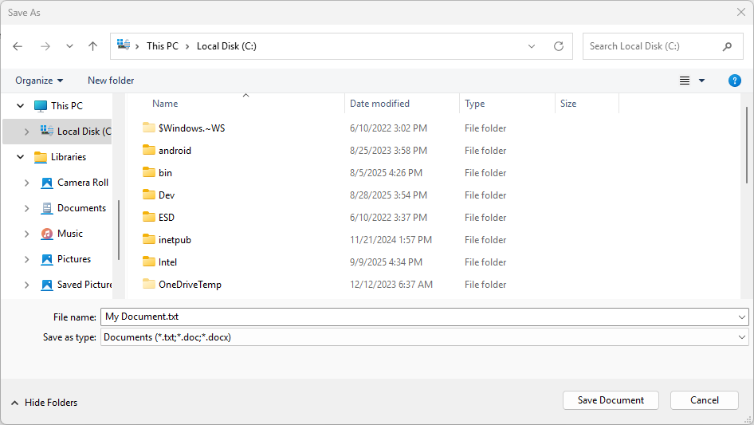

# Save a file with Windows App SDK picker in WinUI

When building Windows apps with Windows App SDK, users often need to save files like documents, images, or other content to specific locations on their device. The Windows App SDK provides the [FileSavePicker](/windows/windows-app-sdk/api/winrt/microsoft.windows.storage.pickers.filesavepicker) class to create a consistent, user-friendly interface that lets users choose where to save files and what to name them.

This article shows you how to implement a file save picker in your WinUI app. You'll learn how to configure the picker's appearance and behavior, handle the user's selection, and save content to the chosen location.

The save file picker can be populated with a suggested file name and other default settings to make it easier for users to save their files:



## Prerequisites

Before you start, make sure you have:

- A WinUI project set up with Windows App SDK
- Basic familiarity with C# and XAML
- Understanding of async/await patterns in C#

## Important APIs

The following APIs are used in this topic:

- [FileSavePicker](/windows/windows-app-sdk/api/winrt/microsoft.windows.storage.pickers.filesavepicker)
- [StorageFile](/uwp/api/Windows.Storage.StorageFile)

Use the [FileSavePicker](/windows/windows-app-sdk/api/winrt/microsoft.windows.storage.pickers.filesavepicker) to allow users to specify the name and location where they want your app to save a file.

## Save a document with FileSavePicker

Use a [FileSavePicker](/windows/windows-app-sdk/api/winrt/microsoft.windows.storage.pickers.filesavepicker) so that your users can specify the name, type, and location of a file to save. Create, customize, and show a file picker object, and then save data via the returned [StorageFile](/uwp/api/Windows.Storage.StorageFile) object that represents the file picked.

1. Create and customize the FileSavePicker. Start by creating a new [FileSavePicker](/windows/windows-app-sdk/api/winrt/microsoft.windows.storage.pickers.filesavepicker) object, and then set properties on the object to customize the file picker for your app and your users:

    ```csharp
    using Microsoft.Windows.Storage.Pickers;
    ...
    var savePicker = new FileSavePicker(this.AppWindow.Id)
    {
        // (Optional) Specify the initial location for the picker. 
        //     If the specified location doesn't exist on the user's machine, it falls back to the DocumentsLibrary.
        //     If not set, it defaults to PickerLocationId.Unspecified, and the system will use its default location.
        SuggestedStartLocation = PickerLocationId.DocumentsLibrary,
        
        // (Optional) specify the default file name. If not specified, use system default.
        SuggestedFileName = "My Document",
    
        // (Optional) Sets the folder that the file save dialog displays when it opens.
        //     If not specified or the specified path doesn't exist, defaults to the last folder the user visited.
        SuggestedFolder = @"C:\MyFiles",
    
        // (Optional) specify the text displayed on the commit button. 
        //     If not specified, the system uses a default label of "Save" (suitably translated).
        CommitButtonText = "Save Document",
    
        // (Optional) categorized extension types. If not specified, "All Files (*.*)" is allowed.
        //     Note that when "All Files (*.*)" is allowed, end users can save a file without an extension.
        FileTypeChoices = {
            { "Documents", new List<string> { ".txt", ".doc", ".docx" } }
        },
    
        // (Optional) specify the default file extension (will be appended to SuggestedFileName).
        //      If not specified, no extension will be appended.
        DefaultFileExtension = ".txt",
    };
    ```

    This example sets six properties: [SuggestedStartLocation](/windows/windows-app-sdk/api/winrt/microsoft.windows.storage.pickers.filesavepicker.suggestedstartlocation), [SuggestedFileName](/windows/windows-app-sdk/api/winrt/microsoft.windows.storage.pickers.filesavepicker.suggestedfilename), [SuggestedFolder](/windows/windows-app-sdk/api/winrt/microsoft.windows.storage.pickers.filesavepicker.suggestedfolder), [CommitButtonText](/windows/windows-app-sdk/api/winrt/microsoft.windows.storage.pickers.filesavepicker.commitbuttontext), [FileTypeChoices](/windows/windows-app-sdk/api/winrt/microsoft.windows.storage.pickers.filesavepicker.filetypechoices), and [DefaultFileExtension](/windows/windows-app-sdk/api/winrt/microsoft.windows.storage.pickers.filesavepicker.defaultfileextension).

    Because the user is saving a document or text file, the sample sets the **SuggestedStartLocation** to the documents library folder by using the **DocumentsLibrary** value from the [PickerLocationId](/windows/windows-app-sdk/api/winrt/microsoft.windows.storage.pickers.pickerlocationid) Enum. Set the [SuggestedStartLocation](/windows/windows-app-sdk/api/winrt/microsoft.windows.storage.pickers.filesavepicker.suggestedstartlocation) to a location that's appropriate for the type of file being saved, for example Music, Pictures, Videos, or Documents. From the start location, the user can navigate to and select other locations.

    To save the user some typing, the example sets a [SuggestedFileName](/windows/windows-app-sdk/api/winrt/microsoft.windows.storage.pickers.filesavepicker.suggestedfilename). The suggested file name should be relevant to the file being saved. For example, like Word, you can suggest the existing file name if there is one, or the first line of a document if the user is saving a file that doesn't have a name yet.

    Use the [FileTypeChoices](/windows/windows-app-sdk/api/winrt/microsoft.windows.storage.pickers.filesavepicker.filetypechoices) property when specifing the file types that the sample supports (Microsoft Word documents and text files). This ensures that the app can open the file after it is saved. Make sure all the file types that you specify are supported by your app. Users will be able to save their file as any of the file types you specify. They can also change the file type by selecting another of the file types that you specified. The first file type choice in the list will be selected by default. To control that, set the [DefaultFileExtension](/windows/windows-app-sdk/api/winrt/microsoft.windows.storage.pickers.filesavepicker.defaultfileextension) property.

    > [!NOTE]
    > The file picker also uses the currently selected file type to filter which files it displays, so that only file types that match the selected files types are displayed to the user.

    The equivalent C++ code for this example is as follows:

    ```cpp
    #include <winrt/Microsoft.Windows.Storage.Pickers.h>
    using namespace winrt::Microsoft::Windows::Storage::Pickers;
    
    FileSavePicker savePicker(AppWindow().Id());
    
    // (Optional) Specify the initial location for the picker. 
    //     If the specified location doesn't exist on the user's machine, it falls back to the DocumentsLibrary.
    //     If not set, it defaults to PickerLocationId.Unspecified, and the system will use its default location.
    savePicker.SuggestedStartLocation(PickerLocationId::DocumentsLibrary);
    
    // (Optional) specify the default file name. If not specified, use system default.
    savePicker.SuggestedFileName(L"NewDocument");
    
    // (Optional) Sets the folder that the file save dialog displays when it opens.
    //     If not specified or the specified path doesn't exist, defaults to the last folder the user visited.
    savePicker.SuggestedFolder = L"C:\\MyFiles",
    
    // (Optional) specify the text displayed on the commit button. 
    //     If not specified, the system uses a default label of "Save" (suitably translated).
    savePicker.CommitButtonText(L"Save Document");
    
    // (Optional) categorized extension types. If not specified, "All Files (*.*)" is allowed.
    //     Note that when "All Files (*.*)" is allowed, end users can save a file without an extension.
    savePicker.FileTypeChoices().Insert(L"Text", winrt::single_threaded_vector<winrt::hstring>({ L".txt" }));
    
    // (Optional) specify the default file extension (will be appended to SuggestedFileName).
    //      If not specified, no extension will be appended.
    savePicker.DefaultFileExtension(L".txt");
    ```

    > [!NOTE]
    > [FileSavePicker](/windows/windows-app-sdk/api/winrt/microsoft.windows.storage.pickers.filesavepicker) objects display the file picker using the [PickerViewMode.List](/windows/windows-app-sdk/api/winrt/microsoft.windows.storage.pickers.pickerviewmode) view mode.

2. Next, let's show the **FileSavePicker** and save to the picked file location. Display the file picker by calling [PickSaveFileAsync](/windows/windows-app-sdk/api/winrt/microsoft.windows.storage.pickers.filesavepicker.picksavefileasync). After the user specifies the name, file type, and location, and confirms to save the file, **PickSaveFileAsync** returns a lightweight [FilePickResult](/windows/windows-app-sdk/api/winrt/microsoft.windows.storage.pickers.pickfileresult) object that contains the path to the saved file and the filename. You can capture and process this file if you have read and write access to it.

    ```csharp
    using Microsoft.Windows.Storage.Pickers;
    ...
    var savePicker = new FileSavePicker(this.AppWindow.Id);
    var result = await savePicker.PickSaveFileAsync();
    if (result != null)
    {
        if (!System.IO.File.Exists(result.Path))
        {
            // Create a file and write to it.
            System.IO.File.WriteAllText(result.Path, "Hello world." + Environment.NewLine);
        }
        else
        {
            // Append to the existing file.
            System.IO.File.AppendAllText(result.Path, "Hello again." + Environment.NewLine);
        }
    }
    else
    {
        this.textBlock.Text = "Operation cancelled.";
    }
    ```

    The example checks if the file exists and either creates a new file or appends to the existing file. If the user cancels the operation, the result will be `null`, and you can handle that case appropriately, such as displaying a message to the user.

    > [!TIP]
    > You should always check the saved file to make sure it exists and is valid before you perform any other processing. Then, you can save content to the file as appropriate for your app. Your app should provide appropriate behavior if the picked file isn't valid.

    Here's the C++ equivalent of this C# example:

    ```cpp
    #include <winrt/Microsoft.Windows.Storage.Pickers.h>
    #include <fstream>
    #include <string>
    using namespace winrt::Microsoft::Windows::Storage::Pickers;
    
    FileSavePicker savePicker(AppWindow().Id());
    auto result{ co_await savePicker.PickSaveFileAsync() };
    if (result)
    {
        // Check if the file exists.
        if (!std::ifstream(result.Path().c_str()))
        {
            std::ofstream outFile(result.Path().c_str());
            outFile << "Hello world.";
            outFile.close();
        }
        else
        {
            // Append to the existing file.
            std::ofstream outFile(result.Path().c_str(), std::ios::app);
            outFile << "Hello again.";
            outFile.close();
        }
    }
    else
    {
        textBlock().Text(L"Operation cancelled.");
    }
    ```

## Related content

[Windows.Storage.Pickers](/uwp/api/windows.storage.pickers)

[Files, folders, and libraries with Windows App SDK](index.md)

[PickSaveFileAsync](/windows/windows-app-sdk/api/winrt/microsoft.windows.storage.pickers.filesavepicker.picksavefileasync)
