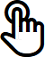
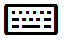
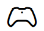

# Input primer

User interactions in a Windows app combine input and output sources such as mouse, keyboard, pen, touch, touchpad, and speech. They also include modes or modifiers that enable extended experiences, such as mouse wheel and buttons, pen eraser and barrel buttons, touch keyboard, and background app services.

Windows uses a contextual interaction system that, in most cases, eliminates the need to handle each input type separately. This includes handling touch, touchpad, mouse, and pen input as a generic pointer type to support static gestures such as tap or press-and-hold, manipulation gestures such as slide for panning, and digital ink rendering.

Familiarize yourself with each input device type and its behaviors, capabilities, and limitations when paired with certain form factors. This helps you decide whether platform controls and affordances are sufficient for your app or if you should provide custom interaction experiences.

## Quick summary

- Windows input features include speech, pen, touch, touchpad, keyboard, mouse, gesture, gamepad/controller, and haptics.
- Touch, touchpad, mouse, and pen can all participate in a unified pointer model for common interactions.
- Each input type has distinct strengths. Most apps should support multiple input types, not just one.
- Haptics and text-to-speech are complementary feedback channels that improve clarity and accessibility.

## Input features at a glance

| Input feature | Primary scenarios | Key strengths | Typical constraints |
|---|---|---|---|
| Speech | Natural language, command and control, dictation | Hands-free interaction, accessibility, productivity | Speech quality and intent understanding vary by environment and app design |
| Pen | Inking, annotation, precision pointing | Pixel-level precision, pressure and tilt data, natural handwriting | Passive pens have limited capabilities and weaker palm rejection |
| Touch | Direct manipulation, navigation, text entry, inking support | Natural gestures, multi-touch interaction, tactile feel | Device support varies from no touch to full multi-touch |
| Touchpad | Indirect gesture input plus pointer precision | Works well for touch-optimized and productivity UI | Indirect input can require additional affordances for discoverability |
| Keyboard | Text entry, navigation, commands, accessibility | Fast input, broad command coverage, strong accessibility support | Touch keyboard is text-only and does not replace full command input |
| Mouse | Precision targeting and command-heavy UI | Fine-grained control, modifier keys, broad familiarity | Less natural for direct manipulation patterns than touch |
| Gesture | Tap/hold and manipulation interactions | Supports static and continuous interactions, including inertia data | Custom gestures can be culture and locale sensitive |
| Gamepad/controller | Game input and console-style navigation | Directional navigation and specialized game controls | Best for focused scenarios, not general productivity text input |
| Haptics | Confirmation and boundary feedback | Reinforces interactions through touch feedback | Requires supported hardware and should complement visual/audio cues |

## How to design for multiple inputs

- Provide equivalent paths for core actions across input types where possible.
- Do not rely on a single modality for critical commands.
- Keep UI affordances discoverable for both direct and indirect input.
- Validate interactions on real hardware combinations (for example, touch-only, keyboard and mouse, and pen-enabled devices).

## Speech

Speech is an effective and natural way for people to interact with apps. It is an easy and accurate way to communicate with apps and helps people stay productive and informed in many situations.

Speech can complement or, in many cases, be the primary input type, depending on the user's device.

Text-to-speech (also known as TTS, or speech synthesis) is used to inform or direct the user.

### Device support

- Tablet
- PCs and laptops

### Typical usage

There are three modes of speech interaction:

**Natural language**

Natural language is how we verbally interact with people on a regular basis. Our speech varies from person to person and situation to situation, and is generally understood. When it's not, we often use different words and word order to get the same idea across.

Natural language interactions with an app are similar: we speak to the app through our device as if it were a person and expect it to understand and react accordingly.

Natural language is the most advanced mode of speech interaction.

**Command and control**

Command and control is the use of verbal commands to activate controls and functionality, such as clicking a button or selecting a menu item.

Because command and control is critical to a successful user experience, do not rely on a single input type. Speech is typically one of several input options based on user preference or hardware capability.

**Dictation**

Dictation is the most basic speech input method. Each utterance is converted to text.

Dictation is typically used when an app doesn't need to understand meaning or intent.

### More info

[Speech design guidelines](/windows/uwp/ui-input/speech-interactions)

## Pen

A pen (or stylus) can serve as a pixel-precise pointing device, like a mouse, and is the optimal device for digital ink input.

> [!NOTE]
> There are two types of pen devices: active and passive.
>
> - Passive pens do not contain electronics, and effectively emulate touch input from a finger. They require a basic device display that recognizes input based on contact pressure. Because users often rest their hand as they write on the input surface, input data can become polluted due to unsuccessful palm rejection.
> - Active pens contain electronics and can work with complex device displays to provide much more extensive input data (including hover, or proximity data) to the system and your app. Palm rejection is much more robust.

When we refer to pen devices here, we are referring to active pens that provide rich input data and are used primarily for precise ink and pointing interactions.

### Device support

- Tablet
- PCs and laptops

### Typical usage

The Windows ink platform, together with a pen, provides a natural way to create handwritten notes, drawings, and annotations. The platform supports capturing ink data from digitizer input, generating ink data, rendering that data as ink strokes on the output device, managing the ink data, and performing handwriting recognition. In addition to capturing the spatial movements of the pen as the user writes or draws, your app can also collect info such as pressure, shape, color, and opacity, to offer user experiences that closely resemble drawing on paper with a pen, pencil, or brush.

Pen and touch input diverge in that touch can emulate direct manipulation of UI elements on the screen through physical gestures (such as swiping, sliding, dragging, and rotating).

You should provide pen-specific UI commands, or affordances, to support these interactions. For example, use previous and next (or + and -) buttons to let users flip through pages of content, or rotate, resize, and zoom objects.

### More info

[Pen design guidelines](/windows/uwp/ui-input/pen-and-stylus-interactions)

## Touch

With touch, physical gestures from one or more fingers can emulate direct manipulation of UI elements (such as panning, rotating, resizing, or moving), serve as an alternative input method (similar to mouse or pen), or complement other input (such as smudging an ink stroke drawn with a pen). These tactile experiences can provide more natural, real-world sensations as users interact with on-screen elements.

### Device support

- Tablet
- PCs and laptops

### Typical usage

Support for touch input can vary significantly, depending on the device.

Some devices don't support touch at all, some devices support a single touch contact, while others support multi-touch (two or more contacts).

Most devices that support multi-touch input recognize ten unique, concurrent contacts.

In general, touch is:

- Single user.
- Not constrained to device orientation.
- Used for all interactions, including text input (touch keyboard) and inking (app configured).

### More info

[Touch design guidelines](touch-interactions.md)

## Touchpad

A touchpad combines both indirect multi-touch input with the precision input of a pointing device, such as a mouse. This combination makes the touchpad suited to both a touch-optimized UI and the smaller targets of productivity apps.

### Device support

- PCs and laptops

### Typical usage

Touchpads typically support a set of touch gestures that provide support similar to touch for direct manipulation of objects and UI.

Because touchpads support interaction experiences similar to touch, we recommend that you also provide mouse-style UI commands or affordances rather than relying only on touch support. Provide touchpad-specific UI commands or affordances for these interactions.

You should provide mouse-specific UI commands, or affordances, to support these interactions. For example, use previous and next (or + and -) buttons to let users flip through pages of content, or rotate, resize, and zoom objects.

### More info

[Touchpad design guidelines](touchpad-interactions.md)

## Keyboard

A keyboard is the primary input device for text, and is often indispensable to people with certain disabilities or users who consider it a faster and more efficient way to interact with an app.

### Device support

- Tablet
- PCs and laptops

### Typical usage

Users can interact with Windows apps through a hardware keyboard and two software keyboards: the On-Screen Keyboard (OSK) and the touch keyboard.

The OSK is a visual, software keyboard that you can use instead of a physical keyboard to type and enter data using touch, mouse, pen/stylus, or another pointing device (a touch screen is not required). The OSK is provided for systems that do not have a physical keyboard, or for users whose mobility impairments prevent them from using traditional physical input devices. The OSK emulates most, if not all, hardware keyboard functionality.

The touch keyboard is a visual, software keyboard used for text entry with touch input. It is not a replacement for the OSK because it is used only for text input (it does not emulate a hardware keyboard) and appears only when a text field or another editable text control gets focus. The touch keyboard does not support app or system commands.

> [!NOTE]
> The OSK has priority over the touch keyboard, which won't be shown if the OSK is present.

In general, a keyboard is:

- Single user.
- Not constrained to device orientation.
- Used for text input, navigation, gameplay, and accessibility.
- Always available, either proactively or reactively.

### More info

[Keyboard design guidelines](keyboard-interactions.md)

## Mouse

A mouse is best suited for productivity apps and high-density UI where user interactions require pixel-level precision for targeting and commanding.

### Device support

- Tablet
- PCs and laptops

### Typical usage

Mouse input can be modified with the addition of various keyboard keys (Ctrl, Shift, Alt, and so on). These keys can be combined with the left mouse button, the right mouse button, the wheel button, and the X buttons for an expanded mouse-optimized command set. (Some Microsoft mouse devices have two additional buttons, referred to as X buttons, typically used to navigate back and forward in Web browsers).

Similar to pen, mouse and touch input diverge in that touch can emulate direct manipulation of UI elements on the screen through physical gestures performed on those objects (such as swiping, sliding, dragging, and rotating).

You should provide mouse-specific UI commands, or affordances, to support these interactions. For example, use previous and next (or + and -) buttons to let users flip through pages of content, or rotate, resize, and zoom objects.

### More info

[Mouse design guidelines](mouse-interactions.md)

## Gesture

A gesture is any form of user movement that is recognized as input for controlling or interacting with an application. Gestures take many forms, from simply using a hand to target something on the screen, to specific, learned patterns of movement, to long stretches of continuous movement using the entire body. Be careful when designing custom gestures, as their meaning can vary depending on locale and culture.

### Device support

- PCs and laptops

### Typical usage

Static gesture events are fired after an interaction is complete.

- Static gesture events include Tapped, DoubleTapped, RightTapped, and Holding.

Manipulation gesture events indicate an ongoing interaction. They start firing when the user touches an element and continue until the user lifts their finger(s), or the manipulation is canceled.

- Manipulation events include multi-touch interactions such as zooming, panning, or rotating, and interactions that use inertia and velocity data such as dragging. (The information provided by the manipulation events doesn't identify the interaction, but rather provides data such as position, translation delta, and velocity.)

- Pointer events such as PointerPressed and PointerMoved provide low-level details for each touch contact, including pointer motion and the ability to distinguish press and release events.

Because Windows supports converged interaction experiences, we recommend that you also provide mouse-style UI commands or affordances rather than relying only on touch support. For example, use previous and next (or + and -) buttons to let users flip through pages of content, or rotate, resize, and zoom objects.

## Gamepad/Controller

The gamepad/controller is a highly specialized device typically dedicated to playing games. However, it is also used to emulate basic keyboard input and provides a UI navigation experience very similar to the keyboard.

### Device support

- PCs and laptops

### Typical usage

Playing games and interacting with a specialized console-style UI.

## Haptics

Haptic feedback adds a sense of touch to digital interactions, providing physical confirmation that reinforces user input and makes experiences feel more responsive. Windows supports contextual haptic feedback through the [InputHapticsManager](/uwp/api/windows.devices.haptics.inputhapticsmanager) API, enabling apps to deliver consistent touch feedback across supported devices.

### Device support

- PCs and laptops with supported haptic hardware

### Typical usage

Haptic feedback is most effective when paired with touch, pen, or touchpad interactions. Common uses include confirming button presses, providing feedback during drag-and-drop operations, and reinforcing gesture boundaries. Haptics should complement visual and auditory feedback, not replace them.

### More info

[Implement haptic feedback](haptics.md)

[Haptics design guidelines](/windows/apps/design/signature-experiences/haptics)

## Multiple inputs

Designing your app to support as many users, devices, and input types as possible (gesture, speech, touch, touchpad, mouse, and keyboard) maximizes flexibility, usability, and accessibility.

### Device support

- Tablet
- PCs and laptops

### Typical usage

Just as people combine voice and gesture when communicating with each other, they can benefit from multiple input types and modes when interacting with an app. However, these combined interactions must remain intuitive and natural, or they can become confusing.