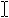

# Mouse interactions

Optimize your Windows app design for touch input and get basic mouse support by default. 

Mouse input is best suited for user interactions that require precision when pointing and clicking. This inherent precision is naturally supported by the UI of Windows, which is optimized for the imprecise nature of touch.

Where mouse and touch input diverge is the ability for touch to more closely emulate the direct manipulation of UI elements through physical gestures performed directly on those objects (such as swiping, sliding, dragging, rotating, and so on). Manipulations with a mouse typically require some other UI affordance, such as the use of handles to resize or rotate an object.

This topic describes design considerations for mouse interactions.

## The Windows mouse language

A concise set of mouse interactions are used consistently throughout the system.

| Term | Description |
|---|---|
| Hover to learn | Hover over an element to display more detailed info or teaching visuals (such as a tooltip) without a commitment to an action. |
| Left-click for primary action | Left-click an element to invoke its primary action (such as launching an app or executing a command). |
| Scroll to change view | Display scroll bars to move up, down, left, and right within a content area. Users can scroll by clicking scroll bars or rotating the mouse wheel. Scroll bars can indicate the location of the current view within the content area (panning with touch displays a similar UI). |
| Right-click to select and command | Right-click to display the navigation bar (if available) and the app bar with global commands. Right-click an element to select it and display the app bar with contextual commands for the selected element. **Note:** Right-click to display a context menu if selection or app bar commands are not appropriate UI behaviors. But we strongly recommend that you use the app bar for all command behaviors. |
| UI commands to zoom | Display UI commands in the app bar (such as + and -), or press Ctrl and rotate mouse wheel, to emulate pinch and stretch gestures for zooming. |
| UI commands to rotate | Display UI commands in the app bar, or press Ctrl+Shift and rotate mouse wheel, to emulate the turn gesture for rotating. Rotate the device itself to rotate the entire screen. |
| Left-click and drag to rearrange | Left-click and drag an element to move it. |
| Left-click and drag to select text | Left-click within selectable text and drag to select it. Double-click to select a word. |

## Mouse input events

Most mouse input can be handled through the common routed input events supported by all [**UIElement**](/windows/windows-app-sdk/api/winrt/microsoft.ui.xaml.UIElement) objects. These include:

- [**BringIntoViewRequested**](/windows/windows-app-sdk/api/winrt/microsoft.ui.xaml.uielement.bringintoviewrequested)
- [**CharacterReceived**](/windows/windows-app-sdk/api/winrt/microsoft.ui.xaml.uielement.characterreceived)
- [**ContextCanceled**](/windows/windows-app-sdk/api/winrt/microsoft.ui.xaml.uielement.contextcanceled)
- [**ContextRequested**](/windows/windows-app-sdk/api/winrt/microsoft.ui.xaml.uielement.contextrequested)
- [**DoubleTapped**](/windows/windows-app-sdk/api/winrt/microsoft.ui.xaml.uielement.doubletapped)
- [**DragEnter**](/windows/windows-app-sdk/api/winrt/microsoft.ui.xaml.uielement.dragenter)
- [**DragLeave**](/windows/windows-app-sdk/api/winrt/microsoft.ui.xaml.uielement.dragleave)
- [**DragOver**](/windows/windows-app-sdk/api/winrt/microsoft.ui.xaml.uielement.dragover)
- [**DragStarting**](/windows/windows-app-sdk/api/winrt/microsoft.ui.xaml.uielement.dragstarting)
- [**Drop**](/windows/windows-app-sdk/api/winrt/microsoft.ui.xaml.uielement.drop)
- [**DropCompleted**](/windows/windows-app-sdk/api/winrt/microsoft.ui.xaml.uielement.dropcompleted)
- [**GettingFocus**](/windows/windows-app-sdk/api/winrt/microsoft.ui.xaml.uielement.gettingfocus)
- [**GotFocus**](/windows/windows-app-sdk/api/winrt/microsoft.ui.xaml.uielement.gotfocus)
- [**Holding**](/windows/windows-app-sdk/api/winrt/microsoft.ui.xaml.uielement.holding)
- [**KeyDown**](/windows/windows-app-sdk/api/winrt/microsoft.ui.xaml.uielement.keydown)
- [**KeyUp**](/windows/windows-app-sdk/api/winrt/microsoft.ui.xaml.uielement.keyup)
- [**LosingFocus**](/windows/windows-app-sdk/api/winrt/microsoft.ui.xaml.uielement.losingfocus)
- [**LostFocus**](/windows/windows-app-sdk/api/winrt/microsoft.ui.xaml.uielement.lostfocus)
- [**ManipulationCompleted**](/windows/windows-app-sdk/api/winrt/microsoft.ui.xaml.uielement.manipulationcompleted)
- [**ManipulationDelta**](/windows/windows-app-sdk/api/winrt/microsoft.ui.xaml.uielement.manipulationdelta)
- [**ManipulationInertiaStarting**](/windows/windows-app-sdk/api/winrt/microsoft.ui.xaml.uielement.manipulationinertiastarting)
- [**ManipulationStarted**](/windows/windows-app-sdk/api/winrt/microsoft.ui.xaml.uielement.manipulationstarted)
- [**ManipulationStarting**](/windows/windows-app-sdk/api/winrt/microsoft.ui.xaml.uielement.manipulationstarting)
- [**NoFocusCandidateFound**](/windows/windows-app-sdk/api/winrt/microsoft.ui.xaml.uielement.nofocuscandidatefound)
- [**PointerCanceled**](/windows/windows-app-sdk/api/winrt/microsoft.ui.xaml.uielement.pointercanceled)
- [**PointerCaptureLost**](/windows/windows-app-sdk/api/winrt/microsoft.ui.xaml.uielement.pointercapturelost)
- [**PointerEntered**](/windows/windows-app-sdk/api/winrt/microsoft.ui.xaml.uielement.pointerentered)
- [**PointerExited**](/windows/windows-app-sdk/api/winrt/microsoft.ui.xaml.uielement.pointerexited)
- [**PointerMoved**](/windows/windows-app-sdk/api/winrt/microsoft.ui.xaml.uielement.pointermoved)
- [**PointerPressed**](/windows/windows-app-sdk/api/winrt/microsoft.ui.xaml.uielement.pointerpressed)
- [**PointerReleased**](/windows/windows-app-sdk/api/winrt/microsoft.ui.xaml.uielement.pointerreleased)
- [**PointerWheelChanged**](/windows/windows-app-sdk/api/winrt/microsoft.ui.xaml.uielement.pointerwheelchanged)
- [**PreviewKeyDown**](/windows/windows-app-sdk/api/winrt/microsoft.ui.xaml.uielement.previewkeydown)
- [**PreviewKeyUp**](/windows/windows-app-sdk/api/winrt/microsoft.ui.xaml.uielement.previewkeyup)
- [**RightTapped**](/windows/windows-app-sdk/api/winrt/microsoft.ui.xaml.uielement.righttapped)
- [**Tapped**](/windows/windows-app-sdk/api/winrt/microsoft.ui.xaml.uielement.tapped)

However, you can take advantage of the specific capabilities of each device (such as mouse wheel events) using the pointer, gesture, and manipulation events in [Windows.UI.Input](/uwp/api/windows.ui.input).

**Samples:** See our [BasicInput sample](https://github.com/Microsoft/Windows-universal-samples/tree/master/Samples/BasicInput), for .

## Guidelines for visual feedback

- When a mouse is detected (through move or hover events), show mouse-specific UI to indicate functionality exposed by the element. If the mouse doesn't move for a certain amount of time, or if the user initiates a touch interaction, make the mouse UI gradually fade away. This keeps the UI clean and uncluttered.
- Don't use the cursor for hover feedback, the feedback provided by the element is sufficient (see Cursors below).
- Don't display visual feedback if an element doesn't support interaction (such as static text).
- Don't use focus rectangles with mouse interactions. Reserve these for keyboard interactions.
- Display visual feedback concurrently for all elements that represent the same input target.
- Provide buttons (such as + and -) for emulating touch-based manipulations such as panning, rotating, zooming, and so on.

For more general guidance on visual feedback, see [Guidelines for visual feedback](../../design/input/guidelines-for-visualfeedback.md).

## Cursors

A set of standard cursors is available for a mouse pointer. These are used to indicate the primary action of an element.

Each standard cursor has a corresponding default image associated with it. The user or an app can replace the default image associated with any standard cursor at any time. Specify a cursor image through the [**PointerCursor**](/uwp/api/windows.ui.core.corewindow.pointercursor) function.

If you need to customize the mouse cursor:

- Always use the arrow cursor () for clickable elements. don't use the pointing hand cursor () for links or other interactive elements. Instead, use hover effects (described earlier).
- Use the text cursor () for selectable text.
- Use the move cursor () when moving is the primary action (such as dragging or cropping). Don't use the move cursor for elements where the primary action is navigation (such as Start tiles).
- Use the horizontal, vertical and diagonal resize cursors (, , , ), when an object is resizable.
- Use the grasping hand cursors (, ) when panning content within a fixed canvas (such as a map).

## Related articles

- [Handle pointer input](../../design/input/handle-pointer-input.md)
- [Identify input devices](../../design/input/identify-input-devices.md)
- [Events and routed events overview](/windows/apps/develop/platform/xaml/events-and-routed-events-overview)

### Samples

- [Basic input sample](https://github.com/Microsoft/Windows-universal-samples/tree/master/Samples/BasicInput)
- [Low latency input sample](https://github.com/Microsoft/Windows-universal-samples/tree/master/Samples/LowLatencyInput)
- [User interaction mode sample](https://github.com/Microsoft/Windows-universal-samples/tree/master/Samples/UserInteractionMode)
- [Focus visuals sample](https://github.com/Microsoft/Windows-universal-samples/tree/master/Samples/XamlFocusVisuals)
