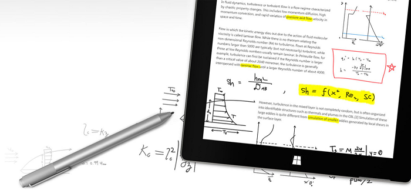

# Pen interactions and Windows Ink in Windows apps

  
*Surface Pen* (available for purchase at the [Microsoft Store](https://www.microsoft.com/p/surface-pen/8zl5c82qmg6b)).

## Overview

Windows apps built with WinUI 3 and the Windows App SDK can handle pen input through the unified pointer input system. A pen is treated as a pointer device, just like mouse and touch, but exposes additional properties unique to stylus hardware — including pressure sensitivity, tilt angles, barrel button state, and eraser tip detection.

For detailed guidance on handling pointer events from all input devices (pen, mouse, touch, and touchpad), see [Handle pointer input](/windows/apps/develop/input/handle-pointer-input).

## Key APIs

Pen-specific properties are available through the [**PointerPointProperties**](/windows/windows-app-sdk/api/winrt/microsoft.ui.input.pointerpointproperties) class in the `Microsoft.UI.Input` namespace.

| Property | Description |
| --- | --- |
| [**Pressure**](/windows/windows-app-sdk/api/winrt/microsoft.ui.input.pointerpointproperties.pressure) | Pressure value (0.0 to 1.0) reported by the pen digitizer |
| [**IsBarrelButtonPressed**](/windows/windows-app-sdk/api/winrt/microsoft.ui.input.pointerpointproperties.isbarrelbuttonpressed) | Whether the pen's barrel (side) button is pressed |
| [**IsEraser**](/windows/windows-app-sdk/api/winrt/microsoft.ui.input.pointerpointproperties.iseraser) | Whether the input is from an eraser tip |
| [**XTilt**](/windows/windows-app-sdk/api/winrt/microsoft.ui.input.pointerpointproperties.xtilt) | Tilt of the pen along the X axis (-90 to +90 degrees) |
| [**YTilt**](/windows/windows-app-sdk/api/winrt/microsoft.ui.input.pointerpointproperties.ytilt) | Tilt of the pen along the Y axis (-90 to +90 degrees) |
| [**Twist**](/windows/windows-app-sdk/api/winrt/microsoft.ui.input.pointerpointproperties.twist) | Clockwise rotation of the pen (0 to 359 degrees) |
| [**IsInRange**](/windows/windows-app-sdk/api/winrt/microsoft.ui.input.pointerpointproperties.isinrange) | Whether the pen is within detection range (hovering) without touching |

You identify a pen device by checking the [**PointerDeviceType**](/windows/windows-app-sdk/api/winrt/microsoft.ui.input.pointerpoint.pointerdevicetype) property on the [**PointerPoint**](/windows/windows-app-sdk/api/winrt/microsoft.ui.input.pointerpoint):

```csharp
private void Target_PointerMoved(object sender, PointerRoutedEventArgs e)
{
    var point = e.GetCurrentPoint(targetElement);

    if (point.PointerDeviceType == Microsoft.UI.Input.PointerDeviceType.Pen)
    {
        var props = point.Properties;

        float pressure = props.Pressure;
        bool barrelButton = props.IsBarrelButtonPressed;
        bool eraser = props.IsEraser;
        float xTilt = props.XTilt;
        float yTilt = props.YTilt;

        // Use pen-specific properties to customize behavior
    }
}
```

## Pen interaction patterns

### Pressure-sensitive drawing

Use the [**Pressure**](/windows/windows-app-sdk/api/winrt/microsoft.ui.input.pointerpointproperties.pressure) property to vary stroke width or opacity based on how hard the user presses:

```csharp
private void Canvas_PointerMoved(object sender, PointerRoutedEventArgs e)
{
    var point = e.GetCurrentPoint(drawingCanvas);

    if (point.IsInContact &&
        point.PointerDeviceType == Microsoft.UI.Input.PointerDeviceType.Pen)
    {
        // Scale stroke width from 1 to 10 based on pressure
        double strokeWidth = 1.0 + (point.Properties.Pressure * 9.0);

        // Draw with the calculated width
        DrawStrokeSegment(point.Position, strokeWidth);
    }
}
```

### Barrel button actions

The barrel button acts as a secondary action, similar to a right-click. Use [**IsBarrelButtonPressed**](/windows/windows-app-sdk/api/winrt/microsoft.ui.input.pointerpointproperties.isbarrelbuttonpressed) to trigger context menus, selection modes, or other secondary behaviors:

```csharp
private void Canvas_PointerPressed(object sender, PointerRoutedEventArgs e)
{
    var point = e.GetCurrentPoint(targetElement);

    if (point.PointerDeviceType == Microsoft.UI.Input.PointerDeviceType.Pen)
    {
        if (point.Properties.IsBarrelButtonPressed)
        {
            // Barrel button held during press — enter selection mode
            EnterSelectionMode(point.Position);
        }
        else if (point.Properties.IsEraser)
        {
            // Eraser tip — switch to erase mode
            EnterEraseMode(point.Position);
        }
        else
        {
            // Normal pen tip — draw
            BeginStroke(point.Position);
        }
    }
}
```

### Hover detection

Pens support a hover state where the pen is within digitizer range but not touching the surface. Use [**IsInRange**](/windows/windows-app-sdk/api/winrt/microsoft.ui.input.pointerpointproperties.isinrange) and the [**PointerEntered**](/windows/windows-app-sdk/api/winrt/microsoft.ui.xaml.uielement.pointerentered) event to show previews, cursor feedback, or tool indicators before the user commits a stroke:

```csharp
private void Canvas_PointerEntered(object sender, PointerRoutedEventArgs e)
{
    var point = e.GetCurrentPoint(targetElement);

    if (point.PointerDeviceType == Microsoft.UI.Input.PointerDeviceType.Pen &&
        !point.IsInContact)
    {
        // Pen is hovering — show a cursor or tool preview
        ShowPenCursor(point.Position, point.Properties.IsEraser);
    }
}
```

## Windows Ink (inking APIs)

The Windows Ink platform provides APIs for capturing, rendering, and recognizing digital ink strokes. These inking APIs are in the [**Windows.UI.Input.Inking**](/uwp/api/windows.ui.input.inking) namespace.

> [!IMPORTANT]
> The inking controls (`InkCanvas` and `InkToolbar`) are not currently available in the stable release channel of the Windows App SDK. For inking functionality in UWP apps, see [Pen interactions and Windows Ink (UWP)](/windows/uwp/input/pen-and-stylus-interactions). For the latest status of inking support in WinUI 3, see [What is supported when migrating from UWP to WinUI 3](/windows/apps/windows-app-sdk/migrate-to-windows-app-sdk/what-is-supported).

## Related articles

- [Handle pointer input](/windows/apps/develop/input/handle-pointer-input)
- [Identify input devices](/windows/apps/develop/input/identify-input-devices)
- [Pen interactions and Windows Ink (UWP)](/windows/uwp/input/pen-and-stylus-interactions)
- [What is supported when migrating from UWP to WinUI 3](/windows/apps/windows-app-sdk/migrate-to-windows-app-sdk/what-is-supported)
