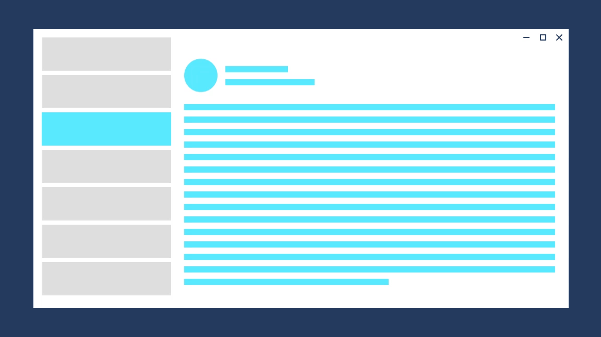
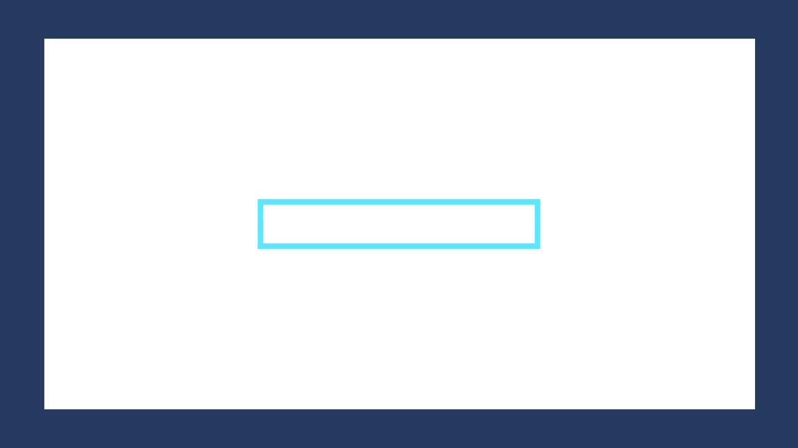

# Animations in Windows app

Timing, easing, directionality, and gravity work together to form the foundation of Fluent motion. Each has to be considered in the context of the others, and applied appropriately in the context of your app.

Here are 3 ways to apply Fluent motion fundamentals in your app.

- **Implicit animation**<br/>
Automatic tween and timing between values in a parameter change to achieve very simple Fluent motion using the standardized values.
- **Built-in animation**<br/>
System components, such as common controls and shared motion, are "Fluent by default". Fundamentals have been applied in a manner consistent with their implied usage.
- **Custom animation following guidance recommendations**<br/>
There may be times when the system does not yet provide an exact motion solution for your scenario. In those cases, use the baseline fundamental recommendations as a starting point for your experiences.

**_Transition example_**



:::row:::
    :::column:::
<b>Direction Forward Out:</b><br>
Fade out: 150m; Easing: Default Accelerate
<b>Direction Forward In:</b><br>
Slide up 150px: 300ms; Easing: Default Decelerate
    :::column-end:::
    :::column:::
<b>Direction Backward Out:</b><br>
Slide down 150px: 150ms; Easing: Default Accelerate
<b>Direction Backward In:</b><br>
Fade in: 300ms; Easing: Default Decelerate
    :::column-end:::
:::row-end:::

**_Object example_**

 

:::row:::
    :::column:::
<b>Direction Expand:</b><br>
Grow: 300ms; Easing: Standard
    :::column-end:::
    :::column:::
<b>Direction Contract:</b><br>
Grow: 150ms; Easing: Default Accelerate
    :::column-end:::
:::row-end:::

## Implicit Animations

Implicit animations are a simple way to achieve Fluent motion by automatically interpolating between the old and new values during a parameter change.

> [!div class="checklist"]
>
> - **Important APIs:** [Windows.UI.Xaml.Media.Animation Namespace](/windows/windows-app-sdk/api/winrt/microsoft.ui.xaml.media.animation), [Windows.UI.Xaml.Controls namespace](/windows/windows-app-sdk/api/winrt/microsoft.ui.xaml.controls)

> [!div class="nextstepaction"]
> [Open the WinUI 3 Gallery app and see Implicit Transitions in action](winui3gallery://item/ImplicitTransition)

[!INCLUDE [winui-3-gallery](../../../includes/winui-3-gallery.md)]

You can implicitly animate changes to the following properties:

- [UIElement](/windows/windows-app-sdk/api/winrt/microsoft.ui.xaml.uielement)
  - **Opacity**
  - **Rotation**
  - **Scale**
  - **Translation**

- [Border](/windows/windows-app-sdk/api/winrt/microsoft.ui.xaml.controls.border), [ContentPresenter](/windows/windows-app-sdk/api/winrt/microsoft.ui.xaml.controls.contentpresenter), or [Panel](/windows/windows-app-sdk/api/winrt/microsoft.ui.xaml.controls.panel)
  - **Background**

Each property that can have changes implicitly animated has a corresponding _transition_ property. To animate the property, you assign a transition type to the corresponding _transition_ property. This table shows the _transition_ properties and the transition type to use for each one.

| Animated property | Transition property | Implicit transition type |
| -- | -- | -- |
| [UIElement.Opacity](/windows/windows-app-sdk/api/winrt/microsoft.ui.xaml.uielement.opacity) | [OpacityTransition](/windows/windows-app-sdk/api/winrt/microsoft.ui.xaml.uielement.opacitytransition) | [ScalarTransition](/windows/windows-app-sdk/api/winrt/microsoft.ui.xaml.scalartransition) |
| [UIElement.Rotation](/windows/windows-app-sdk/api/winrt/microsoft.ui.xaml.uielement.rotation) | [RotationTransition](/windows/windows-app-sdk/api/winrt/microsoft.ui.xaml.uielement.rotationtransition) | [ScalarTransition](/windows/windows-app-sdk/api/winrt/microsoft.ui.xaml.scalartransition) |
| [UIElement.Scale](/windows/windows-app-sdk/api/winrt/microsoft.ui.xaml.uielement.scale) | [ScaleTransition](/windows/windows-app-sdk/api/winrt/microsoft.ui.xaml.uielement.scaletransition) | [Vector3Transition](/windows/windows-app-sdk/api/winrt/microsoft.ui.xaml.vector3transition) |
| [UIElement.Translation](/windows/windows-app-sdk/api/winrt/microsoft.ui.xaml.uielement.translation) | [TranslationTransition](/windows/windows-app-sdk/api/winrt/microsoft.ui.xaml.uielement.translationtransition) | [Vector3Transition](/windows/windows-app-sdk/api/winrt/microsoft.ui.xaml.vector3transition) |
| [Border.Background](/windows/windows-app-sdk/api/winrt/microsoft.ui.xaml.controls.border.background) | [BackgroundTransition](/windows/windows-app-sdk/api/winrt/microsoft.ui.xaml.controls.border.backgroundtransition) | [BrushTransition](/windows/windows-app-sdk/api/winrt/microsoft.ui.xaml.brushtransition) |
| [ContentPresenter.Background](/windows/windows-app-sdk/api/winrt/microsoft.ui.xaml.controls.contentpresenter.background) | [BackgroundTransition](/windows/windows-app-sdk/api/winrt/microsoft.ui.xaml.controls.contentpresenter.backgroundtransition) | [BrushTransition](/windows/windows-app-sdk/api/winrt/microsoft.ui.xaml.brushtransition) |
| [Panel.Background](/windows/windows-app-sdk/api/winrt/microsoft.ui.xaml.controls.panel.background) | [BackgroundTransition](/windows/windows-app-sdk/api/winrt/microsoft.ui.xaml.controls.panel.backgroundtransition)  | [BrushTransition](/windows/windows-app-sdk/api/winrt/microsoft.ui.xaml.brushtransition) |

This example shows how to use the Opacity property and transition to make a button fade in when the control is enabled and fade out when it's disabled.

```xaml
<Button x:Name="SubmitButton"
        Content="Submit"
        Opacity="{x:Bind OpaqueIfEnabled(SubmitButton.IsEnabled), Mode=OneWay}">
    <Button.OpacityTransition>
        <ScalarTransition />
    </Button.OpacityTransition>
</Button>
```

```csharp
public double OpaqueIfEnabled(bool IsEnabled)
{
    return IsEnabled ? 1.0 : 0.2;
}
```

## Related articles

- [Motion overview](../../design/signature-experiences/motion.md)
- [Timing and easing](../../design/motion/timing-and-easing.md)
- [Directionality and gravity](../../design/motion/directionality-and-gravity.md)
