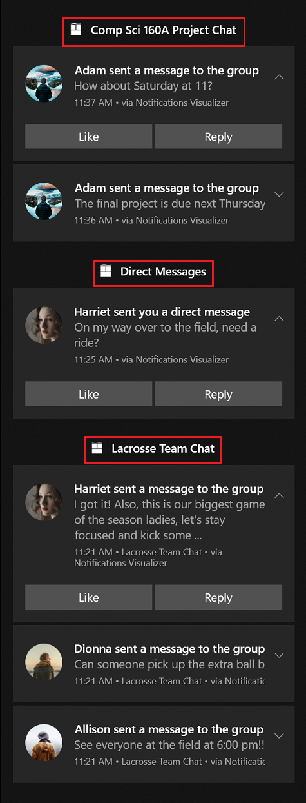

# App notification collections

Use collections to organize your app's notifications in Notification Center. Collections help users locate information more easily and allow developers to better manage their notifications.

A messaging app, for example, can separate notifications by chat group. Each group title ("Comp Sci 160A Project Chat", "Direct Messages", "Lacrosse Team Chat") is a separate collection. Notifications are grouped as if they were from a separate app, even though they all come from the same app. For a more subtle way to organize notifications, see [App notification headers](app-notifications-headers.md).



> [!NOTE]
> The code examples in this article use the `Microsoft.Windows.AppNotifications` namespace to build notification content and the `Windows.UI.Notifications` namespace for collection management. These two namespaces can be used together in the same app.

For more information about app notifications, see [App notifications overview](index.md).

## Create a collection

When creating a collection, provide a display name and an icon, which are shown in Notification Center as part of the collection's title. Collections also require a launch argument so your app can navigate to the right location when the user clicks the collection title. Create the collection by calling [**SaveToastCollectionAsync**](/uwp/api/windows.ui.notifications.toastcollectionmanager.savetoastcollectionasync).

```csharp
using Windows.UI.Notifications;

var collection = new ToastCollection(
    "MyToastCollection",
    "Work Email",
    "NavigateToWorkEmailInbox",
    new Uri("ms-appx:///Assets/workEmail.png"));

await ToastNotificationManager.GetDefault()
    .GetToastCollectionManager()
    .SaveToastCollectionAsync(collection);
```

## Send a notification to a collection

Use [**AppNotificationBuilder**](/windows/windows-app-sdk/api/winrt/microsoft.windows.appnotifications.builder.appnotificationbuilder) to construct the notification content, then call [**GetToastNotifierForToastCollectionIdAsync**](/uwp/api/windows.ui.notifications.toastnotificationmanagerforuser.gettoastnotifierfortoastcollectionidasync) to get a notifier scoped to the collection.

```csharp
using Microsoft.Windows.AppNotifications.Builder;
using Windows.UI.Notifications;
using Windows.Data.Xml.Dom;

// Build notification content with Windows App SDK
var payload = new AppNotificationBuilder()
    .AddText("Adam sent a message to the group")
    .BuildNotification()
    .Payload;

// Deliver to a collection using the WinRT API
var doc = new XmlDocument();
doc.LoadXml(payload);
var toast = new ToastNotification(doc);

var notifier = await ToastNotificationManager.GetDefault()
    .GetToastNotifierForToastCollectionIdAsync("MyToastCollection");
notifier.Show(toast);
```

## List all collections

Retrieve all collections created for your app by calling [**FindAllToastCollectionsAsync**](/uwp/api/windows.ui.notifications.toastcollectionmanager.findalltoastcollectionsasync).

```csharp
var collectionManager = ToastNotificationManager.GetDefault().GetToastCollectionManager();
var collections = await collectionManager.FindAllToastCollectionsAsync();
```

## Update a collection

Update a collection by creating a new [**ToastCollection**](/uwp/api/windows.ui.notifications.toastcollection) instance with the same ID and calling [**SaveToastCollectionAsync**](/uwp/api/windows.ui.notifications.toastcollectionmanager.savetoastcollectionasync).

```csharp
var collectionManager = ToastNotificationManager.GetDefault().GetToastCollectionManager();

var updatedCollection = new ToastCollection(
    "MyToastCollection",
    "Updated Display Name",
    "UpdatedLaunchArgs",
    new Uri("ms-appx:///Assets/updatedPicture.png"));

await collectionManager.SaveToastCollectionAsync(updatedCollection);
```

## Remove a collection

Remove a collection by calling [**RemoveToastCollectionAsync**](/uwp/api/windows.ui.notifications.toastcollectionmanager.removetoastcollectionasync) with the collection ID. Any notifications in the collection are also removed from Notification Center.

```csharp
var collectionManager = ToastNotificationManager.GetDefault().GetToastCollectionManager();
await collectionManager.RemoveToastCollectionAsync("MyToastCollection");
```

## Remove notifications within a collection

Use the **Tag** and **Group** properties to identify and remove individual notifications within a collection by calling [**Remove**](/uwp/api/windows.ui.notifications.toastnotificationhistory.remove), or clear all notifications at once with [**Clear**](/uwp/api/windows.ui.notifications.toastnotificationhistory.clear).

```csharp
var collectionHistory = await ToastNotificationManager.GetDefault()
    .GetHistoryForToastCollectionAsync("MyToastCollection");

// Remove a specific notification
collectionHistory.Remove(tag, group);

// Or clear all notifications in the collection
collectionHistory.Clear();
```

## See also

- [App notifications overview](index.md)