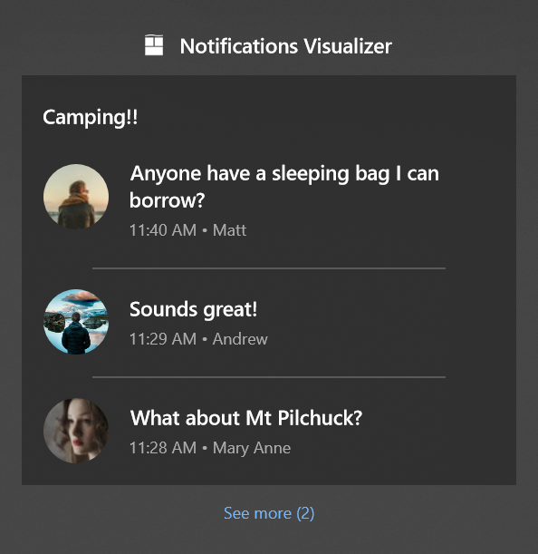

# App notification headers

You can visually group a set of related notifications in Notification Center by adding a header to your notifications.

In the example shown below, this group conversation is unified under a single header, "Camping!!". Each individual message in the conversation is a separate app notification sharing the same header.



You can also visually group your notifications by category, like flight reminders, package tracking, and more.

For more information about app notifications, see [App notifications overview](index.md).

## Add a header to a notification

> [!NOTE]
> [**AppNotificationBuilder**](/windows/windows-app-sdk/api/winrt/microsoft.windows.appnotifications.builder.appnotificationbuilder) doesn't currently include a `SetHeader` method, so use the XML payload directly with the [**AppNotification**](/windows/windows-app-sdk/api/winrt/microsoft.windows.appnotifications.appnotification) constructor.

```csharp
using Microsoft.Windows.AppNotifications;

string xml = @"
<toast>
    <header id='6289' title='Camping!!' arguments='action=openConversation&amp;id=6289'/>
    <visual>
        <binding template='ToastGeneric'>
            <text>Anyone have a sleeping bag I can borrow?</text>
        </binding>
    </visual>
</toast>";

var notification = new AppNotification(xml);
AppNotificationManager.Default.Show(notification);
```

To group multiple notifications under the same header, use the same header **Id** on each notification. The **Id** is the only property used to determine grouping — the **Title** and **Arguments** can differ between notifications. The values from the most recent notification in the group are displayed. If that notification is removed, the values fall back to the next most recent notification.

## Handle activation from a header

Headers are clickable. The **Arguments** property on the header specifies what context to pass to your app when the user clicks the header, similar to launch arguments on the notification itself.

Activation from a header is handled through the [**NotificationInvoked**](/windows/windows-app-sdk/api/winrt/microsoft.windows.appnotifications.appnotificationmanager.notificationinvoked) event, the same as any other notification activation. For more information about setting up activation, see [App notifications quickstart](app-notifications-quickstart.md).

```csharp
AppNotificationManager.Default.NotificationInvoked += (sender, args) =>
{
    // For the header defined above, args.Argument contains:
    // "action=openConversation&id=6289"
    string arguments = args.Argument;
};
```

## Additional details

- Headers visually separate and group notifications but don't change the maximum number of notifications an app can have (20) or the first-in-first-out behavior of the notifications list.
- The **Id** can be any string. There are no length or character restrictions on the header properties. The only constraint is that the entire XML notification content cannot exceed 5 KB.
- Creating headers doesn't change the number of notifications shown in Notification Center before the "See more" button appears (3 by default, configurable by the user in system notification settings).
- Clicking on a header doesn't clear the notifications belonging to that header. Your app should use the notification APIs to clear the relevant notifications.

## See also

- [App notifications overview](index.md)