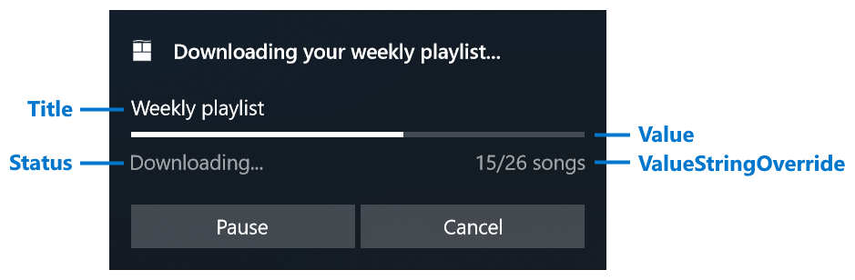

# App notification progress bar and data binding

Using a progress bar inside your app notification allows you to convey the status of long-running operations to the user, like downloads, video rendering, exercise goals, and more.

A progress bar inside an app notification can either be "indeterminate" (no specific value, animated dots indicate an operation is occurring) or "determinate" (a specific percent of the bar is filled, like 60%).

The image below shows a determinate progress bar with all of its corresponding properties labeled.

For more information about app notifications, see [App notifications overview](index.md).



| Property | Type | Required | Description |
|---|---|---|---|
| **Title** | string or [BindableString](app-notifications-schema.md#bindablestring) | false | Gets or sets an optional title string. Supports data binding. |
| **Value** | double or [AdaptiveProgressBarValue](app-notifications-schema.md#adaptiveprogressbarvalue) or [BindableProgressBarValue](app-notifications-schema.md#bindableprogressbarvalue) | false | Gets or sets the value of the progress bar. Supports data binding. Defaults to 0. Can either be a double between 0.0 and 1.0, `AdaptiveProgressBarValue.Indeterminate`, or `new BindableProgressBarValue("myProgressValue")`. |
| **ValueStringOverride** | string or [BindableString](app-notifications-schema.md#bindablestring) | false | Gets or sets an optional string to be displayed instead of the default percentage string. If this isn't provided, something like "70%" will be displayed. |
| **Status** | string or [BindableString](app-notifications-schema.md#bindablestring) | true | Gets or sets a status string (required), which is displayed underneath the progress bar on the left. This string should reflect the status of the operation, like "Downloading..." or "Installing..." |

Use [**AppNotificationBuilder.AddProgressBar**](/windows/windows-app-sdk/api/winrt/microsoft.windows.appnotifications.builder.appnotificationbuilder.addprogressbar) to add a progress bar to your notification. The following example generates the notification shown above.

```csharp
var builder = new AppNotificationBuilder()
    .AddText("Downloading your weekly playlist...")
    .AddProgressBar(new AppNotificationProgressBar()
        .SetTitle("Weekly playlist")
        .SetValue(0.6)
        .SetValueStringOverride("15/26 songs")
        .SetStatus("Downloading..."));
```

To dynamically update the values of the progress bar, use data binding as described in the next section.

## Update a progress bar with data binding

To display a live progress bar, use data binding to update the notification values without re-sending the entire notification.

1. Construct notification content with data-bound fields by calling the `Bind` methods on [**AppNotificationProgressBar**](/windows/windows-app-sdk/api/winrt/microsoft.windows.appnotifications.builder.appnotificationprogressbar).
2. Assign a **Tag** (and optionally a **Group**) to identify the notification.
3. Set the initial [**AppNotificationProgressData**](/windows/windows-app-sdk/api/winrt/microsoft.windows.appnotifications.appnotificationprogressdata) values.
4. Show the notification by calling [**AppNotificationManager.Default.Show**](/windows/windows-app-sdk/api/winrt/microsoft.windows.appnotifications.appnotificationmanager.show).

```csharp
using Microsoft.Windows.AppNotifications;
using Microsoft.Windows.AppNotifications.Builder;

string tag = "weekly-playlist";
string group = "downloads";

var builder = new AppNotificationBuilder()
    .AddText("Downloading your weekly playlist...")
    .AddProgressBar(new AppNotificationProgressBar()
        .BindTitle()
        .BindValue()
        .BindValueStringOverride()
        .BindStatus());

var notification = builder.BuildNotification();
notification.Tag = tag;
notification.Group = group;

notification.Progress = new AppNotificationProgressData(1)
{
    Title = "Weekly playlist",
    Value = 0.6,
    ValueStringOverride = "15/26 songs",
    Status = "Downloading..."
};

AppNotificationManager.Default.Show(notification);
```

Then, update the progress values by calling [**AppNotificationManager.Default.UpdateAsync**](/windows/windows-app-sdk/api/winrt/microsoft.windows.appnotifications.appnotificationmanager.updateasync) with a new [**AppNotificationProgressData**](/windows/windows-app-sdk/api/winrt/microsoft.windows.appnotifications.appnotificationprogressdata) instance. Increment the sequence number so the platform knows this is a newer update.

```csharp
using Microsoft.Windows.AppNotifications;

string tag = "weekly-playlist";
string group = "downloads";

var data = new AppNotificationProgressData(2)
{
    Value = 0.7,
    ValueStringOverride = "18/26 songs"
};

await AppNotificationManager.Default.UpdateAsync(data, tag, group);
```

Using **UpdateAsync** rather than replacing the entire notification ensures that the notification stays in the same position in Notification Center and doesn't move up or down. The method returns a [**NotificationUpdateResult**](/uwp/api/windows.ui.notifications.notificationupdateresult) that indicates whether the update succeeded or whether the notification couldn't be found (the user may have dismissed it).

## Elements that support data binding

The following elements in app notifications support data binding:

- All properties on **AppNotificationProgressBar**
- The **Text** property on the top-level text elements

## Update or replace a notification

You can **replace** a notification by sending a new notification with the same **Tag** and **Group**. The following table describes the difference between replacing and updating a notification.

| | Replacing | Updating |
| -- | -- | -- |
| **Position in Notification Center** | Moves the notification to the top of Notification Center. | Leaves the notification in place within Notification Center. |
| **Modifying content** | Can completely change all content and layout of the notification. | Can only change properties that support data binding (progress bar and top-level text). |
| **Reappearing as popup** | Can reappear as a popup if **SuppressPopup** is `false` (or set to `true` to silently send it to Notification Center). | Won't reappear as a popup; the notification's data is silently updated within Notification Center. |
| **User dismissed** | Replacement notification is always sent regardless of whether the user dismissed the previous notification. | If the user dismissed the notification, the update will fail. |

In general, **updating** is useful for information that changes frequently and doesn't require the user's immediate attention, such as progress changing from 50% to 65%.

After your sequence of updates has completed (for example, a file has finished downloading), consider **replacing** the notification for the final step because:

- The final notification likely has different layout, such as removal of the progress bar or addition of new buttons.
- The user may have dismissed the progress notification but still wants to see a popup when the operation completes.

## See also

- [App notifications overview](index.md)